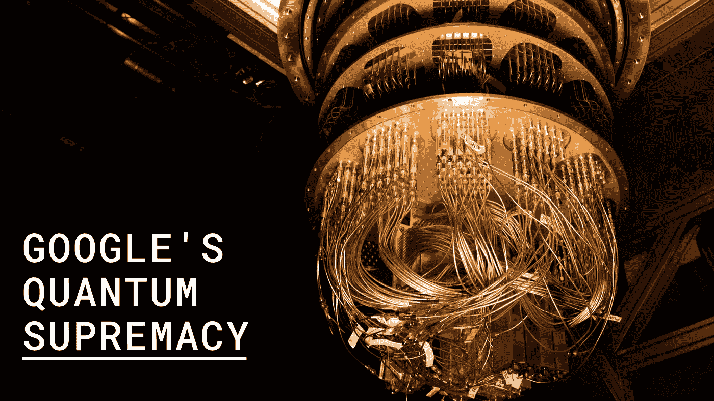

# 谷歌已经破解了“量子霸权”，还是他们已经破解了？

> 原文：<https://towardsdatascience.com/google-has-cracked-quantum-supremacy-cd70c79a774b?source=collection_archive---------19----------------------->

## [数据科学](/data-science/)

## 快速浏览一下谷歌最近在美国宇航局网站上泄露的关于量子计算的论文

Image — Google

问量子计算机和量子比特已经出现有一段时间了，关于它的应用有很多讨论和令人惊讶的关注。美国宇航局和谷歌一直在量子计算项目上合作，今年早些时候有迹象表明，谷歌即将破解量子霸权。几周前的 9 月，一篇谷歌泄露的论文被发布在美国宇航局的网站上，并立即被撤下。但互联网就是互联网，报纸的副本再次浮出水面，从那以后就有很多讨论在进行。

这篇论文的标题是**使用可编程超导处理器**的量子优势。根据谷歌的说法，一台 53 量子位的量子计算机首次利用量子特性在特定任务上超越了经典机器，从而实现了 ***量子优势。但是它还没有在任何科学杂志上发表，专家们还没有证实谷歌的说法，但是根据这篇论文的一段引文，它写道***

> 据我们所知，这个实验标志着只能在量子处理器上进行的第一次计算

量子计算机正在与超级强大的经典计算机竞争，以模拟伪随机量子电路的输出，换句话说，就是一个数字发生器。

毫不奇怪，量子计算机轻而易举地赢得了比赛，但与竞争对手相比，它产生输出的速度可能有点令人震惊。在量子处理器上产生 100 万个随机数只需要 200 秒，而传统的超级计算机需要 10000 年。毕竟一万年后，我们中没有人会被留下来验证这些样本，这将需要数百万年的时间。

尽管所有这些说法都有待证实，但所有专家一致同意的事实是，量子计算机远未准备好用于商业用途。引用约翰·普雷斯基尔在 2011 年创造的“量子至上”一词

> 他们的机器以惊人的速度解决的问题是精心挑选的，只是为了展示量子计算机的优越性

但是，一台至少有 1500 个逻辑量子位的量子计算机可能能够解决比特币、密码术和加密等构成互联网上可信数字通信和账簿的数学问题。谷歌目前使用的量子计算机俗称 **Sycamore** 仅使用 53 个物理量子位，这是在 72 个物理量子位的计算机变得难以控制后开发的。扩展量子计算机绝非易事，你添加的量子位越多，系统就变得越不稳定。

至少现在，可以肯定的是，数据解密还需要很多年，因为它需要 1000 个量子位。所以，是的，你可以继续购买加密货币，并希望赚钱，只要谷歌在不久的将来不会出现奇迹并震惊我们。

Image- Unsplash

我们也不要破坏谷歌在这方面取得的成就。科学家们多年来一直致力于破解这一难题。值得注意的是，谷歌并不是唯一的玩家。像 IBM、英特尔、微软这样的公司已经为实现量子优势努力了很长时间。IBM 推出了一台 20 量子位的量子计算机，它是为商业用途设计的，但从未真正为它做好准备。因此，如果谷歌的工作得到证实，这将是这场争夺 ***霸权的激烈战斗中一个值得庆祝的里程碑。***

同时，你可以在这里 **阅读原泄露论文 [**的节选。**](http://www.spaceref.com/news/viewsr.html?pid=52862)**

> 更新-谷歌今天(2019 年 10 月 23 日)发布了一个名为“展示量子优势”的官方视频。