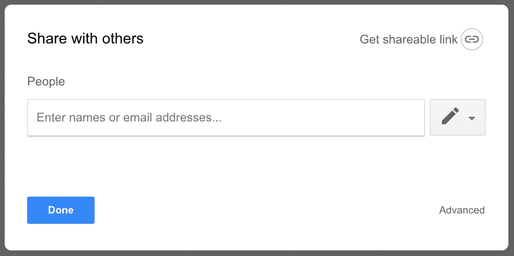
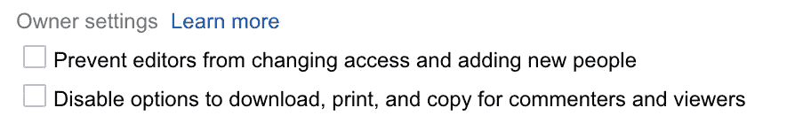
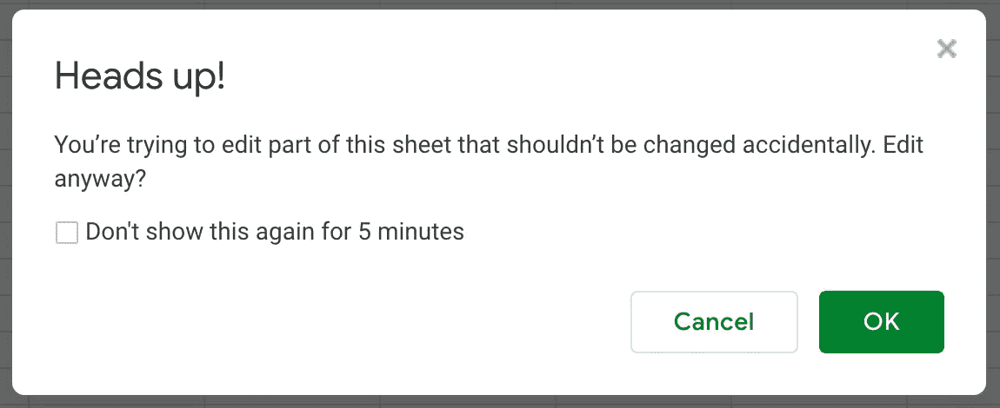
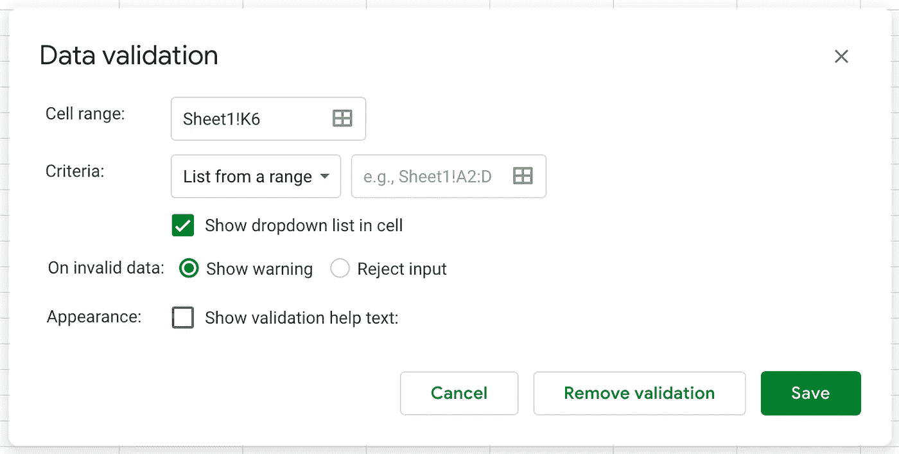
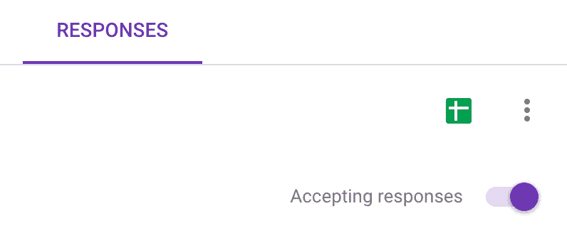
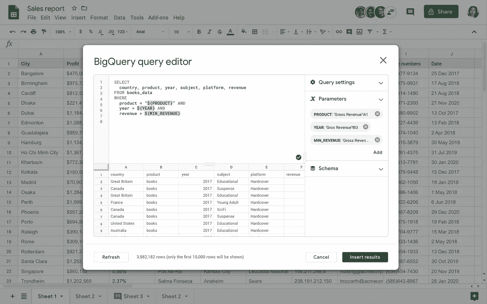

# Google Sheets 作为可靠数据源的终极指南

> 原文：<https://towardsdatascience.com/google-sheet-data-warehouse-c22bb2cce4b0?source=collection_archive---------10----------------------->

## 保持冷静，使用大量的数据验证

我偶尔需要授予一位非技术同事在特定基础上向我们的数据仓库输入信息的能力。例如，我们在 [Milk Bar](https://milkbarstore.com/) 的客户服务团队在 Google Sheets 中维护了一个特殊的[婚礼蛋糕](https://milkbarstore.com/pages/weddings)订单列表，我们需要从中收集数据用于下游计算。

对于数据工程师来说，这是一个棘手的问题——我的同事不具备与我们的数据堆栈直接交互的技术技能，我也不想支持自己的 web 表单或类似的基础设施来收集这些信息。如果我们可以将他们的 Google Sheet 直接同步到我们的数据仓库中的一个表，会怎么样？

乍一看，这听起来是个糟糕的主意。向没有模式控制的数据仓库表中自由输入数据是数据工程师的噩梦。如何防止有人意外删除某列或输入错误类型的数据？我如何知道我的同事正在按照我的期望输入数据？我已经能感觉到你的心开始跳动，想着这种方法违反了多少最佳实践！

和我在一起。我在这里想让你相信，Google Sheets，**加上适当的防护栏**，对于分析团队之外的同事来说，是一种输入表格数据以供下游使用的极好方式，甚至在自动化转换中也是如此！

我们将探索如何建立一个受限的、经过数据验证的 Google 表单，并讨论如何将这些数据同步到您的数据仓库，对其进行测试，甚至将转换后的结果发送回表单供您的同事查看或分析。

# 保护您的谷歌表单

## 许可

我们将从您应该对 Google Sheet 数据源实施的最明显的保护开始:共享权限。简单明了地说，唯一允许编辑你的工作表的人应该是你信任的人，他们会适当地编辑你的工作表，并且受过这方面的培训。保持链接共享关闭，除非你需要它打开，在这种情况下，链接权限应该设置为**可以查看**。

The Google Sheets Share menu. Don’t miss the Advanced button in the bottom right corner!

下一个重要的步骤经常被忽略，因为这个设置隐藏在谷歌共享菜单的高级部分。**确保您限制编辑添加新人或更改访问权限。您希望确保您的同事不会无意中添加未经批准的编辑。**

This menu is accessed by clicking *Share* in the top right corner, then clicking Advanced. Check the first box to make sure your share permissions don’t change without you realizing it.

## 受保护的工作表和区域

除了我们上面设置的工作簿级别的权限之外，我们还可以为单个工作表甚至特定的单元格区域设置权限。

要设置这些权限，导航到*数据*菜单并选择*受保护的工作表和范围*。您可以限制工作表和范围，使它们只能由某些人编辑，或者只允许人们在确认有关其操作后果的警告后编辑它们。

The warning message that Google displays if you try to edit a protected sheet or range with the “Show a warning when editing this range” option selected.

您可能有一些工作表包含公式或计算的必要信息，不需要任何用户进行编辑。如果是这种情况，请保护这些工作表，这样只有您可以修改它们。

## 数据有效性

彻底的数据验证使 Google Sheets 成为直接同步到数据仓库的可靠选择。有了数据验证，你可以在你的工作表中的期望范围上施加*几乎任何你能想到的约束*。

你可以从谷歌工作表中的数据菜单进入数据验证。数据验证会要求您输入一个单元格区域、一个约束以及在不满足该约束时要采取的动作。

The data validation menu in Google Sheets.

我建议当输入无效数据时，你的表单应该采取“拒绝输入”的动作。谷歌的“显示警告”选项在有问题的单元格的右上角显示一个小小的橙色三角形，用户很容易忽略。拒绝所有未经验证的内容，可以确保您只将干净的数据传递给依赖于一致模式的任何自动化流程。

我将浏览 Google 提供的每个约束选项，并讨论我们如何使用每个选项来限定干净的数据并拒绝杂乱的数据。

*   ***列出一个范围。***我们经常使用它来迫使用户从预定义的值或类别列表中进行选择。**一个便利的好处是，您可以在范围内的每个单元格中添加一个下拉列表，这样您的用户就可以直接选择一个有效值。我喜欢为我的验证范围保留一个单独的、完全受保护的表(只有我可以编辑它)。**
*   ***物品清单。*** 类似于来自一个范围的列表，除了你以逗号分隔列表的形式直接提供有效值。**这对于根据静态值的简短列表来验证条目非常有用。**
*   ***号。*** 该标准用于检查条目是否在数值范围内。我们可以防止负数或强制输入小于已知的最大值。
*   ***文字。*** 我们可以测试条目，看看它们是否包含某些子字符串。也许您想确保您的用户在复制发票号码时输入了正确的前缀。在下拉列表的底部还有几个有用的选项:是有效的电子邮件还是有效的网址。这些都是常见的验证需求，需要正则表达式或类似复杂的东西来确认。
*   ***日期。*** 我们可以验证条目是否为有效日期，是否在要求的范围内。由于日期格式的多样性，日期是出了名的混乱。如果用户要在工作表中的任何地方输入日期，这个验证标准是至关重要的。
*   ***自定义公式是。*** 这是数据验证的真正改变者。**您可以编写任何返回 True 或 False 值的自定义公式，Google 将根据它来验证条目。你可以用这种方式实现一些非常复杂的验证逻辑。例如，使用`REGEXPMATCH`公式来确认条目匹配一组更复杂的字符串逻辑。Google Sheets 也不允许对同一个单元格应用多个验证标准，所以这个选项允许我们将标准合并到一个公式中。**
*   ***复选框。*** 您可以用复选框替换您单元格区域中的单元格，当**被选中和取消选中时，它将返回一个自定义值。这里 99%的用例可能都是对与错，但是如果你愿意的话，也可以灵活地表示其他东西。**

如果这还不足以让您进行测试，您可以使用 [DataValidationBuilder](https://developers.google.com/apps-script/reference/spreadsheet/data-validation-builder) 类编写一个定制的 Google Apps 脚本来实现您自己的规则。

修改已经设置好的数据验证有点烦人。在一个工作表中应用的所有有效性规则没有一个统一的列表。相反，您必须选择感兴趣的单元格或区域，并返回到数据有效性菜单来删除或修改条件。

一旦您彻底验证了 Google 表单中的数据，您的表单将和定制的 web 表单一样好，甚至更好。您可以对数据的质量充满信心。

## 用条件格式向用户发出信号

有时用数据验证拒绝用户的输入过于严格，会导致糟糕的用户体验。你可以使用谷歌的“显示警告”选项，但是添加的橙色警告三角形很容易被用户忽略。我更喜欢使用条件格式将整个单元格变成令人担忧的红色或令人满意的绿色。

假设您希望在用户输入的值比平均值大或小两个标准差以上时向用户发出警告。您可以设置带有条件格式的公式，将单元格变为黄色，以警告用户该值是异常值，可能输入不正确。

当然，您可以使用自定义的数据验证公式来拒绝该值，但是条件格式会给您带来灰色阴影(真的！)向您的用户发出除了接受或拒绝之外的信号。有时候，拥有这种灵活性是件好事。我不打算深入设置条件格式的细节，但是如果你不熟悉这个概念，谷歌关于这个特性的文档在这里是。

## 可选:使用单独的导入范围表进行转换

我喜欢设置一个只有我可以编辑的中间导入表，而不是直接从用户访问的表同步到数据仓库。这个中间表给我提供了更多的控制。我使用`IMPORTRANGE` [公式](https://support.google.com/docs/answer/3093340?hl=en)配置这个表来复制用户访问的表中的所有数据。在将它传递到我的数据仓库之前，我可以在这个表中进行任何必要的调整。

*   例如，我可能只导入用户访问的工作表的特定范围，因此该范围之外的错误数据不会破坏下游的任何东西。
*   我还可以将两个用户访问的表(可能有多个表，一年一个)合并成一个带有[垂直数组](https://stackoverflow.com/q/31657470/3524951)的表。
*   我甚至可以使用`QUERY` [公式](https://support.google.com/docs/answer/3093343?hl=en)来过滤用户访问的工作表中的行，以删除空白。

## 替代方案:用谷歌表单完全控制数据输入

如果用户在输入数据后不需要编辑数据，您可以使用 Google 表单设置一个仅附加系统。Google Forms 与 Google Sheets 进行了本机集成，这使得这种设置对于仅附加的需求来说非常简单。Google Forms 将在带有时间戳的 Google 表单中为您的表单的每个回复添加一行。如果您添加问题，工作表将扩展以匹配您的表单。

通过为您的表单选择适当的问题类型来确保数据整洁。要配置 Google Sheets 集成，您需要在 responses 选项卡中单击 Google Sheets 徽标，这将生成表单。

This Google Sheets logo in the Responses tab of a Google Form will create an auto-populating Google Sheet with the form’s responses.

因为您不能拒绝表单自身验证之外的数据，所以我建议您设置一个如上所述的中间导入表。在那里执行任何所需的过滤，以使您的数据在干净的状态下进行加载。

# 将您的 Google Sheet 同步到您的数据仓库

将 Google 表单加载到数据仓库是一个常见的问题，因此有很多潜在的解决方案。

如果你是 Google BigQuery 用户，最简单的方法是将 Google Sheet 设置为一个外部表。BigQuery 的文档[更详细地描述了如何做到这一点](https://cloud.google.com/bigquery/external-data-drive)，但是您需要做的只是为表定义一个模式，并且您可以直接从 BigQuery 查询您的表的第一个选项卡。

如果您正在使用雪花、红移或其他数据仓库，您可以从这些选项中进行选择。

*   大多数 ***数据加载服务*** 都集成了处理加载谷歌表单的功能。参见 [Fivetran 的文档](https://fivetran.com/docs/files/google-sheets)和 [Alooma 的](https://www.alooma.com/docs/connect-your-data/google-drive-and-sheets/google-sheets-integration)。
*   [***Stitch 的 Google Sheets 集成。***](https://www.stitchdata.com/blog/how-to-replicate-google-sheets-to-your-data-warehouse/) 数据加载服务 Stitch 有一个关于如何在 Google Sheets 中设置一些将数据发送到 Stitch 的导入 API 的应用程序脚本代码的指南。然后，Stitch 会将数据加载到您选择的数据仓库中。使用这种方法，您必须通过单击“同步到缝合”来手动同步数据，这可能是一种祝福，也可能是一种诅咒，取决于您的需求。请注意，如果你还不是 Stitch 的客户，你必须注册，但同步几张表不太可能超过他们每月 500 万行的免费级别。
*   [***单张纸。***](https://gitlab.com/gitlab-data/analytics/tree/master/extract/sheetload) 这是一个由 [GitLab](https://gitlab.com/) 的数据团队创建的 Python 工具，用于将本地 CSV 和 Google Sheets 加载到数据仓库中。在编写时，该工具支持 Postgres 和雪花。
*   [***Ro 的 Google Sheet 集成。***](https://github.com/Ro-Data/Ro-Create-Table-From-Sheet)*[Ro](https://ro.co)的数据团队开源了他们将 Google Sheets 数据加载到雪花中的定制方法。请注意，他们的方法在每次加载时都会截断并替换数据表，因此不会保留删除或修改的行。*
*   *你也可以考虑用 Zapier、webhooks 和像 AWS Lambda 这样的无服务器功能推出自己的模块化方法。您可以在工作表中创建行时触发 Zap，它会通过 webhook 将数据发送到一个无服务器函数，该函数设置为接收有效负载作为端点。如果您需要捕获更新和删除，这种方法会变得更有挑战性。*

## *测试您仓库中的数据*

*一旦数据同步到您的仓库，您就差不多完成了！如果您仍然担心数据质量，或者对设置的数据验证不完全满意，可以将同步的数据仓库表作为临时表进行测试。一旦您的数据通过了 SQL 测试，就将其复制到生产环境中。*

*在数据仓库中测试数据是一个更大的主题，(这个主题我已经在这里广泛地[写过了)，但是我们在](https://medium.com/@josh.temple/automated-testing-in-the-modern-data-warehouse-d5a251a866af) [Milk Bar](https://milkbarstore.com/) 使用[数据构建工具(dbt)](https://www.getdbt.com/) 来实现这一点。dbt 管理我们的数据仓库，并在 CI 管道中运行我们的 SQL 测试，以检查任何逃过验证的数据问题。*

## *BigQuery 的加分:将数据发送回 Google Sheets*

*如果您是 BigQuery 用户，并且您的公司使用 GSuite，那么还有一个我不得不提到的功能。您可以在 Google Sheets 中查询 BigQuery 数据。*

*在谷歌工作表的数据菜单中，有一个**数据连接器**的选项。在这里，您可以连接到 BigQuery 数据仓库，用 SQL 查询表，将实时数据返回到 Google Sheet 中。在您的数据仓库中执行任何必要的下游计算或转换，然后以适合您的数据堆栈的节奏将有价值的信息返回给您的用户。*

**

*这种方法最多只支持 10，000 行，但 Google 正在测试这一功能的扩展，称为 Connected Sheets，它将允许您将整个表返回到 Google Sheets，无论它有多大。这项功能目前处于测试阶段，你可以在这里申请[。](https://gsuite.google.com/campaigns/index__sheets-connectedsheet.html?_ga=2.200438701.-241340023.1532979384)*

*我希望这篇指南已经让你能够自信而正确地建立自己的 Google Sheet 数据源。如果你对使用 Google Sheets 作为数据源有所顾虑或有创意，请在评论中告诉我。*

# *进一步阅读*

1.  *[Matthew Lincoln 的](https://matthewlincoln.net/)杰出文章，[在你的数据项目中使用 Google Sheets 的最佳实践](https://matthewlincoln.net/2018/03/26/best-practices-for-using-google-sheets-in-your-data-project.html)*