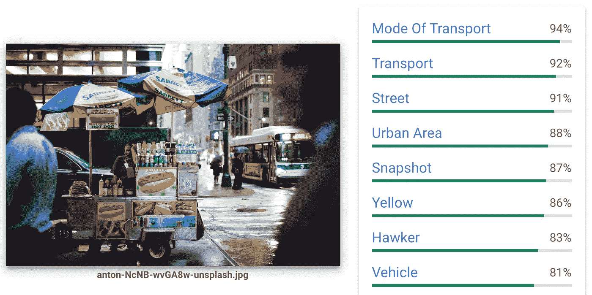

# 使用 python 进行图像分析的 Google vision API

> 原文：<https://towardsdatascience.com/google-vision-api-for-image-analysis-with-python-d3a2e45913d4?source=collection_archive---------19----------------------->

谷歌视觉 API 使用预先训练的机器学习模型从图像中检测物体、人脸、印刷和手写文本。您可以将每个图像上传到该工具并获取其内容。但是，如果您的本地桌面上有大量图像，那么使用 python 向 API 发送请求是非常可行的。



这篇文章讲述了如何使用 python 和 google cloud sdk 创建图像，将图像上传到 google bucket，对大型图像数据集执行标签检测。“gsutil”用于快速上传图片，并在 google bucket 上设置生命周期。所有图像都用批处理进行分析。

**第一步:创建一个项目**

按照下面链接中的步骤创建一个新项目，并启用 google vision AI。将密钥存储在 JSON 文件中。

 [## 开始之前|云视觉 API 文档|谷歌云

### 在您可以使用 Cloud Vision API 之前，您必须为您的项目启用它:登录您的 Google 帐户。如果你…

cloud.google.com](https://cloud.google.com/vision/docs/before-you-begin) 

**第二步:下载 google cloud sdk 和 gsutil**

Gsutil 工具有助于将大型图像数据集轻松上传到 google bucket。在命令提示符或终端中运行以下代码

【https://sdk.cloud.google.com】[](https://sdk.cloud.google.com)**|迎头痛击**

*另外，您也可以从以下链接下载 sdk*

*MAC OS:[https://cloud.google.com/sdk/docs/quickstart-macos](https://cloud.google.com/sdk/docs/quickstart-macos)(将文件夹存放在主目录中)*

*windows[https://cloud.google.com/sdk/docs/quickstart-windows](https://cloud.google.com/sdk/docs/quickstart-windows)*

***第三步:设置配置:***

*需要以下命令来连接到您在步骤 1 中创建的 google cloud 项目。在终端中键入以下内容*

**gcloud init**

*选择要使用的配置:选择“创建新配置”*

*选择一个帐户来执行操作:如果您没有看到您的 gmail 帐户，请选择“使用新帐户登录”并登录该帐户。*

*选择要使用的云项目:您应该看到您在步骤 1 中创建的项目并选择它*

***第四步:上传图片到谷歌云存储***

*创建存储桶:*gsutil MB ' GS://bucket name '*(存储桶名称应该是唯一的)*

*将图像文件夹从本地桌面上传到 google bucket:*

**gsutil-m CP-R ' path/to/image folder ' ' GS://bucket name '**

***第五步:在 google bucket 中获取图片标签***

*现在你已经有了桶中的所有图像，使用' ImageAnnotatorClient '获取标签。如果你有很多图像，那么遍历桶中的每一个图像将会非常耗时。批处理可以加快这一过程，每批最多可处理 16 幅图像([https://cloud.google.com/vision/quotas](https://cloud.google.com/vision/quotas))。*

```
*#install google cloud vision
pip install google-cloud-vision#import dependencies
from google.cloud import vision
from google.cloud import storage
from google.cloud.vision_v1 import enums
from google.cloud.vision_v1 import ImageAnnotatorClient
from google.cloud.vision_v1 import types
import os
import jsonos.environ["GOOGLE_APPLICATION_CREDENTIALS"]='project_key.json' 
#(created in step 1)# Get GCS bucket
storage_client = storage.Client()
bucket = storage_client.bucket('bucket_name’)
image_paths = []
for blob in list(bucket.list_blobs()):
    image_paths.append("gs:// bucket_name/"+blob.name)# We can send a maximum of 16 images per request.
start = 0
end = 16
label_output = []for i in range(int(np.floor(len(image_paths)/16))+1):
    requests = []
    client = vision.ImageAnnotatorClient()
    for image_path in image_paths[start:end]:
        image = types.Image()
        image.source.image_uri = image_path
        requests.append({'image': image,'features': [{'type': vision_v1.Feature.Type.LABEL_DETECTION}]})
        response = client.batch_annotate_images(requests)
    for image_path, i in zip(image_paths[start:end], response.responses):
        labels = [{label.description: label.score} for label in i.label_annotations]
        labels = {k: v for d in labels for k, v in d.items()}
        filename = os.path.basename(image_path)
        l = {'filename': filename, 'labels': labels}
        label_output.append(l)
    start = start+16
    end = end+16#export results to JSON file
with open('image_results.json', 'w') as outputjson:
json.dump(label_output, outputjson, ensure_ascii=False)*
```

*标签检测的结果可以存储在 JSON 文件中。*

***第六步:从 google bucket 中删除图片:**你可能想在完成分析后删除图片，因为会有存储成本。删除循环中的每个图像需要时间。相反，为存储桶设置一个生命周期，这样您就可以一次删除整个存储桶。将以下代码粘贴到一个 JSON 文件中，并将其保存为 lifecycle.json，然后执行 gsutil 代码*

```
*#Age tells about how many days after bucket creation you want to delete it.{
 "rule":
 [
  {
   "action": {"type": "Delete"},
   "condition": {"age": 2}
  }
 ]
}#This codes sets lifecycle for the bucket
gsutil lifecycle set 'lifecycle.json' 'gs://bucket_name'*
```

*如果你还有一些问题或者想做文本/人脸检测，请查看[https://code labs . developers . Google . com/code labs/cloud-vision-API-python/index . html？index=#0](https://codelabs.developers.google.com/codelabs/cloud-vision-api-python/index.html?index=#0)*

*希望这篇文章有所帮助。快乐阅读！*