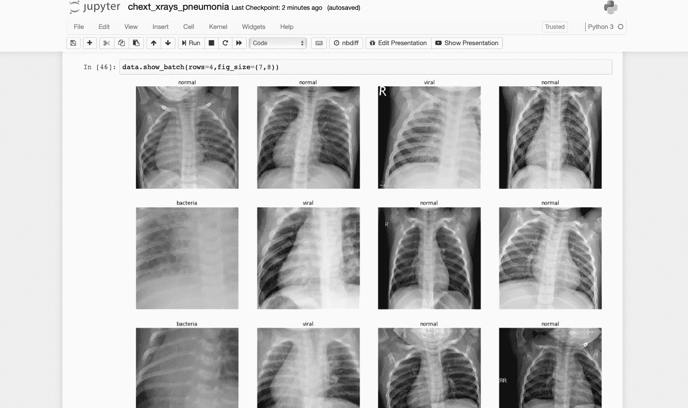
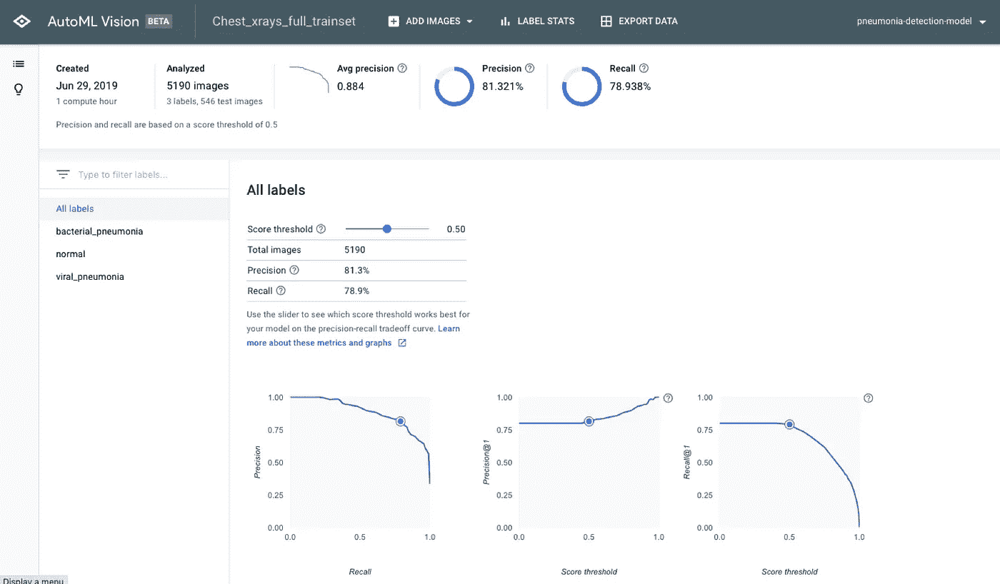

# 谷歌的 AutoML 与手工制作的模型在识别肺炎方面的比较

> 原文：<https://towardsdatascience.com/googles-automl-vs-a-hand-made-model-in-identifying-pneumonia-f818902d24fc?source=collection_archive---------21----------------------->

最近有很多关于 AutoML 或“无人驾驶 ML”改变机器学习方式的潜力的谈论，并将该技术放在非编码人员的手中。谷歌是推动其“云自动”套件的公司之一，该套件包括计算机视觉、表格数据和自然语言处理的应用程序。他们的工具声称易于使用，并通过使用神经架构搜索来找到性能最佳的模型架构，比手工制作的机器学习模型具有更高的准确性。但它真的兑现了宣传吗？我们在 Pytorch 中将 Google AutoML 计算机视觉与我们自己的从头开始模型进行了对比测试。

**试题——从 x 光片中识别肺炎**

为了比较这两种方法，我们使用了一个代表计算机视觉真实世界用例的测试问题:我们使用 5200 张胸部 x 光图像的数据集来预测患者是否没有肺炎、细菌性肺炎或病毒性肺炎。精确模型的好处是显而易见的，可以帮助医生快速识别患者的肺炎病例。

**试用谷歌汽车**

我们从谷歌的 AutoML 开始，使用他们的计算机视觉模块来自动构建模型。导入数据和设置作业非常简单，尽管该工具在如何构造和标注要导入的数据方面提供了有限的灵活性。下面是结果页面的截图，显示了< 15 minutes of training. AutoML yielded an impressive 81.3% precision and 78.9% recall on this task, without requiring a single line of code! It also provides an API to access the model we created for use in generating predictions.

**使用 PyTorch 和 FastAI 手工制作的模型**后的结果

然后，我们使用 PyTorch 和库 FastAI 从头开始构建我们自己的模型，这使得在 PyTorch 中构建和训练模型更快。我们通过使用视觉变换在我们的训练数据集上使用数据增强来建立更鲁棒的模型，并在训练迭代中调整超参数以及缩小然后放大图像。通过几个小时的工作和大约 15 分钟的训练时间，我们实现了 82.7%的准确率和 81.0%的召回率，比 Google AutoML 的结果高出 1-2 个百分点。

**我们的结论**

虽然我们使用手工制作的神经网络在这个测试问题上取得了优于谷歌 AutoML 的结果，但它也明显更加耗时和复杂。即使有 FastAI 的库和 PyTorch 的帮助，我们自己也花了~ 2 个小时来建立和训练一个模型。一旦我们在 AutoML 上设置好了，不超过 30 分钟就可以导入我们的数据并训练一个模型，而无需编写一行代码。就简单性和易用性而言，AutoML 轻而易举地胜出。

然而，当数据集没有被整齐地组织到带标签的文件夹中或者您想要使用自定义验证集时，事情就变得复杂了。今天的 AutoML 在界面上相当死板，极大地限制了灵活性和可定制性。它非常适合“教科书”问题，但是对于许多在输入、标记或验证技术方面增加了复杂性现实世界的问题，它现在还不能处理它。

虽然我们手动实现了更好的精度建模，但我们获得的 1–2%精度增益的值实际上取决于所解决的具体问题。在某些情况下，这可能不是一个显著的差异，而在其他情况下，它可能会创造或破坏模型的价值。

总的来说，AutoML 是一个很好的简单工具，可以用来为标准分类任务快速构建“足够好”的模型，而不需要编码。然而，在其当前形式下，它在现实世界机器学习问题的适用性方面很快就崩溃了，这些问题涉及实践中经常使用的混乱的数据组织、定制标记方法或定制验证技术。它还充当了一个黑盒模型，不暴露任何内部细节来进行检查，也不需要在以后进行额外的培训或改进时进行调整。根据我们的经验，在现实世界中部署预测时，黑盒模型几乎总是一个坏主意。