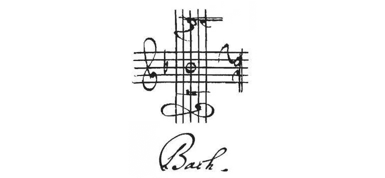

# 谷歌的巴赫人工智能:一位拥有音乐理论博士学位的机器学习科学家做出了反应

> 原文：<https://towardsdatascience.com/googles-bach-ai-a-machine-learning-scientist-with-a-phd-in-music-theory-reacts-68d055f2461d?source=collection_archive---------4----------------------->

Bach’s signature: B(B-flat), A, C, H (B-natural)

迟到的生日快乐，J·S·巴赫。为了庆祝，谷歌发布了一个“涂鸦”，如果你首先提供旋律，它会使用人工智能(AI)来调和巴赫的合唱曲。虽然我很想对谷歌的 Bach AI 进行深入研究，但这需要时间。巴赫的生日是昨天，我不想在派对上迟到了。

由于我拥有音乐理论博士学位，目前是机器学习和人工智能领域的应用科学家，所以有几个人问我的想法，所以他们在这里。

巴赫合唱团在音乐理论中有着特殊的地位。他们经常被认为是优秀的、遵守规则的、西方的、古典的(意思是普通的调性)音乐和声应该是什么样子。事实上，以巴赫合唱风格调和旋律和低音线是我音乐理论教学的一部分，从大学一年级的测验到写论文前必须通过的博士诊断考试。我的理论学生也体验到了巴赫合唱和声对橡皮寿命的不友好。

由于这些原因，当我们(理论家)看到一个“坏的”协调时，我们就知道它。平行第五？巴赫杀死了一只小猫(这是大约 2007 年早期脸书一个流行乐队的名字)。增强秒？你怎么敢。语音穿越？不可唱。这样的例子不胜枚举。

我的音乐理论社交媒体 bubble 很快指出了人工智能生成的合唱中的许多(许多许多许多)部分写作和声错误。乍看之下，我无法忽略这些错误——甚至那些只有基本理论知识的人也能轻易避免的错误。也许我有点嫉妒机器学习和音乐受到如此多的关注，当然我可以做得更好。但是我正在努力让第一物种的对位人工智能工作…

当我想到自己用人工智能创作更简单的音乐时，我意识到谷歌的“涂鸦”非常好。当然，如果是一个大二的学生，他们可能会失败，但是我们在谈论一台电脑。

我有[写的代码](https://github.com/tompkinsguitar/counterpoint)创造了第一种对位。该代码基本上是一长串的规则和启发，将保证两个声音的和谐，不违反任何规则。这种方法不太符合音乐，尽管它是将音乐规则应用于代码的一个很好的练习。

没有对自我、风格、美等的真实表达。仅仅遵循一套规则。希望即使是我们理论家也不认为规则是最重要的。我怀疑有哪个作曲家只是为了避免不可提及的东西(平行五度音等等)。)就完事了。这并不是说规则不重要，但一个普通调性的作曲家应该对这种风格有足够好的把握，规则是本能地遵循的，重点是表达一种音乐思想(恰好遵循规则)。

谷歌的巴赫人工智能“涂鸦”试图与基于规则的系统相反。人工智能背后的“大脑”是一个人工深度神经网络。我不会进入细节(再说一次，我已经迟到了)，但你可以在他们的 [Magenta 项目](https://magenta.tensorflow.org/)中了解谷歌在人工智能和音乐方面的工作。

深度学习的基础是这样的:将数据输入到神经网络中(比如旋律的一个度量)；数据通过“神经元”,神经元随机地给数据中的各种参数分配权重；网络随机猜测一个标签(比如输入旋律应该赋予什么和声音符)。

关键在于:基于网络的猜测是正确还是不正确(以及正确的程度)，随机权重被调整。这些调整——称为反向传播——在大量不同的数据上发生数千次甚至数百万次(例如所有巴赫合唱曲，这实际上是一个非常小的深度学习数据集)。

反向传播是机器学习的“学习”部分。在我们上面描述的假设网络中，如果你用一首原创的旋律进行测试，你会得到一个随机的音符和休止符的集合。所谓随机，我指的是 128 面骰子滚动，128 个 midi 音符中的每一个都有一面。随着网络的训练(看到更多的数据，经历更多的反向传播)，产生的谐波开始进入正常的键盘范围。再往后，由此产生的和声可能会开始产生某种音乐感。

把人工智能想象成一个学生。你只是让它“听”巴赫的合唱曲数千次并模仿它，而不是教它规则。从很多方面来说，这是一种音乐教学法。学生艾正在通过接触有关和声的文献来学习*。*

我们象牙塔中的理论家和谷歌“嘟嘟”之间的区别是，我们有更大的大脑，也许更重要的是，我们已经听了很多年的调性音乐。我不确定如果没有一个有用的规则列表，我们中有多少人会在听合唱时避免所有的和声错误。

作为一名研究人员，我个人最感兴趣的是为什么人工智能会做出这样的决定。通过大量的工作，我们可以深入到神经网络的各个层次来观察决策过程，并将它们与我们的进行比较。当我们了解机器如何作曲时，我们可以了解更多关于我们自己的思想，也许可以找到思考音乐决策的新方法。

在他的书《仙境:游戏如何创造了现代世界》中，史蒂文·约翰逊提供了“自我演奏”的音乐机器和一些塑造了我们周围世界的最卓越的技术发明之间令人信服的联系。也许音乐人工智能将帮助我们发明新的技术里程碑。

所以让小“嘟嘟”继续训练吧。我敢肯定，这只是刚刚开始学习。

P.S .谷歌向数千人介绍了巴赫合唱曲，甚至让他们尝试作曲。别把他们都吓跑了。