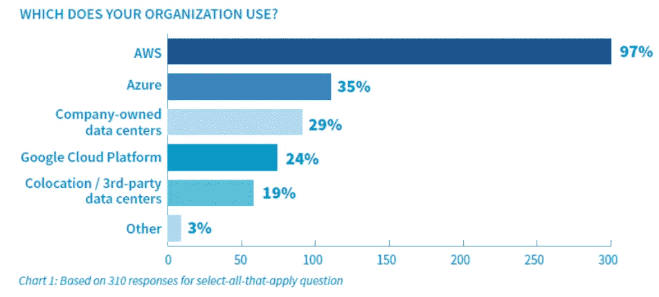

# 谷歌新的“可解释人工智能”(xAI)服务

> 原文：<https://towardsdatascience.com/googles-new-explainable-ai-xai-service-83a7bc823773?source=collection_archive---------6----------------------->

## 谷歌已经开始为“可解释的人工智能”或 XAI 提供一项新服务，这是一种时髦的叫法。目前提供的工具并不多，但是目标是正确的。

# 人工智能有一个可解释的问题

人工智能将改变全球生产力、工作模式和生活方式，并创造巨大的财富。

研究公司 Gartner 预计，到 2022 年 ，全球人工智能经济将从去年的约 1.2 万亿美元增长到约[**【3.9 万亿美元，而麦肯锡认为，到 2030 年**](https://www.forbes.com/sites/alexknapp/2018/04/25/gartner-estimates-ai-business-value-to-reach-nearly-4-trillion-by-2022/#3eb979af33f9) 全球经济活动将达到约[**【13 万亿美元】。**](https://www.mckinsey.com/featured-insights/artificial-intelligence/notes-from-the-ai-frontier-modeling-the-impact-of-ai-on-the-world-economy)

人工智能技术，特别是**D**eep**L**earning(DL)模型[正在一个又一个应用领域以令人瞠目结舌的性能](https://tryolabs.com/blog/2018/12/19/major-advancements-deep-learning-2018/)彻底改变商业和技术世界——图像分类、对象检测、对象跟踪、姿势识别、视频分析、合成图片生成——仅举几例。

它们被用于医疗保健、信息技术服务、金融、制造、自动驾驶、视频游戏、科学发现，甚至刑事司法系统。

然而，它们一点也不像经典的盈利算法/技术。DL 模型使用数百万个参数，并创建极其复杂和高度非线性的图像或数据集的内部表示。

因此，他们通常被称为**完美的暗箱 ML 技术。在我们用大数据集训练它们之后，我们可以从它们那里获得高度准确的预测，但我们几乎没有希望理解模型用来将特定图像归类的数据的内部特征和表示 。**

****

****Source**: [CMU ML blog](https://blog.ml.cmu.edu/2019/05/17/explaining-a-black-box-using-deep-variational-information-bottleneck-approach/)**

# **谷歌已经启动了一项新的服务来解决这个问题**

**毫无疑问，正如商业分析师和经济学家所预测的那样，谷歌(或其母公司 Alphabet)在巨大的人工智能经济的适当发展中有很大的利害关系(见上一节)。**

**早在 2017 年，谷歌就将其官方[战略政策设定为“人工智能优先”。](https://venturebeat.com/2017/05/18/ai-weekly-google-shifts-from-mobile-first-to-ai-first-world/)**

**因此，它可能感到了压力，要成为行业的火炬手，通过提供可解释的人工智能服务，让人工智能不那么神秘，更容易为普通用户所接受。**

## **什么是可解释的人工智能？**

**这个概念，顾名思义，很简单。你希望你的模型不仅能给出预测，还能给出一些解释，关于**为什么预测会变成那样**。**

****

> **但是为什么需要它呢？**

**[这篇文章](https://medium.com/@ODSC/explainable-ai-from-prediction-to-understanding-38c81c11460)涵盖了一些要点。人工智能系统提供可解释性的主要原因是—**

*   **提高人类可读性**
*   **确定机器所做决策的合理性**
*   **帮助决定责任，责任导致良好的决策**
*   **避免歧视**
*   **减少社会偏见**

**围绕它仍有许多争论，但一个共识正在形成，即后预测论证不是一个正确的方法。可解释性目标应该在核心设计阶段构建到 AI 模型/系统中，应该是系统不可分割的一部分，而不是附件。**

**已经提出了一些流行的方法。**

*   ****更好地理解数据** —直观形象地展示区别特征**
*   ****更好地理解模型** —可视化神经网络层的激活。**
*   ****更好地了解用户心理和行为** —在统计学习的同时将行为模型整合到系统中，并在此过程中生成/整合适当的数据/解释**

**[甚至 DARPA 已经开始了整个项目](https://www.darpa.mil/attachments/XAIProgramUpdate.pdf)来为未来人工智能/人工智能驱动的防御系统构建和设计这些 XAI 原理和算法。**

> **在核心设计阶段，可解释性目标应该被构建到人工智能模型/系统中**

**请阅读这篇文章，以获得对这一概念的全面讨论。**

** [## AI 应该自我解释吗？或者我们应该设计可解释的人工智能，这样它就不必

### 在本文中，我将介绍:

towardsdatascience.com](/should-ai-explain-itself-or-should-we-design-explainable-ai-so-that-it-doesnt-have-to-90e75bb6089e) 

## 谷歌云希望在 xAI 领域领先

谷歌在吸引人工智能和人工智能人才方面处于领先地位，它是当前世界信息化经济中无可争议的巨头。然而，与亚马逊和微软相比，它的云服务远远排在第三位。

Source: [Top cloud providers 2019](https://www.zdnet.com/article/top-cloud-providers-2019-aws-microsoft-azure-google-cloud-ibm-makes-hybrid-move-salesforce-dominates-saas/)

然而，[正如本文所指出的](https://www.zdnet.com/article/top-cloud-providers-2019-aws-microsoft-azure-google-cloud-ibm-makes-hybrid-move-salesforce-dominates-saas/)，尽管传统的基础设施即服务之战已经在很大程度上决定了，但人工智能和 ML 等新技术已经为玩家开辟了新的主题、策略和尝试方法的领域。

基于这些想法，在本周伦敦的一次活动中，谷歌的云计算部门推出了一个新设施，希望它能给自己带来相对于微软和亚马逊的优势。

[著名人工智能研究员 Andrew Moore 教授](http://www.cs.cmu.edu/~awm/)在伦敦介绍并解释了这项服务。

Prof. Andrew Moore in London for Google Cloud explainable AI service launch, [source](https://www.bbc.com/news/technology-50506431)

从他们的[官方博客](https://cloud.google.com/explainable-ai/)，

> “可解释的人工智能是一套工具和框架，可以帮助你开发可解释和包容的机器学习模型，并自信地部署它们。通过它，您可以了解 AutoML 表和 AI 平台中的特征属性，并使用假设分析工具直观地研究模型行为。”

## 最初—适度的目标

最初，目标和范围相当有限。该服务将提供关于人脸和物体检测模型的性能和潜在缺点的信息。

然而，随着时间的推移，GCP 希望提供更广泛的见解和可视化，以帮助使其人工智能系统的内部工作不那么神秘，更值得每个人信任。

> 人工智能和人工智能等新技术为云服务玩家打开了一个领域，让他们尝试新的主题、策略和方法。

摩尔教授坦率地承认，在可解释性问题上，人工智能系统甚至让谷歌最优秀的头脑也感到为难。

"*让我们在谷歌疯狂的一件事是，我们经常建立非常准确的机器学习模型，但我们必须理解他们为什么要做他们正在做的事情。在许多大型系统中，我们为我们的智能手机或我们的搜索排名系统或问答系统构建的，我们在内部努力了解正在发生的事情。*”

谷歌希望给用户一个更好的解释，方法之一是通过所谓的**型号卡**。

Google model card for face detection, Source: [ZDNet article](https://www.zdnet.com/article/googles-new-ai-tool-could-help-us-unlock-the-mysteries-of-the-algorithms-that-decide-everything/)

谷歌曾经提供了一个场景分析工具。他们鼓励用户将新的可解释工具与这个场景分析框架结合起来。

“你可以将人工智能解释与我们的假设工具结合起来，以全面了解你的模型的行为，”谷歌云战略总监特雷西·弗雷说。

Google AI’s What-If tool

**而且，目前它是一个免费的附加软件**。可解释的人工智能工具免费提供给 AutoML 表或人工智能平台的用户。

欲了解更多细节和历史观点，[请考虑阅读这篇精彩的白皮书](https://storage.googleapis.com/cloud-ai-whitepapers/AI%20Explainability%20Whitepaper.pdf)。

总的来说，这听起来是一个好的开始。虽然，并不是每个人，甚至是谷歌内部的人，都对 xAI 的整个想法充满热情。

# 偏见和审计？

## 有人说偏见是一个更大的问题

过去，[谷歌研究总监](https://norvig.com)彼得·诺维格曾说过可解释的人工智能，

> “你可以问一个人，但是，你知道，认知心理学家发现，当你问一个人时，你并没有真正了解决策过程。他们先做决定，然后你问，然后他们给出一个解释，而这个解释可能不是真实的。”

所以，从本质上说，我们的决策过程受到心理学的限制，对机器来说也是如此。我们真的需要为机器智能改变这些机制吗？如果得出的答案和见解不为用户所接受怎么办？

相反，[他认为](https://www.computerworld.com.au/article/621059/google-research-chief-questions-value-explainable-ai/)在机器的决策过程中，应该给予跟踪和识别偏见和公平更多的思考和重视。

要做到这一点，模型的内部工作不一定是最好的观察点。人们可以观察系统随时间做出的所有输出决策，并识别隐藏偏差机制的特定模式。

> 对于未来的人工智能系统来说，偏见和公平应该比单纯的解释更重要吗？

如果你申请贷款并被拒绝，一个可解释的人工智能服务可能会吐出这样一句话——“你的贷款申请被拒绝是因为缺乏足够的收入证明”。然而，任何建立了 ML 模型的人都知道，该过程不是一维的，产生这种决策的数学模型的具体结构和权重(通常作为一个整体)取决于收集的数据集，在涉及收入和经济流动性的问题时，这些数据集可能对社会中的某些人有偏见。

因此，这场辩论将围绕这样一个相对重要的问题展开:仅仅拥有一个显示出基本的、淡化了的解释的系统，以及建立一个更少偏见、更高程度公平的系统。

## 外部自动审计？

为了让人工智能系统更容易解释(或者至少更负责任)，一些人提出了自动化、可扩展的外部审计系统来管理来自黑盒人工智能平台的决策。[艾伦人工智能研究所](https://allenai.org/)的柳文欢·埃齐奥尼在这里提出了这样一种方法[。](https://www.wired.com/story/ai-needs-to-be-audited/)

 [## 高风险的人工智能决策需要被自动审计

### 今天的人工智能系统在贷款、医疗诊断、假释等方面做出重大决策。它们也是不透明的…

www.wired.com](https://www.wired.com/story/ai-needs-to-be-audited/) 

如果你有任何问题或想法要分享，请联系作者[**tirthajyoti【AT】Gmail . com**](mailto:tirthajyoti@gmail.com)。此外，您可以查看作者的 [**GitHub**](https://github.com/tirthajyoti?tab=repositories) **资源库**中的代码、思想和机器学习和数据科学方面的资源。如果你像我一样，对人工智能/机器学习/数据科学充满热情，请随时[在 LinkedIn 上添加我](https://www.linkedin.com/in/tirthajyoti-sarkar-2127aa7/)或[在 Twitter 上关注我](https://twitter.com/tirthajyotiS)。

 [## Tirthajyoti Sarkar - Sr .首席工程师-半导体、人工智能、机器学习- ON…

### 通过写作使数据科学/ML 概念易于理解:https://medium.com/@tirthajyoti 开源和有趣…

www.linkedin.com](https://www.linkedin.com/in/tirthajyoti-sarkar-2127aa7/?source=post_page-----c02c141c5756----------------------)**