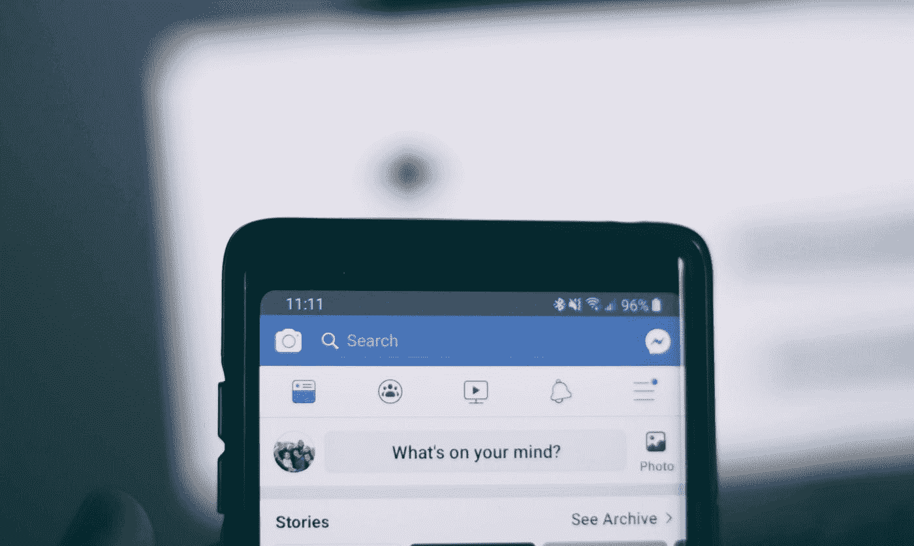

# 谷歌的夜莺计划和紧急医疗数据

> 原文：<https://towardsdatascience.com/googles-project-nightingale-and-emergent-medical-data-7382b15f051f?source=collection_archive---------43----------------------->

## 其他人的健康数据对你有什么影响

Photo by [Marcelo Leal](https://unsplash.com/@marceloleal80?utm_source=medium&utm_medium=referral) on [Unsplash](https://unsplash.com?utm_source=medium&utm_medium=referral)

你知道手机应用收集位置、通话记录、社交媒体帖子等等。这些数据收集机器在收集相关信息以识别选择性广告的客户方面不断改进。虽然我们所处的这种反乌托邦式的定向广告前景令人恐惧，但这仅仅是商业化潜力或个人数据歧视的冰山一角。数据在我们的数字经济中有着巨大的价值，没有任何数据比患者病历的价值更高。广告商可以利用这些数据来推销昂贵的药品，并针对一个人的医疗状况定制行为广告。保险公司也可以收集这些医疗数据来计算患者的保费。

健康数据影响着我们生活和身份的方方面面。诊断可能使我们改变生活方式或接受终生治疗。对于那些不想公布潜在健康状况的人来说，仍然可以使用我们的数字指纹来观察由于健康原因而导致的生活方式的改变。此外，一些行为可能预示着未诊断的医疗状况。梅森将这些从数字足迹中推断出的医疗状况描述为紧急医疗数据。在今年 6 月发表的一篇文章中，[脸书的研究人员](https://journals.plos.org/plosone/article?id=10.1371/journal.pone.0215476)表明，来自社交媒体帖子的信息可能与潜在的医疗状况相关联。该研究包括 999 名患者的病历和脸书状态。该研究表明，仅基于脸书的帖子，在诊断糖尿病患者和精神健康状况方面是有效的。

Photo by [Joshua Hoehne](https://unsplash.com/@mrthetrain?utm_source=medium&utm_medium=referral) on [Unsplash](https://unsplash.com?utm_source=medium&utm_medium=referral)

脸书邮报是一个面向外部的媒体，旨在向更广泛的社区表达情感。搜索结果对用户来说更加“私密”，因此许多人会搜索他们永远不会公开发布的信息。这种对搜索引擎的信任使得控制搜索引擎的公司特别擅长收集潜在的健康数据，因为患者可能会通过在诊断后收集更多信息来开始他们的健康之旅。最大的搜索引擎谷歌最近被曝与美国最大的非营利医疗系统阿森松岛进行了秘密谈判。这项名为“南丁格尔计划”的交易让谷歌获得了 5000 万份患者病历。谷歌健康记录数据库的规模和来自“私人”搜索结果的扩展信息赋予谷歌前所未有的能力，来识别反映所有用户中疾病的存在或早期发作的单词、短语和其他变量。

南丁格尔项目为谷歌创建了一个黄金标准健康数据库，以发现新的健康标志，并将它们应用于广泛的公司平台，以推断用户的医疗状况。谷歌最有可能将这个黄金标准数据集导出到母公司 Alphabet 的其他分支机构。例如，谷歌和 Nest 正在努力为一种智能家居健康算法申请专利，该算法能够从居住者的行为中推断他们是否患有阿尔茨海默氏症或物质使用障碍。**这些新的健康标志将作为商业秘密受到保护，不向公众公开，可能会花费数百万的医疗费用和无数的生命。**

谷歌在健康领域的野心越来越大，最近收购 Fitbit 就是明证。2700 万 [FitBit](https://www.cnbc.com/2019/11/17/people-getting-rid-of-fitbits-after-google.html) 用户为谷歌扩展到可穿戴健康技术时正在建立的消费者健康监控帝国提供了一个新的角度。

谷歌并不是唯一一个雄心勃勃收集消费者健康数据的公司。Apple Health 和 Apple Watch 可穿戴设备可供苹果开发的时机已经成熟。微软和亚马逊紧随其后，这些科技公司提供医疗保险等产品，并利用从购物习惯和智能扬声器收集的数据来预测用户的健康信息。

并非所有数据都是平等的。患者的医疗记录很有价值，因为它们可以用作训练算法的黄金标准，以搜索另一个用户未公开或未诊断的医疗状况。科技公司开始使用这些信息来为行为广告或药物分析用户。我的一个朋友多年来一直在与潜在的疾病作斗争，并向我分享了他对他最喜欢的流媒体平台上不断出现的药品广告的烦恼。他的潜在状况的细节是如何被转移到针对他的健康的广告商那里的，这令人担忧。我们会成为未确诊疾病的行为广告的目标吗？这些技术公司有义务向用户报告推断的情况吗？随着我们越来越多的个人数据被用于盈利，监管机构和个人应该要求提供这些信息。

来源:

[https://slate . com/technology/2019/11/Google-ascension-project-nightingale-emergent-medical-data . html](https://slate.com/technology/2019/11/google-ascension-project-nightingale-emergent-medical-data.html)

【https://journals.plos.org/plosone/article? id = 10.1371/journal . pone . 0215476

[https://blog . petrieflom . law . Harvard . edu/2017/10/11/emergent-medical-data/](https://blog.petrieflom.law.harvard.edu/2017/10/11/emergent-medical-data/)