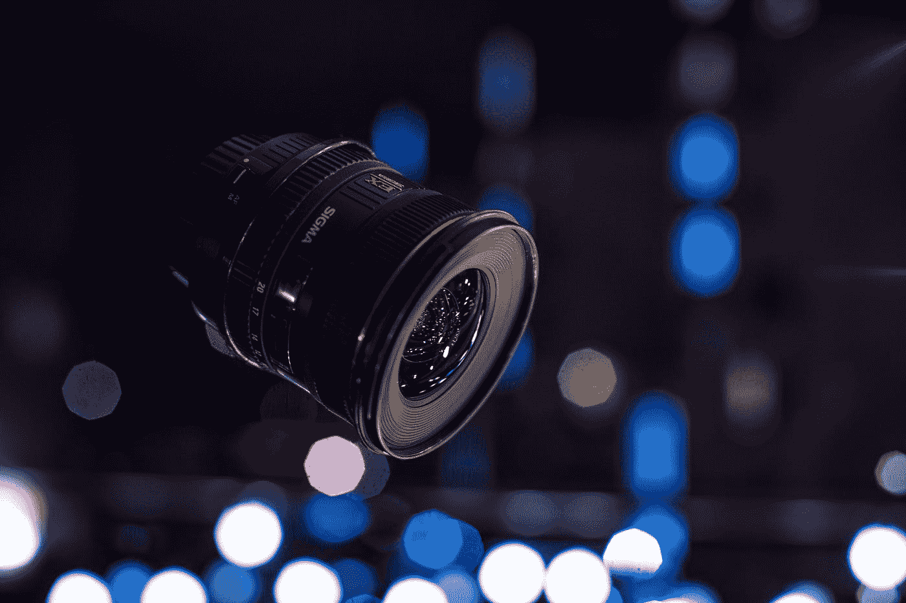
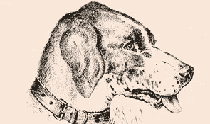

# 被幻觉欺骗的 GoogleVision？

> 原文：<https://towardsdatascience.com/googlevision-tricked-by-illusions-e698d98cc3cf?source=collection_archive---------24----------------------->

Photo by [Conor Luddy](https://unsplash.com/@opticonor?utm_source=medium&utm_medium=referral) on [Unsplash](https://unsplash.com?utm_source=medium&utm_medium=referral)

马克斯·伍尔夫的这条推文在一段时间内被到处谈论

我发现这很有趣。所以，我想弄清楚[谷歌视觉 API](https://cloud.google.com/vision/) 如何对互联网上不同类型的*幻觉*做出反应。

Classification - Dog 100% (Confidence)

所以，在第一张图中，我们可以清楚地看到一只**狗**。

而[视觉 API](https://cloud.google.com/vision/) 归类为 **100%** 置信度的狗。

这并不奇怪。

Classification — Head, nose, jaw, and mouth 85% (Confidence, Avg)

现在让我们将图像向右旋转 90 度。

我给你做了标记，让你很容易认出代表一个戴着帽子的男人的部分——看起来有点悲伤，因为是狗耳朵的一部分！

令人惊讶的是， [Vision API](https://cloud.google.com/vision/) 也收到了！它以大约 85%的置信度预测它是头部、鼻子、下巴和嘴巴。

下图显示了类似的结果:

Classification — Frog, Toad, Amphibian 65% (Confidence, Avg)

它被归类为青蛙、蟾蜍、两栖动物，有大约 65%的把握。

Classification — Horse 93% (Confidence)

它被归类为马！有着超过 **90** %的信心。

谷歌更进一步，把它归类为'*鬃毛*'、' T24 种马'和' m *ustang* '也是！

显然[视觉 API](https://cloud.google.com/vision/) ，就像你和我会感知一个图像，需要它来旋转图像并得到一个“*哦，我现在看到了*！”瞬间。

## 取向的确很重要。

这里有一个陷阱，当伪装在背景中时，[视觉 API](https://cloud.google.com/vision/) 无法识别图像中的对象。它甚至在图像中失败，在图像中，它会有不同的组件融合在一起，造成某种东西由它们组成的幻觉。

你可以自己去看。

S[ave The Animals Poster by WWF](https://www.moillusions.com/save-the-animals-poster-by-wwf/)

我们可以看到一些隐藏的动物(为了便于可视化而标记)，但遗憾的是 [Vision API](https://cloud.google.com/vision/) 只能看到**植物群，而不是动物群。**

同样，这里它识别一棵树、一根树枝、一棵木本植物，而不是脸。

## 就是这样！如果你有任何问题，请随时发微博给我。

哦，我在网上找到了这个-

## [关注我](https://medium.com/@vyasaananya19)随时更新我的帖子。祝您愉快！🎉