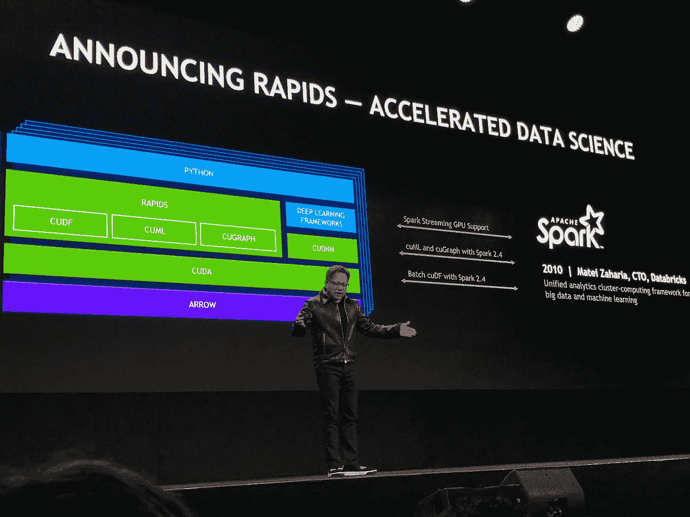
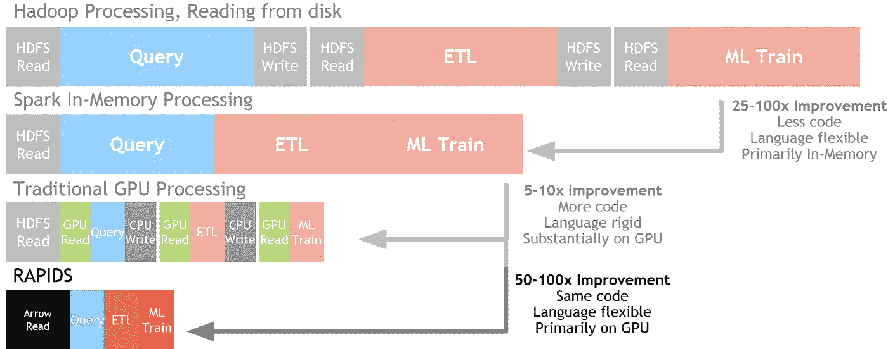
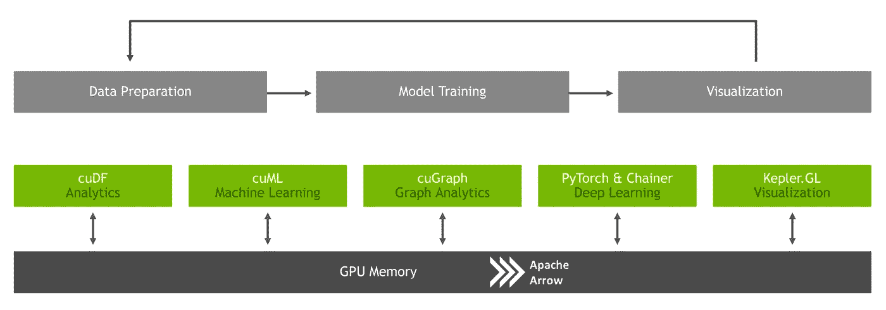
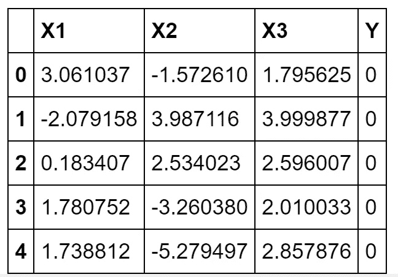
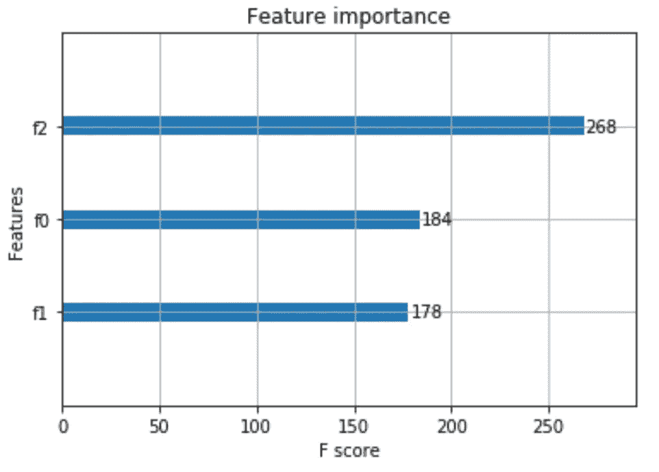

# GPU 加速数据分析和机器学习

> 原文：<https://towardsdatascience.com/gpu-accelerated-data-analytics-machine-learning-963aebe956ce?source=collection_archive---------9----------------------->

## 未来就在这里！使用 Python RAPIDS 库支持加速您的机器学习工作流。



(Source: [https://res.infoq.com/news/2018/10/Nvidia-keynote-gtc/en/resources/1BFA0900F-5083-497B-8275-B80D87C9CFF8-1539179054604.jpeg](https://res.infoq.com/news/2018/10/Nvidia-keynote-gtc/en/resources/1BFA0900F-5083-497B-8275-B80D87C9CFF8-1539179054604.jpeg))

# 介绍

GPU 加速如今变得越来越重要。这一转变的两个主要驱动因素是:

1.  世界上的数据量每年都在翻倍[1]。
2.  由于量子领域的限制，摩尔定律现在即将结束。

作为这种转变的一个证明，越来越多的在线数据科学平台正在添加支持 GPU 的解决方案。一些例子是:Kaggle，谷歌合作实验室，微软 Azure 和亚马逊网络服务(AWS)。

在本文中，我将首先向您介绍 NVIDIA 开源 Python RAPIDS 库，然后向您展示 RAPIDS 如何将数据分析速度提高 50 倍。

本文使用的所有代码都可以在我的 [GitHub](https://github.com/pierpaolo28/Artificial-Intelligence-Projects/tree/master/NVIDIA-RAPIDS%20AI) 和 [Google 联合实验室](https://colab.research.google.com/drive/1oEoAxBbZONUqm4gt9w2PIzmLTa7IjjV9)上找到，供您使用。

# 湍流

在过去的几年中，为了处理大量的数据，已经提出了许多解决方案。一些例子是 [MapReduce、Hadoop 和 Spark](/big-data-analysis-spark-and-hadoop-a11ba591c057) 。

RAPIDS 现在被设计成数据处理的下一个发展阶段。由于其 Apache Arrow 内存格式，与 Spark 内存处理相比，RAPIDS 的速度提高了大约 50 倍(图 1)。此外，它还能够从一个 GPU 扩展到多个 GPU[3]。

所有的 RAPIDS 库都是基于 Python 的，并且被设计成拥有 Pandas 和 Sklearn 这样的接口来促进采用。



Figure 1: Data Processing Evolution [3]

所有的 RAPIDS 包现在都可以免费在 Anaconda、Docker 和 Google Colaboratory 等基于云的解决方案上使用。

RAPIDS 结构基于不同的库，以便加速端到端的数据科学(图 2)。它的主要组成部分是:

*   cuDF =用于执行数据处理任务(熊猫喜欢)。
*   cuML =用于创建机器学习模型(Sklearn like)。
*   cuGraph =用于执行绘图任务([图论](https://www.analyticsvidhya.com/blog/2018/09/introduction-graph-theory-applications-python/))。

RAPIDS 还集成了:用于深度学习的 PyTorch & Chainer、用于可视化的 Kepler GL 和用于分布式计算的 Dask。



Figure 2: RAPIDS architecture [3]

# 示范

我现在将向您演示，与使用 Pandas 和 Sklearn 相比，使用 RAPIDS 如何能够实现更快的数据分析。我将使用的所有代码都可以在[谷歌合作实验室](https://colab.research.google.com/drive/1oEoAxBbZONUqm4gt9w2PIzmLTa7IjjV9)上获得，所以你可以自由地自己测试它！

为了使用 RAPIDS，我们首先需要使我们的谷歌协作笔记本能够与特斯拉 T4 GPU 一起在 GPU 模式下使用，然后安装所需的依赖项(指南可在我的[谷歌协作笔记本](https://drive.google.com/open?id=1oEoAxBbZONUqm4gt9w2PIzmLTa7IjjV9)上获得)。

## 预处理

一旦一切就绪，我们就可以导入所有必要的库了。

在这个例子中，我将向您展示与仅使用 Sklearn 相比，RAPIDS 如何加快您的机器学习工作流。在这种情况下，我决定使用 Pandas 来预处理 RAPIDS 和 Sklearn 分析。在我的[谷歌合作实验室](https://drive.google.com/open?id=1oEoAxBbZONUqm4gt9w2PIzmLTa7IjjV9)笔记本上也有另一个例子，我用 cuDF 代替预处理。使用 cuDF 而不是 Pandas，可以导致更快的预处理，特别是在处理大量数据的情况下。

对于本例，我决定使用由三个要素和两个标注(0/1)组成的高斯分布来构建一个简单的数据集。

已经选择了分布的平均值和标准偏差值，以便使这个分类问题相当容易(线性可分数据)。



Figure 3: Sample Dataset

创建数据集后，我将它的特征和标签分开，然后定义一个函数对其进行预处理。

现在我们有了训练/测试集，我们终于准备好开始我们的机器学习了。在这个例子中，我将使用 XGBoost(极端梯度推进)作为分类器。

## 湍流

为了在 RAPIDS 中使用 XGBoost，我们首先需要将我们的训练/测试输入转换成矩阵形式。

接下来，我们可以开始训练我们的模型。

上述单元的输出如下所示。使用 RAPIDS 提供的 XGBoost 库只花了不到两分钟来训练我们的模型。

```
CPU times: user 1min 54s, sys: 307 ms, total: 1min 54s
Wall time: 1min 54s
```

此外，RAPIDS XGBoost 库还提供了一个非常方便的函数，可以对数据集中每个特性的重要性进行排序和绘图(图 4)。

这对于减少我们数据的维度非常有用。事实上，通过选择最重要的特征并在此基础上训练我们的模型，我们将降低过度拟合数据的风险，并且我们还将加快训练时间。如果你想了解更多关于特性选择的信息，你可以阅读我的文章。



Figure 4: XGBoost Feature Importance

最后，我们现在可以计算我们的分类器的准确性。

我们使用 RAPIDS 的模型的整体准确性等于 98%。

```
XGB accuracy using RAPIDS: 98.0 %
```

## Sklearn

我现在将使用普通的 Sklearn 重复相同的分析。

在这种情况下，训练我们的模型只花了 11 分钟多一点。这意味着使用 Sklearn 解决这个问题比使用 RAPIDS (662s/114s)慢 5.8 倍。通过在预处理阶段使用 cuDF 而不是 Pandas，我们可以为这个例子的整个工作流减少更多的执行时间。

```
CPU times: user 11min 2s, sys: 594 ms, total: 11min 3s
Wall time: 11min 2s
```

最后，利用 Sklearn 计算了模型的整体精度。

此外，在这种情况下，总体准确率等于 98%。这意味着使用 RAPIDS 可以更快地得到结果，而不会影响模型的准确性。

```
XGB accuracy using Sklearn: 98.0 %
```

## 结论

正如我们从这个例子中看到的，使用 RAPIDS 导致了执行时间的持续减少。

这在处理大量数据时非常重要，因为 RAPIDS 能够将执行时间从几天减少到几小时，从几小时减少到几分钟。

RAPIDS 提供了有价值的文档和示例来充分利用它的库。如果你有兴趣了解更多，这里有一些例子[这里](https://github.com/rapidsai/notebooks)和[这里](https://github.com/rapidsai/notebooks-extended)。

我另外创建了另外两个笔记本来探索 RAPIDS cuGraph 和 Dask 库。如果你有兴趣了解更多，这里有[这里有](https://drive.google.com/open?id=1cb40U3gdXZ7ASQsWZypzBFrrFOKpvnbB)和[这里有](https://drive.google.com/open?id=1jrHoqh_zH7lIsWNsyfRaq0aUARkkW1s2)。

# 联系人

如果你想了解我最新的文章和项目[，请在 Medium](https://medium.com/@pierpaoloippolito28?source=post_page---------------------------) 上关注我，并订阅我的[邮件列表](http://eepurl.com/gwO-Dr?source=post_page---------------------------)。以下是我的一些联系人详细信息:

*   [领英](https://uk.linkedin.com/in/pier-paolo-ippolito-202917146?source=post_page---------------------------)
*   [个人博客](https://pierpaolo28.github.io/blog/?source=post_page---------------------------)
*   [个人网站](https://pierpaolo28.github.io/?source=post_page---------------------------)
*   [中等轮廓](https://towardsdatascience.com/@pierpaoloippolito28?source=post_page---------------------------)
*   [GitHub](https://github.com/pierpaolo28?source=post_page---------------------------)
*   [卡格尔](https://www.kaggle.com/pierpaolo28?source=post_page---------------------------)

# 文献学

[1]什么是大数据？—大数据世界入门指南。阿努什里·苏布拉马年，爱德华卡！。访问地点:【https://www.edureka.co/blog/what-is-big-data/ 

[2]不再有晶体管:摩尔定律的终结。有趣的工程学，约翰·雷夫勒。访问地址:[https://interesting engineering . com/no-more-transistors-the-end-of-Moores-law](https://interestingengineering.com/no-more-transistors-the-end-of-moores-law)

[3]急流:平台内外，乔希·帕特森 10–23–2018。访问网址:[http://on-demand . gputechconf . com/gtcdc/2018/pdf/DC 8256-rapids-the-platform-inside-and-out . pdf](http://on-demand.gputechconf.com/gtcdc/2018/pdf/dc8256-rapids-the-platform-inside-and-out.pdf)

[4] GPU 加速的数据科学|英伟达 GTC 主题演示。黄仁勋。访问地点:[https://www.youtube.com/watch?v=LztHuPh3GyU](https://www.youtube.com/watch?v=LztHuPh3GyU)