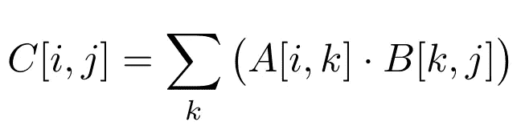

# MacOS 上 GPU 加速的机器学习

> 原文：<https://towardsdatascience.com/gpu-accelerated-machine-learning-on-macos-48d53ef1b545?source=collection_archive---------4----------------------->

## 苹果可能不喜欢 NVIDIA 卡，解决方案叫 PlaidML+OpenCL


PlaidML is a software framework that enables Keras to execute calculations on a GPU using OpenCL instead of CUDA. This is a good solution to do light ML development on a Mac without a NVIDIA eGPU card.

大规模并行编程对于在相似输入上多次应用相同操作的情况下加速计算非常有用。如果你的代码包含许多`if`或`case`语句，你可能想在使用*的 CPU 上运行，例如* [OpenMPI](https://www.open-mpi.org/) 。如果你的代码涉及到随机数的生成，并行编程可能不是最好的解决方案(不过，这里见)。否则，你很可能是在正确的地方，所以继续阅读！

> *训练一个神经网络涉及*非常*大量的矩阵乘法。这是典型的大规模并行操作，这也是 GPU 对机器学习至关重要的主要原因之一。需要记住的一条经验法则是，1K 个 CPUs = 16K 个内核= 3 个 GPU，尽管 CPU 可以执行的操作种类远远超过单个 GPU 内核。对于 GPU 来说，实力在数量！*

iMac 和 MacBook Pro 电脑配备了 AMD 镭龙 GPU 卡。不幸的是，这种硬件不能直接用于加速机器学习应用中典型的计算，例如训练 CNN。虽然没有适用于所有可能应用的解决方案，但是仍然有一个基于并行编程语言 OpenCL 的简单架构的解决方案。

两个最流行的 ML 框架 [Keras](https://keras.io/) 和 [PyTorch](https://pytorch.org/) 支持基于通用 GPU 库 [NVIDIA CUDA](https://developer.nvidia.com/cuda-zone) 的 GPU 加速。CUDA 只适用于 NVIDIA GPU 卡。

> *NVIDIA 外置 GPU 卡(eGPU)可用于带有雷电 3 端口的 MacOS 系统和 MacOS High Sierra 10.13.4 或更高版本。按照* [*本指南*](https://support.apple.com/en-us/HT208544) *安装 eGPU。*
> 
> *在 MacOs 上安装 CUDA 遵循* [*官方文档*](https://docs.nvidia.com/cuda/cuda-installation-guide-mac-os-x/index.html) *。这里可以找到* [*驱动*](https://www.nvidia.com/download/driverResults.aspx/147830/) *。*

# 使用 Python 的 OpenCL

项目 [PyOpenCL](https://documen.tician.de/pyopencl/) 可能是在 Mac 上开始使用 GP-GPU 的最简单的方法。另见其姊妹项目 [PyCUDA](https://documen.tician.de/pycuda/) 。

```
$ pip install pyopencl
```

OpenCL 的核心是一个*内核*，这是一个可以应用于大量输入数据的函数(用类似于 *C* 的语言编写)。

> *要了解并行编程，请阅读基于 CUDA 的在线课程* *，或者购买 Tim Mattson* et al *撰写的本书* [*。*](https://www.amazon.ca/OpenCL-Programming-Guide-Aaftab-Munshi/dp/0321749642)

OpenCL 比 CUDA 更灵活，允许程序在不同的架构上执行。这是有代价的:需要编写一些“样板”代码来定义一个*上下文* ( *即*什么样的硬件可用)、一个*队列* ( *即*一个命令序列)和一组内存标志(*如* `READ_ONLY`、`WRITE_ONLY`等。).典型的工作流程如下:

1.  输入数据被复制到 GPU 内存中
2.  GPU 缓冲存储器被保留用于存放计算结果
3.  内核被执行
4.  结果从 GPU 内存复制到主机内存

> *NB: OpenCL* 内核*可以在 CPU 和 GPU 上执行，但是如果代码针对某个 GPU 架构进行了高度优化(*例如*具有大内存)，它可能无法完全移植。*
> 
> *虽然 GPU 通常更快，但根据处理器的架构，将大量数据从 CPU 传输到 GPU 所需的时间可能会导致更高的开销时间。*

下面是一个计算两个矩阵之和的全功能 OpenCL 程序示例:

```
#!/usr/bin/env python
# -*- coding: utf-8 -*-from __future__ import absolute_import, print_function
import numpy as np
import pyopencl as cla_np = np.random.rand(50000).astype(np.float32)
b_np = np.random.rand(50000).astype(np.float32)ctx = cl.create_some_context()
queue = cl.CommandQueue(ctx)mf = cl.mem_flags
a_g = cl.Buffer(ctx, mf.READ_ONLY | mf.COPY_HOST_PTR, hostbuf=a_np)
b_g = cl.Buffer(ctx, mf.READ_ONLY | mf.COPY_HOST_PTR, hostbuf=b_np)kernel = """
__kernel void sum(
    __global const float *a_g, __global const float *b_g, __global float *res_g)
{
  int gid = get_global_id(0);
  res_g[gid] = a_g[gid] + b_g[gid];
}
"""prg = cl.Program(ctx, kernel).build()res_g = cl.Buffer(ctx, mf.WRITE_ONLY, a_np.nbytes)
prg.sum(queue, a_np.shape, None, a_g, b_g, res_g)res_np = np.empty_like(a_np)
cl.enqueue_copy(queue, res_np, res_g)# Check on CPU with Numpy:
print(res_np - (a_np + b_np))
print(np.linalg.norm(res_np - (a_np + b_np)))
assert np.allclose(res_np, a_np + b_np)
```

# 使用 OpenCL 作为 Keras 后端的机器学习(PlaidML)

[Keras](https://keras.io/) 是最流行的深度学习框架之一。使用 Keras' [功能 API](https://keras.io/getting-started/functional-api-guide/)定义网络架构、运行训练和执行推理非常容易。然而，Keras 本身并不执行实际的计算，而是部署其他软件库来定义、优化和评估涉及多维数组的数学表达式。最常见的有 [Theano](https://github.com/Theano/Theano) 和 [TensorFlow](https://www.tensorflow.org/) 。反过来，这些库使用 CUDA 在 GPU 上执行并行计算。如前所述，这带来了非常强的硬件限制，即它只能在 NVIDIA 卡上工作。

通过使用 [PlaidML](https://vertexai-plaidml.readthedocs-hosted.com/en/latest/index.html) 库可以部分避免这个问题:

```
$ pip install plaidml-keras
```

安装之后，执行安装脚本(选择默认，除非您知道自己在做什么):

```
$ plaidml-setup
```

您应该会看到类似这样的内容:

```
PlaidML Setup (0.6.4)Thanks for using PlaidML!Some Notes:
  * Bugs and other issues: https://github.com/plaidml/plaidml
  * Questions: https://stackoverflow.com/questions/tagged/plaidml
  * Say hello: https://groups.google.com/forum/#!forum/plaidml-dev
  * PlaidML is licensed under the Apache License 2.0 Default Config Devices:
   metal_amd_radeon_r9_m380.0 : AMD Radeon R9 M380 (Metal)Experimental Config Devices:
   llvm_cpu.0 : CPU (LLVM)
   opencl_amd_radeon_r9_m380_compute_engine.0 : AMD AMD Radeon R9 M380 Compute Engine (OpenCL)
   opencl_cpu.0 : Intel CPU (OpenCL)
   metal_amd_radeon_r9_m380.0 : AMD Radeon R9 M380 (Metal)Using experimental devices can cause poor performance, crashes, and other nastiness.Enable experimental device support? (y,n)[n]:Selected device:
    metal_amd_radeon_r9_m380.0Almost done. Multiplying some matrices...
Tile code:
  function (B[X,Z], C[Z,Y]) -> (A) { A[x,y : X,Y] = +(B[x,z] * C[z,y]); }
Whew. That worked.Save settings to /Users/user/.plaidml? (y,n)[y]:
Success!
```

> *该库支持许多但不是所有的 Keras 层。如果您的架构只涉及密集层、LSTM 层、CNN 层和漏层，那么您当然很好，否则请查看文档。*

原则上，您所要做的就是在您的程序前添加以下代码行来激活 PlaidML 后端:

```
import osos.environ["KERAS_BACKEND"] = "plaidml.keras.backend"
```

在执行过程中，您应该会看到如下打印输出:

```
Using plaindml.keras.backend backendINFO:plaidml:Opening device "metal_amd_radeon_r9_m380.0"
```

这是一个示例，改编自 Keras 的[官方文档](https://github.com/keras-team/keras/blob/master/examples/mnist_cnn.py)，应该可以开箱即用:

```
#!/usr/bin/env pythonimport osos.environ["KERAS_BACKEND"] = "plaidml.keras.backend"import keras
from keras.datasets import mnist
from keras.models import Sequential
from keras.layers import Dense, Dropout, Flatten
from keras.layers import Conv2D, MaxPooling2D
from keras import backend as Kbatch_size = 128
num_classes = 10
epochs = 12# input image dimensions
img_rows, img_cols = 28, 28# the data, split between train and test sets
(x_train, y_train), (x_test, y_test) = mnist.load_data()if K.image_data_format() == 'channels_first':
    x_train = x_train.reshape(x_train.shape[0], 1, img_rows, img_cols)
    x_test = x_test.reshape(x_test.shape[0], 1, img_rows, img_cols)
    input_shape = (1, img_rows, img_cols)
else:
    x_train = x_train.reshape(x_train.shape[0], img_rows, img_cols, 1)
    x_test = x_test.reshape(x_test.shape[0], img_rows, img_cols, 1)
    input_shape = (img_rows, img_cols, 1)x_train = x_train.astype('float32')
x_test = x_test.astype('float32')
x_train /= 255
x_test /= 255
print('x_train shape:', x_train.shape)
print(x_train.shape[0], 'train samples')
print(x_test.shape[0], 'test samples')# convert class vectors to binary class matrices
y_train = keras.utils.to_categorical(y_train, num_classes)
y_test = keras.utils.to_categorical(y_test, num_classes)model = Sequential()
model.add(Conv2D(32, kernel_size=(3, 3),
                 activation='relu',
                 input_shape=input_shape))
model.add(Conv2D(64, (3, 3), activation='relu'))
model.add(MaxPooling2D(pool_size=(2, 2)))
model.add(Dropout(0.25))
model.add(Flatten())
model.add(Dense(128, activation='relu'))
model.add(Dropout(0.5))
model.add(Dense(num_classes, activation='softmax'))model.compile(loss=keras.losses.categorical_crossentropy,
              optimizer=keras.optimizers.Adadelta(),
              metrics=['accuracy'])model.fit(x_train, y_train,
          batch_size=batch_size,
          epochs=epochs,
          verbose=1,
          validation_data=(x_test, y_test))
score = model.evaluate(x_test, y_test, verbose=0)
print('Test loss:', score[0])
print('Test accuracy:', score[1])
```

在 2015 款 iMac (3.2 GHz 英特尔酷睿 i5，16 GB DDR RAM，AMD 镭龙 R9 M380 2 GB GPU)上，使用 PlaidML/OpenCL GPU 后端训练需要 **1m50s** ，使用 TensorFlow-2.0/CPU 后端训练需要 **5m06s** 。

注意，如果没有可用的后端，指令`from keras import backend as K`将返回一个错误。例如，如果您没有安装`TensorFlow`(默认)，您会看到:

```
Using TensorFlow backend.
Traceback (most recent call last):
  File "./test_keras.py", line 8, in <module>
    import keras
  File "/Users/Riccardo/development/venv_opencl/lib/python3.7/site-packages/keras/__init__.py", line 3, in <module>
    from . import utils
  File "/Users/Riccardo/development/venv_opencl/lib/python3.7/site-packages/keras/utils/__init__.py", line 6, in <module>
    from . import conv_utils
  File "/Users/Riccardo/development/venv_opencl/lib/python3.7/site-packages/keras/utils/conv_utils.py", line 9, in <module>
    from .. import backend as K
  File "/Users/Riccardo/development/venv_opencl/lib/python3.7/site-packages/keras/backend/__init__.py", line 89, in <module>
    from .tensorflow_backend import *
  File "/Users/Riccardo/development/venv_opencl/lib/python3.7/site-packages/keras/backend/tensorflow_backend.py", line 5, in <module>
    import tensorflow as tf
ModuleNotFoundError: No module named 'tensorflow'
```

最后一点，`TensorFlow >=2.0`包括 Keras API。如果你的程序是从 TF 定义层，而不是从 Keras 定义层，那么你不能仅仅改变 Keras 后端来运行在支持 OpenCL 的 GPU 上，因为 TF2 *不支持 OpenCL* 。更具体地说:

这不会使用 GPU(假设你已经安装了`TensorFlow >=2.0`)

```
from tensorflow import keras
from tensorflow.keras import layers
```

这将工作得很好(假设你已经安装了`Keras`)

```
import keras
from keras import layers
```

## 用 Tile 编写 OpenCL 内核

事实证明，PlaidML 不仅仅是一个 Keras 后端。事实上，它附带了一种叫做 [Tile](https://www.intel.ai/automatic-kernel-generation-in-plaidml/#gs.lecnpy) 的编程语言，帮助用户编写优化的内核，而不需要深入了解 *C* 和 OpenCL 的大部分古怪之处。Tile 指令看起来更像数学函数。例如，矩阵乘法



在瓷砖上看起来像这样

```
function (A[M, L], B[L, N]) -> (C) {
    C[i, j: M, N] = +(A[i, k] * B[k, j]);
}
```

其中“+”运算符代表数学表达式中的“和”。

更多示例可在[文档](https://vertexai-plaidml.readthedocs-hosted.com/en/latest/writing_tile_code.html)中找到，包括一些最常见的操作，如矩阵乘法、最小/最大、最大池、卷积、累积和。合成内核时，Tile 展平张量并将索引转换为指针偏移量。计算被分成适合内存的*块*，其大小根据可用硬件进行优化。然后在 GPU 内存中布置图块，以优化 SIMDs 指令，如乘法和累加。最后，内核被写出来，就好像它们是由人类用户创建的一样，并被传递给 OpenCL 进行实际执行。

## 结论

PlaidML 现在是英特尔人工智能集团 [Vertex.ai](https://www.intel.ai/plaidml/) 的一部分。它可能最终使 AMD 卡(可能会有更多的厂商出现)成为 ML 中一个可行的选择。事实上，英特尔也将在 2020 年进入 GPU 市场，为数据中心的 ML 设计硬件，这可能通过竞争进一步降低计算价格。英特尔首席执行官 [Bob Swan 表示](https://www.forbes.com/sites/marcochiappetta/2019/10/26/intel-xe-dg1-discrete-gpu-silicon-is-alive-and-being-validated-in-intels-labs/#1caee6ba645f)*“2020 年，我们将继续扩大我们的 10 纳米产品组合，推出令人兴奋的新产品，包括人工智能推理加速器、5G 基站 SOC、用于服务器存储的至强 CPU、网络和独立 GPU。本季度，我们的首款独立 GPU DG1 实现了通电退出，这是一个重要的里程碑。”*。敬请关注！