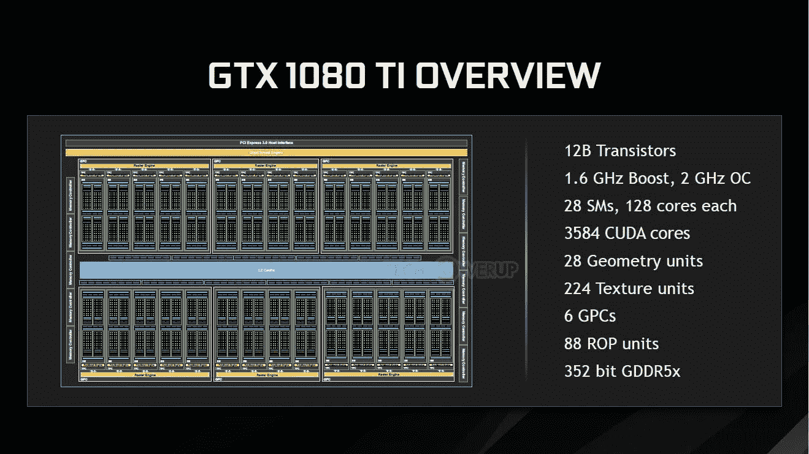
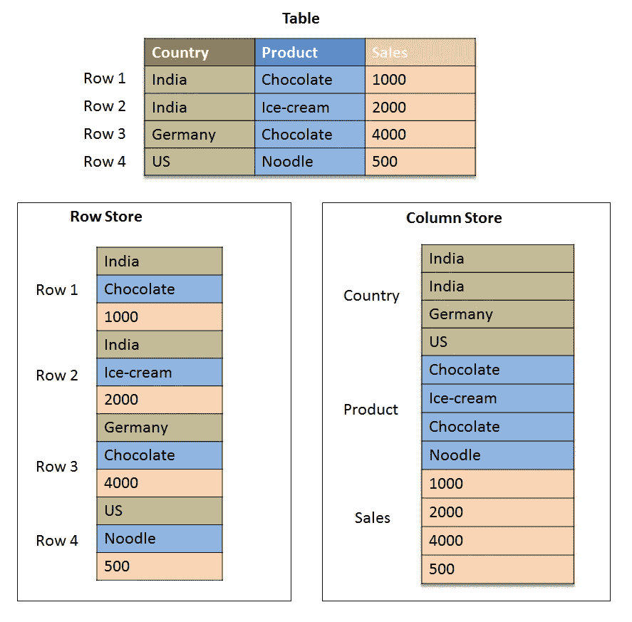

# GPU 数据科学:将 CSV 转换为 Parquet / ORC 比使用集群更快更便宜！

> 原文：<https://towardsdatascience.com/gpu-datascience-converting-csv-to-parquet-orc-faster-cheaper-than-using-a-cluster-c4b20d969009?source=collection_archive---------29----------------------->

## 在本地，有一句话已经说了很久了:“我们用启动资金处理企业级数据”——我们需要以更低的成本做到这一点！

这可能会令人沮丧——老实说，我曾经梦想过能够在几分钟内而不是几个小时内启动一个 1000 节点的集群来进行一些痛苦的处理会好得多。因此，我开始尝试一些替代方法，不仅加快我们的数据科学工作，还让它更便宜！

其中一种方法是利用 GPU 的能力。

# 是什么让 GPU 对数据科学有好处？

GPU 基本上是一个自包含的集群。NVIDIA 芯片有所谓的“CUDA 核心”，每个核心都是一个微型处理器，可以像 CPU 一样执行一些代码。

一款流行的消费级 GPU——GTX 1080 Ti 如下图所示，它显示该卡拥有 3584 个 CUDA 内核，可以并行处理这些数据。



Courtesy of videocardz.com

# 为什么用 CSV 到 ORC 或者拼花为例？

很简单，因为从计算上来说这是一件相对困难的事情。为了从基于行转换到基于列，需要透视整个数据集

最重要的是，数据被分割成条带，需要计算各种统计数据，并且要编写包含所保存数据摘要的文件页眉和页脚。



[https://www.reddit.com/r/dataengineering/comments/bd5h54/eli5_columnar_databasesdata_storage/](https://www.reddit.com/r/dataengineering/comments/bd5h54/eli5_columnar_databasesdata_storage/)

# 设置

我家里有一个 QNAP NAS，非常适合这次演示，因为我需要大量的存储，它有以下硬件和软件:

*   14TB SATA (Raid 10)
*   英伟达 Geforce GTX 1060 6GB
*   Rapids.ai(通过 Docker)

Rapids.ai 是一个由 NVIDIA 人员支持的开源框架，它提供了 GPU 优化的数据帧和各种其他工具来简化这一过程！

# 数据集

我们为一个客户端创建了一个数据集，它是 117GB 的压缩 CSV 文件(大约 400GB 未压缩)，大约有 20 亿行。我们需要将它转换成 ORC 格式，这样我们就可以将它插入我们的平台数据仓库(基于 Presto)。

# 在 GPU 上处理 CSV 到 ORC

*注意:我已经包括了在标准 SATA 驱动器上运行时下面每个步骤的时间*

第一步是创建一个包含所有 CSV 数据的 Dask GPU 数据帧。我的 GPU 只有 6GB，因此这里的限制是每个未压缩的块必须适合 GPU 内存，如果您以较少的大文件导出 CSV 数据，这可能会导致问题——在这种情况下，您应该处理未压缩的数据。

```
CPU times: user 1.82 s, sys: 870 ms, total: 2.69 s
Wall time 6.99 s
```

第二步是将数据重新划分为更易于管理的文件数量——这里的内存限制再次限制了您可以做的事情(尽管 Rapids.ai 团队正在进行这项工作)。

```
CPU times: user 60.2 ms, sys: 159 µs, total: 60.4 ms
Wall time: 57.6 ms
```

最后，获取这个新的数据帧并将其写出到 ORC 文件中:

```
CPU times: user 1h 4min 4s, sys: 30min 19s, total 1h 34min 23s
Wall time: 41min 57s
```

> ***所以总共 42 分钟处理 400 GB CSV 数据给 ORC***

# 测试回顾

当然，这个测试并不完美。有许多可以改进的地方。对我来说，最大的烦恼是我必须指定大量的分区，以便保持在我的 GPU 限制内。

激流勇进有一些票打开来解决这个，不过:
[https://github.com/rapidsai/cudf/issues/3542](https://github.com/rapidsai/cudf/issues/3542)
[https://github.com/rapidsai/cudf/issues/3342](https://github.com/rapidsai/cudf/issues/3342)
[https://github.com/rapidsai/cudf/issues/3004](https://github.com/rapidsai/cudf/issues/3004)

他们在开发方面非常积极，所以我只是假设这是处于风口浪尖的一部分！

**磁盘速度:**

同样，在 SATA 驱动器上运行该测试。42 分钟是一个了不起的结果，比运行 Presto 或类似的 21 节点大型实例集群的类似规模的数据集快得多。
我确实在 NVMe 驱动器上运行了这个，返回了 **31 分钟**，但是我认为可以通过运行单独的 NVMe 驱动器来进一步减少这个时间，以避免 IO 冲突。

# 结论

GPU 正迅速成为使用集群完成数据科学任务的廉价而现实的替代方案。与拥有 21 个节点的大型集群相比，部署单个 AWS GPU 实例的成本大约是前者的 1/10，探索这种数据处理方法比以往任何时候都更有意义。

