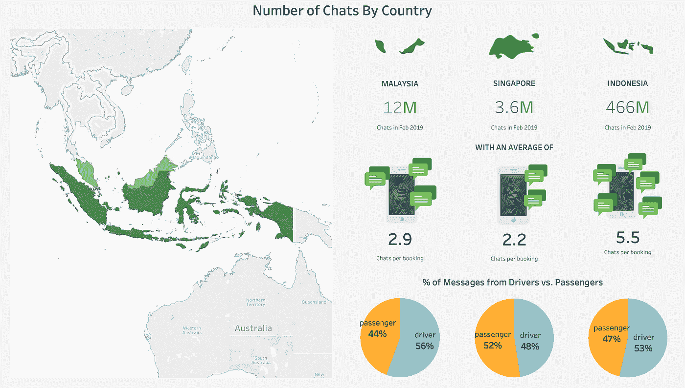
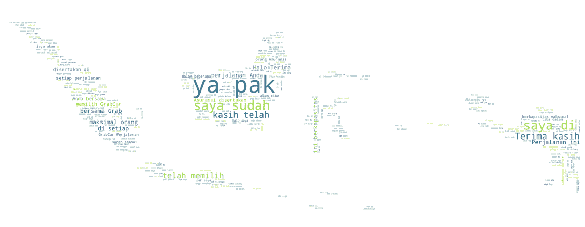
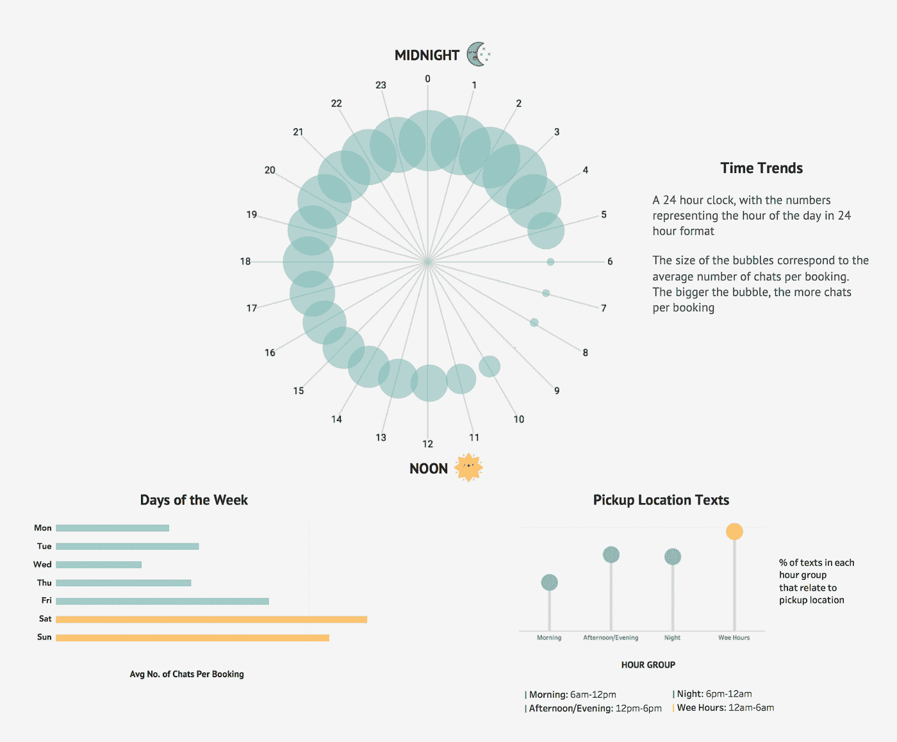
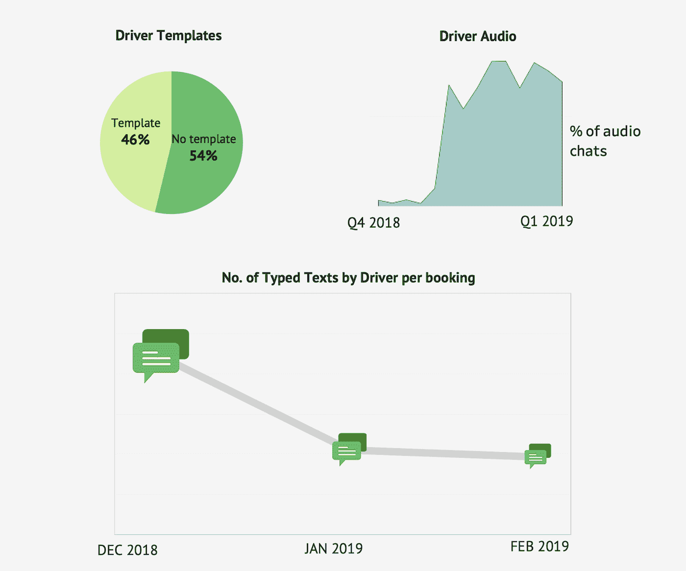
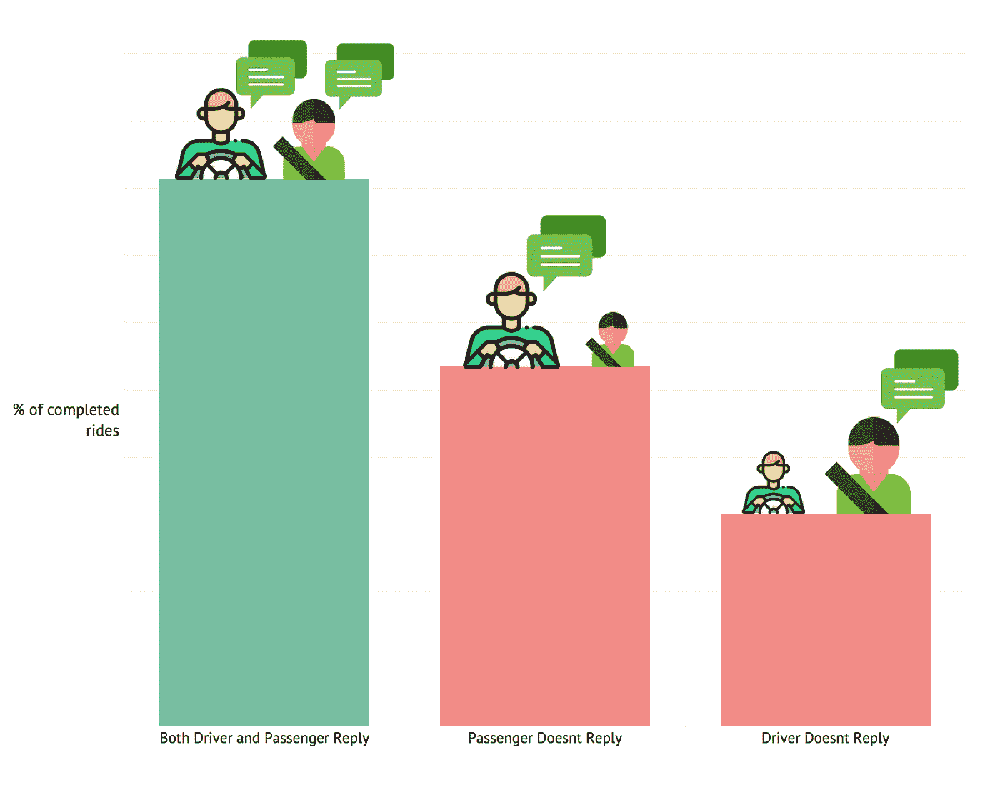
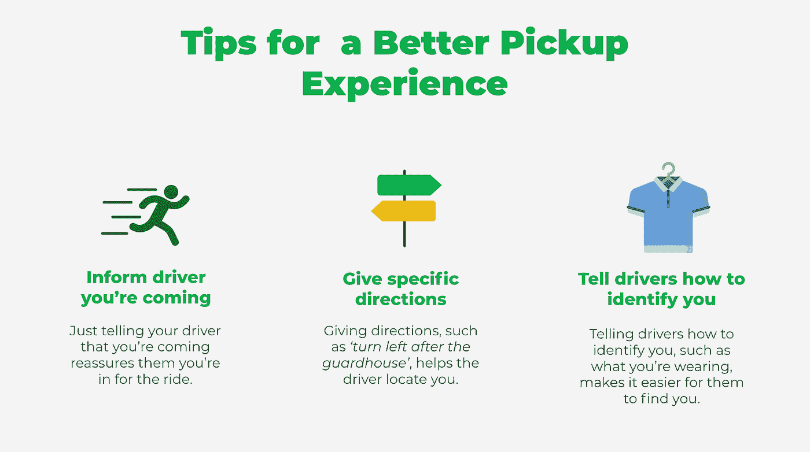

# 抓住多少？跟我谈数据！

> 原文：<https://towardsdatascience.com/grabchat-much-talk-data-to-me-40743ec5a75f?source=collection_archive---------41----------------------->

## 作者:[杰森·李](https://www.linkedin.com/in/jason-jie-shen/)，[劳拉·伊姆](https://www.linkedin.com/in/larapureumyim/)

2016 年 9 月，GrabChat 诞生了，这是一个旨在实现乘客和司机伙伴之间无缝沟通的平台。从那时起，Grab 通过引入即时翻译、图像和音频聊天等功能不断改善 GrabChat 体验，结果是取消率降低了 50%!我们甚至[尝试了各种功能](https://engineering.grab.com/experiment-chat-booking-cancellations)在每个国家提供超本地化的体验！那么有了这些功能，我们的用户反应如何呢？让我们对此进行更深入的研究，从我们在新加坡、马来西亚和印度尼西亚的数据中发现一些有趣的见解。

# 最健谈的国家

在两年前的一篇博客文章中，我们揭示了印度尼西亚是东南亚最健谈的国家。我们的最新数据没有什么不同。**印度尼西亚仍然是三个国家中最健谈的国家，平均每次预订有 5.5 次聊天，而新加坡是最不健谈的国家！此外，新加坡的乘客比司机伴侣更健谈，而其他两个国家的情况正好相反。**

**但是人们都在谈论什么呢？**

*Common words in Indonesia*

*Common words in Singapore*

*Common words in Malaysia*

不出所料，大多数聊天都围绕着搭讪点。这三个国家之间有许多相似之处，例如打招呼如“嗨”和“谢谢”,以及司机伴侣/乘客来了。然而，各国之间还是有细微的差别。你能认出他们吗？

在印度尼西亚，聊天通常是用印度尼西亚语进行的，而且大多是司机伙伴感谢乘客使用 Grab。

另一方面，新加坡的聊天倾向于用英语，而且大多包含上车地点，比如停车场。在新加坡的语境中有很多独特的词，如“垃圾道”和“街区”，反映了新加坡随处可见的 HDB(公共住房)的特征，这些公共住房是受欢迎的住宅区。

马来西亚似乎是其他两个国家的混合体，人们用英语和马来西亚语聊天。许多聊天突出了上车地点，如警卫室，以及所有马来西亚人都知道的短语:堵车。

# 时间趋势

对这三个国家的聊天趋势的分析揭示了一个意想不到的发现:从午夜到凌晨 4 点的聊天越来越多。困惑但好奇的是，我们进一步挖掘，以发现是什么促使我们的用户在这种奇怪的时间里说更多的话。

从午夜到凌晨 4 点，商店和商场通常在这些时间关闭，随着人们深夜在镇上闲逛，取货地点变得更加模糊。因此，司机伴侣和乘客倾向于进行更多的对话来确定上车点。这也解释了为什么所有消息中基于 **接送位置的消息的**比例在 12 点和早上 6 点**之间最高。另一方面，这些消息在早上(6am-12pm)不太常见，因为人们往往会从标准的住宅区被接走。**

# 图像趋势

*GrabChat’s Image-function uptake in Jakarta, Singapore, and Kuala Lumpur (Nov 2018 — March 2019)*

GrabChat 上发送图像的功能于 2018 年 9 月推出，旨在帮助司机合作伙伴确定乘客的确切上车位置。在发布的最初几周内，仅在新加坡就有 22，000 张图片被发送出去。从上面的 gif 图中可以看出，雅加达、新加坡和吉隆坡对图片功能的使用有所增加。

通过分析，我们发现**更偏远的地区，如新加坡的 Tengah，发送的图像比例往往最高**，这表明图像对不熟悉地方的用户很有用。

# 安全第一

除了图像，Grab 还引入了另外两个功能:模板和音频聊天，以避免司机伴侣在开车时发短信。

*Templates and audio features used by driver-partners, and a reduced number of typed texts by driver-partners per booking*

“模板”(预先填充的短语)允许司机伙伴只需快速点击即可发送模板消息。在我们最近的数据分析中，我们发现几乎 50%的司机合作伙伴文本包含模板。

“音频聊天”和“图像聊天”于 2018 年 9 月推出，该功能的使用一直在稳步增加，音频包括越来越多的司机合作伙伴文本。

随着这两项功能被所有三个国家的司机合作伙伴采用，Grab 在三个月内成功减少了每次预订的司机合作伙伴文本(非模板)的总数。

# 简短的提货指南

没人喜欢取消的旅程，对吧？在分析了数百万个数据点后，我们发现了一些巧妙的技巧和窍门来帮助你完成你的旅程，我们正在与你分享！

这第一个建议可能是显而易见的，但是回复你的司机伙伴会导致更高的完成率。没有人喜欢闷闷不乐，是吗？

接下来，我们发现了可以提高完成率的各种方法，如下图所示。

通知司机伙伴你要来了，给他们指路，告诉他们如何识别你，这样完成旅程的机会几乎会翻倍！

最后但同样重要的是，我们不要忘记我们的礼仪。Grab 的数据分析显示，说“谢谢”与完成率的增加相关。另外，要准时到达接车点——记住，对于我们的司机伙伴来说，时间就是金钱！

# 结论

就像莎士比亚的*中的无事生非一样，*仅仅是一个突发奇想的信息就可以收集到大量的信息。Grab 一直致力于为乘客和司机伙伴提供最佳体验，而数据在帮助我们实现这一目标方面发挥了巨大作用。

这只是这本书的第一页。隐藏在每一页之间的信息量是无穷无尽的。因此，请继续关注我们 GrabChat 平台的更多有趣见解！