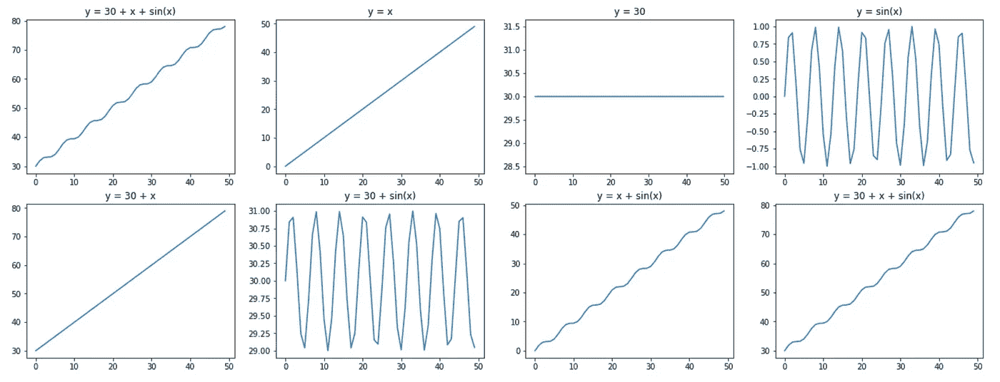
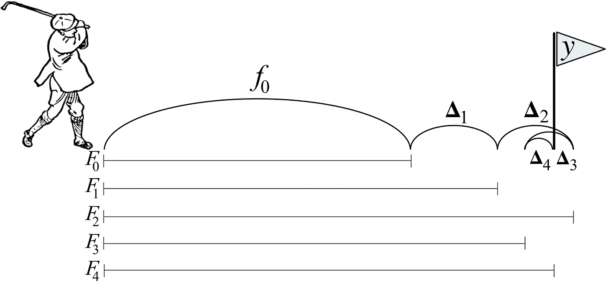

# 梯度增压机(GBM)—Eli 5 方式

> 原文：<https://towardsdatascience.com/gradient-boosting-machines-gbms-the-eli5-way-c4a21b2e2b0a?source=collection_archive---------21----------------------->


***【GBMs】***梯度推进机器(GBMs)是机器学习中的一种集成技术，其中建立个体*弱学习者(弱模型)*的复合模型，以便组合它们的所有结果并形成*强学习者(强模型)*。这是因为给定一个映射每一个观察值的数据集 *(xi，易)*，我们和算法总是更容易将整体函数***【F(x)***分解成*个简单的*子模块(子函数)*，而不是必须一次猜测整个表达式。由于这种*分而治之*的方法，该算法在逼近强模型方面变得非常好，从而减少了预测过程中出现的错误。*

*简而言之，Boosting 模型旨在提高前一个函数的精度分数，可以递归表示为:*

```
*Fm(x) = Fm-1(x) + fm(x)where,1\. Fm(x) = overall composite function of "m" simpler models
2\. fm(x) = m-th sub-module for Fm(x)
3\. Fm-1(x) = overall compositve function without fm(x)*
```

**

*The overall function y = 30 + x + sin(x) has been broken down into its sub-modules to illustrate how its simpler constituents can individually make an overall difference*

```
**Example:***F(x)  =** 30 + x + sin(x)**f1(x) =** 30
**f2(x) =** x
**f3(x) =** sin(x)**F(x)  =** f1(x) + f2(x) + f3(x)*
```

*在这个例子中，我们可以说，我们正在训练 M = 3 个弱学习者来近似整体函数*为***f1(x)+F2(x)+F3(x)****。***

****

**我们训练我们的复合学习器，使得每一次迭代的输出值都向真实值的方向推进。在上图中，我们看到一名高尔夫球手试图通过不同强度和方向的努力将球击入洞中。梯度增强以类似的方式工作。**

# **梯度推进决策树**

**梯度增强决策树(GBDT)是按顺序建模的——每次构建一棵树，其中每个新树负责纠正先前添加的树所产生的错误。尽管与训练随机森林相比，这个训练过程需要更长的时间，但是我们发现 GBDTs 是更好的学习者，即，我们用更少数量的树获得更好的准确度分数。此外，boosting 还可以处理不平衡的数据集。**

**培训 GBDTs 时需要执行 3 个步骤—**

1.  **损失/目标函数被优化**
2.  **弱学习者做预测**
3.  **加法模型将弱学习者堆积起来，以最小化成本函数。**

```
**Cost Function = average(outputs of Loss Function)**
```

# **培训 GBDTs 时需要考虑的事项**

**梯度推进是一种贪婪的算法，容易过度拟合。我们可以考虑一些参数来优化我们的模型—**

1.  **增加树的数量，直到没有观察到改进，以确保我们的模型是可推广的。**
2.  **较浅的树(4 - 8 层)是首选，以使模型不那么复杂。**
3.  **学习率可以保持在[0.1，0.3]的范围内，甚至小于 0.1。这是因为收缩减少了每棵树对整体模型未来改进的影响。**
4.  **也可以通过对权重执行 L1 和 L2 正则化来避免过拟合。一个规则化的目标将倾向于选择一个使用简单和预测函数的模型。**