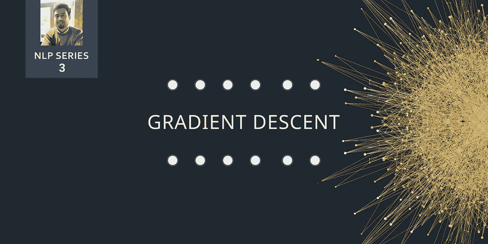
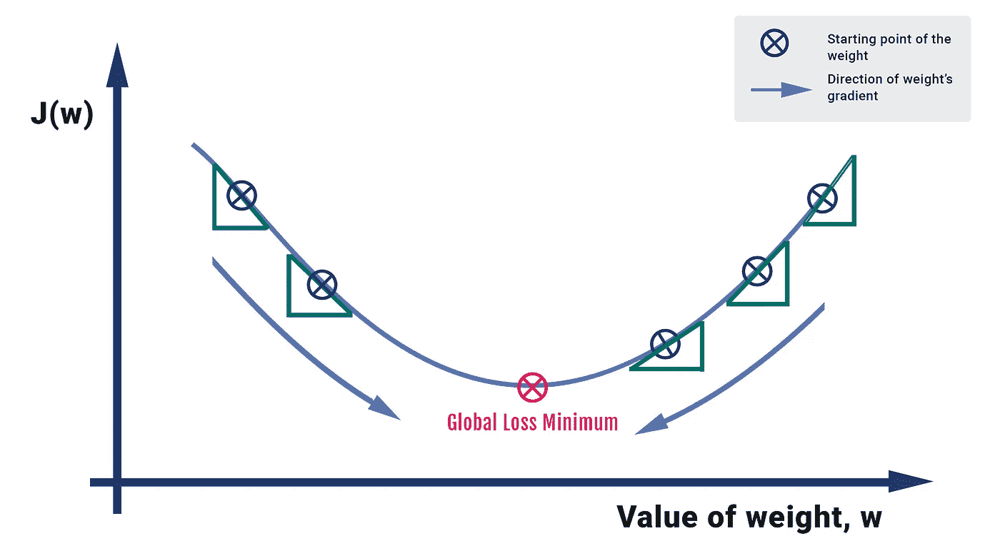
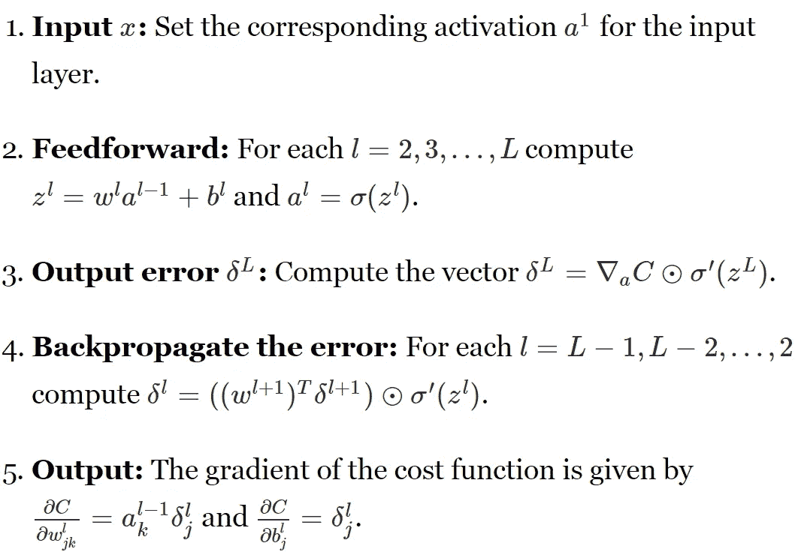

# 梯度下降

> 原文：<https://towardsdatascience.com/gradient-descent-3a7db7520711?source=collection_archive---------10----------------------->

## 这是一个滑坡，但是保证在底部会变得更好

> **TL；dr** 梯度下降是一种优化技术，用于通过最小化成本函数来改善深度学习和基于神经网络的模型。

在我们之前的帖子中，我们谈到了激活函数(链接[这里](/activation-functions-in-neural-networks-83ff7f46a6bd))以及它在机器学习模型中的应用。然而，我们也大量使用了术语“梯度下降”，这是深度学习模型中的一个关键元素，这将在本文中讨论。

## 定义和术语

梯度下降是发生在**反向传播**阶段的过程，其目标是基于权重 *w* 在相反方向上连续地重新采样模型参数的梯度，不断地更新，直到我们达到函数 *J(w)* 的**全局最小值**。

简单来说，我们用梯度下降最小化代价函数， *J(w)* 。

**Fig 1:** How Gradient Descent works for one parameter, *w*

可以用一座陡峭的山来做类比，这座山的底部与大海相接。我们假设一个人的目标是到达海平面。理想情况下，这个人必须一次迈出一步才能达到目标。每一步都有一个负向的梯度(注意:值可以是不同的量级)。这个人继续往下走，直到他到达底部或一个临界点，在那里没有空间再往下走了。

## 数学

让我们将类比形式化为算法形式。我们计算输入参数的激活度，通过取激活度及其偏差的加权和来执行前馈。我们通过用实际“目标”值减去输出样本来提取误差项。

梯度下降过程以反向传播步骤的形式展示，其中我们从最后一层开始反向计算误差向量δ。根据激活函数，我们通过对函数相对于 **w 的偏导数来确定需要多少变化。变化值乘以学习率。作为输出的一部分，我们从以前的输出中减去这个值，得到更新的值。我们继续这样，直到我们达到收敛。**

在下面的代码中，我想强调如何编写一个简单的代码来可视化梯度下降是如何工作的。运行这段代码；使用 Tanh 激活函数，我们将观察到 **10** 的当前值在第 10000 次迭代时下降到值 **8.407e-06** ，这是我们的全局最小值。

**Fig 2:** A simple implementation of gradient descent, based on the Tanh activation function

有很多梯度下降算法。下面我就举几个:

*   批量梯度下降
*   随机梯度下降
*   小批量梯度下降

如果你想深入研究最近的一些技术细节，我强烈推荐你去看看 Sebastian Ruder 关于这个话题的文章。

## 爆炸和消失渐变

在深度网络或递归神经网络中，Pascanu 等人(1994 年)在一篇论文中解释了两个已知问题——爆炸和消失梯度。当我们在代码中迭代进行反向传播时，会发生这种情况，权重矩阵的法线有可能超过 1。如果发生这种情况，梯度爆炸，但如果法线低于 1，梯度消失。

如果我们想可视化爆炸梯度，你会遇到至少一个问题:

*   该模型将输出“Nan”值
*   该模型在每一步都会显示非常大的变化
*   对于训练层中的每个节点，误差梯度值始终高于 1.0。

## 解决方案:渐变裁剪

为了解决渐变爆炸和消失的问题，我们引入了渐变裁剪，如果渐变超过了某个由最大绝对值表示的阈值，我们就对其进行“裁剪”。因此，我们保持神经网络稳定，因为权重值永远不会达到它返回“Nan”的点。在编码实现中，去除削波的梯度导致损失为“Nan”值或无穷大，并且不能进一步运行。

下面的代码展示了如何执行渐变裁剪。假设我们有一个损失向量和一个学习率，我们能够计算一个梯度向量，然后基于最大 L2 范数值对其进行剪切，在这种情况下，我写为 5。

因此，在一天结束时，当向数据科学家提出使用什么优化器来最大限度地减少损失的问题时，有几个因素需要考虑:

*   训练数据集的大小
*   我们需要多快训练数据来实现收敛

参考论文链接:【http://proceedings.mlr.press/v28/pascanu13.pdf 

## 结论

在这篇文章中，我们讨论了很多事情:我们讨论了什么是梯度下降以及它在神经网络中是如何工作的。我们研究了相关的数学，并实现了它的编码版本。最后，我们以消失和爆炸梯度问题的形式讨论了涉及梯度下降的问题，并讨论了使用梯度裁剪的解决方案。在下一堂课中，我们将探索什么是激活函数，以及它们在深度学习模型中如何至关重要，请继续关注！

*传播和分享知识。如果这篇文章激起了你的兴趣，请分享给你的朋友或专业人士。更多数据科技相关帖子关注我* [*这里*](https://medium.com/@hamzamahmood) *。
我在*[*Linkedin*](https://www.linkedin.com/in/hmahmood93/)*上也有空，偶尔*[*tweet*](https://twitter.com/mahmooyo)*也有空。:)*