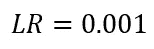

# 梯度下降在 5 分钟内揭开神秘面纱

> 原文：<https://towardsdatascience.com/gradient-descent-demystified-in-5-minutes-f02966704e35?source=collection_archive---------19----------------------->

> “我在和一个女孩约会。一切都很好，直到我开始谈论梯度下降。从那以后，一切都走下坡路了。”

嗯，运气不好，但这是她的损失。

***这对你没有任何意义吗？*** 爽，保持阅读。

Photo by [Stephen Leonardi](https://unsplash.com/@stephenleo1982?utm_source=medium&utm_medium=referral) on [Unsplash](https://unsplash.com?utm_source=medium&utm_medium=referral)

如果你没有生活在岩石下，你很可能听说过一种叫做梯度下降的优化算法。但是仅仅因为你听说过它并不意味着你理解它。试着用几句话解释一下，不要使用专业术语。

***没那么容易吧？那么你在这里是件好事。让我们开始吧。***

梯度下降是一种优化算法，用于找到最小化**成本函数**的函数参数的最佳值。这听起来可能很奇特，但是试着从视觉上来思考。你有一个大碗，就像你早上吃麦片的那个一样。那个碗是一个成本函数。现在，在碗的表面上任意取一个位置——这些是你的系数的当前值。这个想法是以某种方式达到底部——因此达到一个函数的最小值——因此找到最佳参数。

我们的想法是继续尝试不同的系数值，并评估每个值的成本，然后选择稍微好一点的新系数—成本更低。重复这个过程足够多的次数将引导你到达碗的底部，你将发现系数的最佳值——最佳值意味着它们导致最小的成本。

# 但是什么是成本函数呢？

在数据科学和机器学习中，成本函数用于估计**你的模型有多好或多坏**。用最简单的话来说，成本函数是衡量模型在估计特征( *X* )和目标变量( *y* )之间关系的能力方面有多差的一种方法。

使用什么作为成本函数并不重要，但最常用的是:

*   残差平方和( *SSR/SSE* )
*   均方误差( *MSE*
*   均方根误差( *RMSE* )

它有时也被称为损失函数或误差函数。你的目标是找到模型的最优参数，也就是最小化成本函数的参数。

现在当你理解了这一点，让我们继续梯度下降。

# 逐步梯度下降

该算法从设置系数的初始值开始——您可以随意设置值(*而不是字符串或布尔值*)，但通常的做法是将它们设置为 0。如果我有两个系数，比如β0 和β1，我会先将它们设置为零:

现在为了简单起见，让我们假设我正在处理一个**线性回归**任务，这些β是我的系数(*β0 是偏差截距*)。然后，我将定义我的成本函数，例如 SSR:

这可以进一步简化:

读起来挺简单的。你做一个预测，然后从实际值中减去这个预测，然后取它的平方。然后，对数据集中每个实例的所有方块求和。

现在到了你应该知道一点微积分的部分来完全理解正在发生的事情。您需要为每个系数计算**偏导数**，这样系数可以在以后更新。您应该熟悉的主题有:

*   权力规则
*   链式法则
*   多元微分

前一段时间，我写了一篇关于在 Python 中求导的文章，它在一定程度上涵盖了这些主题:

 [## 在 Python 中取导数

### 学习如何处理机器学习中的微积分部分

towardsdatascience.com](/taking-derivatives-in-python-d6229ba72c64) 

回到正题。由于我的模型只有两个系数，我需要计算两个偏导数，一个关于β0，另一个关于β1。方法如下:

现在到了你使用这两个函数并做一些被称为 **epoch** 的事情的时候了——这只是一个对数据集进行单次迭代的时髦说法。您正在浏览数据集，关注自己的事情，并跟踪系数的成本—让我们将它们表示为:

不知不觉中，您已经到达了数据集的末尾，是时候重新计算系数了。再介绍一个术语——**学习率(LR)** 。它决定了新获得的信息覆盖旧信息的程度。在初始化系数时，将其设置为某个常数，通常在 0.0001 到 0.1 之间:

将学习率设置为太小的值将导致需要大量的历元来寻找最佳参数，而将其设置为太高的值可能会导致算法“跳过”最佳值。需要一个学习率来计算**步长**——一个告诉算法下一次迭代要走多远的数字。

如果函数在给定点很陡，步长会更大，当接近最佳参数时，步长会减小，从而使算法达到最佳状态。

一旦你得到这些计算结果，你可以按如下方式**更新系数**:

简而言之，这是一个时代。重复这个过程 10000 次，你会得到系数的最佳值。

# 在你离开之前

这应该是一些可管理的文本和可管理的数学，以理解机器学习和深度学习的最基本的主题之一。如果你还是觉得不明白，那就拿起笔和纸，按照方程，手动计算一切。

如果这对你来说听起来有些难以处理，不用担心，几天后我将发表一篇关于使用梯度下降来寻找线性回归的最佳系数值的文章——我将精确地使用上面列出的方程。

***现在概念对你来说更清晰了吧？请让我知道。***

*喜欢这篇文章吗？成为* [*中等会员*](https://medium.com/@radecicdario/membership) *继续无限制学习。如果你使用下面的链接，我会收到你的一部分会员费，不需要你额外付费。*

 [## 通过我的推荐链接加入 Medium-Dario rade ci

### 作为一个媒体会员，你的会员费的一部分会给你阅读的作家，你可以完全接触到每一个故事…

medium.com](https://medium.com/@radecicdario/membership)