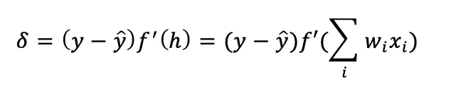

# 梯度下降:给我看看数学！

> 原文：<https://towardsdatascience.com/gradient-descent-show-me-the-math-7ba7d1caef09?source=collection_archive---------4----------------------->

Photo by [Martin Jernberg](https://unsplash.com/@martinjernberg?utm_source=medium&utm_medium=referral) on [Unsplash](https://unsplash.com?utm_source=medium&utm_medium=referral)

梯度下降是一种迭代学习算法，也是神经网络的主力。对于 [PyTorch](https://github.com/pytorch/examples) 或 [Keras](https://github.com/keras-team/keras/tree/master/examples) 来说，有了许多可定制的例子，构建一个千篇一律的神经网络就成了一项微不足道的工作。然而，当事情出错时，掌握基础知识可以节省大量冗长的调试时间。

在这篇文章中，我们将深入挖掘[梯度下降](https://en.wikipedia.org/wiki/Gradient_descent)的数学公式，为它建立一个更好的直觉。有些例子很简单，可以手工解决。此外，写下东西有助于记忆，所以请随意拿一张纸和一个计算器！

# 误差度量

神经网络(NN)做出的预测经常会错过目标，有时会相差很大。我们需要以这样一种方式量化误差，即符号总是正的，并且大的误差被放大。我们定义误差平方和(SSE)，用大写字母 ***E*** 表示:

*   y=基本事实
*   ŷ (y hat)=预测
*   j=网络的输出单位
*   *μ (* 希腊字母 mu *)=* 所有数据点

在 j 上的第一个和中，找出每个真值和它对应的预测值之间的差，求这些差的平方，然后把它们加起来。

接下来我们有 *μ* 个数据点*。*在第二次求和中，对于我们计算平方距离的内部和的每个数据点，我们对所有这些进行求和。

回想一下，神经网络的预测 *ŷ* 是由其权重决定的:

*   w=重量
*   x=特征
*   i=特征数量

因此，在 SSE 方程中插入 *ŷ* 的方程，我们可以看到误差取决于权重:

因此，我们的目标是确定最小化误差的权重。后者有时被称为由 *J(w)* 表示的成本函数，其思想是我们对错误的预测进行惩罚。

# 链式法则

## 理论

为了找出函数的最小值出现在哪里，我们对它求导。鉴于我们有许多变量，我们将看到[链规则](https://en.wikipedia.org/wiki/Chain_rule)如何帮助我们制定这个导数。

在单个输出单元的情况下，其中 j=1，我们可以得到误差 *E* 相对于权重的导数为:

假设 *ŷ* 是单个激活函数 *f* 的结果，该函数接受输入 *h* ，使得 h 接受输入并将其乘以其权重:

在误差的导数中替换:

注意求和项的偏导数，如果我们写出随机权重 wi:

和对 I 的偏导数只有 xi，其他都等于零。我们可以代入 E 的偏导数:

相对于某个权重的平方误差的梯度是误差乘以激活函数在 T2 h T3 的导数再乘以输入值 T4 Xi T5 的负值。我们将其乘以学习速率 *η* (希腊字母 eta)以获得权重步长:

为了使我们的符号更容易理解，我们将误差项 *δ* 定义为误差乘以 h 处激活函数的导数:

这将重量步骤简化为:

用更一般的符号来写:

## 单输出单元示例

现在我们有了如何进行的想法，我们可以将它应用到单个输出单元上。我们使用由 S 表示的 [sigmoid 函数](https://en.wikipedia.org/wiki/Sigmoid_function)作为激活函数。回想一下，激活函数的一般符号是 f(h):

sigmoid 函数的一个特殊之处在于其导数的最大值为 0.25。查看这篇[帖子](/derivative-of-the-sigmoid-function-536880cf918e)以获得如何计算其导数的指导。

用 python 实现它:

现在让我们定义初始特征、权重和学习速率:

根据上面的公式，我们可以如下计算重量的变化:

# 梯度下降通用实现

在大多数应用中，我们将有不止一个节点。因此，我们需要改变我们计算误差的方式，以避免对可能导致梯度发散的大误差求和。我们引入均方误差:

*   m=数据中的记录数

我们可以将对数据集应用梯度下降的一般算法定义如下:

1.  将重量步长设置为零:wi = 0
2.  对于培训数据中的每条记录:

*   向前通过网络，并计算输出 *ŷ*
*   计算输出单元的误差项 *δ*
*   更新权重步长:δwi =δwi+*δXi*

3.更新权重:wi = wi+*η*δwi/m

4.重复 e 个时期

在这一点上，我们如何初始化权重成为一个相关的问题。我们希望权重足够小，以使 sigmoid 的输入位于 0 附近的线性区域，并且不会在高端和低端受到挤压。

我们遵循[斯坦福 CS231n](http://cs231n.github.io/neural-networks-2/#init) 规定的方法，随机初始化它们，使它们都有不同的初始值并发散，打破对称性。因此，我们从以 0 为中心的正态分布初始化权重，并以 1/sqrt(n)对其进行缩放，其中 n 是输入单元的数量。

对于具有 n _ recrods 和 n_features 的数据集，我们可以用 python 实现如下:

# 反向传播

到目前为止，我们已经了解了如何计算输出节点中的误差并向前传播误差。我们也可以使用[反向传播](https://en.wikipedia.org/wiki/Backpropagation)来反向传播误差。

层的输出由层之间的权重决定，因此由单元产生的误差由相应的权重来缩放。

考虑归因于输出单元 *k* 和隐藏层 *h* 的隐藏单元 *j* 的误差 *δ* 。我们可以这样写这个错误:

*   o =输出层
*   h=隐藏层
*   j =的隐藏单位
*   k=输出单位

梯度下降步骤与前面定义的步骤相同，但增加了下标以标识操作发生的位置:

*   wij=输入层和隐藏层之间的权重
*   xi=输入单位值

因此，权重步长等于上面计算的步长乘以该层的输出误差乘以该层的输入值:

*   *δ输出* =输出误差
*   *V in* =层的输入，如输出单元的隐藏层激活

## 反向传播手算

如果你还没有纸和笔，现在是个好时机😉。

考虑下面从底部流向顶部的两层神经网络。我们有两个输入值，一个隐藏单元和一个输出单元。

我们还在隐藏和输出单元应用了 sigmoid 激活函数。我们可以使用其他激活， [PyTorch 文档](https://pytorch.org/docs/stable/nn.html#non-linear-activations-weighted-sum-nonlinearity)列出了许多带有相应图形的公式。

请注意，输入的相应权重用黑色写在线旁边。

Photo credit: [Udacity.com](http://udacity.com)

为了这个例子的目的，让我们假设我们的目标输出是 *y=1* 。

我们从正向传递开始，从输入到隐藏单元:

隐藏单元的输出随后被激活:

对于输出注释，我们将重量倍增与激活相结合:

回想一下，导数 sigmoid 激活函数如下:

因此，输出单元的误差项为:

进一步通过网络，我们计算带有传播的隐藏单元的误差项。回想一下，每个隐藏层对误差的贡献与其权重成比例:

在上面的等式中，我们通过将输出单元连接到隐藏单元的权重 W 来缩放来自输出单元的误差项。在我们的例子中，我们只有一个隐藏节点，可以将上面的表达式简化为:

学习率乘以输出单元误差乘以隐藏单元激活值等于隐藏到输出的权重步长:

因此，连接隐藏到输出层的当前权重 W=0.1 将被更新这个数量。

最后一步是输入隐藏权重。更新等于学习率乘以隐藏单元误差，再乘以输入值:

随着权重的更新，我们可以重复上述步骤，直到我们的预测变得几乎等于地面真相。

请注意，如果我们有许多层，使用 sigmoid 激活函数会将输入附近层中的权重步长快速降低到微小值。这不是别人，正是[消失渐变问题](https://en.wikipedia.org/wiki/Vanishing_gradient_problem)。

## 数字示例

我们可以在 NumPy 中使用稍微复杂一点的网络做同样的事情:三个输入节点，两个隐藏节点，一个输出层。

# 结论

我们已经看到学习的数学是如何为神经网络工作的。通过上面的练习，我们可以更好地理解错误、激活函数，也许还可以为神经网络构建一个 python 类。

还有更多的资源可以探索，如斯坦福 CS231n。我也强烈推荐 Andrew Trask 的[探索深度学习](https://www.manning.com/books/grokking-deep-learning)，这是一个很好的资源，有可解释的例子。