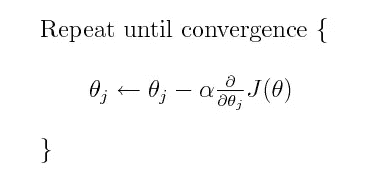
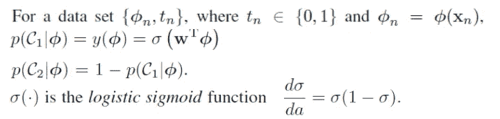
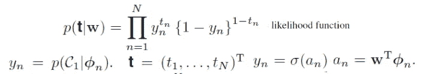
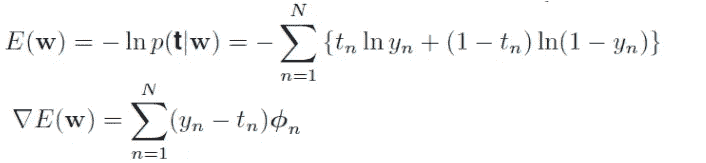
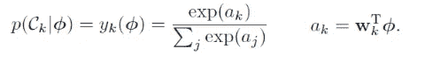
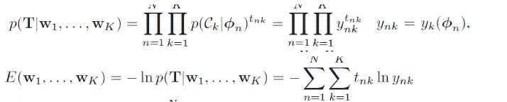

# 使用逻辑回归的梯度下降训练

> 原文：<https://towardsdatascience.com/gradient-descent-training-with-logistic-regression-c5516f5344f7?source=collection_archive---------3----------------------->


# 梯度下降

梯度下降算法及其变体(Adam、SGD 等。)已经成为许多机器学习应用中非常流行的训练(优化)算法。优化算法可以非正式地分为两类——基于梯度的和无梯度的(例如粒子群、遗传算法等。).你可以猜到，梯度下降是一种基于梯度的算法。为什么梯度在训练机器学习中很重要？

训练机器学习模型的目的是通过改变可训练参数来最小化基础事实和预测之间的损失或误差。梯度是导数在多维空间中的延伸，它告诉我们损失或误差最佳最小化的方向。如果你还记得向量微积分课上，梯度被定义为最大变化率。因此，梯度下降的公式很简单:



θj 是可训练参数，j. α是学习率。J(θ)是一个成本函数。

在下图中，从起点(峰)到最佳点(谷)的最短距离是沿着渐变轨迹。相同的原理适用于多维空间，这通常是机器学习训练的情况。


为了演示梯度下降如何应用于机器学习训练，我们将使用逻辑回归。

# 逻辑回归

## 二元情况

为了理解 LR 的工作原理，让我们想象以下场景:我们想根据年龄(x1)、年收入(x2)和教育程度(x3)来预测一个人的性别(男性= 0，女性= 1)。如果 Y 是预测值，则此问题的逻辑回归模型将采用以下形式:

***Z = B0+B1(x1)+B2(x2)+B3(x3)***

***Y = 1.0 / (1.0 + e^-Z)***

b0 通常称为“偏差”，b1、b2 和 b3 称为“权重”。

z 具有与线性回归相同的形式，而 Y 是 sigmoid 激活函数。y 取 0 到 1 之间的值。如果 Y 小于 0.5，我们推断预测输出为 0，如果 Y 大于 0.5，我们推断输出为 1。

现在，我们准备看看下面 LR 的更正式的形式:



φn 是 Xn 在特征空间中的增广变换。tn 是类标签。σ是一个 s 形激活。w 是权重向量(包括偏差项)。p(C1 |φ)和 p(C2 |φ)分别是给定φ时分配给 C1 和 C2 的概率。

给定上述公式，这里的主要目标是在给定权重(W)的情况下最大化观察数据的可能性。似然函数是观测数据的联合分布，如下所示:



π是乘积算子。

从似然函数可以看出，y 是伯努利分布。

当处理概率时，最好转换成对数，因为对数将乘积转换成总和，从而避免了取非常小的数的乘积的问题(通常用于概率)。下面是负对数似然(NLL)及其相对于权重的梯度。NLL 用于将最大化问题转化为最小化问题。本质上，最小化 NLL 相当于最大化可能性。



## 多类案件

LR 的二进制情况可以通过改变符号扩展到多类情况。

假设有 K 类。因此，p(Ck)是在给定φ的情况下分配给类 k 的概率。



代替 sigmoid 激活，softmax 激活用于将类分数(ak)转换成适当的概率。

w 是权重矩阵(DxK) — D 是特征空间维度。

似然函数和负似然(NLL)如下所示。



y 现在是多元分布的。

# MNIST 分类

[MNIST](http://deeplearning.net/data/mnist/) 是一个经典数据集，由手绘数字(0 到 9 之间)的黑白图像组成。我们将使用 PyTorch 实现多类逻辑回归来对 MNIST 的数字进行分类。因为我们想要演示梯度下降算法，所以我们不使用 torch.optim 中的内置算法。为了简单起见，我们将使用 torch.autograd，而不是手动计算梯度。这个演示来自 PyTorch 网站。

## 下载数据集

以下代码下载数据集(训练集和验证集)并转换成相应的 numpy 数组。

```
from pathlib import Path
import requests
import pickle
import gzipDATA_PATH = Path("data")
PATH = DATA_PATH / "mnist"
PATH.mkdir(parents=True, exist_ok=True)
URL = "http://deeplearning.net/data/mnist/"FILENAME = "mnist.pkl.gz"
if not (PATH / FILENAME).exists():
  content = requests.get(URL + FILENAME).content
  (PATH / FILENAME).open("wb").write(content)with gzip.open((PATH / FILENAME).as_posix(), "rb") as f:
  ((x_train, y_train), (x_valid, y_valid), _) = pickle.load(f,   encoding="latin-1")
```

## 转换为张量

在使用 PyTorch 时，我们需要将上面的 numpy 数组转换成张量。

```
import torch
x_train, y_train, x_valid, y_valid = map(torch.tensor, (x_train,  y_train, x_valid, y_valid))
```

## 初始化权重和偏差

接下来，我们将创建和初始化权重和偏差张量。我们使用 [Xavier 初始化](http://proceedings.mlr.press/v9/glorot10a/glorot10a.pdf)用于权重，同时用零值初始化偏置。因为我们希望 torch.autograd 负责梯度计算，所以我们需要将 requires_grad 设置为 True，以便 PyTorch 可以跟踪梯度计算所需的操作。

```
import math
weights = torch.randn(784, 10) / math.sqrt(784)
weights.requires_grad_()
bias = torch.zeros(10, requires_grad=True)
```

## 似然函数

我们需要评估的可能性是 yk(φ)。要得到 yk(φ)，我们首先需要对 ak 求值。它不返回 yk(φ)，而是返回 log(yk(φ))，这对以后计算损失函数很有用。

```
**def** **log_softmax**(x):
    **return** x **-** x**.**exp()**.**sum(**-**1)**.**log()**.**unsqueeze(**-**1)

**def** **model**(xb):
    **return** log_softmax(xb **@** weights **+** bias)
```

## 损失函数—负对数似然(NLL)

现在，我们可以使用似然来计算总体负对数似然，这是 MNIST 逻辑回归的损失函数。

```
**def** **nll**(input, target):
    **return** **-**input[range(target**.**shape[0]), target]**.**mean()
```

## 训练循环

到目前为止，我们已经实现了训练 MNIST 逻辑回归所需的所有必要功能。我们将实施小批量培训。

```
bs **=** 64  *# batch size* loss_func **=** nll
lr **=** 0.5  *# learning rate*
epochs **=** 2  *# how many epochs to train for*

**for** epoch **in** range(epochs):
    **for** i **in** range((n **-** 1) **//** bs **+** 1):
        start_i **=** i ***** bs
        end_i **=** start_i **+** bs
        xb **=** x_train[start_i:end_i]
        yb **=** y_train[start_i:end_i]
        pred **=** model(xb)
        loss **=** loss_func(pred, yb)

        loss**.**backward()
        **with** torch**.**no_grad():
            weights **-=** weights**.**grad ***** lr
            bias **-=** bias**.**grad ***** lr
            weights**.**grad**.**zero_()
            bias**.**grad**.**zero_()
```

。loss_func 上的 backward()执行参数更新所需的所有梯度计算。一旦计算出梯度。backward()，权重和偏差由梯度和学习率的乘积更新。学习率(LR)用于控制收敛。大 LR 会过冲，而小 LR 会减慢收敛。

一旦权重和偏差被更新，它们的梯度被设置为零；否则，梯度将在下一批中累积。

# 总结

上面实现的梯度下降非常基本，但足以演示它是如何工作的。PyTorch 和 TensorFlow 等现代机器学习框架有更复杂的梯度下降变体，如 SGD、Adam 等。尽管如此，当我们需要训练机器学习模型时，理解梯度下降如何工作是有益的。

本文中的等式摘自 Christopher M. Bishop 的《模式识别和机器学习》。