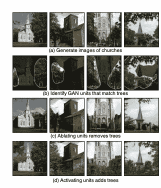
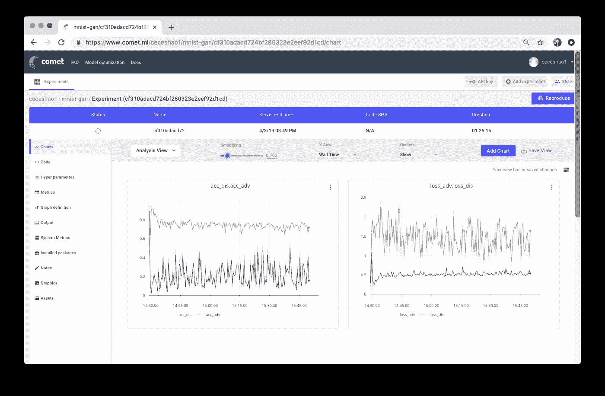

# 毕业于 GANs:从理解生成性对抗网络到经营自己的网络

> 原文：<https://towardsdatascience.com/graduating-in-gans-going-from-understanding-generative-adversarial-networks-to-running-your-own-39804c283399?source=collection_archive---------4----------------------->

## 阅读如何生成对抗性网络(GANs)的研究和评估已经发展，然后实现自己的 GAN 生成手写数字


Visualization of the latent space for the MNIST dataset — you can make your own GAN that generates MNIST-like handwritten digits later in the post!

生殖对抗网络(GANs)已经接管了公众的想象力——通过人工智能生成的名人渗透流行文化，创造出在高端艺术拍卖会上以数千美元的价格在[出售的艺术。](https://www.christies.com/features/A-collaboration-between-two-artists-one-human-one-a-machine-9332-1.aspx)

在本帖中，我们将探索:

*   **甘斯简介**
*   **了解和评估 GANs**
*   **经营自己的 GAN**

有大量的资源可以了解 GANs，所以本文的重点是了解如何评估 GANs。我们还将指导您运行自己的 GAN 来生成手写数字，如 MNIST。


Here’s one run of the GAN we’ll show you how to implement later on — see how the handwritten digits it generates become increasingly realistic as training progresses!

# **关于 GANs 的简要介绍**

自 2014 年 Ian Goodfellow 的'[Generative Adversarial Networks](https://arxiv.org/abs/1406.2661)'论文发表以来，GANs 取得了爆炸式的进展，并带来了越来越现实的成果。

就在三年前，你可以在[这个 Reddit 帖子](https://www.reddit.com/r/MachineLearning/comments/40ldq6/generative_adversarial_networks_for_text/)上找到 Ian Goodfellow 对一个询问你是否可以用 GANs 发短信的用户的回复:


> “gan 尚未应用于 NLP，因为 gan 仅针对实值数据定义。
> 
> gan 的工作原理是训练一个输出合成数据的生成器网络，然后对合成数据运行一个鉴别器网络。鉴频器网络输出相对于合成数据的梯度告诉您如何稍微改变合成数据，使其更加真实。
> 
> 只有在基于连续数字的情况下，您才能对合成数据进行细微的更改。如果是基于离散数，就没办法稍作改动。
> 
> 例如，如果输出像素值为 1.0 的图像，可以在下一步将该像素值更改为 1.0001。
> 
> 如果输出“企鹅”这个词，下一步就不能把那个改成“企鹅+ .001”，因为没有“企鹅+ .001”这个词。你要从“企鹅”一路走到“鸵鸟”。
> 
> 因为所有的 NLP 都是基于离散值的，比如单词、字符或字节，所以还没有人真正知道如何将 GANs 应用于 NLP。"

现在，GANs 正被用于创建各种内容，包括图像、视频、音频和文本。这些输出可以作为训练其他模型的合成数据，或者只是用来催生有趣的副业，比如【thispersondoesnotexist.com】[【thisairbnbdoesnotexist.com/】](https://thisairbnbdoesnotexist.com/)[这种机器学习媒介岗位不存在](https://medium.com/comet-ml/this-machine-learning-medium-post-does-not-exist-c4705215b4a0)。😎

## 甘背后

GAN 由两个神经网络组成，一个是从零开始合成新样本的**生成器**，另一个是将训练样本与生成器生成的样本进行比较的**鉴别器**。鉴别器的目标是区分“真实”和“虚假”输入(即分类样本是来自模型分布还是真实分布)。正如我们所描述的，这些样本可以是图像、视频、音频片段和文本。


Simple GAN overview from [Kiran Sudhir](https://medium.com/u/facae13d21a?source=post_page-----39804c283399--------------------------------)

为了合成这些新样本，生成器被给予随机噪声，并试图从训练数据的学习分布中生成逼真的图像。

鉴别器网络(卷积神经网络)的输出相对于合成数据的梯度告知如何稍微改变合成数据以使其更真实。最终，生成器收敛于再现真实数据分布的参数，并且鉴别器无法检测到差异。

**您可以在 GAN Lab 中看到并体验这些聚合数据分布:**

[](https://poloclub.github.io/ganlab/) [## 甘实验室:在你的浏览器中玩生成性对抗网络！

### GAN 实验室是由 Minsuk Kahng，Nikhil Thorat，Polo Chau，Fernanda Viégas 和 Martin Wattenberg 创建的，他们是…

poloclub.github.io](https://poloclub.github.io/ganlab/) 

**这里有一些关于甘斯的最佳指南:**

*   [斯坦福 CS231 第 13 讲——生成模型](https://www.youtube.com/watch?v=5WoItGTWV54)
*   [基于风格的 GANs](https://www.lyrn.ai/2018/12/26/a-style-based-generator-architecture-for-generative-adversarial-networks/)
*   [理解生成性对抗网络](/understanding-generative-adversarial-networks-gans-cd6e4651a29)
*   [生成性对抗网络简介](https://heartbeat.fritz.ai/introduction-to-generative-adversarial-networks-gans-35ef44f21193)
*   [莉莲·翁:从甘到 WGAN](https://lilianweng.github.io/lil-log/2017/08/20/from-GAN-to-WGAN.html)
*   [一头扎进高级甘斯:探索自我关注和光谱标准](https://medium.freecodecamp.org/dive-head-first-into-advanced-gans-exploring-self-attention-and-spectral-norm-d2f7cdb55ede)
*   Guim Perarnau:奇异的甘以及在哪里可以找到他们

# **了解和评估 GANs**

量化 GAN 的进展可能感觉非常主观— *“这个生成的人脸看起来足够逼真吗？”、“这些生成的图像足够多样吗？”—*GANs 可能感觉像是黑匣子，不清楚模型的哪些组成部分会影响学习或结果质量。

为此，麻省理工学院计算机科学和人工智能(CSAIL)实验室的一个小组最近发布了一篇论文，“ [GAN 解剖:可视化和理解生成性对抗网络](https://arxiv.org/abs/1811.10597)”,介绍了一种可视化 GAN 的方法，以及 GAN 单元如何与图像中的对象以及对象之间的关系相关联。



Figure 1 from [Bau et. al 2019](https://arxiv.org/pdf/1811.10597v2.pdf) showing image modification through intervention with certain GAN units.

使用基于分段的网络剖析方法，本文的框架允许我们剖析和可视化发电机神经网络的内部工作。这是通过寻找一组 GAN 单元(称为神经元)与输出图像中的概念(如树、天空、云等)之间的一致来实现的。因此，我们能够识别负责某些物体(如建筑物或云)的神经元。

使神经元具有这种粒度级别允许通过强制激活和去激活(消融)那些对象的相应单元来编辑现有图像(例如，添加或移除图像中所示的树)。

然而，尚不清楚网络是否能够推理场景中的对象，或者它是否只是记忆这些对象。接近这个问题答案的一个方法是试图以不切实际的方式扭曲图像。也许麻省理工学院 CSAIL 的 GAN Paint 交互式网络演示最令人印象深刻的部分是该模型似乎能够将这些编辑限制在“照片级”更改。如果你试图将草添加到天空中，会发生以下情况:


尽管我们激活了相应的神经元，但 GAN 似乎抑制了后面几层的信号。


Figure 11 from [Bau et. al. 2019](https://arxiv.org/pdf/1811.10597v2.pdf) shows how the local context for an object impacts the likelihood of the object synthesis (in this case, the likelihood of a door being generated on a building versus on a tree or in the sky).

另一种可视化 GAN 的有趣方式是进行**潜在空间插值**(记住，GAN 通过从已学习的潜在空间采样来生成新的实例)。这是查看生成的样本之间的过渡有多平滑的有用方法。


**这些可视化可以帮助我们理解 GAN 的内部表示，但找到量化的方法来理解 GAN 的进展和输出质量仍然是一个活跃的研究领域。**

图像质量和多样性的两个常用评估指标是:**初始得分**和**弗雷歇初始距离(FID)** 。在 Shane Barratt 和 Rishi Sharma 发布了他们的论文“[关于初始分数的注释](https://arxiv.org/pdf/1801.01973.pdf)”之后，大多数从业者已经从初始分数转向 FID。

## 初始得分

Salimans 等人于 2016 年在“[训练 GANs 的改进技术](https://arxiv.org/abs/1606.03498)”中发明了 Inception 评分，该评分基于一种启发式方法，即当现实样本通过预先训练的网络(如 ImageNet 上的 Inception)时，应该能够对其进行分类。从技术上讲，这意味着样本应该具有低熵 softmax 预测向量。

除了高预测性(低熵)，初始分数还基于所生成样本的差异程度(例如，所生成样本分布的高方差或熵)来评估 GAN。这意味着不应该有任何统治阶级。

如果这两个特征都满足了，那么就应该有一个大的初始得分。结合这两个标准的方法是评估样本的条件标签分布和所有样本的边际分布之间的 Kullback-Leibler (KL)散度。

## **弗雷歇初始距离**

由 [Heusel et al. 2017](https://arxiv.org/abs/1706.08500) 推出，FID 通过测量生成的图像分布与真实分布之间的距离来估计真实感。FID 将一组生成的样本嵌入到由初始网的特定层给出的特征空间中。该嵌入层被视为连续的多元高斯，然后对生成的数据和真实数据估计均值和协方差。然后使用这两个高斯函数之间的弗雷歇距离(也称为 Wasserstein-2 距离)来量化生成样本的质量。较低的 FID 对应于更相似的真实样本和生成样本。

一个重要的注意事项是，FID 需要一个合适的样本量来给出好的结果(建议大小= 50k 样本)。如果使用的样本太少，最终会高估实际的 FID，估计值会有很大的差异。

> 关于不同论文之间的 Inception 分数和 FID 分数的比较，见 Neal Jean 的帖子[这里](https://nealjean.com/ml/frechet-inception-distance/)。

## **想看更多吗？**

Aji Borji 的论文“[GAN 评估方法的利弊](http://Pros and Cons of GAN Evaluation Measures)”包括一个非常好的表格，更详尽地涵盖了 GAN 评估指标:


**有趣的是，其他研究人员正在通过使用特定领域的评估指标来采取不同的方法。**对于文本 GAN，Guy Tevet 和他的团队在他们的论文“[评估文本 GAN 作为语言模型](https://arxiv.org/abs/1810.12686)”中提出使用传统的基于概率的语言模型度量来评估 GAN 生成的文本的分布。

我的甘有多好？’，Konstantin Shmelkov 和他的团队使用了两种基于图像分类的方法，GAN-train 和 GAN-test，这两种方法分别接近于 GAN 的召回率(多样性)和精确度(图像质量)。你可以在谷歌大脑研究论文中看到这些评估指标，“[GANS 创造了平等吗](https://arxiv.org/abs/1711.10337)”中，他们使用三角形数据集来测量不同 GAN 模型的精度和召回率。


# 运行您自己的 GAN

为了说明 GANs，我们将改编来自 Wouter Bulten 的[这篇优秀教程](https://www.wouterbulten.nl/blog/tech/getting-started-with-generative-adversarial-networks/)，它使用 Keras 和 MNIST 数据集来生成书面数字。

完整教程笔记本[见这里](https://gist.github.com/ceceshao1/935ea6000c8509a28130d4c55b32fcd6)。


We’ll be tracking our GAN’s progress by visualizing our loss and accuracy curves but also by checking test outputs using [Comet.ml](http://bit.ly/2WGduCM)

该 GAN 模型将 MNIST 训练数据和随机噪声作为输入(具体地，噪声的随机向量)来生成:

*   图像(在这种情况下，是手写数字的图像)。*最终，这些生成的图像将类似于 MNIST 数据集的数据分布。*
*   鉴别器对生成图像的预测

**生成器**和**鉴别器**模型一起形成对抗模型——对于这个例子，如果对抗模型的输出将生成的图像分类为所有输入的真实图像，那么生成器将表现良好。

看完整的代码[这里](https://gist.github.com/ceceshao1/935ea6000c8509a28130d4c55b32fcd6)和完整的彗星实验结果[这里](https://www.comet.ml/ceceshao1/mnist-gan)

## 跟踪模型的进度

我们能够使用 [Comet.ml](http://bit.ly/2WGduCM) 来跟踪我们的**生成器**和**鉴别器**模型的训练进度。

我们正在绘制鉴别模型和对抗模型的准确性和损失图，这里要跟踪的最重要的指标是:

*   鉴频器的损耗(见右图中的蓝线)——*dis _ loss*
*   对抗模型的准确性(见左图中的蓝线)——*ACC _ adv*

**此处** **见本实验** [**的训练进度。**](https://www.comet.ml/ceceshao1/mnist-gan/cf310adacd724bf280323e2eef92d1cd/chart)



您还想确认您的培训过程确实使用了 GPU，这可以在[Comet 系统指标选项卡](https://www.comet.ml/ceceshao1/mnist-gan/cf310adacd724bf280323e2eef92d1cd/systemMetrics)中查看。


您会注意到我们的训练 for-loop 包含了从测试向量中报告图像的代码:

```
if i % 500 == 0:
        # Visualize the performance of the generator by producing images from the test vector
        images = net_generator.predict(vis_noise)
        # Map back to original range
        #images = (images + 1 ) * 0.5
        plt.figure(figsize=(10,10))

        for im in range(images.shape[0]):
            plt.subplot(4, 4, im+1)
            image = images[im, :, :, :]
            image = np.reshape(image, [28, 28])

            plt.imshow(image, cmap='gray')
            plt.axis('off')

        plt.tight_layout()
        # plt.savefig('/home/ubuntu/cecelia/deeplearning-resources/output/mnist-normal/{}.png'.format(i)) plt.savefig(r'output/mnist-normal/{}.png'.format(i)) experiment.log_image(r'output/mnist-normal/{}.png'.format(i)) plt.close('all')
```

我们希望每隔几个步骤就报告生成的输出的部分原因是，我们可以直观地分析我们的生成器和鉴别器模型在生成真实的手写数字和正确地将生成的数字分别分类为“真”或“假”方面的表现。

让我们来看看这些生成的输出！

> 在[慧星实验](https://www.comet.ml/ceceshao1/mnist-gan)中查看自己生成的输出

你可以看到生成器模型是如何从这个模糊的灰色输出开始的(见下面的 0.png ),它看起来不像我们期望的手写数字。


随着训练的进行，我们的模型损失下降，生成的数字变得越来越清晰。在以下位置查看生成的输出:

**步骤 500:**


**步骤 1000:**


**步骤 1500:**


最后，在**步骤 10，000 —** 中，您可以在下面的红色方框中看到一些 GAN 生成的数字样本


一旦我们的 GAN 模型完成训练，我们甚至可以在 [Comet 的图形选项卡](https://www.comet.ml/ceceshao1/mnist-gan/cf310adacd724bf280323e2eef92d1cd/images)中以电影形式查看我们报告的输出(只需按下播放按钮！).


为了完成实验，请务必运行`experiment.end()`来查看模型和 GPU 使用情况的一些汇总统计数据。


## 迭代你的模型

我们可以对模型进行更长时间的训练，看看这是如何影响性能的，但让我们尝试用几个不同的参数进行迭代。

我们尝试的一些参数是:

*   鉴别器的优化器
*   学习率
*   退出概率
*   批量

从 Wouter 的[原始博文](https://www.wouterbulten.nl/blog/tech/getting-started-with-generative-adversarial-networks/)中，他提到了自己在测试参数方面的努力:

> 我测试了鉴别器的优化器的`SGD`、`RMSprop`和`Adam`，但是`RMSprop`表现最好。`RMSprop`使用了低学习率，我将值修剪在-1 和 1 之间。学习速度的小幅下降有助于稳定

我们将尝试将鉴别器的退出概率从 0.4 增加到 0.5，同时增加鉴别器的学习率(从 0.008 增加到 0.0009)和生成器的学习率(从 0.0004 增加到 0.0006)。很容易看出这些变化是如何失去控制的，并且很难跟踪…🤯

要创建一个不同的实验，只需再次运行实验定义单元，Comet 将为您的新实验发布一个新的 url！记录你的实验很好，这样你就可以比较不同之处:


[See the difference](https://www.comet.ml/ceceshao1/mnist-gan/cf310adacd724bf280323e2eef92d1cd/e7cdcbf789674be6af8d9c7cfade1922/compare?experiment-tab=params) between the two experiments’ hyperparameters. Can you spot the differences in learning rate and dropout probability that we made?

不幸的是，我们的调整并没有提高模型的性能！事实上，它产生了一些有趣的输出:


本教程到此为止！如果你喜欢这篇文章，请和你的朋友分享，他可能会觉得这篇文章很有用😎

## 👉🏼有问题或反馈吗？下面评论！

## 👉🏼想要更多牛逼的机器学习内容？F [在媒体上关注我们](https://medium.com/comet-ml)！