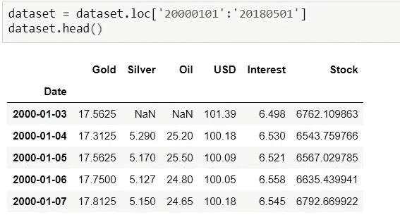

# 格兰杰因果关系和向量自回归模型预测

> 原文：<https://towardsdatascience.com/granger-causality-and-vector-auto-regressive-model-for-time-series-forecasting-3226a64889a6?source=collection_archive---------1----------------------->

## 预测建模和统计分析

## 计量经济模型和时间序列数据


【F】*****黄金*** 和 ***石油*** 受到学术界、投资者和政府机构等的高度关注。这两种产品因其对全球经济的重大影响而闻名。我将在这里展示，如何利用 ***格兰杰因果检验*** 来检验时间序列中多个变量的关系，以及 ***向量自回归模型(VAR)*** 来预测未来 ***黄金&石油*** 价格从 ***黄金价格、白银价格、原油价格、股票指数、利率和美元汇率*** 的历史数据中。**

*****黄金*** 价格与其他商品密切相关。 ***石油*** 价格的上涨会对 ***黄金*** 价格产生正面影响，反之亦然。从历史上看，我们已经看到，当股票上涨时，*黄金价格就会下跌。***

*   ***时间序列预测问题公式化***
*   ***一元和多元时间序列时间序列预测***
*   ***将 ***VAR*** 应用到这个问题上***

***让我们了解一个多元时间序列是如何制定的。下面是多元时间序列的简单 K 方程，其中每个方程都是另一个序列的滞后。x 是这里的外生数列。目的是看这个系列是否受到它自己的过去以及其他系列的过去的影响。***

******

***这种系列允许我们对系列本身的动态以及其他系列的相互依赖性进行建模。我们将通过 ***格兰杰因果分析*** 来探究这种相互依存关系。***

# ***探索性分析:***

***让我们加载数据，并通过可视化进行一些分析，以了解数据的洞察力。探索性数据分析在多元时间序列中相当广泛。我将在这里介绍一些领域，以获得对数据的见解。然而，建议进行所有的统计测试，以确保我们对数据分布有清晰的理解。***

******

***让我们确定所有系列的日期。***

************

***数据中的 NaN 值用前几天的数据填充。在做了一些必要的预处理后，数据集现在可以进行进一步的分析了。***

```
*# Plot
fig, axes = plt.subplots(nrows=3, ncols=2, dpi=120, figsize=(10,6))
for i, ax in enumerate(axes.flatten()):
 data = dataset[dataset.columns[i]]
 ax.plot(data, color=’red’, linewidth=1)
 ax.set_title(dataset.columns[i])
 ax.xaxis.set_ticks_position(‘none’)
 ax.yaxis.set_ticks_position(‘none’)
 ax.spines[“top”].set_alpha(0)
 ax.tick_params(labelsize=6)plt.tight_layout();*
```

******

***从上面的图中，我们可以看出，所有的序列都包含单位根，具有随机趋势，表现出不可预测的系统模式。***

***为了从我们的数据中提取最多的信息，数据的正态或高斯分布是很重要的。为了验证这一点，我们做了一个基于零假设和交替假设直觉的正态性检验。***

```
*stat,p = stats.normaltest(dataset.Gold)
print("Statistics = %.3f, p=%.3f" % (stat,p))
alpha = 0.05
if p> alpha:
print('Data looks Gaussian (fail to reject null hypothesis)')
else:
print('Data looks non-Gaussian (reject null hypothesis')output: Statistics = 658.293, p=0.000 Data looks Gaussian (reject null hypothesis*
```

******

***这两个分布给了我们一些关于数据分布的直觉。这个数据集的峰度是-0.95。由于该值小于 0，因此它被认为是一个轻尾数据集。它在每条尾巴上的数据和在峰值上的一样多。中度偏度指的是-1 和-0.5 或 0.5 和 1 之间的值。***

```
*plt.figure(figsize=(14,6))
plt.subplot(1,2,1)
dataset['Gold'].hist(bins=50)
plt.title('Gold')
plt.subplot(1,2,2)
stats.probplot(dataset['Gold'], plot=plt);
dataset.Gold.describe().T*
```

******

***正态概率图也显示数据远非正态分布。***

******

## ***自相关:***

> ***如果我们不知道如何寻找自相关或序列相关性，那么在分析历史数据时，这可能是一个重大问题。***

```
*# plots the autocorrelation plots for each stock's price at 50 lags
for i in dataset:
  plt_acf(dataset[i], lags = 50)
  plt.title('ACF for %s' % i)
  plt.show()*
```

***从上面的图中我们可以看到,+1 的自相关性代表了完全的正相关，这意味着一个时间序列的增加会导致另一个时间序列的相应增加。我们肯定需要应用变换并中和它，以使级数稳定。它测量线性关系；即使自相关性很小，时间序列和其滞后版本之间仍可能存在非线性关系。***

## ***培训和测试数据:***

***VAR 模型将在 X_train 上拟合，然后用于预测接下来的 15 个观测值。这些预测将与试验数据中的实际数据进行比较。***

```
*n_obs=15
X_train, X_test = dataset[0:-n_obs], dataset[-n_obs:]
print(X_train.shape, X_test.shape)(5114, 6) (15, 6)*
```

## ***转型:***

***对训练集应用一阶差分使所有序列平稳。然而，这是一个迭代过程，在第一次差分后，序列可能仍然是非平稳的。在这种情况下，我们必须应用二阶差分或对数变换来标准化数列。***

******

## ***稳定性检查:***

```
*def augmented_dickey_fuller_statistics(time_series):
  result = adfuller(time_series.values)
  print('ADF Statistic: %f' % result[0])
  print('p-value: %f' % result[1])
  print('Critical Values:')
  for key, value in result[4].items():
    print('\t%s: %.3f' % (key, value))print('Augmented Dickey-Fuller Test: Gold Price Time Series')
augmented_dickey_fuller_statistics(X_train_transformed['Gold'])
print('Augmented Dickey-Fuller Test: Silver Price Time Series')
augmented_dickey_fuller_statistics(X_train_transformed['Silver'])
print('Augmented Dickey-Fuller Test: Oil Price Time Series')
augmented_dickey_fuller_statistics(X_train_transformed['Oil'])
print('Augmented Dickey-Fuller Test: Interest_rate Time Series')
augmented_dickey_fuller_statistics(X_train_transformed['Interest_rate'])
print('Augmented Dickey-Fuller Test: Stock_Index Time Series')
augmented_dickey_fuller_statistics(X_train_transformed['Stock_Index'])
print('Augmented Dickey-Fuller Test: USD_Index Time Series')
augmented_dickey_fuller_statistics(X_train_transformed['USD_Index'])*
```

************

```
*fig, axes = plt.subplots(nrows=3, ncols=2, dpi=120, figsize=(10,6))
for i, ax in enumerate(axes.flatten()):
d = X_train_transformed[X_train_transformed.columns[i]]
ax.plot(d, color='red', linewidth=1)# Decorations
ax.set_title(dataset.columns[i])
ax.xaxis.set_ticks_position('none')
ax.yaxis.set_ticks_position('none')
ax.spines['top'].set_alpha(0)
ax.tick_params(labelsize=6)
plt.tight_layout();*
```

******

## ***格兰杰因果关系检验:***

***格兰杰因果关系的正式定义可以解释为，x 的过去值是否有助于 yt 的预测，取决于已经考虑了 y 的过去值(也许还有其他变量的过去值)对 yt 的影响。如果是这样的话，x 就是 y 的格兰杰原因。因此，VAR 背后的基础是系统中的每个时间序列都相互影响。***

***格兰杰因果关系检验回归方程中过去值的系数为零的零假设。因此，如果从测试中获得的 p 值小于 0.05 的显著性水平，那么，您可以安全地拒绝零假设。这是在原始数据集上进行的。***

****下面这段代码摘自*[*stack overflow*](https://stackoverflow.com/questions/58005681/is-it-possible-to-run-a-vector-autoregression-analysis-on-a-large-gdp-data-with)。***

```
*maxlag=12
test = 'ssr-chi2test'
def grangers_causality_matrix(X_train, variables, test = 'ssr_chi2test', verbose=False):
dataset = pd.DataFrame(np.zeros((len(variables), len(variables))), columns=variables, index=variables)
for c in dataset.columns:
for r in dataset.index:
test_result = grangercausalitytests(X_train[[r,c]], maxlag=maxlag, verbose=False)
p_values = [round(test_result[i+1][0][test][1],4) for i in range(maxlag)]
if verbose: print(f'Y = {r}, X = {c}, P Values = {p_values}')
min_p_value = np.min(p_values)
dataset.loc[r,c] = min_p_value
dataset.columns = [var + '_x' for var in variables]
dataset.index = [var + '_y' for var in variables]
return dataset
grangers_causality_matrix(dataset, variables = dataset.columns)*
```

******

***行是响应(y ),列是预测序列(x)。***

*   ***如果我们在(第 1 行，第 2 列)中取值 0.0000，它指的是 Silver_x 引起 Gold_y 的格兰杰因果关系检验的 p 值，(第 2 行，第 1 列)中的 0.0000 指的是 Gold_y 引起 Silver_x 的 p 值，以此类推。***
*   ***我们可以看到，在*利息*和*美元*变量的情况下，我们不能拒绝零假设，例如*美元* & *白银，美元&石油。*我们感兴趣的变量是*黄金*和*石油*这里。所以，对于*黄金，*所有的变量都会引起，但是对于*美元*不会对*石油*产生任何影响。***

***因此，查看 p 值，我们可以假设，除了美元，系统中的所有其他变量(时间序列)是可互换的，互为因果。这证明了 VAR 建模方法对这一多时间序列系统进行预测的合理性。***

## ***风险值模型:***

***VAR 要求序列的平稳性，这意味着序列的均值不会随时间而改变(我们可以从 Augmented Dickey-Fuller Test 旁边的图中找到这一点)。***

***先来了解一下 VAR 模型的数学直觉。***

******

***在这里，每个系列都是通过它自己的滞后和其他系列的滞后来建模的。y{1，t-1，y{2，t-1}…是时间序列 y1，y2，…的滞后。分别是。上述方程被称为 VAR (1)模型，因为每个方程都是一阶的，也就是说，它包含每个预测因子(y1，y2，…)的一个滞后..).因为方程中的 y 项是相互关联的，所以 y 被认为是内生变量，而不是外生预测因子。为了防止结构不稳定的问题，VAR 框架被用来根据 AIC 选择滞后长度。***

***因此，我将在训练集上拟合 VAR 模型，然后使用拟合的模型预测接下来的 15 次观察。这些预测将与试验数据中的实际数据进行比较。我采用最大滞后(15)来确定风险值模型所需的滞后。***

```
*mod = smt.VAR(X_train_transformed)
res = mod.fit(maxlags=15, ic='aic')
print(res.summary())*
```

************

***最大的相关性是 0.38(白银&黄金)和-0.19(石油&美元)；然而，在这种情况下，有足够小的问题可以忽略。***

## ***残差图:***

***除了在 2009 年、2011 年、2014 年等期间有一些大的波动外，残差图看起来是正常的，始终具有恒定的平均值。***

```
*y_fitted = res.fittedvalues
plt.figure(figsize = (15,5))
plt.plot(residuals, label='resid')
plt.plot(y_fitted, label='VAR prediction')
plt.xlabel('Date')
plt.xticks(rotation=45)
plt.ylabel('Residuals')
plt.grid(True)*
```

******

## ***德宾-沃森统计:***

***德宾-沃森统计与自相关相关。***

> ***德宾-沃森统计值将总是在 0 和 4 之间。值为 2.0 意味着在样本中没有检测到自相关。从 0 到小于 2 的值表示正自相关，从 2 到 4 的值表示负自相关。根据经验，测试统计值在 1.5 到 2.5 之间是相对正常的。任何超出此范围的值都可能引起关注。***

> ***显示正自相关的股票价格将表明昨天的价格与今天的价格正相关，因此如果股票昨天下跌，它今天也可能下跌。另一方面，具有负自相关性的股票随着时间的推移会对自身产生负面影响——因此，如果它昨天下跌，今天上涨的可能性更大。***

******

***不存在自相关(2.0)；因此，我们可以继续进行预测。***

## ***预测:***

***为了进行预测，VAR 模型期望从过去的数据中得到多达滞后阶数的观察值。这是因为，风险值模型中的项本质上是数据集中各种时间序列的滞后，因此我们需要提供模型使用的滞后顺序所指示的尽可能多的先前值。***

```
*# Get the lag order
lag_order = res.k_ar
print(lag_order)# Input data for forecasting
input_data = X_train_transformed.values[-lag_order:]
print(input_data)# forecasting
pred = res.forecast(y=input_data, steps=n_obs)
pred = (pd.DataFrame(pred, index=X_test.index, columns=X_test.columns + '_pred'))
print(pred)*
```

******

## ***反转变换:***

***预测是生成的，但它是基于模型使用的训练数据的规模。所以，为了让它回到原来的比例，我们需要去差分。***

***转换差异的方法是将这些差异连续地加到基数上。一个简单的方法是首先确定索引处的累积和，然后将其加到基数上。***

***这个过程可以通过将前一时间步的观测值加到差值上来逆转。反演(ts) =差分(ts) +观测值(ts-1)***

```
*# inverting transformation
def invert_transformation(X_train, pred):
forecast = pred.copy()
columns = X_train.columns
for col in columns:
forecast[str(col)+'_pred'] = X_train[col].iloc[-1] + forecast[str(col)+'_pred'].cumsum()
return forecast
output = invert_transformation(X_train, pred)#combining predicted and real data set
combine = pd.concat([output['Gold_pred'], X_test['Gold']], axis=1)
combine['accuracy'] = round(combine.apply(lambda row: row.Gold_pred /row.Gold *100, axis = 1),2)
combine['accuracy'] = pd.Series(["{0:.2f}%".format(val) for val in combine['accuracy']],index = combine.index)
combine = combine.round(decimals=2)
combine = combine.reset_index()
combine = combine.sort_values(by='Date', ascending=False)*
```

******

## ***评估:***

***为了评估预测，可以计算一组全面的指标，如 MAPE、ME、MAE、MPE 和 RMSE。我们计算了其中的一些，如下所示。***

```
*#Forecast bias
forecast_errors = [combine['Gold'][i]- combine['Gold_pred'][i] for i in range(len(combine['Gold']))]
bias = sum(forecast_errors) * 1.0/len(combine['Gold'])
print('Bias: %f' % bias)print('Mean absolute error:', mean_absolute_error(combine['Gold'].values, combine['Gold_pred'].values))print('Mean squared error:', mean_squared_error(combine['Gold'].values, combine['Gold_pred'].values))print('Root mean squared error:', sqrt(mean_squared_error(combine['Gold'].values, combine['Gold_pred'].values)))*
```

******

***平均绝对误差告诉我们，平均而言，预测的误差有多大。我们的错误率很低，这表明我们有合适的模型。***

# ***总结:***

***VAR 模型是一种基于过去观测值的线性函数来预测多个时间序列联合动态的流行工具。还可以进行更多的分析，例如脉冲响应(IRF)和预测误差方差分解(FEVD)以及 VAR，以评估一项资产对另一项资产的冲击影响。但是，为了便于理解，我在这里将保持简单。在实际业务案例中，我们应该用不同的方法做多个模型来做比较分析，然后再锁定一个或一个混合模型。***

******我这里可以连接***[](https://www.linkedin.com/in/saritmaitra/)****。*******

*****注意:这里描述的程序是实验性的，应该谨慎使用。所有此类使用风险自负。*****