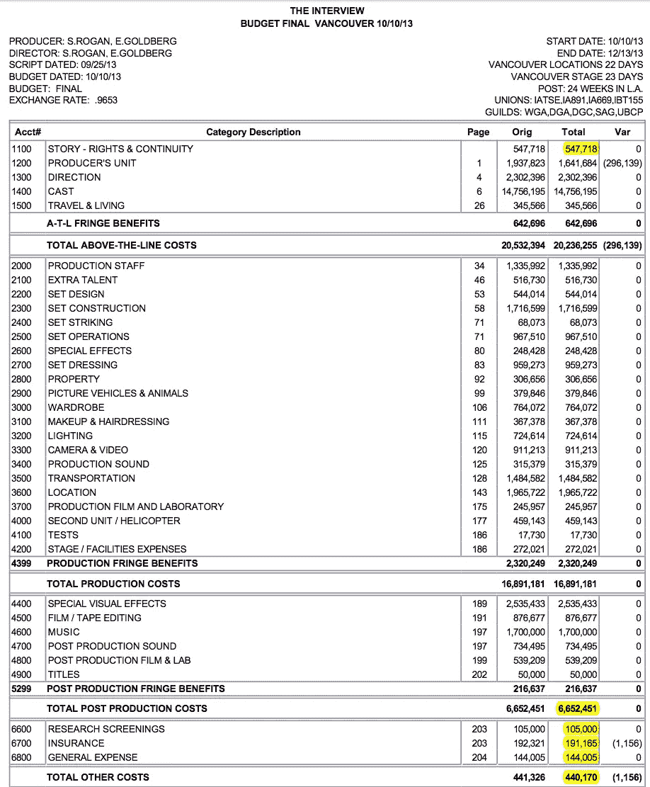
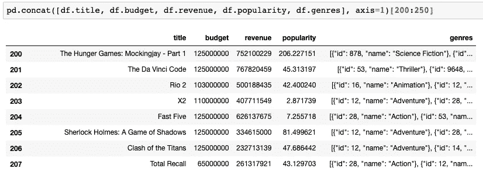
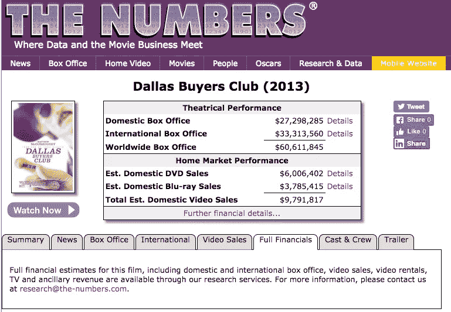
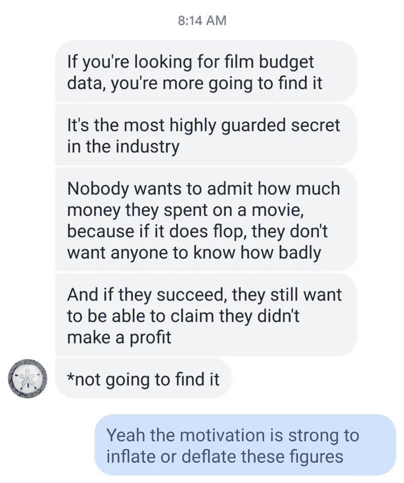

# 我想要精确的电影预算数据

> 原文：<https://towardsdatascience.com/granular-film-budget-data-9970b06735e1?source=collection_archive---------9----------------------->

## 但我找了一段时间，还没找到多少。

我能找到的最详细的电影制作数据是在维基解密上，比如这个*难忘的*第三季的[预算，还有](https://wikileaks.org/sony/docs/03_03/RISKMGMT/Production%20Files/Take%20Part%20Live/Financials/Budget/Unforgettable%20S3%20Locked%20Amort%20Budget%203-13-14.pdf)[这个*采访*](https://wikileaks.org/sony/docs/03_03/RISKMGMT/Production%20Files/Interview,%20The/Interview,%20The%20%20(10-10-13%20to%2012-10-13)/Budget/Budget_Final_Wkst+Topsheet+6700.pdf) *:*

That there is some high-resolution budget data

我甚至不应该能够看到这两个行项目的电影预算，但我想要*几千*。我在哪里可以找到他们？我如何打开闸门？

数据科学训练营的学生经常做与电影相关的玩具项目，因为*每个人都喜欢电影*，并且因为在网络搜索结果的[前几页](https://grouplens.org/datasets/movielens/)中总是有很好的 [kaggle-s](https://www.kaggle.com/rounakbanik/the-movies-dataset) 风格的表格电影[数据集](https://www.kaggle.com/tmdb/tmdb-movie-metadata)随时可用。有 [OMdB](https://www.omdbapi.com/) ，在那里你可以查询一个漂亮的 REST-ful API 来获得一堆票房数据(并演示你可以调用 API 作为额外的奖励)。你甚至可以买一个升级的 OMdB 密匙，让你花一整美元就可以进行许多 API 调用。我为承担这样的项目而感到内疚，但是我感觉这个主题的变化太多了。

问题是，对于一些了解电影制作的人来说，公开的票房数据并不那么有趣。它们通常不会很深。我开始觉得真正有趣的电影制作和发行数据，尤其是关于预算的数据，在一些有围墙的花园里被保护得很好，当然这是真的。为什么要分享呢？

Some lame data from Kaggle

任何电影制作公司有什么动机去公开他们全部的、详细的项目预算呢？即使是那些在 Kickstarter 等平台上寻求众包资金的人，也不会被要求或期望提供超过“这就是我们需要的”标量值预算总额、古怪的推介视频，或许还有一些创意奖励。详细的电影预算在内部起草、批准、跟踪、上报给国税局，然后存档。

但是如果电影预算变得透明会怎么样呢？我们能学到什么？

电影制作的艺术和惊人的机械让我着迷，因为我大约十岁的时候就从我的父亲那里学习如何制作关键帧，他是一名视频编辑和电影摄影师。在过去十年的大部分时间里，我在旧金山的电影片场担任摄影助理和灯光技术员。我[装上灯光车](http://littlegiantlighting.com/)，重新备货[灯光仓库](https://easterneffects.com/lighting-and-grip-equipment/)。我搬到了纽约，和一家很棒的后期制作工作室[签约](http://harborpicturecompany.com)做了几年的日常调色师。我非常高兴能参与一些很酷/很大的项目，在一些很棒的导师的指导下学习，学到了很多东西。我通常是一名技术人员，并且总是与主要角色关系密切:导演、摄影师、演员、制片人(在商业工作的情况下，还有代理人)。

我也看到了一部电影在不同的阶段，在某种程度上是如何失败的。当各级管理和创意人员犯错误或遗漏时，当预算分配不当时，当远见者被迫妥协他们的愿景时，或当信任错误地给予无能或好战或某种组合时，我看到了裂缝开始形成的地方。因此，我从该行业获得的主要收获是:

在一部电影作品中，有许多活动的部分，它比你想象的更像一次军事行动；时间变得异常珍贵；成功的程度与准备的程度正相关；专业设备往往是必要的，但不应该分散真正的创造性元素；工作人员、演员和赞助人的积极动机(如故事质量和总血糖水平等因素)赋予了电影生命；金钱是一种肮脏的邪恶，但在整个过程的许多阶段都是完全必要的。拥有特殊技能的人需要为他们的劳动获得报酬，他们需要购买和租赁特殊的材料和工具，需要贿赂特殊地点的看门人以获得访问和许可。每个人都要被喂养和穿梭。一切都必须投保，而且一切都必须按计划进行。

一般来说，新电影制作人低估了他们将承担的费用和他们需要的时间。有经验的电影制作人更擅长估算预算和时间要求，或者雇佣一个由 T2 人组成的中队来为他们做这件事。这并不能阻止令人厌恶的大量时间和金钱在隐喻的**垃圾箱火灾**中燃烧，其频率在整个行业都令人震惊。

我想说的是:**一部电影制作分配预算的方式对其成败至关重要，**如果能获得更精细的示例数据，那将会很有趣。每部作品的要求都是完全独特的，所以如果你深入研究，每个预算都会有所不同，但我们可以做得更好，而不仅仅是看 IMdB 上列出的总制作预算，这些预算通常是他们实际花费的几分之一或几倍，原因如下。只要制作预算保密，电影制作，总的来说，在如何花钱上不会变得更聪明。

如果我们只知道几千部电影如何在[前期/前期/后期/销售]**阶段**之间分配他们的预算，以及他们的结局如何，会怎么样？如果我们能看到几千部电影如何在[制作/摄像/灯光/艺术/服装/餐饮/演员]部门之间分配预算，并了解这如何影响电影的成功，会怎么样？我想要那些数据。

我最喜欢的衡量一部电影“成功”的基本标准是一个简单的比率:它在全球范围内产生的收入(是的，有时是由质的验证因素推动的，如奥斯卡奖或[狮](https://www.wikiwand.com/en/Venice_Film_Festival#/Awards)或 [Prixe](https://www.wikiwand.com/en/Cannes_Film_Festival#/Awards) )与其总支出的比率——从前期制作一直到制作、后期制作、营销和发行；所有费用。这个标准有利于那些以少赚多的电影制作人，世界上的[乔丹·皮尔](https://www.wikiwand.com/en/Get_Out) s，而不是詹姆斯·卡梅隆，后者必然会获得巨大的资源。我肯定卡梅隆在职业生涯的早期很好斗，但你明白我的意思。

电影制作人不需要有大数据集的学生来弄清楚恐怖类型是非常有利可图的。从 20 世纪 60 年代开始，罗杰·科尔曼就在这个事实的基础上建立了自己的事业和持久的遗产:几十年来，他一直告诉新制片人，把几个美国青少年(穿着美国运动鞋和雷朋，嚼着美国泡泡糖，开着美国车)限制在一个鬼屋的位置，把他们切碎，喷洒一些假血，在国际领土上做一些创造性的许可，赚回你预算的数倍，并活着看到另一个导演机会，这是明智而廉价的。顺便说一句，不要在你的剧本里写任何夜间外景，有很多台词的儿童角色，也不要写动物。

Indie Glimmer

*达拉斯买家俱乐部*是一部赢得 2013 年奥斯卡三项大奖的电影，从其 500 万美元的预算中获得了 1200%的回报*。*据称，整个电影的化妆部门获得 250 美元(原文如此),并为自己赢得了奥斯卡奖。据说，加拿大的大金融家在最后一刻退出了，所以这部电影的 800 万美元预算一夜之间化为乌有。一位强大的制片人相信这部电影，并在接下来的周末设法筹集了 500 万美元来维持这个项目。为了让缩减的预算发挥作用，生产部门削减了整个照明部门，但保留了马修·麦康纳。这很好。

但是，他们到底是怎么花掉这 500 万美元的呢？难道每个“低预算”(少于 1000 万美元)的制片人都不关心午餐花了多少钱吗？

But how much did they spend on location scouting?

[数字](https://www.the-numbers.com/movie/Dallas-Buyers-Club#tab=summary)提供了一些样本数据集，但同样，从生产的角度来看，它们并没有让我对完整的数据库抱有希望。每个人似乎都更关心为电影成品确定有效的收入来源，而不是在电影制作过程中优化支出！

我会继续寻找，但在这篇文章中，我不确定在哪里可以找到我想要的东西。

附言:一个有机会接触神秘知识的 NYU·提施毕业生发给我这个:

“如果你在寻找电影预算数据，你不会找到的。这是业内高度保密的秘密。没有人愿意承认他们在一部电影上花了多少钱，因为如果它真的失败了，他们不想让任何人知道有多糟糕——如果他们成功了，他们仍然希望能够声称他们没有盈利。”

如果我们能把这类数据收集在一个匿名的大袋子里会怎么样？难道不是每个人都可以对它进行逆向工程来找出哪部电影是哪部吗？我们有没有办法让电影公司公布预算数字？