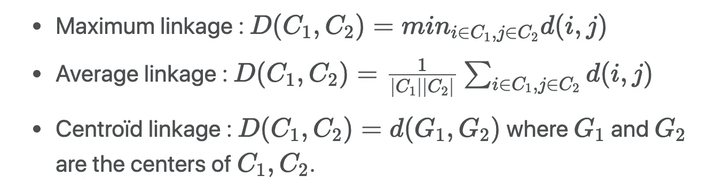

# 图形算法(第二部分)

> 原文：<https://towardsdatascience.com/graph-algorithms-part-2-dce0b2734a1d?source=collection_archive---------4----------------------->

## [内线艾](https://medium.com/towards-data-science/inside-ai/home)

## Python 中的主要概念、属性和应用


Corsica, France

这些天来，无论你是想通过预测潜在的联系来了解社交网络的结构，检测欺诈，了解汽车租赁服务的客户行为，还是提出实时建议，raphs 都成为机器学习的核心。

在本文中，我们将讨论:

*   主要的图形算法
*   插图和使用案例
*   Python 中的示例

本文原载于我的个人博客:[https://maelfabien.github.io/ml/#](https://maelfabien.github.io/ml/#)

我在这个资源库上发布我所有的文章和相应的代码:

[](https://github.com/maelfabien/Machine_Learning_Tutorials) [## mael fabien/机器学习教程

### 本报告包含练习、代码、教程和我的个人博客文章

github.com](https://github.com/maelfabien/Machine_Learning_Tutorials) 

如果您还没有，请务必阅读我的第一篇文章:

[](/introduction-to-graphs-part-1-2de6cda8c5a5) [## 图表介绍(第一部分)

### Python 中的主要概念、属性和应用

towardsdatascience.com](/introduction-to-graphs-part-1-2de6cda8c5a5) 

**新**:第 3 部出来了！

[](/learning-in-graphs-with-python-part-3-8d5513eef62d) [## 用 Python 学习图形(第 3 部分)

### Python 的概念、应用和示例

towardsdatascience.com](/learning-in-graphs-with-python-part-3-8d5513eef62d) 

接下来，打开 Jupyter 笔记本，导入以下包:

```
import numpy as np
import random
import networkx as nx
from IPython.display import Image
import matplotlib.pyplot as plt
```

以下文章将使用最新版本的`networkx``2.x`。NetworkX 是一个 Python 包，用于创建、操作和研究复杂网络的结构、动态和功能。

我将尽量保持一种实用的方法，并举例说明每个概念。

在上一篇文章中，我们介绍了图的主要种类，以及描述图的基本特征。我们现在将更详细地介绍图形分析/算法以及分析图形的不同方法。

为了理解上下文，下面是一些图算法的用例:

*   实时欺诈检测
*   实时推荐
*   简化法规遵从性
*   复杂网络的管理和监控
*   身份和访问管理
*   社交应用/功能
*   …

目前大多数框架都支持三种主要的图形算法(例如 Python 中的`networkx`或 Neo4J):

*   **寻路**:根据可用性和质量等确定*最佳路径*。我们还将在这一类别中包括**搜索算法**。例如，这可用于识别*最快路线或交通路线*。
*   **中心性**:确定网络中节点的重要性。这可以用来*识别社交媒体中的影响者*或者识别网络中的潜在攻击目标。
*   **社区检测**:评估一个*群体是如何聚集的*。这可用于*细分客户*和*检测欺诈*等。

我们还将在下周发表的第三篇文章中开发图形中的机器学习基础和**图形学习**。在 Networkx 中实现的所有算法都可以在这里找到:

 [## 算法- NetworkX 2.3 文档

### 编辑描述

networkx.github.io](https://networkx.github.io/documentation/stable/reference/algorithms/index.html) 

您会注意到，我们将只讨论在 Networkx 中实现的基本和最常见的算法。

# I .寻路和图搜索算法

*   **寻路算法**试图通过最小化跳数找到两个节点之间的**最短路径**。
*   **搜索算法**没有给出最短路径。取而代之的是，他们通过考虑图的邻居或深度来探索图。这可以用于信息检索。

## **1。搜索算法**

有两种主要的图形搜索算法:

*   **广度优先搜索(BFS)** 首先搜索每个节点的邻居，然后是邻居的邻居…
*   **深度优先搜索(DFS)** 尝试尽可能地沿着一条路径走下去，如果可能的话，访问新邻居。


Search Algorithms

## **2。寻路算法**

**a .最短路径**

> *最短路径计算一对节点之间最短的加权(如果图是加权的)路径。*

例如，它用于识别社交网络上两个人之间的最佳驾驶方向或分离程度。

有许多方法可以计算图中的最短路径，包括 **Dijkstra 的算法**，Networkx 中的默认算法。

根据维基百科，该算法的伪代码如下:

1.  将图中的所有节点标记为未访问。创建所有未访问节点的集合，称为*未访问集合*。
2.  给每个节点分配一个试探性的距离值:对于初始节点，将其设置为零；对于所有其他节点，将其设置为无穷大。将初始开始节点设置为当前节点。
3.  对于当前节点，考虑其所有未访问的邻居，并计算它们通过当前节点的*暂定*距离。将新计算的*暂定*距离与当前分配值进行比较，并分配较小的一个。例如，如果当前节点 *A* 被标记为距离 6，并且连接它和邻居 *B* 的边的长度为 2，那么通过 *A* 到 *B* 的距离将是 6 + 2 = 8。如果 B 之前标记的距离大于 8，则将其更改为 8。否则，保持当前值。
4.  当我们考虑完当前节点的所有未访问邻居后，将当前节点标记为已访问，并将其从*未访问集合*中移除。被访问的节点将不再被检查。
5.  如果目的地节点已经被标记为已访问(当计划两个特定节点之间的路线时)或者如果*未访问集合*中的节点之间的最小暂定距离是无穷大(当计划完整遍历时；当初始节点和剩余的未访问节点之间没有连接时发生)，然后停止。算法已经完成。
6.  否则，选择标有最小暂定距离的未访问节点，将其设置为新的“当前节点”，并返回步骤 3。

如果你想了解更多关于最短路径的问题，请看这篇文章:[https://en.wikipedia.org/wiki/Shortest_path_problem](https://en.wikipedia.org/wiki/Shortest_path_problem)


Wikipedia’s illustration of the **Dijkstra’s algorithm**

在 Python 中，实现非常简单:

```
# Returns shortest path between each node
nx.shortest_path(G_karate)
```

这将返回图中每个节点之间的最短路径列表:

```
{0: {0: [0],
    1: [0, 1],
    2: [0, 2],
    ...
```

**b .单源最短路径**

> *单源最短路径(SSSP)查找图中给定节点和所有其他节点之间的最短路径。*

例如，它通常用于 IP 网络的路由协议。

**c .所有对最短路径**

> *“所有对最短路径”(APSP)算法寻找所有节点对之间的最短路径。*

尽管提供了相似的结果，但它比针对每对节点调用单一源最短路径更快。该算法通常可用于确定交通网格不同路段的预期交通负荷。

```
# Returns shortest path length between each node
list(nx.all_pairs_shortest_path_length(G_karate))
```

它返回:

```
[(0,
    {0: 0,
    1: 1,
    2: 1,
    3: 1,
    4: 1,
    ...
```

**d .最小重量生成树**

> 最小生成树是连接图中所有节点的边权重之和最小的图(树)的子图。

最小生成树应该应用于无向图。

```
from networkx.algorithms import tree
mst = tree.minimum_spanning_edges(G_karate, algorithm='prim', data=False)
edgelist = list(mst)
sorted(edgelist)
```

它返回:

```
[(0, 1),
(0, 2),
(0, 3),
(0, 4),
(0, 5),
(0, 6),
...
```

# 二。社区检测

> *社区检测根据给定的* ***质量准则*** *将节点划分成若干个* ***组*** *。*

它通常用于识别社交社区、客户行为或网页主题。

*社区*是一组连接的节点。然而，尽管社区内的节点应该是紧密连接的，但是没有一个通用的定义可以用来定义社区。


Communities

寻找社区的一种常见算法是格文纽曼算法。它通过逐步移除网络中的边来识别社区。我们将把中间性称为“边中间性”。它是一个与通过这条边的节点对之间的最短路径数成比例的分数。

该算法的步骤如下:

1.  计算网络中所有现有边的介数。
2.  移除具有最高介数的边。
3.  移除此边后，重新计算所有边的介数。
4.  重复第 2 步和第 3 步，直到没有剩余的边。

要在 Python 中实现这一点，可以使用以下代码:

```
from networkx.algorithms import communityk = 1
comp = community.girvan_newman(G_karate)for communities in itertools.islice(comp, k):
    print(tuple(sorted(c) for c in communities))
```

这是属于每个社区的节点列表的开头(k=1 表示我们期望 2 个社区):

```
([0, 1, 3, 4, 5, 6, 7, 10, 11, 12, 13, 16, 17, 19, 21], [2, 8, 9, 14, 15, 18, 20, 22, 23, 24, 25, 26, 27, 28, 29, 30, 31, 32, 33])
```

如上所述，这种方法没有真正的规模。由于这个原因，已经开发了诸如 Louvain 方法的方法。然而，这种方法在大型图上运行起来确实很长。

## 3.鲁汶模块化

在定义 Louvain 方法之前，引入模块化的概念是很重要的。模块性是对组被划分为集群的良好程度的度量:


Modularity

卢万方法的**伪码**如下:

*   首先为每个节点分配一个社区
*   交替接下来的 2 个步骤，直到收敛:
*   创建一个具有相邻节点的新社区，以最大化模块化
*   创建新的加权图。前一步的社区成为图的节点

现在这可能看起来有点混乱。事实上，我们所做的唯一事情就是对最近的节点进行分组，以便优化模块化标准。


Louvain Method

请注意，卢万方法没有理论上的保证，但在实践中效果很好。卢万的方法作为 NetworkX 的一个子项目出现，就在这里:[https://python-louvain.readthedocs.io/en/latest/](https://python-louvain.readthedocs.io/en/latest/)

首先，安装软件包:

```
pip install python-louvain
```

然后，计算最佳分区(基于 Louvain 方法):

```
import community
partition = community.best_partition(G_karate)pos = nx.spring_layout(G_karate)
plt.figure(figsize=(8, 8))
plt.axis('off')
nx.draw_networkx_nodes(G_karate, pos, node_size=600, cmap=plt.cm.RdYlBu, node_color=list(partition.values()))
nx.draw_networkx_edges(G_karate, pos, alpha=0.3)
plt.show(G_karate)
```


Best partition of the Karate Graph using Louvain

## 4.强连通分量

> *强连通分量(SCC)算法在有向图中找到多组* ***连通节点*** *。注意，每个节点必须是从同一组中的任何其他节点在* ***两个方向*** *上**可达* *。*

它通常在图表分析过程的早期使用，让我们了解我们的图表是如何构建的，例如，当我们查看谁拥有哪个公司的股份时，探索财务报表数据(例如，想想巴拿马文件)。

## 5.弱连通分量(联合查找)

> *弱连通分量或联合查找算法在有向图中查找* ***连通节点*** *的集合，其中每个节点是从同一集合中的任何其他节点可达的***。**

*它只需要在一个方向的节点对之间存在一条路径，而 SCC 需要在两个方向都存在一条路径。与 SCC 一样，Union Find 通常在分析的早期用于理解图的结构。*

*Union-Find 是一个预处理步骤，对于理解图的结构来说，在任何算法之前都是必不可少的。*

*我们可以使用以下方法测试连通有向图:*

```
*nx.is_weakly_connected(G)
nx.is_strongly_connected(G)*
```

*或者对于无向图，使用:*

```
*nx.is_connected(G_karate)*
```

*它返回一个布尔值。*

*确保查看关于实施连接的 [Networkx 文档](https://networkx.github.io/documentation/stable/reference/algorithms/component.html)。*

## *6.分层聚类*

> **在层次聚类中，我们构建一个***的层次聚类。我们用一个* ***树状图来表示下面的聚类。*****

****

**Dendrogram**

**这个想法是分析不同尺度的社区结构。我们通常自底向上构建树状图。我们从每个节点的一个集群开始，合并两个“最近”的节点。**

**但是我们如何测量星团是否很接近呢？我们使用相似距离。设 d(i，j)是 I 和 j 之间最短路径的长度。**

****

**Similarity Distances**

**对于最大链接，在每一步，由最短距离分开的两个聚类被组合。相似性距离可以如下所示:**

****

**Linkage**

**回到我们空手道的例子。在应用层次聚类之前，我们需要定义每个节点之间的距离矩阵。**

```
**pcc_longueurs=list(nx.all_pairs_shortest_path_length(G_karate))
distances=np.zeros((n,n))# distances[i, j] is the length of the shortest path between i and j
for i in range(n):
    for j in range(n):
        distances[i, j] = pcc_longueurs[i][1][j]**
```

**现在，我们将使用`sklearn`的`AgglomerativeClustering`函数来识别层次聚类。**

```
**from sklearn.cluster import AgglomerativeClusteringclustering = AgglomerativeClustering(n_clusters=2,linkage='average',affinity='precomputed').fit_predict(distances)**
```

**最后，根据分类用不同的颜色绘制结果图:**

```
**nx.draw(G_karate,  node_color = clustering)**
```

****

**Hierarchical Clustering**

## **7.聚类系数**

> ***聚类系数衡量两个节点趋向于* ***聚类*** *在一起的程度。***

**局部聚类系数是以节点 I 为中心的三角形的数量与以节点 I 为中心的三元组的数量之比。在某种意义上，它衡量节点 I 及其邻居与完整图形的接近程度。**

****

**Clustering Coefficient**

**我尝试用下图来说明聚类系数的计算:**

****

**Clustering Coefficient**

****全局**系数测量图形中三角形(局部聚类)的密度:**

****

**Global Clustering Coefficient**

**在上图中，聚类系数等于:**

****

**对于 **Erdos-Rényi** 随机图，E[聚类系数]=E[Ci]=p 其中 p 为上一篇文章定义的概率。**

**对于 **Baràbasi-Albert** 随机图，全局聚类系数根据节点数遵循幂律。度为 k 的节点的平均聚类系数与 k 的倒数成正比:**

****

**具有低等级的节点连接到其社区中的其他节点。度数高的节点链接到不同社区的节点。**

**对于给定的图，在`networkx`中，可以很容易地计算出聚类系数。首先，让我们从局部聚类系数开始:**

```
**# List of local clustering coefficients
list(nx.clustering(G_barabasi).values())**
```

**这应该会返回类似于以下内容的内容:**

```
**0.13636363636363635,
0.2,
0.07602339181286549,
0.04843304843304843,
0.09,
0.055384615384615386,
0.07017543859649122,
...**
```

**并对结果进行平均，以找到图的全局聚类系数:**

```
**# Global clustering coefficient
np.mean(list(nx.clustering(G_barabasi).values()))**
```

**哪些标题:**

```
**0.0965577637155059**
```

# **三。中心算法**

**中心性衡量一个节点的重要性。这不是一个清晰的定义，但当我们想要识别重要的网页、交通网络中的瓶颈时，这很有用…**

**一条**步行**是一条可以多次通过同一个节点的路径。中心性度量随着所考虑的行走类型和计算它们的方式而变化。**

## **1.PageRank 算法**

> *****page rank****从其链接的邻居，然后再从它们各自的邻居，估计当前节点的重要性。***

**虽然是由谷歌推广的，但这是一种检测任何网络中有影响力节点的方法。例如，它被用来暗示社交网络上的联系。**

**PageRank 是通过迭代地将一个节点的等级(最初基于度)分配给它的邻居，或者通过随机遍历图形并计算在这些遍历期间命中每个节点的频率来计算的。**

****

**Neo4J summary of the Page Rank Algorithm**

**PageRank 通常是在有向图上计算的。但是，它也可以通过将有向图中的每条边转换为两条边来在无向图上执行。**

**例如，空手道图的 PageRank 可以通过以下方式访问:**

```
**nx.pagerank(G_karate, alpha=0.9)**
```

**其中，alpha 是阻尼参数(默认为 0.85)。作为回报，它会给你一个排名列表:**

```
**{0: 0.09923208031303203,
 1: 0.0543403155825792,
 2: 0.05919704684187155,
 3: 0.036612460562853694,
...**
```

## **2.程度中心性**

> *****度中心性*** *统计结束于节点 I 的长度为 1 的行走次数***

**它衡量传入和传出的关系。它由 C(Xi)=di 给出。例如，度中心性用于识别社交网络上最有影响力的人。**

```
**c_degree = nx.degree_centrality(G_karate)
c_degree = list(c_degree.values())**
```

## **3.特征向量中心性**

> ***特征向量中心性是在节点 I 结束的无限长的行走的数量。***

**这使得具有良好连接的邻居的节点更加重要。**

****

**Eigenvector Centrality**

```
**c_eigenvector = nx.eigenvector_centrality(G_karate)
c_eigenvector = list(c_eigenvector.values())**
```

## **4.接近中心性**

> *****接近中心度*** *通过图形检测能够有效传播信息的节点。***

**它可以用来识别假新闻账户或恐怖分子的细胞，以隔离那些可以传播信息的个人。**

****

**接近中心性与到其他节点的最短路径的长度之和成反比。**

```
**c_closeness = nx.closeness_centrality(G_karate)
c_closeness = list(c_closeness.values())**
```

## **5.中间中心性**

> *****中间中心性*** *检测一个节点对图中信息流的影响程度。***

**它通常用于查找充当从图的一部分到另一部分的桥梁的节点，例如在电信网络中的包裹递送处理器中，或者在假新闻的传播中。**

****

**其中:**

*   **σJK j 和 k 之间的最短路径数**
*   **σJK(I)j 和 k 之间经过 I 的最短路径数**

**介数中心性测量一个节点作为两个节点之间的桥梁的次数。例如:**

****

**Centrality Measure**

```
**c_betweenness = nx.betweenness_centrality(G_karate)
c_betweenness = list(c_betweenness.values())**
```

**在 Python 中，实现依赖于`networkx`的内置函数:**

```
**# Plot the centrality of the nodes
plt.figure(figsize=(18, 12))# Degree Centrality
f, axarr = plt.subplots(2, 2, num=1)
plt.sca(axarr[0,0])
nx.draw(G_karate, cmap = plt.get_cmap('inferno'), node_color = c_degree, node_size=300, pos=pos, with_labels=True)
axarr[0,0].set_title('Degree Centrality', size=16)# Eigenvalue Centrality
plt.sca(axarr[0,1])
nx.draw(G_karate, cmap = plt.get_cmap('inferno'), node_color = c_eigenvector, node_size=300, pos=pos, with_labels=True)
axarr[0,1].set_title('Eigenvalue Centrality', size=16)# Proximity Centrality
plt.sca(axarr[1,0])
nx.draw(G_karate, cmap = plt.get_cmap('inferno'), node_color = c_closeness, node_size=300, pos=pos, with_labels=True)
axarr[1,0].set_title('Proximity Centrality', size=16)# Betweenness Centrality
plt.sca(axarr[1,1])
nx.draw(G_karate, cmap = plt.get_cmap('inferno'), node_color = c_betweenness, node_size=300, pos=pos, with_labels=True)
axarr[1,1].set_title('Betweenness Centrality', size=16)**
```

****

**The different centrality measures**

**我们观察到由中心性度量突出显示的不同节点是非常不同的。例如，中间中心性产生的结果与其他方法相差甚远，因为它们测量的不是同样的东西。**

# **四。结论**

**我们现在已经介绍了图的介绍、图的主要类型、不同的图算法以及它们在 Python 和 Networkx 中的实现。**

**在下一篇文章中，我们将讨论图学习，它提供了预测图中节点和边的方法，以处理丢失的值或预测新的关系。**

**如果您有任何问题或意见，请随时评论。敬请期待，本系列的最后一篇文章将于下周问世:)**

## **来源:**

*   **Neo4j 中的图形算法综合指南**
*   **网络 x 文档，【https://networkx.github.io/documentation/stable/ **

**如果你想从我这里读到更多，我以前的文章可以在这里找到:**

**[](/introduction-to-graphs-part-1-2de6cda8c5a5) [## 图表介绍(第一部分)

### Python 中的主要概念、属性和应用

towardsdatascience.com](/introduction-to-graphs-part-1-2de6cda8c5a5) [](/learning-in-graphs-with-python-part-3-8d5513eef62d) [## 用 Python 学习图形(第 3 部分)

### Python 的概念、应用和示例

towardsdatascience.com](/learning-in-graphs-with-python-part-3-8d5513eef62d) [](/markov-chains-and-hmms-ceaf2c854788) [## 马尔可夫链和 hmm

### 在本文中，我们将关注马尔可夫模型，何时何地应该使用它们，以及隐马尔可夫模型。这个…

towardsdatascience.com](/markov-chains-and-hmms-ceaf2c854788) [](/a-guide-to-face-detection-in-python-3eab0f6b9fc1) [## Python 中的人脸检测指南

### 在本教程中，我们将看到如何使用 OpenCV 和 Dlib 在 Python 中创建和启动人脸检测算法。我们会…

towardsdatascience.com](/a-guide-to-face-detection-in-python-3eab0f6b9fc1) [](/boosting-and-adaboost-clearly-explained-856e21152d3e) [## 升压和 AdaBoost 解释清楚

### 直观的解释

towardsdatascience.com](/boosting-and-adaboost-clearly-explained-856e21152d3e)**