# 图形分析——中心性的介绍和概念

> 原文：<https://towardsdatascience.com/graph-analytics-introduction-and-concepts-of-centrality-8f5543b55de3?source=collection_archive---------1----------------------->

Photo by [Alina Grubnyak](https://unsplash.com/@alinnnaaaa?utm_source=medium&utm_medium=referral) on [Unsplash](https://unsplash.com?utm_source=medium&utm_medium=referral)

社交网络、大数据和电子商务的出现再次强调了分析一种独特类型的数据结构的重要性，这种数据结构描述了其实体之间的关系，也称为图表。在我开始介绍图分析之前，有必要简要介绍一下“图”的概念。

让我们从下面展示的朋友图表开始。我将在下面的一些章节中使用相同的图表来进一步解释图表分析的概念。

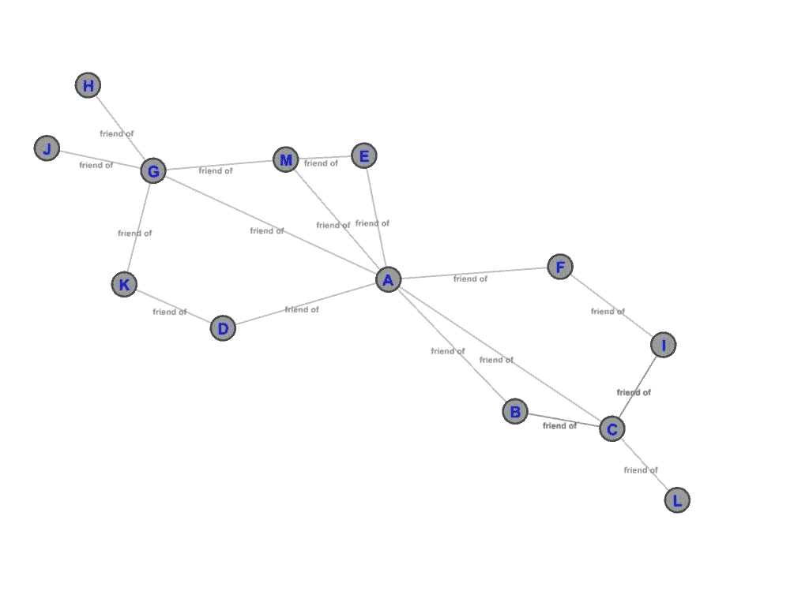

Figure 1 ( This graph was designed in Gephi )

上图描绘了朋友的图，其中节点/实体例如 A、B 等。描述了一个特定的个体，任何两个个体之间的链接(也称为边)描述了他们之间的关系(在这种情况下为“友谊”)。

从上面的例子中总结:

**图可以被定义为“实体”或“事物”之间关系的表示，其中这些“实体”是图的“节点”(也称为“顶点”)，它们之间的关系由图的“链接”(也称为“边”)来表示。对图的研究也被称为“图论”**

此外，通过简单地查看图表，人们可以分析出 A 和 B 有一个共同的朋友 C，而 C 并不是 d 的朋友。数据科学的分支通过对图表进行分析来处理从图表中提取信息，这被称为**“图表分析”。**

从介绍继续向前，让我们通过探索一些基本概念进入图形分析的世界。在本文中，我们将特别关注图形分析中使用的基于**中心性**的概念。如果你不理解前面提到的声明，请不要担心，因为随着我们的前进，我将从头开始讲述一切。

**中心性**

在图分析中，中心性是识别图中重要节点的一个非常重要的概念。它用于测量图中各种节点的重要性(或“中心性”，如节点在图中的“中心”程度)。现在，从某个角度来看，每个节点都可能很重要，这取决于“重要性”是如何定义的。中心性有不同的风格，每种风格或度量从不同的角度定义节点的重要性，并进一步提供关于图及其节点的相关分析信息。

**度中心性**

我们要讨论的中心性的第一种味道是“**度中心性**”。为了理解它，我们先来探讨一下图中一个节点的**度**的概念。

在**无向图**中，节点的度被定义为一个节点与其他节点的直接连接数。请看下图:

在**有向图**中(每条边都有一个方向)，节点的度进一步分为入度和出度。入度指的是入射到其上的边/连接数，出度指的是从它到其他节点的边/连接数。让我们看看下面的 Twitter 图表示例，其中节点是个体，带箭头的边表示“关注”关系:

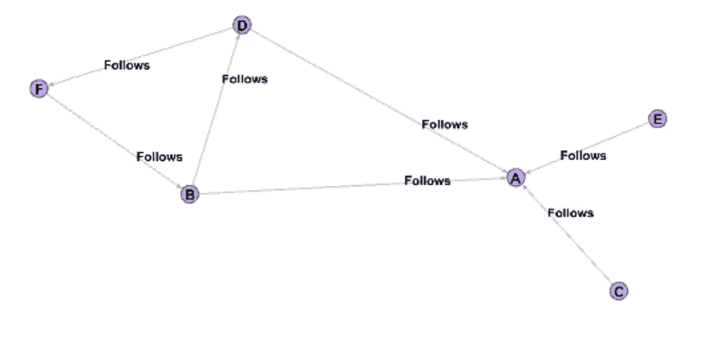

Figure 2

我们可以看到，节点 E、C、D 和 B 具有朝向节点 A 的输出边，因此跟随节点 A。因此，节点 A 的入度是 4，因为它有 4 条边入射到它上面。

我们还可以看到，节点 B 跟随节点 D 和节点 A，因此它的出度为 2。

现在，度中心性度量将图中节点的重要性定义为基于其度来测量，即节点的度越高，它在图中就越重要。

重新检查下面提到的朋友图表(图 1 ):

Figure 3

节点 A 的度中心性是 7，节点 G 是 5，节点 C 是 4，节点 L 是 1。

数学上，度中心性被定义为节点“I”的 D(i ),如下所示:

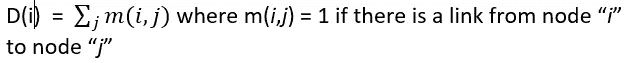

现在，让我们简要地讨论一下上面显示的朋友图的度中心性的一个示例应用。观察节点 A 和 G，它们具有高度的中心性(分别为 7 和 5 ),并且如果我们想要将任何信息快速传播到网络的大部分，与仅具有 1 的中心性的节点 L 相比，它们将是理想的候选者。如果必须在网络中引入新产品或想法/思想，该信息对于创建营销或影响策略非常有用。营销人员可以关注 A、G 等节点。在网络中高度集中地营销他们的产品或想法，以确保节点之间更高的可及性。

类似地，记住样本 Twitter 图(图 2)，如果我们实际检查一个具有数百万节点的社交网络，如 Twitter，并计算各种节点的入度中心性，具有高入度中心性的节点(如 Kanye West、Lady Gaga 和其他名人)将是拥有大量追随者的节点，并且可能是影响公众或推广商业产品的理想候选节点。现在你知道为什么名人或受欢迎的人在 Instagram 和 Twitter 等社交网络上获得报酬，以说某些事情或推广某些产品，因为商业公司意识到这些人有非常高的参与度，有能力影响或迅速接触到大量的人。

基于度中心性分析节点重要性的应用/有用性是巨大的，并且取决于所考虑的图/网络的性质。

**接近中心性**

我们要讨论的第二种味道是“接近中心性”。为了理解同样的道理，首先让我们来理解图中两个节点之间的“**测地线距离”**的概念。

两个节点 *a* 和 *b* 之间的测地距离 d 被定义为这两个节点之间的最短路径(具有最少边数的路径)上的边数/链接数。

让我们看看下图:

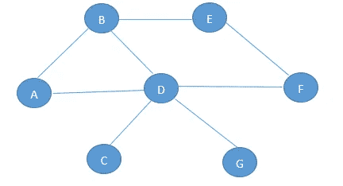

Figure 4

让我们检查 A 和 F 之间的测地线距离，以进一步阐明这个概念。我们可以通过 B 和 E 或 D 从 A 到达 F。然而，从 F 到 A 的最短路径是通过 D(2 条边)，因此测地线距离 d(A，F)将被定义为 2，因为 A 和 F 之间有 2 条边。

数学上，测地线距离可以定义如下:

**d( *a* ， *b* )** =从 *a* 到 *b* 的最短路径上 *a* 和 *b* 之间的边数，如果存在从 *a* 到 *b* 的路径

**d( *a* ， *b* )** = 0，如果 a = *b*

**d( *a* ， *b* )** = ∞(无穷大)，如果从 *a* 到 *b* 没有路径

此外，接近中心性度量将图中节点的重要性定义为通过它与图中所有其他节点的接近程度来测量。对于一个节点，它被定义为该节点到网络中所有其他节点的测地距离之和。

同样，在下面的图 1 中查看之前介绍的朋友图，我们可以看到节点 A 的亲密度中心性是 17，而节点 L 的亲密度中心性是 33。

Figure 5

数学上，图中节点 *i* 的接近中心度 C(i)可以定义如下:

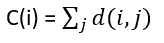

让我们通过检查上面图 5 中的朋友图来简要描述亲密度中心性的一个示例应用。现在让我们假设在朋友的图中，每条链路/边都有 1 分钟的权重(属性),即从一个节点向其相邻节点(如 A 到 B 或 B 到 c)传输信息需要 1 分钟。现在让我们假设我们想向图中的每个节点发送一条特定信息(每个节点的信息都不同),我们需要在图中选择一个节点，该节点可以将它快速传输到网络中的所有节点。

为了解决上述问题，我们可以计算网络中所有节点的接近中心度。正如我们在上面已经为节点 A 计算的那样，如果我们选择节点 A，信息可以通过遍历 17 条边到达所有节点(即从 A 开始，在假设从 A 顺序发送的最坏情况下，信息可以在 17 分钟内被发送到所有节点),相比之下，在节点 L，将信息发送到所有节点需要 33 分钟。很明显，我们可以看到节点 A 和 L 在接近中心性度量方面的重要性差异。

**中间中心性**

我们将要讨论的第三种中心性被称为“中间中心性”(BC)。该度量基于节点在图中所有节点对之间的最短路径中出现的次数来定义和测量节点在网络中的重要性。为了进一步阐述这一指标，我们再来看看下面的朋友图表:

Figure 6

数学上，图中节点 *i* 的中间中心度 B(i)定义如下:

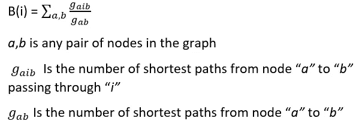

查看节点 A，我们可以看到它位于以下节点对之间的最短路径上:(D，M)，(D，E)，(G，C)，(G，B)，(G，F)，(G，I)，(K，C)，(D，C)等等。因此在图中的所有其他节点中具有最高的 BC。我们还可以观察到，与图中的其他节点(除了 A)相比，节点 G 和 C 也具有较高的介数中心性(BCs)

如前所述，如果我们看一下上面的朋友图(图 6)，节点 A 有一个非常高的 BC。如果我们移除它，将会导致网络中的巨大中断，因为节点{J，H，G，M，K，E，D}将无法与节点{F，B，C，I，L}通信，反之亦然，并且我们将会以两个孤立的子图结束。这种理解标志着具有高 BCs 的节点的重要性。

BC 的一个示例应用是在图中查找桥节点。具有高 BC 的节点是在大量节点对之间的最短路径上的节点，并且因此对于图中的通信是至关重要的，因为它们将大量节点彼此连接。从网络中移除这些节点将导致网络的链接或通信的巨大中断。

上述应用程序的一个真实使用案例是分析全球恐怖主义网络。例如，如果我们将恐怖分子或恐怖组织以及其他相关个人的网络表示为图的节点，我们可以计算每个节点的 BC，并识别具有高 BC 的节点。这些节点(或者在这种情况下是恐怖分子)将是网络中的桥节点。这些信息对国防机构非常有用，因为他们可以非常有效地破坏整个恐怖主义网络。该指标的另一个用例是检测和监控计算机网络或流网络中可能的瓶颈或热点。

**特征向量中心性**

我们将探索的中心性的最后一种风格被称为特征向量中心性。该度量将图中节点的重要性作为其邻居重要性的函数来衡量。如果节点连接到非常重要的节点，则与连接到不太重要的节点的节点相比，它将具有更高的特征向量中心性得分。

让我们看看下面给出的图表来进一步解释这个概念:

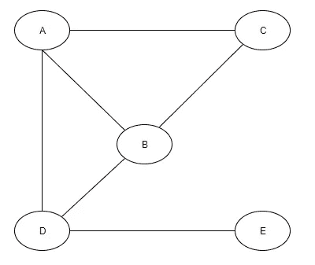

Figure 7

上图的邻接矩阵 **A** 如下所示:

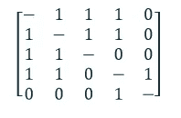

Figure 8

我们假设在上面的图中，每个节点的重要性是用它的度来衡量的，这样一个节点的度越高，它在图中的重要性就越大。各节点的度数如下所示:

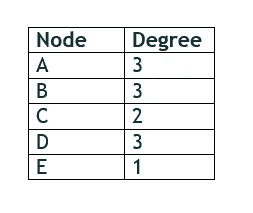

Figure 9

以上也可以表示为如下所示的矩阵向量 **V** :

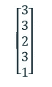

Figure 10

现在，在数学上，特征向量中心性计算如下:

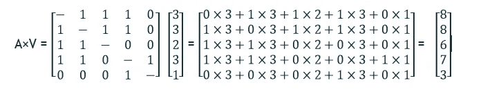

Figure 11 showing Eigen Vector Centrality Calculation — 1st Iteration

上述等式中的合成 1-D 向量给出了图中每个节点的特征向量中心性(EVC)分数。乘法的第一次迭代的效果可以如下所示:

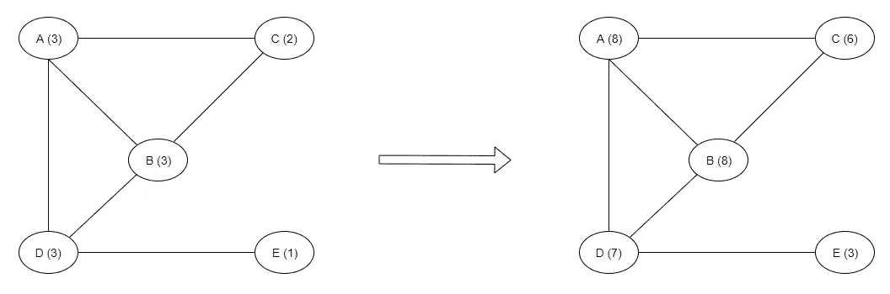

Figure 12 showing EVC scores of each node after 1st iteration of multiplication

正如您在上面看到的，节点 A 和 B 的得分都很高，为 8，因为它们都连接到多个具有高度(重要性)的节点，而节点 E 的得分为 3，因为它只连接到一个 3 度的节点。同样重要的是，观察到合成向量中每个节点的 EVC 分数值只不过是其相邻节点的度数之和。例如:节点 A 的 EVC 分数=度(B) +度(C) +度(D) = 8

现在，如果我们在上面的等式(图 11)中得到的合成 EVC 向量再次乘以邻接矩阵 A，我们将得到图中每个节点的 EVC 得分的更大值，如下所示:

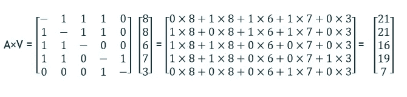

Figure 13 showing Eigen Vector Centrality Calculation — 2nd Iteration of multiplication

将结果向量再次乘以邻接矩阵(乘法的第二次迭代)的效果可以被可视化，如下所示:

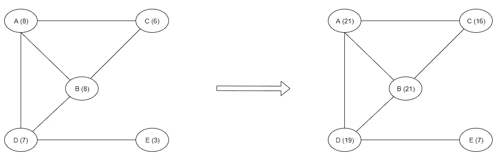

Figure 14 showing EVC scores of each node after 2nd iteration of multiplication

现在，为什么我们要用邻接矩阵再次乘以合成向量？

简而言之，答案在于，将所得向量再次与图的邻接矩阵相乘有助于 EVC 分数在图中展开，从而对于图中的每个节点，得到更全局突出的 EVC 分数，而不是局部 EVC 分数。如果我们观察到，在乘法的第一次迭代之后，每个节点的 EVC 分数仅是其直接(第一级)邻居的函数，因此是局部分数，其在图中的全局水平上可能不准确。

阐述上述内容时，如果我们将上述操作可视化，我们可以观察到以下情况:

*   在乘法的第一次迭代之后，每个节点从它的直接(第一级)邻居获得它的 EVC 分数。
*   在第二次迭代中，当我们再次将结果向量乘以邻接矩阵时，每个节点再次从它的直接邻居获得它的 EVC 分数，但是第二次迭代中的不同之处在于，这一次，直接邻居的分数已经受到它们自己的直接(第一级)邻居先前(从第一次乘法迭代)的影响，这最终帮助任何节点的 EVC 分数也成为它的第二级相邻节点的函数。
*   在随后的乘法迭代中，图节点的 EVC 分数通过受到来自更远程度的相邻节点(第三、第四等等)的 EVC 分数的影响而保持更新。

重复乘法使得每个节点的 EVC 分数最终是其相邻节点的几度的函数或依赖于其相邻节点的几度，从而为每个节点提供全局精确的 EVC 分数。通常，重复 EVC 向量与邻接矩阵相乘的过程，直到图中节点的 EVC 值达到平衡或不再显示明显变化。

对特征向量中心性的应用的讨论是广泛的，值得单独的一篇文章来讨论。EVC 的一个示例应用是计算页面排名或页面排名算法，Google 和许多其他公司使用该算法来根据相关性对互联网上的网页进行排名。页面排名是 EVC 的直接变体。万维网上的网页有指向/来自其他网页的链接。你可以把每一个网页想象成图中的一个节点，把每一个输出/输入链接想象成通向/来自网络上另一个网页的有向边，从而构成整个万维网图。万维网中网页的图经历几次 EVS 计算的迭代，以便计算每个网页的全局精确的相关性排名。然后，具有高 EVC 分数的网页可以作为营销和其他商业目的的目标。

图形分析的领域是广阔的，并且有巨大的实际应用。这篇文章的范围是覆盖中心性的基本原理，希望能让读者深入了解图形分析的迷人世界。

以下是可用于图形分析的各种图形分析库和软件列表:

*   **Gephi**(【https://gephi.org/】T2)
*   **细胞图**([https://github.com/cytoscape/cytoscape.js](https://github.com/cytoscape/cytoscape.js))
*   **Neo4j**([https://neo4j.com](https://neo4j.com))
*   **GraphAnalyticsLib**([https://github.com/jb123/GraphAnalyticsLib](https://github.com/jb123/GraphAnalyticsLib)