# 用于几何深度学习的图卷积网络

> 原文：<https://towardsdatascience.com/graph-convolutional-networks-for-geometric-deep-learning-1faf17dee008?source=collection_archive---------2----------------------->

## 图形学习和几何深度学习—第二部分

> 一定要看一篇 [**几何深度学习概述**](/what-is-geometric-deep-learning-b2adb662d91d) 和[**先决条件**](/graph-theory-and-deep-learning-know-hows-6556b0e9891b) 熟悉机器学习这个小众领域。
> 
> 关注 [**我的推特**](https://twitter.com/FlawnsonTong) 加入 [**几何深度学习子编辑**](https://www.reddit.com/r/GeometricDeepLearning/) 获取空间最新更新。

G **图卷积**与[上一期](https://medium.com/p/4305c10ad4a4/edit)中介绍的图嵌入方法非常不同。卷积方法不是将图变换到更低的维度，而是在输入图本身上执行，结构和特征保持不变。

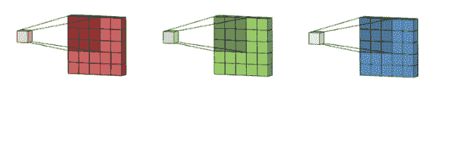

Convolutions (Courtesy of Doing Interesting Things in Life)

由于图表在更高的维度上保持最接近其原始形式，因此**关系归纳偏差**更强。

> **学习算法的归纳偏差是一组假设，学习者使用这些假设来预测其尚未遇到的给定输入的输出。**

每个机器学习算法中都有一种归纳偏差。例如，在普通 CNN 中，**最小特征**归纳偏差声明，除非有充分的证据表明某个特征是有用的，否则它应该被删除。特征选择算法是建立在这个假设之上的。在几何深度学习中，假设是相关的:

> **通过以优先考虑特定模式的方式来组织数据，我们可以提高模型性能，即使数据是相同的。**

# 香草卷

通常，传统的卷积网络包括 3 个主要操作:

**内核/过滤器**

将内核想象成一个扫描仪，而不是“跨越”整个图像。扫描仪一次可以扫描的像素簇由用户定义，为执行下一次扫描而移动的像素数量也是如此。内核将像素聚集成网格格式的值，为池化做准备。

**联营**

再次执行“扫描仪”类型的操作，但是池化不是聚合一堆像素，而是只挑选出最重要的值(最大池化)或平均所有值(平均池化)，并使用它来构建用于展平的值网格。

**展平**

扁平化只是采用池化操作的最终网格结构，并将其截断成一个数组，然后可以通过前馈神经模型，最终输出预测。

# 图形卷积

然而，图上的卷积更具挑战性。由于其不规则的结构，图形的操作并不简单。图像被表示在二维欧几里得网格上，其中内核可以向左、向右等移动。图形是非欧几里得的，方向的概念如上、下等。没有任何意义。**图形更加抽象，节点度、邻近度和邻域结构等变量提供了更多的数据信息。**所以最终的问题是:

> 我们如何推广图形数据的卷积？

Wet spider silk sort of looks like a graph!

推广卷积的关键是核/滤波器。我们将会看到**图学习方法之间最大的不同是在内核中，**或者说内核在操作什么。

在高层次上，卷积聚合来自周围或相邻实体的信息。深度学习中的卷积利用这些聚合信息来构建特征图(网格值)，这些特征图用于通过神经网络进行预测。我们想在图表上这样做。

# 图卷积的类型

有两种类型的图形卷积:

> **空间方法:**不需要使用特征值

和

> **光谱方法:**需要使用特征材料

这两种方法都建立在不同的数学原理上，很容易注意到每种方法中方法之间的相似之处。然而，为什么谱方法在图形学习中如此流行，这可能不是很直观。

这是对一些最流行的架构的高级分析。

# 谱图卷积网络

Michal Defferrard 等人的研究方向导致了图论和信号分析中一个新领域的普及。该子域被称为[图形信号处理](https://arxiv.org/pdf/1712.00468.pdf) (GSP)。

> GSP 是一般化卷积的关键，它允许我们构建能够**考虑图形的整体结构和图形组件的单独属性的函数。**

GSP 使用类似于**傅立叶变换**的信号处理功能，这通常是为信号/频率保留的工具，并将它们应用于图形。正是**图傅立叶变换**允许人们将**“带宽”或“平滑度”的概念引入到图中。**在这个术语的空间意义上，平滑度只是指事物集合的每个值相对于彼此有多接近。从光谱的角度来看，这有点复杂。

类似于**平滑时间信号**，其具有窄的频带宽度，展示聚类属性的图在 GFT 中将具有窄的频带宽度(信号在高度互连节点的集群内变化较小)。换句话说，一个**聚类图在频域**中将是稀疏的，允许更有效地表示数据(频域、非欧几里德和谱域意味着相同的东西)。对于一点光谱直觉，你可以在这篇伟大的文章中找到一个伟大的总结。

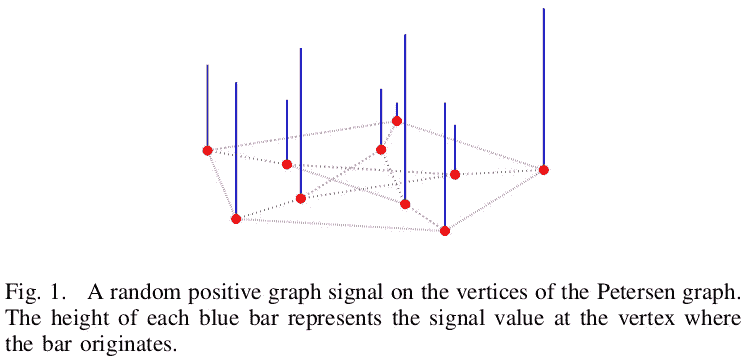

A graph with its signals represented in the spatial domain.

在 GCNs 中，**节点特征和属性用“信号”来表示。**然后，我们可以使用信号处理中的概念从数据中学习。通常，信号不仅仅是节点或边缘特征，而是应用于该特征的功能。

卷积可以通过寻找拉普拉斯图的特征分解来计算。特征分解是一种将矩阵分解成一组特征向量和特征值的方法。这也被称为谱分解，因此称为谱图卷积网络。**计算拉普拉斯的特征向量，返回图形的傅立叶基。**由于计算是在拉普拉斯算子上进行的，因此将有与图节点一样多的特征向量。直接求解分解是密集的，因此许多方法选择近似频谱分解。为了深入了解谱分解，[机器学习大师](http://kulkarni_text/frequency.)有一个关于这个操作的很棒的帖子。

所以总体步骤是:

1.  使用特征分解将图形转换到谱域
2.  对指定的内核应用特征分解
3.  将光谱图和光谱核相乘(像香草卷积一样)
4.  返回原始空间域中的结果(类似于逆 GFT)

关于谱图论的原始论文是这整个图形学习方法家族的灵感来源。这些是最受欢迎的一些。

## [切布涅茨—德费拉德等人](https://arxiv.org/pdf/1606.09375.pdf)

ChebNets 是关于谱图学习的第一篇也是最重要的论文之一。**谱卷积被定义为信号(节点特征/属性)与内核**的乘积。这类似于卷积对图像的操作方式，其中像素值乘以核值。

由拉普拉斯特征值的对角矩阵的**切比雪夫多项式构成的谱卷积中使用的内核。**切比雪夫多项式是一种正交多项式，其特性使其非常擅长于逼近函数等任务。内核由以下等式表示:

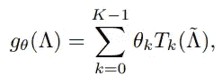

其中 ***gθ*** 为核( ***θ*** 表示切比雪夫系数的向量)应用于***λ***，拉普拉斯特征值的对角矩阵(***λ】***表示缩放拉普拉斯特征值的对角矩阵)。 ***k*** 代表最小阶邻域， ***K*** 代表最大阶邻域。最后， ***T*** 代表***k***阶的切比雪夫多项式。

用简单的英语说:

> 对于从*到 ***K-1*** 的每一阶，核等于应用于缩放拉普拉斯特征值的对角矩阵的所有切比雪夫多项式核的总和。*

*最初的 ChebNet 论文还通过使用**图形处理**介绍了**池化方法**，这是完整普通卷积的另一个关键组件。这个额外的步骤提高了效率，并使图形卷积更接近它们的普通表亲。*

*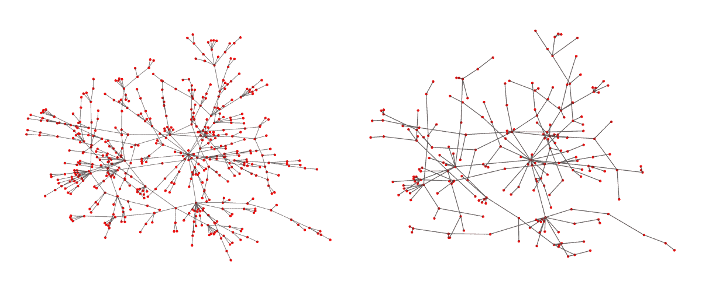*

*Before and after graph coarsening (Courtesy of Andreas Loukas)*

*ChebNet 隐式**避免计算特征值位置，而是选择近似**它。在这方面，ChebNet 与 Thomas Kipf 等人的图卷积网络非常相似[。gcn 本质上是一阶 cheb net(一阶和二阶+在我的](https://medium.com/u/bc6de38fed39?source=post_page-----1faf17dee008--------------------------------)[上一篇文章](/overview-of-deep-learning-on-graph-embeddings-4305c10ad4a4)中有所解释)，并通过一些其他简化操作来降低复杂性。*

***一阶**仅仅意味着用于确定两个节点之间相似性的度量是基于节点的紧邻。**二阶**(以及更高阶)意味着用于确定相似性的度量考虑了节点的直接邻域，但是也考虑了邻域结构之间的相似性(随着每一阶的增加，节点被考虑的深度增加)。在大多数论文中，卷积内被考虑的阶数由**T5 KT7 表示(最小阶数为**K)。*****

*ChebNets 没有将 K 限制为任何值，因此该模型能够学习给定节点的任意阶邻域。然而，gcn 将其 K 值限制为 1，从而将卷积的范围限制为一阶相似性。*

## *[图卷积网络(GCNs)——Kipf 和 Wellin](https://arxiv.org/abs/1609.02907) g*

*在图形学习中被引用最多的作品是 Kipf 和 Welling 的一篇论文。该论文将谱卷积引入了图学习，并被简单地称为“图卷积网络”，这有点误导，因为它被归类为谱方法，而绝不是图学习中所有后续工作的起源。*

*在 Kipf 和 Welling 的 GCN 中，卷积被定义为:*

*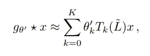*

*eqn. 1*

*其中 ***gθ*** 是一个内核( ***θ*** 代表参数)，它被应用(由星号代表)到***【x】、*** 一个图形信号。 ***K*** 代表要考虑的远离目标节点的节点数(第 ***K*** 阶邻居， ***k*** 为最近阶邻居)。 ***T*** 表示应用于 ***L̃*** 的切比雪夫多项式，其表示如下等式:*

*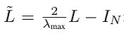*

*eqn. 2 (In the original paper, part of the simplification included assuming ***λ*** ***max = 2***)*

*其中***λ******max***表示 ***L*** 的最大特征值，归一化图拉普拉斯。可以在一个图形上执行多次卷积，输出聚合成 ***Z.****

*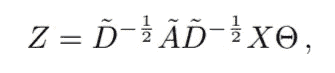*

*eqn. 3*

*其中 ***Z*** 是卷积信号的矩阵(来自相邻节点)*是图的邻接矩阵(加上单位矩阵) ***D*** ̃是从****θ***是核/滤波器参数的矩阵(可以在整个图中共享)，而 **【T21 ***D*** 到 ***-1/2*** 的幂是重正化技巧的一部分，以避免爆炸或消失梯度。*****

***等式 1 和 3 是包含在激活函数(Relu、Sigmoid 等)中的分量。).合并后的结果是构成 GCN 单一图层的分层传播规则。关键的创新是傅立叶变换的使用，傅立叶变换是量子力学(在 Q 比特的研究中)和信号处理(在波的研究中)中的一种流行操作。***

***ChebNets 和 gcn 非常相似，但它们最大的区别在于它们对等式中的值 ***K*** 的选择。1.在 GCN 中，逐层卷积限于 ***K = 1*** 。这是为了**减轻图形局部邻域过度拟合的风险。**Kipf 等人的原始论文进一步解释了这如何使架构相对于拉普拉斯算子呈线性，从而简化了整体模型的复杂性。***

***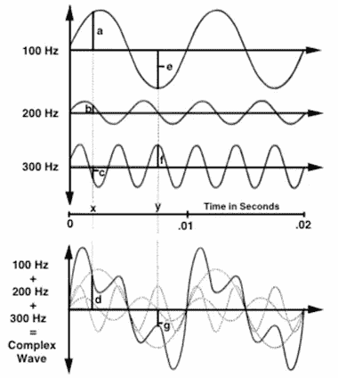***

***Component sound waves coming together to make a single sound (Courtesy of Hearing health matters)***

***在高层次上，GCN 使用图形傅立叶变换来聚合相邻结点的特征和属性。这些特征和属性被表示为信号，这些信号是潜在图的组件分解。这类似于成分频率是声波的分解；分量频率是节点特征(作为信号)，声波信号是潜在图形。***

***gcn 在节点分类任务和其他图形应用中表现良好，但主要缺点是**特征值往往在很小的范围内聚集在一起**，每个聚类之间有很大的间隙。对 ChebNets 来说，这一点可以强调到较低的程度。这个问题后来被 CayleyNets 解决了。***

## ***快速/简化图形卷积([FastGCNs](https://arxiv.org/abs/1606.09375)/[SGCs](https://arxiv.org/pdf/1902.07153.pdf))***

***谱卷积的最大缺点是计算量非常大。内核是在傅立叶空间中定义的，而图形傅立叶变换的计算成本是出了名的高。它需要将节点特征与图拉普拉斯的特征向量矩阵相乘，这是对一个有 N 个节点的图的一个 ***O(N )*** 运算。***

***因此，IBM 研究人员着手解决的问题是，如何在保持最佳结果的同时提高计算效率。[fastcn](https://arxiv.org/pdf/1801.10247.pdf)因此诞生于对可伸缩谱图卷积的需求。该项目基本上修改了原始的 GCN 架构，以便能够使用**蒙特卡罗**(有偏随机抽样方法)方法一致地估计积分，这允许**批量训练，**减少了总的训练时间。***

***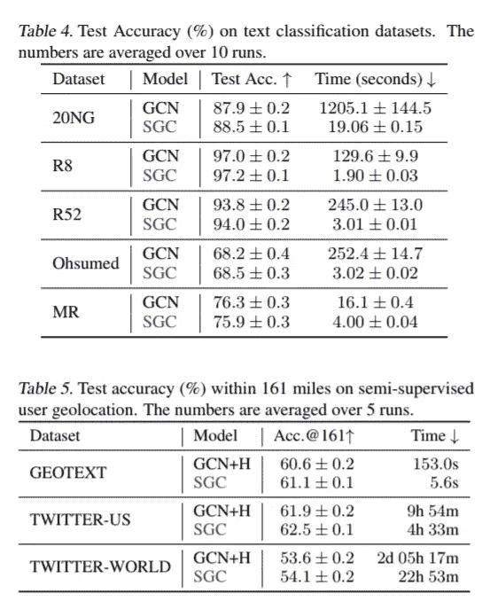***

***另一方面，简化图卷积(SGC)以不同的方式处理这个问题；与其提高计算效率，也许降低计算复杂度才是自然的解决方案。他们的实验结果显示在左边的图表上。他们假设背后的前提是:***

> ***“我们假设 GCN 层之间的非线性并不重要，但大部分好处来自局部平均。”***

***项目**去除了每个卷积层之间的非线性转换函数。**最终的 softmax 激活允许概率输出，可通过随机梯度下降进行优化。***

## ***[凯莱网](https://arxiv.org/abs/1705.07664)***

***CayleyNets 使用一种秘密成分改进了 ChebNet 的高计算开销问题。顾名思义，这种方法使用 **Cayley 变换**(用单位半圆表示)来解决问题。***

***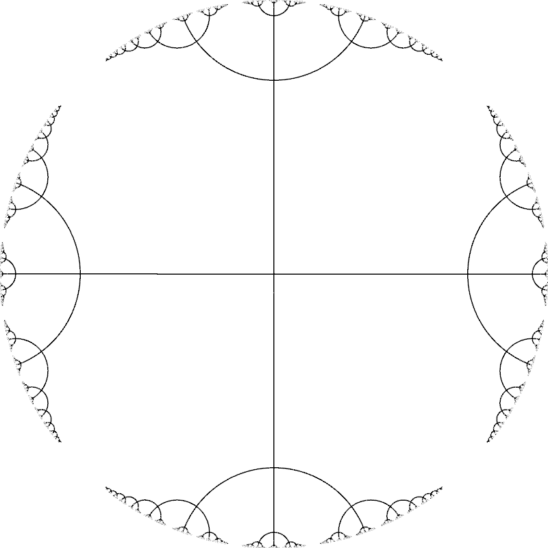***

***Reminds me of fractal visualizations (Courtesy of the globberingmattress blog)***

***在高层次上，转换有助于“放大”倾斜的数据点，如这张古怪的 GIF 所示。***

***Cayley 多项式与 ChebNets 中的 Chebshev 多项式具有相似的性质，包括**定位**的有用概念(注意，在这两种方法中，“多项式”指的是充当内核/滤波器的函数)。***

***Cayley 已被证明在广泛的图形学习任务中表现更好，因为他们能够**在训练期间检测重要的窄频带，并在图形上很好地定位的同时专注于它们。*****

***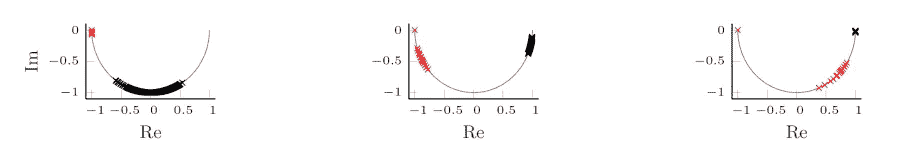***

***由于 Cayley 内核/滤波器中的一个参数( *h* )，频谱上较小的特征值可以分散开来，从而允许**内核专注于不同的频率。**这在原始论文的 3 张图中可以看到，证明了参数(h)的归一化能力，其中标记表示特征值(红色表示保存重要信息)。***

***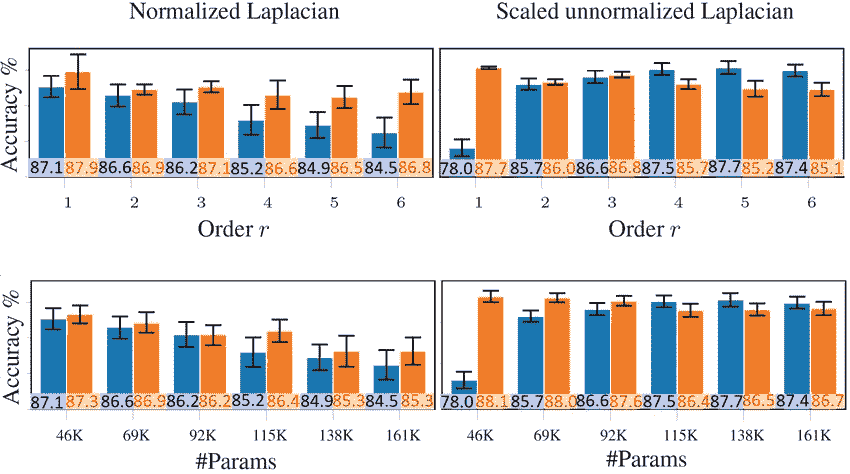***

***Cheb vs Cayley (Courtesy of ResearchGate)***

***并列而言，CayleyNets(橙色)大多优于 ChebNets(蓝色)，同时需要的参数更少。***

## ***[电影](https://arxiv.org/abs/1802.01572)***

***MotifNets 是一种不同的方法，它通过引入“主题”的概念建立在原始 GCN 模型的基础上。本质上，该模式将输入图划分为**个主题，这些主题是 *x* 长度**的唯一子结构，因此数据集中的任何图都可以通过主题的某种组合来构建。***

***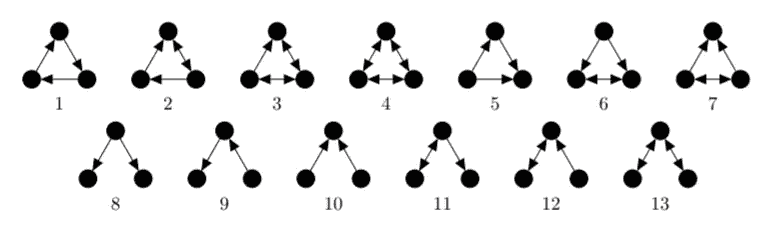***

***The motifs used in the original paper (Courtesy of the MotifNet team)***

***这些图案的尺寸为 x = 3。 注意，主题考虑到了**边的方向性**，这是图论中的一个细节，在以前的图形学习方法中被忽略了。这对于具有内在方向概念的应用程序尤其有用，例如社交网络、交通网络和能源网格。***

***ChebNet 是具有无向图的单个拉普拉斯算子的 MotifNet 的一个实例，其中使用了 Chebyshev 多项式的矩阵。MotifNet 的每个卷积层都有一个**多元矩阵多项式**(一个奇特的内核，其中每个元素都是一个多变量的多项式)，它被应用到 motif 的拉普拉斯矩阵并从中学习。***

***尽管切布内特和 GCN 的效率很高，但这两种方法在处理包含**簇特征值**的图时都有困难，这种现象在社区图中很常见。在这方面，MotifNet 力求修复与 CayleyNet 相同的弱点。***

## ***总体光谱方法***

***稳健、可靠和经过研究的谱卷积从整体上激发了人们对图形学习和几何深度学习的兴趣。甚至 Yann Lecun 和其他研究人员也在这个领域的前沿做出了贡献。***

***然而，谱方法有很多缺点和不足，但那是另一篇文章的主题。***

# ***空间图形卷积网络***

## ***[GraphSage —汉密尔顿等人](https://arxiv.org/abs/1706.02216)***

***GraphSage 的美在于它的简单性。该型号是顶级的，在性能方面保持竞争力，即使是更新或更强大的型号。它特别强大，因为它可以很好地适应大型、密集、同质的动态网络。Graph sage 部分是由 Jure Leskovec 的贡献创建的，他也为本文中的其他各种算法做出了贡献(包括 node2vec)，它是来自斯坦福大学网络分析项目 [SNAP 的许多图形学习算法之一。](http://snap.stanford.edu/)***

***在高层次上，GraphSage 有 3 个步骤:***

*****邻域采样:*****

***首先在图中找到目标节点的近邻。**深度 k 由用户定义，并确定将采样多少个“邻居的邻居”。**这是递归执行的操作，执行设定的步骤数。***

*****聚合:*****

***在图中的每个节点都采样了其各自的邻域后，我们必须**将邻域节点的所有特征汇集到目标节点。**原论文提出 3 个聚合函数***

*   ****平均聚合* —对所有邻域节点特征进行平均(可以是加权平均)***
*   ****LSTM 聚合*-使用 LSTM 单元选择性聚合邻域结点要素(随机排序)***
*   ****池化聚合* —最大池化仅考虑“最高”特性(在实验中表现最佳)***

*****预测:*****

***目标节点使用聚集的邻域节点特征通过神经网络进行预测，这可以是像节点分类或结构/上下文确定这样的任务。这是学习发生的地方。以**监督的方式**对图中的每个节点重复这 3 步过程。该方法的直观表示如下所示:***

***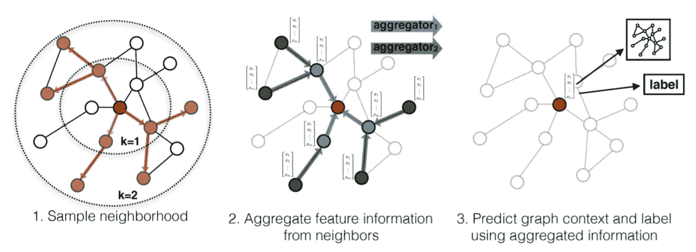***

***GraphSage (Courtesy of the GraphSage research team)***

***实验表明，池化聚合的性能最好，计算效率也最高。GraphSage 的有效性是为什么它是目前在现实世界应用程序中实现的少数图形学习模型之一。照片分享网站 Pintrest 目前使用 GraphSage(尽管经过修改并更名为 PinSage)根据用户的兴趣和搜索查询来预测相关照片。***

## ***[混合模型网络(MoNet)——蒙蒂等人](https://arxiv.org/abs/1611.08402)***

***MoNet 在进一步的研究和开发中取得了很大成功，原始论文成为许多方法和架构的灵感和源泉，包括测地线 CNN(gcnn)、各向异性 CNN(acnn)、样条 CNN 和扩散 CNN。***

***最初的莫奈论文有三重贡献***

1.  ***各种图形学习方法的概括，统一了空间和光谱方法***
2.  ***使用参数核、伪坐标的新方法，与现有模型(各向异性 CNN、测地线 CNN 等)集成***
3.  ***在不同的基准流形、图形和网络上进行的一系列实验***

***莫奈的概括首先根据应用、任务和输入，将变量 ***x*** 视为流形中的点或图中的节点。变量 ***y*** 被认为是相邻的节点或点，其与 d 维空间中的**伪坐标的向量**相关联，使得***【x，y】***是伪坐标，其对于*的每个邻居都有唯一的集合。****

****每个伪坐标通过一个**加权函数**，该函数复制了传统图像卷积核的效果，由此核的每个值乘以当前考虑的值。在 MoNet 的情况下，加权函数是具有可学习参数的内核，它在伪坐标上操作:****

****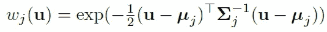****

****其中***σj***是一个可学习的 ***d 乘 d*** 协方差矩阵， ***μj*** 是一个 ***d 乘 1*** 核的均值向量。 ***d*** 是伪坐标向量的尺寸(***【x，y】***)。这些矢量/伪坐标卷积核映射出一些非常有趣的可视化效果:****

***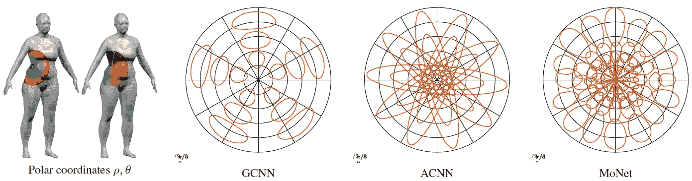***

***The normalized kernels applied to a manifold (Courtesy of the MoNet research team)***

***在 3D 模型上是以它们的流形上的一点为中心的局部极坐标。圆图(代表模型的多色部分)是在流形上的不同卷积运算中使用的**补丁算子加权函数**(内核的奇特说法)。***

***这个**内核只在 MoNet 中学习，而不是在 GCNNs 和 ACNNs 中硬编码。人们可能注意到的第一件事是莫奈的权重(红色曲线)比其他方法更明显(GCNN)和更完整(ACNN)的权重“平滑”了多少。*****

***这些内核可视化将随着 GCNNs 和 ACNNs 的每个独特配置而改变。但是莫奈和 GraphSage 一样，可以学习参数。这种灵活性是两者都允许**跨数据集共享参数的部分原因。**这为像**迁移学习**这样的想法应用到几何领域开辟了空间。图形学习的未来看起来非常棒！***

## ***整体空间方法***

***空间方法更容易掌握，特别是对于大多数人来说，他们对线性代数相关的运算没有很强的直觉，如特征分解、傅立叶变换和其他复杂的数学概念。***

***最近，空间方法获得了越来越多的动力，其潜在原因是另一篇文章的主题。***

# ***本质上***

***在 2010 年至 2012 年期间，由于深度学习领域最优秀的研究人员的共同努力，包括 Yann Lecun(图像卷积)和 Geoff Hinton(反向传播)，卷积神经网络点燃了只有他们看到的深度学习的回归。**有效和高效的图卷积有可能产生这种效果**，将几何深度学习领域推向聚光灯下。***

***谱卷积和空间卷积之间的差异有望得到阐明，最终，这两种方法的特征在于具有如下差异:***

> ***频谱卷积在数学上和理论上与普通卷积相似，而空间卷积在概念上和普通卷积相似。***

***一种方法遵循教科书定义和数学来概括卷积，另一种方法从图论的角度出发。***

***我肯定错过了一堆算法和模型，尤其是最近对几何深度学习和图形学习的兴趣激增，导致几乎每天都有新的贡献出现在出版物上。一些有趣的方法包括像 [Graph U-Net](https://openreview.net/forum?id=HJePRoAct7) 和 [Graph Markov 神经网络](https://jian-tang.com/)这样的项目。还有一些我还没有完全理解的现有模型；但当我做到了，我会更新这篇文章。***

# ***关键要点***

*   ***图形卷积的目的是**将图像卷积运算**推广到图形，以便我们可以达到相似的性能和精度水平。***
*   ***图形卷积不同于图像卷积，因为**图形作为一种具有非欧几里德属性的数据结构与欧几里德图像的集合结构非常不同**。***
*   ***图形学习方法分为两个派别；光谱方法和空间方法。通过检查特征分解和相关操作的使用来确定分类。***
*   ***谱方法试图使用**信号等概念来表示节点特征，并使用傅里叶变换等操作来聚集节点信息**并进行预测。***
*   ***空间方法使用**操作(如消息传递)和表示方法(如伪坐标)来聚合节点**之间的信息并做出预测。***

> *****接下来，我们将深入探讨循环图和基于注意力的方法**🔥***

# ***需要看到更多这样的内容？***

****跟我上*[***LinkedIn***](http://www.linkedin.com/in/flawnson)*[***脸书***](https://www.facebook.com/flawnson)*[***insta gram***](https://www.instagram.com/flaws.non/?hl=en)*，当然还有* [***中***](https://medium.com/@flawnsontong1)*****

****我所有的内容都在* [***我的网站***](http://www.flawnson.com) *我所有的项目都在*[***GitHub***](https://github.com/flawnson)***

****我总是希望结识新朋友、合作或学习新东西，所以请随时联系*[***flawnsontong1@gmail.com***](http://mail.google.com)***

> ***向上和向前，永远和唯一🚀***