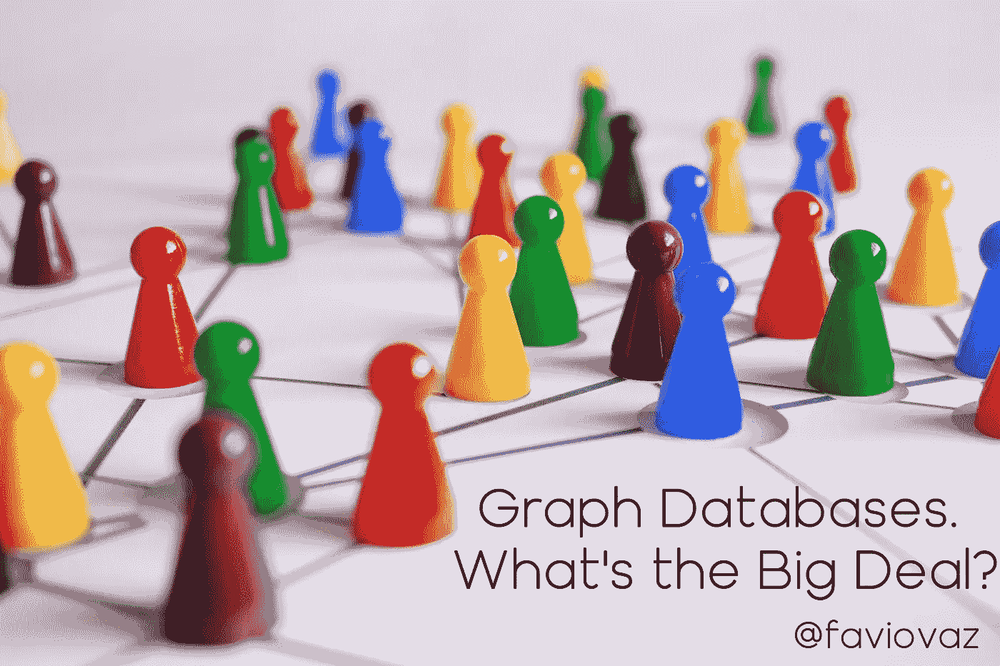
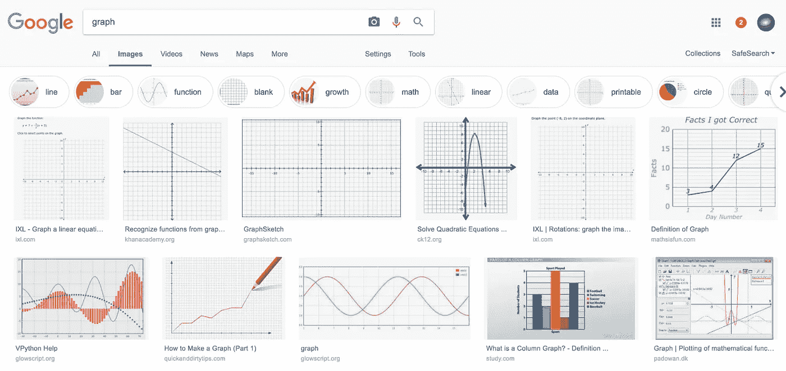
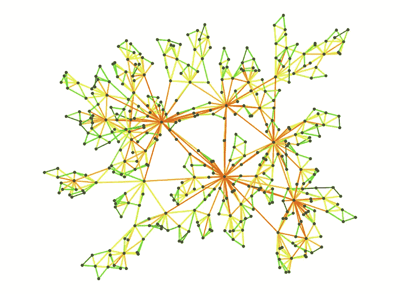
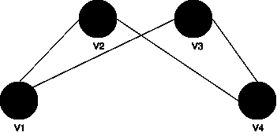
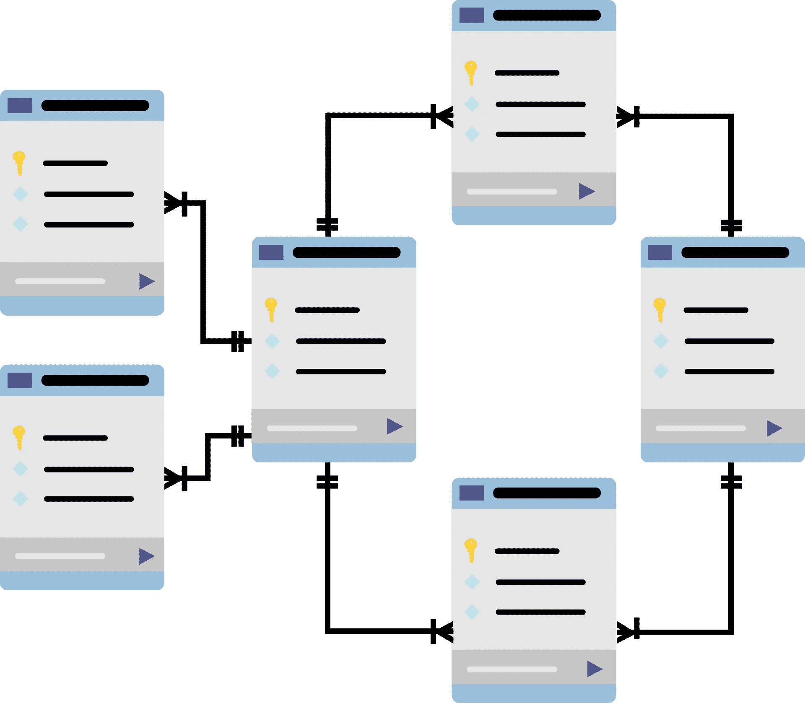
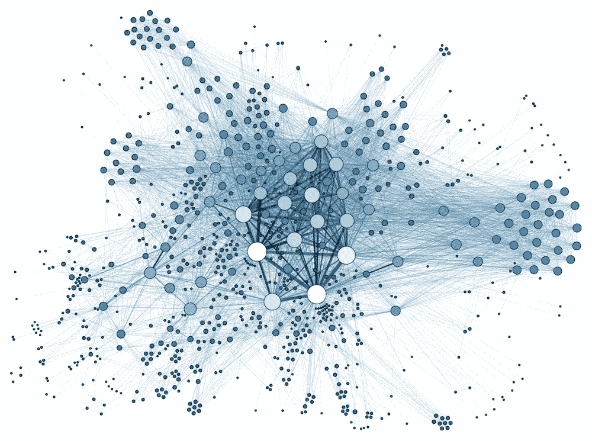
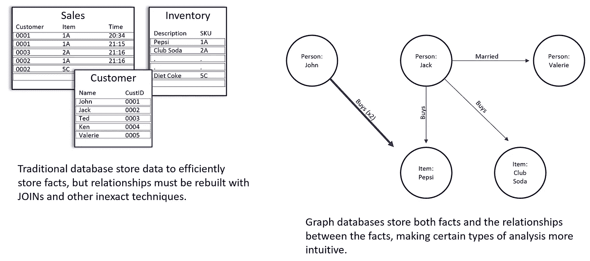
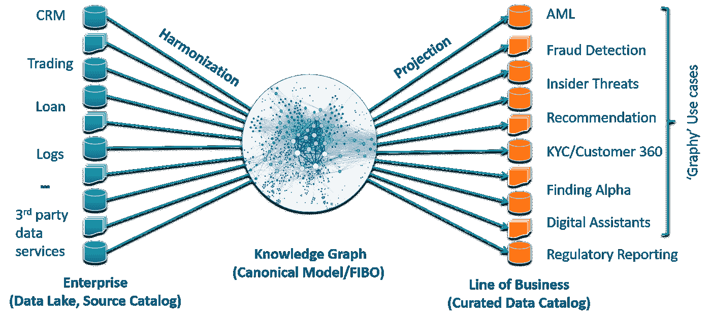
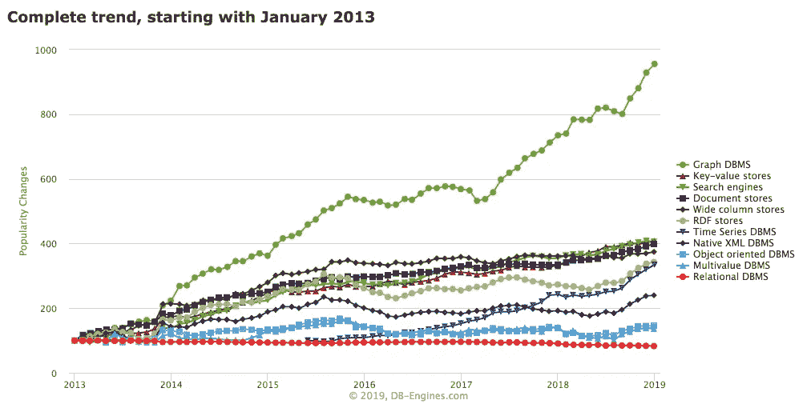
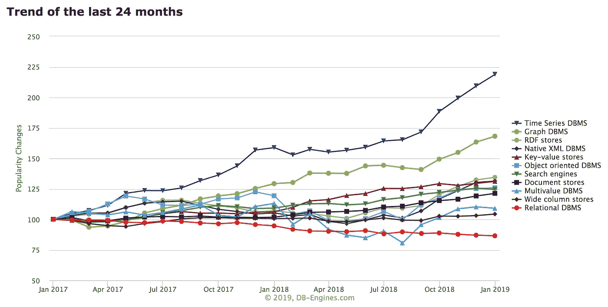

# 图形数据库。有什么大不了的？

> 原文：<https://towardsdatascience.com/graph-databases-whats-the-big-deal-ec310b1bc0ed?source=collection_archive---------2----------------------->

## 继续关于语义和数据科学的分析，是时候讨论图形数据库以及它们能为我们提供什么了。

# 介绍

我们应该把宝贵的时间投入到学习一种吸收、存储和分析数据的新方法上吗？在图表上接触数学？

对我来说，当我开始调查时，答案是不确定的，但过了一会儿，我的答案是:

I’m using a surprising amount of Kenan Thompson’s gifs. Wow.

在本文中，我将讨论图数据库的一些想法和概念，它们是什么，它们的优势是什么，以及它们如何在我们的日常任务中帮助我们。

顺便说一句，我真的厌倦了编写大量的连接和查询来计算 2017 年 1 月至 2018 年 10 月期间在 Y 州购买商品 X 的客户数量(以及他们的平均工资)，并且该客户已经超过 Z 个月了。所以，一切对我有帮助的事情，我想很多人都是这样，在缩短时间，让它变得更简单、更直观方面，我都参与了。

# 什么是图？

This is not the type of graph I’ll be talking about :)

当我们谈论图表时，在英语中有一个问题(在西班牙语中我们没有这个问题)。如果您在线搜索图形图像，您可能会看到以下内容:

google.com

但这不是我想谈论的那种图表。当我在这里谈论一个图表时，这是你应该在脑海中描绘的:

我将给出图的两种定义。首先是数学问题，然后是更简单的问题。

根据贝扎德和沙特兰的说法:

> 图 G 是一个有限的非空集 V 和一个(可能是空集)集合 E(与 V 不相交),集合 E 是 V 的(不同的)元素的二元子集。V 的每个元素称为一个顶点，V 本身称为 G 的顶点集；边集合 E 的成员称为边。我们所说的图的一个元素是指一个顶点或一条边。

图论最吸引人的特征之一在于该学科的几何或图像方面。给定一个图，用图解法表示它通常是有用的，其中集合的每个元素用平面上的一个点表示，每个边用一条线段表示。

把 G 的这种图称为 G 本身是很方便的，因为集合 V 和 E 是容易辨别的。在下图中，图 G 显示了顶点集 V = {V1，V2，V3，V4}和边集 E = {V1V2，V1V3，V2V4，V3V4}

Copyright Favio Vázquez (you can use it of course)

正如你所看到的，集合 V 包含了图中顶点或点的数量，E 包含了它们之间的关系(读作 V1V2，就像 V1 连接到 V2)。

所以简单来说，图是对象(或实体或节点)及其关系(或边)的数学表示。这些点中的每一个都可以代表不同的东西，这取决于你想要什么。顺便说一下，这里节点和顶点的意思是一样的，我们可以互换使用。

当我们使用图形数据库时，我们将回顾一个如何使用它们的例子。

# 什么是数据库？

[https://www.bmc.com/blogs/dbms-database-management-systems/](https://www.bmc.com/blogs/dbms-database-management-systems/)

来自 techopedia:

> 从最一般的意义上来说，数据库是一个有组织的数据集合。更具体地说，数据库是一个电子系统，它允许数据被容易地访问、操作和更新。
> 
> 换句话说，一个组织使用数据库作为存储、管理和检索信息的方法。使用数据库管理系统(DBMS)来管理现代数据库。

你想知道真相吗？根据我的经验，大多数数据库都是:

*   没有组织
*   不易接近
*   不易操纵
*   不容易更新

当我们谈论做数据科学的时候。在更早的年代(比如 20 lol ),维护一个数据库更容易，因为数据简单、更小、更慢。

如今，我们几乎可以在“数据库”中保存我们想要的任何东西，我认为这个定义与另一个概念有关，即**关系数据库。**

在关系数据库中，我们有一组“正式”描述的表，可以从这些表中以许多不同的方式访问或重组数据，而不必重新组织数据库表。基本上，我们有模式，可以在其中存储不同的表，在这些表中，我们有一组列和行，在特定位置(行和列)中，我们有一个观察。

我们在这些表之间也有关系。但它们不是最重要的，它们包含的数据才是最重要的。通常情况下，它们会被画成这样:

[https://towardsdatascience.com/what-if-i-told-you-database-indexes-could-be-learned-6cf8f59bff94](/what-if-i-told-you-database-indexes-could-be-learned-6cf8f59bff94)

# 什么是图形数据库？

[https://www.cbronline.com/enterprise-it/software/graph-technology-data-standby-every-fortune-500-company/](https://www.cbronline.com/enterprise-it/software/graph-technology-data-standby-every-fortune-500-company/)

基于数学图的概念，图数据库包含节点和边的集合。节点代表一个对象，边代表两个对象之间的连接或关系。图形数据库中的每个节点都由表示键值对的唯一标识符来标识。此外，每条边都由一个唯一的标识符定义，该标识符详细描述了起始或结束节点以及一组属性。

我将用一个来自 [Cambidge Semantics](https://blog.cambridgesemantics.com/understanding-graph-databases) 的例子来说明图形数据库是如何工作的。

假设我们有一些存储在本地连锁餐厅的数据。通常，在关系数据库中，您会将客户信息存储在一个数据库表中，将您提供的商品存储在另一个表中，将您的销售额存储在第三个表中。

当我想了解我卖了什么、订购了多少库存以及谁是我的最佳客户时，这很好。但是缺少的是连接组织，项目之间的连接，以及数据库中可以让我充分利用它的函数。

图形数据库存储相同类型的数据，但也能够存储事物之间的联系。约翰买了很多百事可乐，杰克和瓦莱丽结婚了，买了不同的饮料。我不需要运行 JOINs 来了解我应该如何向每个客户进行营销。我可以看到数据中的关系，而不必做出假设并进行测试。

neo4j 的人提到:

> 访问原生图数据库中的节点和关系是一种高效的、恒定时间的操作，允许您在每个内核上每秒钟快速遍历数百万个连接。

关系数据库将高度结构化的数据存储在具有预先确定的列和行的表中，而图形数据库可以映射多种类型的关系数据和复杂数据。因此，图形数据库的组织和结构不像关系数据库那样严格。所有关系都存储在边的顶点中，这意味着顶点和边都可以有与之关联的属性。这种结构允许数据库能够描述不相关的数据集之间的复杂关系。

# 图形数据库的使用

[https://blog.cambridgesemantics.com/why-knowledge-graph-for-financial-services-real-world-use-cases](https://blog.cambridgesemantics.com/why-knowledge-graph-for-financial-services-real-world-use-cases)

您知道吗，2018 年被吹捧为“图形年”，因为越来越多的大型和小型组织最近开始投资图形数据库技术。所以我们并没有走上一条疯狂的道路。

我并不是说我们从关系数据库和 SQL 中了解到的一切都不再适用。我是说，在某些情况下(令人惊讶的是，很多情况下)，使用图形数据库比使用关系数据库更好。

我现在就给你一个建议，告诉你什么时候应该使用图形数据库，而不是其他东西:

*   你有高度相关的数据。
*   你需要一个灵活的模式。
*   您希望有一个结构并构建更接近人们思维方式的查询。

相反，如果您有一个高度结构化的数据，您希望进行大量的分组计算，并且您的表之间没有太多的关系，那么您可能更适合使用关系数据库。

图形数据库还有另一个不明显的优势。它允许你建立一个知识图表。因为它们是图表，知识图表更直观。人们不会用表格来思考，但他们会立刻理解图表。当你在白板上画出一个知识图表的结构时，它对大多数人的意义是显而易见的。

然后你可以开始考虑建立一个[数据结构](/the-data-fabric-for-machine-learning-part-1-2c558b7035d7)，这可以让你重新思考你做机器学习和数据科学的方式。但是这是下一篇文章的素材。

# 在您的公司中实现图形数据库

像传统的 RDBMS 一样，图数据库可以是事务型的，也可以是分析型的。

当你选择你的图形数据库时，选择你的焦点。例如，流行的 Neo4J、 [Neptune](https://aws.amazon.com/neptune/?sc_channel=PS&sc_campaign=acquisition_LATAM&sc_publisher=google&sc_medium=ACQ-P%7CPS-GO%7CBrand%7CDesktop%7CSU%7CDatabase%7CNeptune%7CLATAM%7CEN%7CText&sc_content=Neptune_e&sc_detail=amazon%20neptune&sc_category=Database&sc_segment=293626758636&sc_matchtype=e&sc_country=LATAM&s_kwcid=AL!4422!3!293626758636!e!!g!!amazon%20neptune&ef_id=Cj0KCQiA-JXiBRCpARIsAGqF8wWSufRurR3ftuKalKjGxotD7c2wyKmV2nMriVAtHXUxxjzj7kMm3CoaAt8JEALw_wcB:G:s) 或 [JanusGraph](http://janusgraph.org/) 都专注于事务(OLTP)图数据库。

而类似[的 AnzoGraph](https://blog.cambridgesemantics.com/anzograph-free-preview-on-aws-of-best-in-class-real-time-analytics-graph-olap-product) 是一个分析(OLAP)图形数据库。但是，要小心，您可能需要不同的引擎来运行涉及单个实体的快速查询(例如，Sean 买了什么汽水？)和轮询整个数据库的分析查询。(例如，像肖恩这样的人买一瓶汽水的平均价格是多少？).随着机器学习和人工智能的发展，图 OLAP 数据库变得非常重要，因为许多机器学习算法都是固有的图算法，在图 OLAP 数据库上运行比在 RDBMS 上运行更有效。

在这里，您可以找到不同类型的图形数据库和计算工具的丰富资源:

 [## jbmusso/awesome-graph

### 图形数据库和图形计算工具的精选资源列表

github.com](https://github.com/jbmusso/awesome-graph) 

图形 OLAP 数据库的用例非常多。例如，可以使用 PageRank 算法找到关键的意见领袖和书籍推荐者。此外，进行流失分析以提高客户保留率，甚至进行机器学习分析以确定推动图书销售的五大因素。

如果你想了解为什么以及如何实现一个 OLAP 图表，请看这篇文章:

 [## 如果您没有使用 OLAP 图表，以下是您应该使用的原因

### 越来越多的企业和政府机构已经开始使用 GOLTP 系统来存储和挖掘他们的…

blog.cambridgesemantics.com](https://blog.cambridgesemantics.com/if-youre-not-using-graph-olap-heres-why-you-should) 

# 下一步是什么？

下面的图表(摘自[https://db-engines.com/](https://db-engines.com/))展示了这些类别受欢迎程度的历史趋势。在每个月的排名中，选择每个类别中最好的三个系统，并计算其排名得分的平均值。为了便于比较，初始值被归一化为 100。

Graph databases are getting a lot of attention

Together with Time Series databases, graph databases are on the top.

随着数据源持续快速扩张(非结构化数据增长最快)，寻找基于机器的见解变得越来越重要。

图形数据库为链接不同的数据提供了一个极好的基础设施。图形数据库易于表达数据之间的实体和关系，使程序员、用户和机器更容易理解数据并找到见解。这种更深层次的理解对于成功的机器学习计划至关重要，其中基于上下文的机器学习对于特征工程、基于机器的推理和推断变得越来越重要。

在未来，我将讨论图形数据库如何帮助我们进行机器学习和数据科学。

## 相关文章:

 [## 本体论和数据科学

### 对现有数据的研究如何帮助我们成为更好的数据科学家。

towardsdatascience.com](/ontology-and-data-science-45e916288cc5)  [## 机器学习的数据结构。第一部分。

### 语义学的新进展如何帮助我们更好地进行机器学习。

towardsdatascience.com](/the-data-fabric-for-machine-learning-part-1-2c558b7035d7)  [## 面向大众的深度学习(…和语义层)

### 深度学习现在无处不在，在你的手表里，在你的电视里，在你的电话里，在某种程度上，在你的平台上…

towardsdatascience.com](/deep-learning-for-the-masses-and-the-semantic-layer-f1db5e3ab94b)