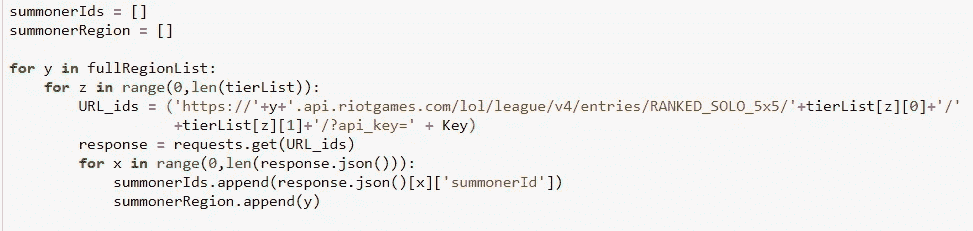

# 冠军推荐的图形网络(英雄联盟)

> 原文：<https://towardsdatascience.com/graph-networks-for-champion-recommendation-league-of-legends-189c8d55f2b?source=collection_archive---------23----------------------->

让我们想象你为暴乱游戏公司工作。你的第一个任务是设计一种在他们的游戏《英雄联盟》中产生冠军(可玩角色)推荐的方法。你会如何处理这个问题？

标准的方法是给每个冠军贴上关键属性的标签，然后根据这些共同属性将他们联系起来。我们可以用这个来假设享有冠军 A 的参与人 1 也会享有相似的冠军 b。

例子:泽德是一名中路刺客，使用近战攻击，并拥有高机动性装备。塔龙也有这些属性，因此如果一号玩家喜欢泽德，我们可以假设他们也会喜欢塔龙。

然而，通过使用图网络，我们可以反过来解决这个问题:如果我们已经知道平均来说享受冠军 A 的玩家享受冠军 B，那么那些目前只玩冠军 A 的玩家将可能享受冠军 B——不管他们共享什么属性。

*例子:经常玩 Zed 的玩家也经常玩 Talon。如果一号玩家只玩泽德，他们可能也会喜欢塔龙。我们可以假设这两个冠军有相似之处——我们只是不需要定义他们是什么。*

你可以在这里找到最终产品:【www.lolnets.com 

# 语境

你可以在这里观看游戏介绍。

你可以在这里阅读更多关于图表的信息。

“节点”=图中的特定点，在此上下文中，“节点”是冠军

“边”=两个节点(冠军)之间的连接。如果没有边缘，两个冠军是不相连的。有时与权重(也称为节点间距离)一起使用。

# **数据采集**

对于任何数据科学问题，第一步都是收集数据。首先，我们需要随机选择一个召唤师的名字。幸运的是，这些都可以通过 Riot API 工具轻松实现。

我们首先创建一个区域和部门列表。为此，我使用了 3 个地区(EUW、北美和韩国)和以下分类:钻石、铂金、黄金、白银和青铜(比例为 1:2:4:4:2)。然后可以使用下面的循环随机创建一个大约 8000 个召唤师 id 的列表。

Loop code used to create a randomised list of Summoner IDs

一旦我们有了这些 id，我们可以再次使用 Riot API 来循环每个召唤师，找到他们的前 5 名冠军。代码下方的表格显示了 5 名随机玩家，他们最常玩的 5 个冠军(显示为冠军 ID)。

Each players Top 5 Champions (using Champion ID)

通过聚集这个数据集，我们可以回答每个冠军的以下问题:当他们出现在玩家的前 5 名名单中时，哪些冠军也最常出现在同一名单中？

这将创建下表:

我们可以看到，对于冠军 1(安妮)，最常见的连接是冠军 103 (Ahri)。用最简单的话来说:对于所有 8000 名选手来说，那些经常打安妮的选手也将比其他任何冠军更经常打 Ahri。

通过另一个简单的循环，我们可以将这个表转换为一个矩阵，其中冠军 ID 1(在 Y 轴上)将连接到 X 轴上的冠军 103、142 和 55。然后再一次，以同样的方式从 X 转置到 y。这将在所有冠军中重复。代码下方是最终矩阵的**说明性示例(非真实数据)**。冠军 id 出现在 X 和 Y 轴上，其中 1 表示两个冠军之间有联系，0 表示没有联系。

数据收集现已完成。

# 图形网络

下一步是创建图形网络，为此，我将使用 NetworkX 根据我们之前保存的矩阵创建图形。然后我们用散景来更详细地观察它。完整代码如下:

这将创建下图:

你可以在这里看到这张图的互动版本[。](https://www.lolnets.com/graph)

节点按泳道着色(黄色:支持，橙色:ADC，蓝色:中间，绿色:丛林，红色:顶部)。由此我们可以得出一些有趣的发现，例如 Thresh/Blitzcrank 往往是由非支援玩家扮演的支援(因为它最接近其他车道组)，而 Soraka 往往是支援主线的首选冠军(因为它最深入支援组)。这个逻辑可以贯穿始终，查看交互图，得出自己的结论！

但是对推荐有帮助吗？答案是依赖。是的，如果你正在寻找你最喜欢的泳道的冠军，不，否则。这是为什么呢？

假设你是一名 ADC main，你可以假设你的前 3 名冠军将围绕以黑色突出显示的橙色部分分组。如果我们使用此图来推荐冠军，可以肯定的是，它只会推荐一小部分最接近 ADC 分组的中间 laners(用蓝色标记)。这不是一个量身定制的建议。它不会从您独特的 ADC 冠军那里获取您的特定玩法，而是简单地将您默认为一个通用 ADC 播放器，并假设您与所有其他 ADC 完全一样。

为了改善这一点，我们需要回到数据收集上来。

# 数据收集 2

这一次，我们正在以不同的方式完成任务。我们不会给每个玩家找前 5 名冠军，我们会给每个玩家找前 3 名冠军*。这意味着，对于每一个冠军，我们也将有共同的连接到每一个车道。*

*循环代码相当长，所以我不会在这里包括它。最后，我们留下了一个矩阵，它包含每个冠军，并将其连接到每个通道中的前 3 名冠军(总共 15 个连接)。除此之外，这些优势现在也将根据他们的平均冠军掌握程度作为该车道的百分比进行加权。*

**举例:如果你是一个打 Thresh (80k 精通)、Blitzcrank (10k 精通)、Pyke (10k 精通)做支援的 ADC 主。然后 Thresh 会给 80%，Blitz 给 10%，Pyke 给 10%。**

*这是反过来计算的:边 A 到 B 权重= 1 —(冠军 B 精通点数/总冠军精通点数)。这样，**越高的**玩家在一条道上掌握的百分比就在冠军身上，**越低的**边权重(也称为节点间距离)。*

# *图形网络 2*

*现在我们有了一个新的方法来处理图网络，我们可以使用相同的代码重新创建图。*

**

*这比之前的要复杂得多。节点之间有大量的连接，权重决定了它们之间的距离。虽然看起来不太舒服，但它现在应该会提供更强的推荐。*

# *推荐引擎*

*最后一部分是制造引擎。为此，我们回到 Riot API。通过插入我们自己的召唤师名字和地区，我们可以调用我们最常玩的冠军列表。我们用我们的干线，用 [Dijkstra 的算法](https://en.wikipedia.org/wiki/Dijkstra%27s_algorithm)来确定从我们的冠军到其他冠军的距离。我们删除任何我们已经经常玩的冠军，按球道分组，瞧——我们会找到最接近我们已经玩过的冠军。*

**举例:我是 AP Mid main，大部分时间玩战斗法师，比如 Vel'Koz 和 Lux。我的首选是 Teemo，我的中间是仙后座，我的支持者是莫甘娜。这是有道理的，我们可能会使用本文开头概述的简单方法到达这里。然而，对于 ADC，我被推荐为 Jhin——这一点我无法解释。我没玩过 Jhin，但是和我一样热爱战斗法师的人玩 ADC 的时候似乎也很享受 Jhin。引用大师自己的话，我的观众在等待！**

*[如需自己的推荐，请点击此处。](https://www.lolnets.com/recommend)*

# *结论*

*谢谢你读到文章最后。我希望这为如何在推荐引擎中使用图网络提供了一些启示。我可能最终会将完整的代码发布到 GitHub 上，但直到我对它的编写方式感到更加自豪。我计划很快将此贴在 Reddit 上，当我这样做时，我会包含链接，请随时在这里或那里留下您的反馈和评论。*

*你已经看到文章的结尾了！我叫 Jack J，是一名将人工智能应用于竞技游戏和电子竞技的专业数据科学家。我是 [**iTero 的创始人。GG**T3](https://itero.gg/)[和**jung . GG**。你可以在](https://www.jung.gg/) [**Twitter**](https://twitter.com/JackJGaming) 上关注我，加入 [**iTero Discord**](https://discord.gg/hZmk3z6adP) 或者给我发邮件 **jack@itero.gg** 。下一场见。*

**最初发表于:*[【https://itero.gg/blog】T21](https://itero.gg/blog)*