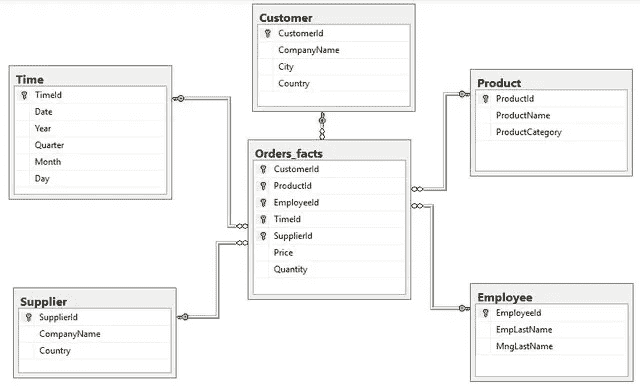
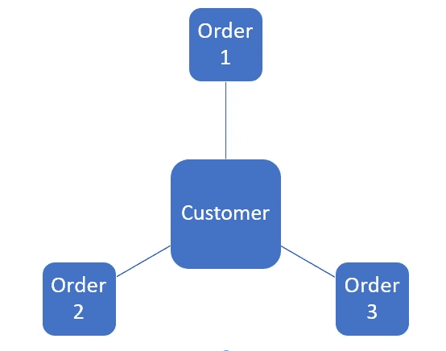
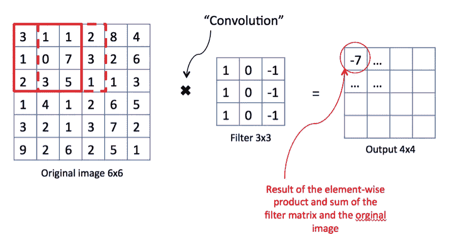
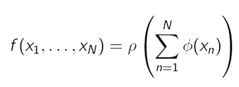
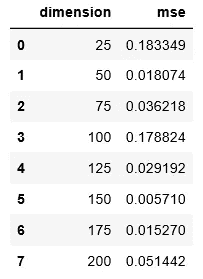

# 图形神经网络与置换不变性

> 原文：<https://towardsdatascience.com/graph-neural-network-and-permutation-invariance-979754a08178?source=collection_archive---------9----------------------->

## 用不变性理论学习图形和关系数据

Photo by [Alina Grubnyak](https://unsplash.com/@alinnnaaaa?utm_source=medium&utm_medium=referral) on [Unsplash](https://unsplash.com?utm_source=medium&utm_medium=referral)

在[之前的一篇帖子](/learning-aggregate-functions-5b4102383433)中，我们讨论了一种学习聚合函数的方法。当分析关系数据时，需要根据未知数量的记录得出结论，这种特殊的需求就出现了。例如，根据交易历史对客户进行分类。更一般的情况是在图上学习，其中我们必须基于连接到当前顶点的顶点的属性以及终止于给定顶点的边的任何属性来预测节点的属性。

举例来说，考虑一个基于交易历史预测客户流失的问题。下面是著名的 Northwind 数据库的 ER 图。

Source: [https://www.researchgate.net/publication/323340741_A_Comparative_Analysis_of_Extract_Transformation_and_Loading_ETL_Process](https://www.researchgate.net/publication/323340741_A_Comparative_Analysis_of_Extract_Transformation_and_Loading_ETL_Process)

这里的挑战是，每个客户有零到多个交易行，因此您不能轻松地为每个客户创建一个只有一行的表格数据集。最常见的方法是生成以某种方式聚合交易的特征，例如，订单计数、所有订单的总金额、上个月的订单数量等。但本着深度学习的精神，我们希望探索的算法能够自己学习这些功能，而不是依赖手工制作的功能。

很容易看出，实体关系可以用图来表示。例如，Northwind 数据库具有以下图形结构:

事实上，图可以很容易地表示实体关系，同时也能够表示更复杂的结构，这些结构不容易用关系数据库来表示。图形表示也使问题更加清晰。给定这个图，我们如何卷起所有相邻顶点的属性，并预测给定其连接的顶点的重要属性。

这个领域的研究已经进行了很长时间。参见[1]中关于神经网络方法的一篇很好的综述，或者如果你更喜欢内核方法，你可以查看[2]。这里我们将集中于神经网络方法，更具体地说，集中于卷积图神经网络。这些网络的灵感来自卷积神经网络(CNN)，它彻底改变了计算机视觉领域。你可以在下面看到 CNN 的基本构件——卷积滤波器:

Source: [https://medium.com/machine-learning-bites/deeplearning-series-convolutional-neural-networks-a9c2f2ee1524](https://medium.com/machine-learning-bites/deeplearning-series-convolutional-neural-networks-a9c2f2ee1524)

应用滤波器，我们可以学习图像的基本特征，堆叠多个卷积层，连同池和其他层，我们可以使用反向传播的能力来学习卷积滤波器的所有参数。这是图形神经网络的目标，其中标签可以分配给顶点、边或子图。

然而有一点不同。CNN 允许来自不同方向的不同贡献，而卷积图神经网络将相同的贡献层分配给所有相邻节点。就好像卷积滤波器只允许卷积矩阵的所有元素具有相同的值。以上面的客户流失为例。典型的图形神经网络将激活函数(或几层神经网络)应用于每个相邻节点，然后取输出的总和，并将其添加到节点的特征，可选地应用另一个变换函数。

这实际上对大多数图表都有意义。如果您再次查看客户订单节点图，您会注意到，如果我们切换任意两个订单节点，客户节点没有任何变化。这个性质被称为不变性，从[3]开始，人们对这个话题有了一定的兴趣。

置换对称对多元函数 f()施加了一个约束。通常，它可以用对称群的不可约表示来分解(因为置换群在形式上是已知的)。然而，有一种更简单的方法来表示这个函数，使用[Kolmogorov–Arnold 表示定理](https://en.wikipedia.org/wiki/Kolmogorov%E2%80%93Arnold_representation_theorem)。它陈述了如果 *f* 是多元连续函数，那么 *f* 可以写成单变量连续函数的有限合成和加法的二元运算。更具体地说，

从某种意义上说，他们证明了唯一真正的多元函数是和，因为其他所有函数都可以用一元函数和求和来编写。如果函数 f 是置换不变的，那么公式可以进一步简化:

这与卷积图神经网络中使用的公式完全相同。请注意， **φ** 是 x 的多维函数。本质上，上面的公式将一维 x 映射到多维向量，然后对每个相邻节点的向量求和，并使用函数 **ρ再次映射到一维值。**在【4】中已经证明，对于标量 x， **φ** 的维数必须至少为 N，以便能够逼近任何函数。这是通用逼近定理的图形版本。对我们来说，这意味着我们必须使用 **φ** 的维数至少作为每个客户的最大订单数。然而，可以使用更低的维数，但是在这种情况下，不能保证收敛。

我们将运行一个实验，并尝试获得不同维度值 **φ** 的模型性能。我们将近似`max`函数，众所周知，使用连续函数很难近似。我们将遵循与之前的 Jupyter 笔记本相同的方法:

我们将在这个实验中使用合成数据。我们假设有 100 个客户，他们的订单数量各不相同。我们将看看是否能成功地了解每个客户的最大订单金额。

首先我们会做一些探索性的数据分析。我们将看到最大订单金额在客户中的分布。

我们将遵循与前一篇文章几乎相同的代码，但是使用更多的隐藏层，因为 max()函数不容易学习，因为它的层很少

现在让我们尝试探索潜在空间维度的不同值的模型性能

总的来说，我们得到了相当低的 MSE。似乎神经网络很好地拟合了数据。我们还可以观察到，对于 100 维潜在空间，我们得到了 MSE 的意外尖峰。但是对于高于 125 的维度，该模型给出了极好的结果，但是即使对于更低的维度，该结果也是可接受的。它证实了[4]的论点，即尽管存在理论上的限制，但实际上潜在空间的维度可以显著低于，并且在实践中仍然给出良好的结果。有可能模型过拟合，因为由于几个隐藏层，我们有这个模型的许多参数。需要进一步的研究来调整它，选择最佳的激活函数和模型结构。

## 结论和下一步措施

奇怪的是，对图形或关系结构的学习并没有引起应有的关注。这很奇怪，因为大多数业务数据库都是关系型的，而大多数大数据系统都是在图形和关系型方法中获得优势的。然而，大多数机器学习算法都采用严格的表格格式，即使是可选数据也会给大多数算法带来问题。的确，您可以将图形嵌入作为一种策略，从图形数据中生成一个表格数据集。但是在这种情况下，我们失去了反向传播的能力。基于 CNN 的图模型是一个活跃的研究领域，最近关于置换不变性的理论研究证明了这些模型的坚实的理论基础。

我对这个话题感兴趣的原因之一是，大约一周后我将去 NIPS，我希望有机会在那里见到图形和关系学习以及置换理论的研究人员。如果你也打算参加 NIPS，请随时与我联系。与此同时，像往常一样，你可以在[我的 github 库](https://github.com/mlarionov/machine_learning_POC/blob/master/aggregate_functions/kolmogorov_arnold.ipynb)中找到这款笔记本的所有代码。

## 参考资料:

1.  韩综等人。艾尔。，关于图神经网络的综合综述，arXiv:1901.00596v3 [cs。LG]2019 年 8 月 8 日
2.  克里格等人。艾尔。，关于图核的综述，arXiv:1903.11835v1 [cs。2019 年 3 月 28 日
3.  Zaheer 等人。艾尔。，深套，arXiv:1703.06114v3 [cs。2018 年 4 月 14 日

4.瓦格斯塔夫等人。艾尔。，论集合上表示函数的局限性，arXiv:1901.09006v2 [cs。2019 年 10 月 7 日