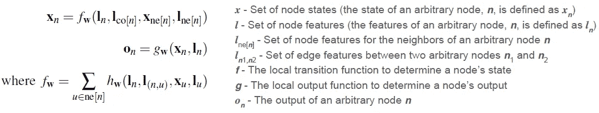
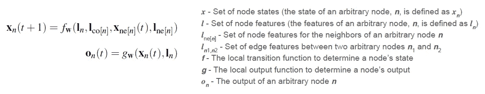
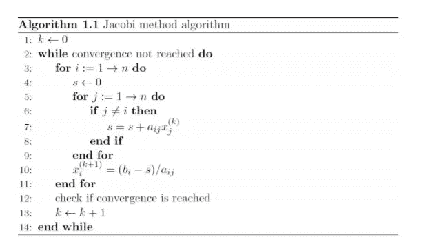
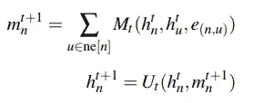
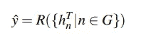
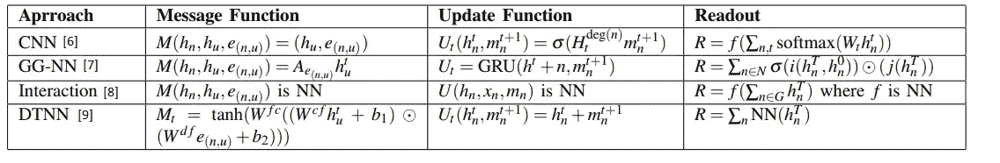

# 图形神经网络是如何工作的？

> 原文：<https://towardsdatascience.com/graph-neural-networks-20d0f8da7df6?source=collection_archive---------5----------------------->

图形神经网络(GNNs)作为一种有趣的应用出现在许多问题中。最显著的是在化学和分子生物学领域。在这个领域产生影响的一个例子是 [DeepChem](https://deepchem.io/) ，一个使用 GNNs 的 pythonic 库。但是它们到底是如何工作的呢？

# gnn 是什么？

典型的机器学习应用将把图形表示预处理成实值向量，这又丢失了关于图形结构的信息。GNNs 是信息扩散机制和神经网络的组合，代表一组转移函数和一组输出函数。信息扩散机制定义为节点更新它们的状态，并通过向它们的邻居节点传递“消息”来交换信息，直到它们达到稳定的平衡。该过程首先涉及一个转移函数，该函数将每个节点的特征、每个节点的边特征、相邻节点的状态和相邻节点的特征作为输入，并输出节点的新状态。斯卡塞利等人 2009 年[1]提出的原始 GNN 使用了离散特征，并将边和节点特征称为“标签”。然后，该过程涉及一个输出函数，该函数将节点的更新状态和节点的特征作为输入，为每个节点产生一个输出。

The localized functions for GNNs. Equation 1 from [1]

定域跃迁和输出函数都是被学习的参数微分函数。为了找到唯一的解，文献[1]的作者使用了 Banach 不动点定理和 Jacobi 迭代方法来以指数速度计算节点的状态。

## Banach 不动点定理和 Jacobi 方法

这个 [Banach 不动点定理](https://en.wikipedia.org/wiki/Banach_fixed-point_theorem) (BFP)陈述了一个方程组存在唯一的解，并提供了一种计算这些不动点的方法。如果假设一个度量空间 **X** ，那么**T:X→XT7 的 mpping 称为 ***X*** 上的收缩映射，其中*在 ***X*** 中承认一个唯一的不动点 *x** (例如 ***T*** *GNN 中的转移函数被假设为相对于节点状态的压缩映射。因为 BFP 保证了唯一的解，所以作者使用雅可比迭代法来计算不动点解，即节点的状态。[雅可比方法](https://en.wikipedia.org/wiki/Jacobi_method)迭代求解算法，首先将近似值代入，然后迭代直至收敛。****

****

**Equation 5 from [1]**

****

**From Kacamarga, M. F., Pardamean, B., & Baurley, J. (2014)**

**这种计算由一个网络来表示，该网络由计算转换和输出函数的单元组成。下图显示了编码网络及其展开的表示。当转移函数和输出函数由前馈神经网络(NN)实现时，编码网络成为[递归神经网络](https://en.wikipedia.org/wiki/Recurrent_neural_network)，一种 NN，其中节点之间的连接沿着时间序列形成有向图。这些类型的网络最常用于处理输入序列。所得网络中的每一层对应于一个时刻，并且包含编码网络的所有单元的副本，而层之间的连接取决于原始的编码网络连通性。**

****

**Figure 3 From [1].**

**如上所述，每个反向传播步骤都需要存储单元的每个实例的状态，对于大型图形，所需的内存可能相当大。 [Almeida-Pineda 算法](https://en.wikipedia.org/wiki/Almeida%E2%80%93Pineda_recurrent_backpropagation)【3，4】用于帮助减少这种情况，通过假设等式 5(如上所示)在梯度计算之前已经达到稳定点，可以通过仅存储 ***x*** 来执行随时间的反向传播，因为它不期望随着 t 的改变而改变。关于这方面的更多细节，我推荐看他们提供证明和数学公式的原始论文。**

# **消息传递神经网络(MPNN)**

**由于人们对 GNNs 在化学和分子研究中的应用越来越感兴趣，[5]为 GNNs 制定了一个框架，并将以前的研究转换成这种格式作为说明。主要区别是:**

*   **不假设边特征是离散的**
*   **两个阶段:消息阶段和读出阶段，其中读出阶段是新的**

****

**Message Phase: Message and Update function from [5]**

**消息阶段与组合的转换函数和输出函数同义，其中 ***M*** 是转换函数，而*是输出函数。读出阶段是所有节点状态的函数，并输出整个图形的标签。***

******

***Readout Phase: Readout function from [5]***

***作者展示了以前的 GNN 方法是如何在 MPNN 框架中形成的，显示了它的多功能性。***

******

***Formulating previous GNN approaches into the MPNN framework [5].***

# ***谁在使用 MPNNs？***

***MPNN 正被用于进一步的研究，如图像分割、位置图、化学/分子图、自然语言处理等。这些方法中的许多已经解决了 gnn 固有的平坦性、不学习图的分层表示以及如果不正确处理的话计算量大的问题。在一篇将 MPNN 应用到他们工作中的论文的文献综述中，对最初的 MPNN 框架最常见的改变是子图的使用。这有助于研究人员在某些情况下减少计算，以及在整个图形中表示分层图形关系。***

***希望这一领域的研究将继续下去，并能够扩展到更大的具有更动态交互的图形。这将允许对可区分的大型社交网络的进一步建模方法。***

# ***参考***

***[1]g .蒙法迪尼，Ah Chung Tsoi，m .哈根布奇纳，f .斯卡塞利和 m .戈里(2008 年)。图形神经网络模型。神经网络汇刊，20(1)，61–80。[https://doi.org/10.1109/tnn.2008.2005605](https://doi.org/10.1109/tnn.2008.2005605)***

***[2] Kacamarga，M. F .，Pardamean，b .，和 Baurley，J. (2014 年)。mapreduce 框架下共轭梯度法和雅可比法算法的比较。*应用数学科学*， *8* (17)，837–849。***

**[3]皮内达，法官，1987 年。反向传播推广到递归神经网络。物理评论快报，59(19)，第 2229 页**

**[4]阿尔梅达法律出版社，1987 年。组合神经网络中带反馈的异步感知器的学习规则**

**[5] Gilmer，j .，Schoenholz，S. S .，Riley，P. F .，Vinyals，o .，& Dahl，G. E. (2017 年)。量子化学的神经信息传递。从 http://arxiv.org/abs/1704.01212[取回](http://arxiv.org/abs/1704.01212)**

**[6] D. Duvenaud，D. Maclaurin，j . Aguilera-iparaguirre，R. GmezBombarelli，T. Hirzel，A. Aspuru-Guzik 和 R. P. Adams，“用于学习分子指纹的图形卷积网络”，2015 年**

**[7] Y. Li，D. Tarlow，M. Brockschmidt，R. Zemel，“门控图序列神经网络”，2015 年。**

**[8] P. W .巴塔格利亚和 m .赖，“学习物体、关系和物理学的互动网络 arXiv : 1612。00222v1 [ cs。2016 年 12 月 1 日。”**

**[9] K. T. Schutt，F. Arbabzadah，S. Chmiela，K. R. M uller 和 A. Tkatchenko，“来自深度张量神经网络的量子化学见解”，《自然通讯》，第 8 卷，第 13890 页，2017 年。**