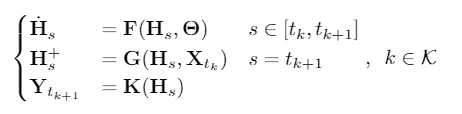

# 图形神经常微分方程

> 原文：<https://towardsdatascience.com/graph-neural-ordinary-differential-equations-a5e44ac2b6ec?source=collection_archive---------18----------------------->

## 将图形神经网络扩展到连续深度域

[Rayleigh–Bénard](https://en.wikipedia.org/wiki/Rayleigh%E2%80%93B%C3%A9nard_convection) convection. [Finite element methods](https://en.wikipedia.org/wiki/Finite_element_method) discretize spatially continuous problems into sets of entities that display complex inductive relational biases. Source: [original author](https://www.youtube.com/watch?v=OM0l2YPVMf8&t=74s.).

多智能体系统普遍存在于各种科学领域:从[物理学](https://en.wikipedia.org/wiki/N-body_simulation)到[机器人学](https://en.wikipedia.org/wiki/Swarm_robotics)，[博弈论](https://en.wikipedia.org/wiki/Auction_theory)，金融和分子生物学，等等。通常，封闭形式的分析公式是不可用的，并且预测或决策任务不得不依赖于有噪声的、不规则采样的观察。

这类系统提供了一个清晰的归纳关系偏差的例子。在统计学或机器学习中引入归纳偏差是一种众所周知的提高样本效率和泛化性能的方法。从目标函数的选择，到适合手头具体问题的特定深度学习架构的设计，偏见是普遍而有效的。

关系归纳偏差[1]代表一类特殊的偏差，涉及实体之间的关系。概率或其他图形模型是一类传统的模型，专门以先验结构的形式对实体施加关系偏差。这些图结构在不同的方面是有用的；即通过引入条件独立性假设来降低计算复杂度，以及通过以图形形式编码先验知识来提高样本效率。

图形神经网络(GNNs)是图形模型的深度学习对应物。当目标问题结构可以被编码为图时，或者在关于输入实体之间的关系的先验知识本身可以被描述为图的设置中，通常使用它们。GNNs 已经在各种应用领域显示出显著的结果，例如节点分类[2]，图分类和预测[3][4]以及生成任务[5]。

## 深度学习中的常微分方程

另一类不同但同样重要的归纳偏差与收集数据的系统类别有关。尽管深度学习传统上是由离散模型主导的领域，但最近的进展提出了将神经网络视为配备有连续层的模型[6]。该视图允许将正向传递重新表述为常微分方程(ODE)的[初始值问题](https://en.wikipedia.org/wiki/Initial_value_problem)的解决方案。这种假设允许对微分方程直接建模，并提高神经网络在涉及连续时间过程的任务中的性能。

我们的工作旨在弥合几何深度学习和连续模型之间的差距。*图形神经常微分方程* (GDEs)将图形结构数据上的常见任务投射到系统理论框架中:

GDEs model vector fields defined on graphs, both when the structure is fixed or evolves in time. This is achieved by equipping the model with a continuum of GNN layers.

GDEs 提供了灵活性，因为它们的结构是由连续的 GNN 层定义的，因此可以适应不规则采样的顺序数据。

GDEs 的主要目的是为结构化系统的建模提供一种数据驱动的方法，特别是当动态特性是非线性的，因而难以用经典或分析方法处理时。

下面是对 GDEs 的介绍。我们参考完整的[论文](https://arxiv.org/abs/1911.07532)以获得更多的细节和推导。一个 [github 知识库](https://github.com/Zymrael/gde)目前正在开发中，它以注释 Jupyter 笔记本的形式提供了一些介绍性的例子。我们鼓励请求/建议 GDEs 的额外应用:我们计划最终包括所有主要*图形神经网络* (GNN)架构的 GDE 变体的工作示例，部署在各种设置(预测、控制……)

## **准备工作和背景**

GDEs 和 GNNs 一样，对 [*图*](https://en.wikipedia.org/wiki/Graph_(discrete_mathematics)) *进行操作。*我们参考了 GNNs 的优秀[调查以及我们论文](https://arxiv.org/abs/1901.00596)中的[背景部分，以获得关于符号和基本定义的更详细介绍。接下来的 GDE 介绍是经过提炼的，只有两个关于图的基本事实是必须的:](https://arxiv.org/abs/1911.07532)

1.  图是由边连接的节点(实体)的集合。深度学习模型通常在*属性图、*上工作，属性图是其节点由一组特征描述的图(通常以嵌入向量或张量的形式)。对于具有 **n** 个节点的图，每个节点由 **d** 个特征描述，我们将**n***x****d***个节点的嵌入矩阵表示为 **H** 。
2.  图的结构通过其邻接矩阵 **A.** 节点之间的连接结构代表了标准深度学习模型和 GNNs [1]之间的主要区别，因为后者以各种方式直接利用它来执行节点嵌入操作。

# 图形神经常微分方程

A ***G*** *raph 神经普通* ***D*** *微分****E****quation*【GDE】定义如下:

General GDE formulation

其中 **H** 是节点特征矩阵。以上为 **H** 定义了一个向量场，由函数 **F** 参数化，该函数可以是任何已知的*图形神经网络* (GNN)层。换句话说， **F** 利用图 ***G*** 的连通性信息，以及它的节点特征，来指定***【S】****中 **H** 的演化，这里***S*** 是模型的深度域； ***S*** 是连续的，不同于深度域由自然数子集指定的 GNNs，代表由 **F** 定义的常微分方程的*积分域*。GDEs 可以用多种方式训练，很像标准的神经微分方程[6]。[系统的适定性](https://en.wikipedia.org/wiki/Well-posed_problem)在[论文](https://arxiv.org/pdf/1911.07532.pdf)中有完整的讨论。*

*一般的 GDE 公式带有几个含义。在一般神经微分方程的情况下，已经观察到离散化方案的选择可以描述先前已知的 ResNets 的离散多步变量[7]。因此，深度学习的连续、动态系统观点不限于微分方程的建模，并且可以通过利用丰富的[数值方法](https://en.wikipedia.org/wiki/Numerical_methods_for_ordinary_differential_equations)文献来指导新的通用模型的发现。*

*与 ResNets 相比，gnn 作为一个模型类相对年轻。因此，具有复杂的、类似分形的剩余连接的多级或变体的文献并不发达；新 GNNs 变体的发现可以通过将各种离散化方案应用于 GDEs 来引导，而不是从零开始。*

## *静态图的结果:节点分类*

*通过在 Cora、Pubmed 和 Citeseer 上进行的一系列半监督节点分类实验，我们证明了 GDEs 可以作为高性能的通用模型。这些数据集包含*静态图*，其中邻接矩阵 **A** 保持固定，因此远离 GDEs 大放异彩的动态系统设置。我们评估*图卷积常微分方程* (GCDEs)的性能，定义为:*

**

*GCDE model. A more detailed version is included in our paper, along with GDE versions of popular GNN variants*

*以及它们完全离散化的对等物 [*图卷积网络*](https://tkipf.github.io/graph-convolutional-networks/)【GCN】【8】。我们包括著名的*图形注意网络*(GAT)【9】以供参考:*

**

*Accuracy on node classification tasks. Mean and standard deviation of 100 runs.*

*GCDEs 与最先进的模型相比具有竞争力，并且优于它们的离散对应物。我们评估了两个版本的 GCDEs:采用固定步长方案离散化的[龙格-库塔](https://en.wikipedia.org/wiki/Runge%E2%80%93Kutta_methods)4(GCDE-rk4)，以及自适应步长方案[Dormand-Prince](https://en.wikipedia.org/wiki/Dormand%E2%80%93Prince_method)(GDDE-DP r5)。固定步长离散化不能确保 ODE 近似保持接近解析解；在这种情况下，解决一个适当的 ODE 是没有必要的，GCDE-rk4 只是为 GCNs 提供了一个计算有效的 fractal net-like 结构，以提高准确性。*

**

*Training loss and accuracy on Cora. Shaded area is the 95% confidence interval*

*另一方面，使用自适应分步求解器训练 GCDEs 自然会比使用普通 GCNs 得到更深的模型，后者的层深度会大大降低性能。在我们的实验中，我们成功地用多达 200 个 ODE *函数评估* (NFE)训练了 GCDE-DP r5，这是一个比普通 gcn 可能的图形计算量高得多的计算量，其层深度大大降低了性能。应该注意的是，gde 不需要比它们的离散对应物更多的参数，因为事实上它们在函数计算中重用它们的参数。有趣的是，自适应步长几何微分方程似乎不受节点特征过度平滑的影响。过度平滑问题[10]阻碍了深度 gnn 在各种领域的有效使用，特别是*多智能体强化学习*(MARL)；我们目前正在探索 GDEs 的这一特性，并将很快包括更详细的分析。*

# *时空 GDEs*

*GDEs 的一个关键设置涉及时空图形数据。当处理*图序列时，*GNNs 的递归版本是必要的[11][12]。然而，与常规递归神经网络(RNNs)及其变体非常相似，固定离散化不允许对不规则采样数据进行操作。这一事实推动了 RNNs 形式的进一步发展，RNNs 具有到达时间之间的动力学的先验假设[13]以及 RNN 的 ODE 版本[14]。*

*在涉及时间分量的场景中，GDEs**T3S**的深度域与时间域一致，并且可以根据需要进行调整。例如，给定时间窗**δt**，由 GDE 执行的预测采用以下形式:*

**

*不考虑具体的 GDE 架构。GDEs 代表了用于图序列的自回归建模的自然模型类，并且自然地导致以 [*混合动态系统*](https://en.wikipedia.org/wiki/Hybrid_system) *，*形式的经典时空体系结构的扩展，即以相互作用的连续和离散时间动态为特征的系统。核心思想是让 GDE 平滑地操纵两个时刻之间的潜在节点特征，然后应用一些离散算子，导致节点特征的跳跃 **H** ，然后由输出层处理。*

*给定一组时刻 **{(t ₖ)}** )和一个状态图数据流 **{(X ₜ，G ₜ)}** )自回归 GDEs 的一般公式为:*

**

*Autoregressive GDE. Continuous variants of known spatio — temporal GNN models can be obtained from this system by choosing appropriate **F**, **G**, **K***

*其中 **F** 、 **G** 、 **K** 为类 GNN 算子或一般神经网络层， **H** **⁺** 代表离散转换后 **H** 的值。系统的演化可以通过[混合自动机](https://en.wikipedia.org/wiki/Hybrid_automaton)来可视化:*

**

*Hybrid automata schematic of autoregressive GDEs.*

*与仅配备离散跳跃的标准递归模型相比，自回归 GDEs 在跳跃之间结合了潜在节点特征的连续流 **H** 。自回归 GDEs 的这一特性允许它们从不规则的观测中跟踪动力系统。 **F** 、 **G** 、 **K** 的不同组合可以产生最常见的时空 GNN 模型的连续变量。*

*为了评估自回归 GDE 模型在预测任务中的有效性，我们在已建立的 [PeMS 流量数据集](https://dot.ca.gov/programs/traffic-operations/mobility-performance-reports)上进行了一系列实验。我们按照[15]的实验设置进行额外的预处理步骤:对时间序列进行欠采样，每个条目的移除概率为 0.7，以模拟具有不规则时间戳和缺失值的挑战性环境。*

*为了测量 GDEs 在使用连续时间系统生成的数据的设置中获得的性能增益，我们采用了 GCGRU 及其离散副本 GCGRU [12]，并且我们将结果与香草 GRU 度量联系起来。对于考虑中的每个模型，我们收集 [*归一化的 RMSE*](https://en.wikipedia.org/wiki/Root-mean-square_deviation#Normalized_root-mean-square_deviation) (NRMSE)和 [*平均绝对百分比误差*](https://en.wikipedia.org/wiki/Mean_absolute_percentage_error) (MAPE)。在我们的[论文](https://arxiv.org/abs/1911.07532)中可以找到关于所选指标和数据的更多细节。*

*时间戳之间的非恒定差异导致对单个模型的预测任务具有挑战性，因为平均预测范围在训练和测试过程中会发生剧烈变化。为了在模型之间进行公平的比较，我们将增量时间戳信息作为 GCGNs 和 GRUs 的附加节点功能。*

**

*Results of irregular data forecasting task. Mean and standard deviation across 5 training runs.*

*由于 GCDE-GRUs 和 GCGRUs 被设计为在结构和参数数量上相匹配，我们可以测量出 NRSME 的性能提升 **3%** 和 MAPE 的性能提升**7%****。具有连续动态和不规则数据集的各种其他应用领域可以类似地受益于采用 GDEs 作为建模工具:医学、金融或分布式控制系统，仅举几例。我们正在这些领域进行更多的实验，欢迎提出请求、想法或合作。***

## ***结论***

***如前所述，我们目前正在开发一个 [github 库](https://github.com/Zymrael/gde)，里面有一系列不同类型 gde 的例子和应用。***

***我们鼓励请求/建议 GDEs 的其他应用:我们计划最终包括所有主要*图形神经网络* (GNN)架构的 GDE 变体的工作示例，部署在各种设置(预测、控制……)。我们的论文在 arXiv 上有预印本:如果你觉得我们的工作有用，可以考虑[引用我们](https://arxiv.org/abs/1911.07532)。***

*****参考文献:*****

***[1] P. W .巴塔格利亚等人，关系归纳偏差、深度学习和图形网络。arXiv 预印本 arXiv:1806.01261，2018。***

***[2] J .阿特伍德和 d .陶斯利扩散卷积神经网络。神经信息处理系统进展，1993–2001 页，2016 年。***

***[3]崔志勇、亨瑞克森、柯和王。交通图卷积递归神经网络:网络规模交通学习和预测的深度学习框架。arXiv 预印本 arXiv:1802.07007，2018***

***[4] J .帕克和 j .帕克。物理诱导图形神经网络:风电场功率估算的应用。能源，187:115883，2019。***

***[5]李、o .维尼亚尔斯、c .戴尔、r .帕斯卡努和 p .巴塔格利亚。学习图的深度生成模型。arXiv 预印本 arXiv:1803.03324，2018。***

***[6] T. Q. Chen、Y. Rubanova、J. Bettencourt 和 D. K. Duvenaud。神经常微分方程。《神经信息处理系统进展》，6571–6583 页，2018 年。***

***[7]陆，钟，李，董。超越有限层神经网络:桥接深层结构和数值微分方程。arXiv 预印本 arXiv:1710.10121，2017。***

***[8]基普夫和韦林。基于图卷积网络的半监督分类。arXiv 预印本 arXiv:1609.02907，2016。***

***[9]佩利科维奇、库库鲁勒、卡萨诺瓦、罗梅罗、莉雅和本吉奥。图形注意力网络。arXiv 预印本 arXiv:1710.10903，2017。***

***[10]陈，德利等.“从拓扑角度度量和缓解图神经网络的过光滑问题” *arXiv 预印本 arXiv:1909.03211* (2019)。***

***[11]李，，沙哈比和刘。扩散卷积递归神经网络:数据驱动的交通预测。arXiv 预印本 arXiv:1707.01926，2017***

***[12]赵晓东、陈芳芳和赵俊辉。预测网络数据中动态不确定观点的深度学习。2018 年 IEEE 大数据国际会议(Big Data)，1150–1155 页。IEEE，2018。***

***[13] Z. Che、S. Purushotham、K. Cho、D. Sontag 和 Y. Liu。具有缺失值的多变量时间序列的递归神经网络。科学报告，8(1):6085，2018。***

***[14] Rubanova，R. T. Chen 和 D. Duvenaud。不规则采样时间序列的潜在常微分方程。arXiv 预印本 arXiv:1907.03907，2019。***

***[15]俞、尹和朱。时空图卷积网络:交通预测的深度学习框架。在 2018 年第 27 届国际人工智能联合会议(IJCAI)的议事录中。***