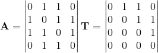

# 图论的简明介绍

> 原文：<https://towardsdatascience.com/graph-theory-132122ac38f2?source=collection_archive---------12----------------------->

最近，图吸引了机器学习社区过多的注意力。图可以表示许多复杂系统，如社会网络、蛋白质相互作用网络、知识图、引文、互联网等。这些是在非欧几里得空间中操作的信息的例子，但是甚至图像和文本也是在欧几里得空间中操作的特殊图形。

Image is taken from William Hamilton [COMP551: Graph Representation Learning](https://cs.mcgill.ca/~wlh/comp551/slides/25-gnns.pdf)

图( *G* )是由顶点(又称节点 *V* )和边(又称链接 *E* ) *G(V，E)* 组成的特殊数据结构。边可以被加权，并且表示例如城市之间的距离。此外，节点可以有一个概率解释，并代表随机变量。这些特殊的图被称为概率图模型，其中如果没有联系，两个 r.v .就是独立的。例如，神经网络是一种特定的图形模型。图形无处不在，大多数知识都可以用图形来建模。

Undirected Graph G(V, E), circles represents nodes and lines represent edges.

在这里，我将介绍一些图论中常用的术语，以便补充这个[好看的帖子](/graph-theory-and-deep-learning-know-hows-6556b0e9891b)，所以一定要查看一下！

让我们从一个关于有向图和无向图的提示开始。当所有的边都表示方向时是一个**有向图** (2)，当所有的边都是无向时是一个**无向图** (1)。

1) Example of an undirected graph; 2) example of a directed graph.

## **路径**

路径是连接两个节点所需的所有节点的列表。例如，为了连接节点 A 和 D，我们需要转到节点 *{A，B，D}。*所以路径可以由节点 *A，B，D，*和边 *{(A，B)，(B，C)，(C，D)}构成。*

In order to go from A to D, we need to follow the path {A, B, D}.

有向图有向路径，有一些节点是 ***祖先*** 和**后代**。祖先是路径中节点的前辈； *D* 的祖先是 *{B，A}* 。同样，后代是一个节点的子节点；例如， *A* 的子代是 *{B，D}* 。

## 有向无环图

图包含**圈**，是*有向路径*，在同一个节点开始和结束。比如上图有圈{A，B，D，C，A}。如果我们*忽略方向*，我们就会有**循环**。例如，节点{A，B，C}是一个循环，但它们不能是一个循环。当有一条边连接两个不相邻的节点时，我们有一条**弦**。比如边 *(C，B)* 就是弦。

如果没有循环，则该图是*非循环的*。所以，有向无环图(DAG)。它只是一个包含没有圈的路径的图。DAG 的祖先和后代可以在路径中找到；*节点不会重访一个节点*。例如，下图是一条 DAG。

Directed Acyclic Graph. Contains two paths P1 = {A, C, D} and P1 = {A, B, D}.

**D 的父母**:pa(D)= { C，B} 。

*A* 的**子**:*ch(A)= { C，B}*

**一个节点的家族**就是它本身和它的双亲。 *D* 的族: *fa(D) = {D，C，B}* 。

**马氏毯**的一个节点是它的父母，孩子，孩子的父母。 *B* 的马尔科夫毯: *MB(B) = {A，D，C}* 。

有向图很重要，因为链接代表了父子之间的依赖关系。

## 派系

无向图有**个邻域**，表示连接到一个节点 *ne(x)* 的节点。比如下图 *ne(A) = {B，C，D}* 。这么说，**团**是所有节点全连通且长度最大的节点的*子集。因此，一个集团的所有成员都是邻居。在图的例子中，我们有两个全连接节点的子集:S *1 = {A，B，C，D}* 和 S *2 = {B，D，E}* 。S1 最长，是个小团体。非极大的全连通集合被称为**。***

****

**Example of a clique: {A, B, C, D} is a clique while {B, D, E} is a cliquo.**

**为了让计算机能够理解，我们将图形信息表示为矩阵或列表。在引入团矩阵之前，我们将定义一个边列表和邻接矩阵。**

**一个**边列表**仅仅是一个*节点-节点对列表*。比如下面的无向图有下面的列表: *L = {(A，B)，(B，A)，(A，C)，(C，A)，(B，C)，(C，B)，(C，D)，(D，C)，(B，D)，(D，B)}* 。有向边仅表示一次，但无向边会被复制以保持两个方向。**

****

**(Left) Undirected graph; (right) directed graph.**

**另一种表示图的方式是用一个**邻接矩阵**，如果在节点 *i，j* 之间有一条边，则该矩阵为 1，否则为 0。您可以通过在对角线上添加 1 来添加自连接。无向图的邻接矩阵是*对称的*，有向图的邻接矩阵是*三角邻接矩阵*，因为它们保留了祖先。例如，参见上图中的邻接矩阵和三角形邻接矩阵。**

****

**Adjacency matrix for undirected graphs and triangular adjacency matrix for the directed graph (we only add the parents of a node)**

**邻接矩阵有一个有趣的性质:*幂表示路径的数量*。基本上你从节点 *i* 到节点 *j* 有 *k* 边希望。**

****

**此外，行的添加给出了图的**度**。度数是一个节点接触的边的数量。**

**最后，一个**集团矩阵**在其每一列中都有最大集团。并且**集团矩阵**放松了具有最大集团的约束。当你有两个节点时，结果矩阵是一个**关联矩阵**。这个矩阵很有趣，因为关联矩阵*的乘积产生了邻接矩阵，图的度在对角线上*。参见上面无向图的团矩阵和关联矩阵。**

****

**Clique matrix and incidence matrix**

**还有很多关于图的讨论，比如生成树、拉普拉斯算子、谱图、图核、图因子分解等等。**

**我希望你喜欢这篇文章，并从中获得一些有用的东西。感谢一直陪伴我直到这篇文章结束。我是 Xavier，我通常从事自然语言处理和贝叶斯推理，但我对图形数据非常感兴趣。所以，如果你想合作并有一个很酷的想法，我很乐意合作。在推特[上找到我](https://twitter.com/Xavier_Sumba)！**