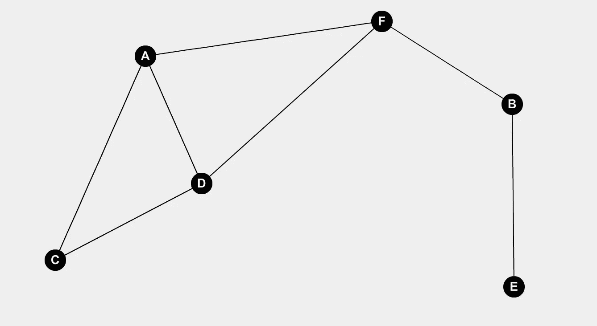

# 图论和数据科学

> 原文：<https://towardsdatascience.com/graph-theory-and-data-science-ec95fe2f31d8?source=collection_archive---------22----------------------->

## [图表和数据科学](https://towardsdatascience.com/tagged/graphs-and-data-science)

## 柯尼斯堡桥的主题介绍

图论可以追溯到 1736 年的普鲁士城市柯尼斯堡。当时，这座城市以普雷格尔河中的两个岛屿为中心，这些岛屿通过七座不同的桥梁与大陆相连。据说，当地的桥牌爱好者举行了一场比赛，看谁能设计出最佳路线，穿过每座桥，同时只穿过一座桥一次。从而在最短的时间内看到所有桥梁的辉煌。

Fig. 1: a map of old Königsberg

虽然这个问题很容易理解，但却很难解决。这个谜题的消息不胫而走，直到引起数学家莱昂哈德·欧拉的注意。他能够证明这个问题实际上没有有效的解决方案，并由此奠定了图论的基础。

为了更容易理解他的解决方案，我们将介绍一些图论术语。

*   一个**图** *G* ( *V* ， *E* )是由一组顶点( *V* )和一组边( *E* )定义的数据结构。
*   **顶点** ( *v* )或节点是一个不可分割的点，由下图中的字母组件表示
*   一条**边** ( *vu* )将顶点 *v* 和顶点 *u* 连接在一起。
*   顶点 *v* 的**度** *d* ( *v* )，就是与之相连的边数。
*   一个顶点的**奇偶性**是指 *d* ( *v* )是偶数还是奇数。
*   **欧拉路径**是有限图中访问每条边恰好一次的路径(允许重访顶点)。

Fig 2: Example Graph with 6 Vertices and 7 Edges

现在回到普鲁士！让我们用我们所学的知识将柯尼斯堡及其桥梁的地图转换成图表。在这个图形表示中，每块陆地将成为一个顶点，每座桥将成为一条边。

Fig 3\. Mapping Königsberg onto a Graph

Fig 4\. Graph of Königsberg Bridges

现在，让我们按照以下顺序在这张图上尝试一条欧拉路径:

*   A → B → D
*   D → A → C

Fig 5\. Eulerian walk attempt

我认为，在我们遍历到顶点 C 之后，很容易看到我们的路径无法完成，因为我们将在 B 或 d 处结束。

通过上面的例子，欧拉意识到问题的核心是每个顶点的奇偶性。行走中的旅行者总是需要从每个顶点开始的入口和出口边缘，以便继续他们的行走。因此，为了继续行走，偶校验总是需要的。

因此，对于试图沿着图 G 进行欧拉行走的旅行者来说，以下条件必须成立才能完成:

*   g 必须连接
*   g 必须有零个或两个奇数阶的顶点

此外，如果 G 有两个奇数度的顶点，那么行走必须从一个开始，到另一个奇数度的顶点结束。

从这个最初的问题中发展出来的领域在我们高度联系的世界中只会变得越来越重要。图论可以用来表示和分析各种各样的网络信息，并且在数据科学中有许多现代应用。

Fig 6\. Variety of Graph Representations of Networks

从谷歌页面排名到网飞内容推荐，它也是众多基础算法发展的基础。

**来源**

[https://math . stack exchange . com/questions/1173328/eulers-solution-of-seven-bridges-of-k % C3 % B6 nigsberg-in-layman-terms](https://math.stackexchange.com/questions/1173328/eulers-solution-of-seven-bridges-of-k%C3%B6nigsberg-in-layman-terms)

[https://en . Wikipedia . org/wiki/Seven _ Bridges _ of _ K % C3 % B6 尼斯堡](https://en.wikipedia.org/wiki/Seven_Bridges_of_K%C3%B6nigsberg)

[https://www . learner . org/courses/mathillumined/units/11/textbook/02 . PHP](https://www.learner.org/courses/mathilluminated/units/11/textbook/02.php)

[https://www.storyofmathematics.com/16th_tartaglia.html](https://www.storyofmathematics.com/16th_tartaglia.html)

[https://cs.mcgill.ca/~wlh/comp551/slides/25-gnns.pdf](https://cs.mcgill.ca/~wlh/comp551/slides/25-gnns.pdf)