# 关于深度学习的图论，你需要知道的一切

> 原文：<https://towardsdatascience.com/graph-theory-and-deep-learning-know-hows-6556b0e9891b?source=collection_archive---------2----------------------->

## 图形学习和几何深度学习—第 0 部分

> 预测未来的最好方法是创造未来——亚伯拉罕·林肯
> 
> 关注 [**我的推特**](https://twitter.com/FlawnsonTong) 加入 [**几何深度学习子编辑**](https://www.reddit.com/r/GeometricDeepLearning/) 获取空间最新更新。

今天，机器学习风靡一时，一旦科学赶上宣传，它将很可能成为我们生活中的一种常态。我们达到下一步的方法之一是一种新形式的深度学习；几何深度学习。点击阅读灵感和创意[。这个系列的重点是我们如何在图上使用深度学习](https://medium.com/@flawnsontong1/what-is-geometric-deep-learning-b2adb662d91d)

理解图学习所需的两个先决条件就在名称本身；**图论和深度学习**。这就是你所需要知道的，来理解的本质，并为这两个想法建立一个高层次的直觉。

Progress in A.I means more cute robots (Courtesy of Techgyd)

# 图论—速成班

## 什么是图？

在图论的上下文中，**图**是一种结构化的数据类型，具有**节点**(保存信息的实体)和**边**(也可以保存信息的节点之间的连接)。图表是一种组织数据的方式，但它本身也可以是一个数据点。图表是一种**非欧几里得数据**，这意味着它们以 3D 形式存在，不像图像、文本和音频等其他数据类型。图表可以具有某些属性，这些属性限制了可以对其执行的可能操作和分析。这些属性是可以定义的。

## 图形定义

首先让我们来看一些定义，这是我一生中最简单的 Photoshop 工作带给你的。

在计算机科学中，我们经常谈论一种叫做**图的数据结构:**

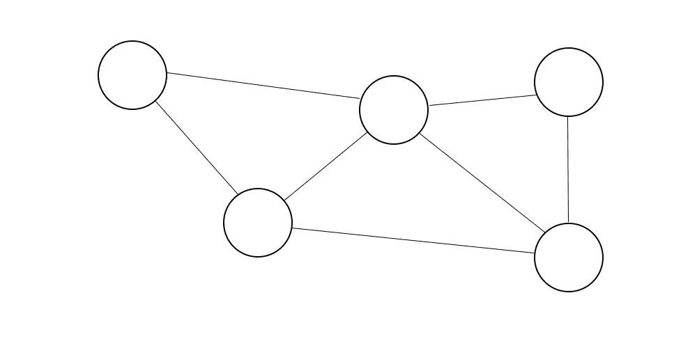

He’s cute, let’s call him Graham

图可以在它们的边和/或节点上有**标签**，让我们给 Graham 一些边和节点标签。

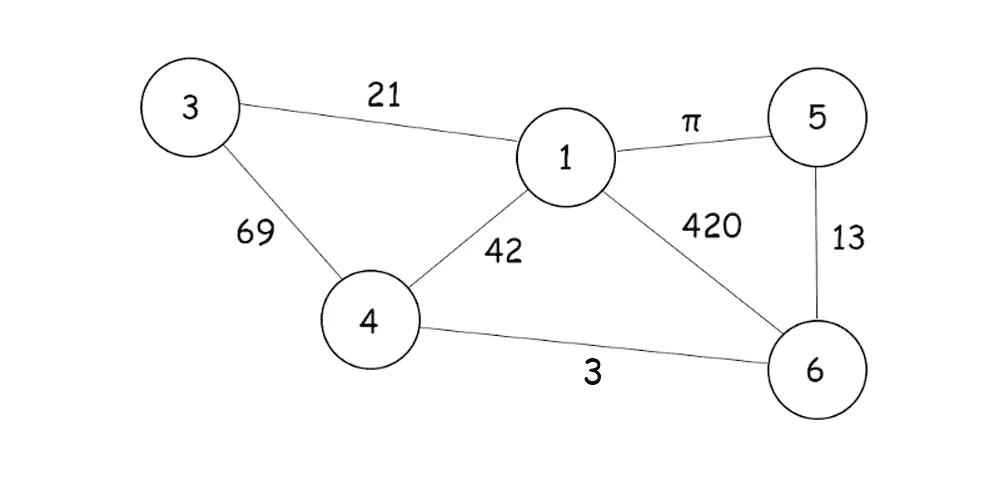

Graham looks rather dashing in his new attire

标签也可以被认为是权重，但这取决于图表的设计者。

**标签不一定是数字**，也可以是文字。

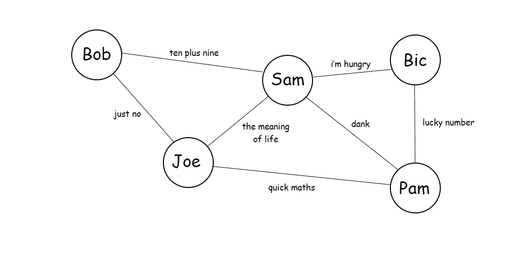

Graham also likes memes

**标签不必唯一**；给多个节点相同的标签是完全可能的，有时也是有用的。以氢分子为例:

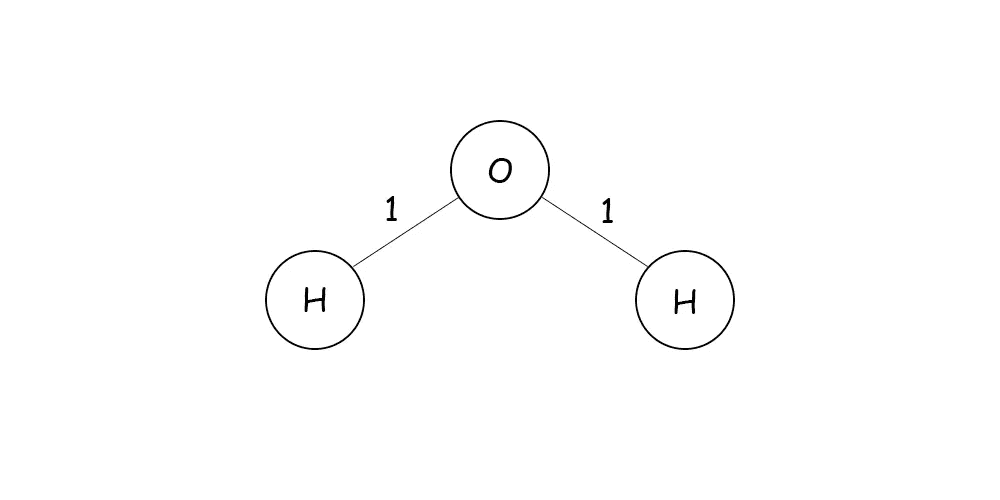

Notice the mix of numerical and textual datatypes

图形可以有**特征**(也称为属性)**。**

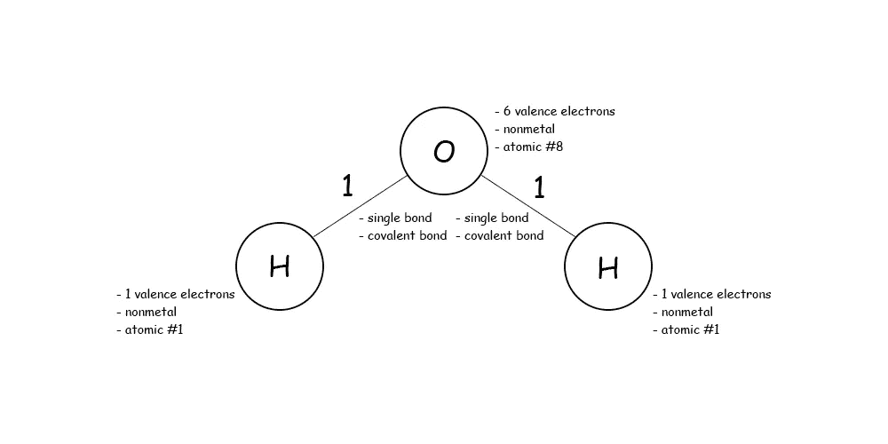

注意不要混淆特征和标签。一种简单的思考方式是用名字、人物和人来类比:

> 节点是一个人，节点的标签是一个人的名字，节点的特征是这个人的特征。

图形可以是**有向的或无向的:**

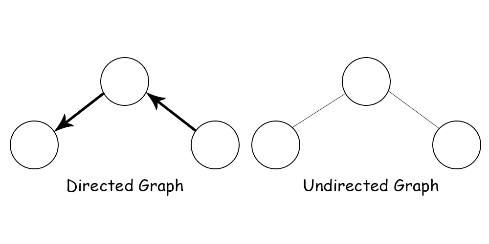

Note that directed graphs can have undirected edges too

图中的节点甚至可以有一条指向/连接到自身的边。这就是所谓的**自循环。**

图表可以是:

*   **异构**——由不同类型的节点组成
*   **同类** —由相同类型的节点组成

并且是:

*   **静态** —节点和边不变，不添加或删除任何东西
*   **动态** —节点和边的改变、添加、删除、移动等。

粗略地说，图可以模糊地描述为

*   **密集**——由许多节点和边组成
*   **稀疏** —由较少的节点和边组成

通过将图表转换成平面形式，可以使它们看起来更整洁，这基本上意味着重新排列节点，使边不相交

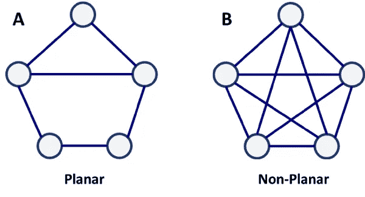

(Courtesy of The Geography of Transport Systems**)**

这些概念和术语在我们探索当前在各种 GNN 架构中使用的许多不同方法时会派上用场。这些基本方法中的一些在:

## 图形分析

**有许多不同的图形结构**可供 ML 模型学习(轮子、周期、星形、网格、棒棒糖、密集、稀疏等)。)

你可以遍历一个图

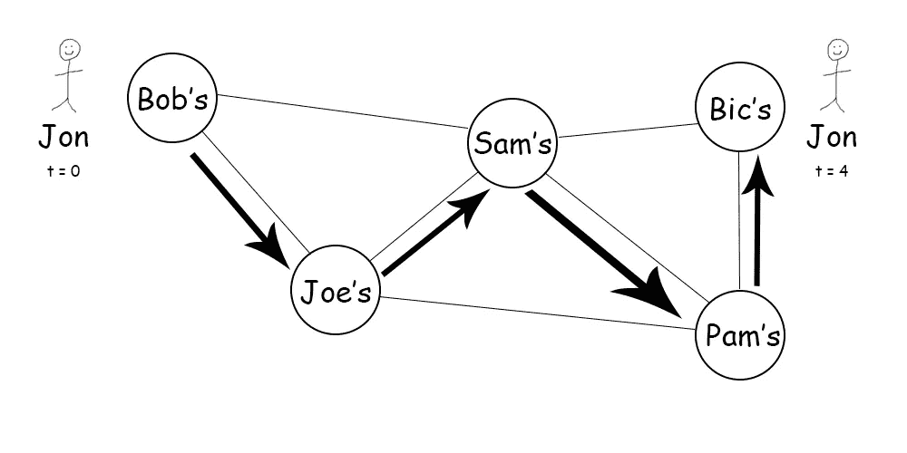

Jon went from Bob’s to Bic’s in 4 timesteps; he better hope it doesn’t snow!

在这种情况下，我们正在遍历一个无向图。显然，如果图是**有向**的，人们可以简单地沿着边的方向走。有几种不同类型的遍历，所以要小心措辞。以下是一些最常见的图形遍历术语及其含义:

*   **走查:**一个图的遍历——一个**封闭走查**是当目的节点与源节点相同时
*   **步道:**没有重复边缘的步道——一条**环路**是一条封闭的步道
*   **路径:**没有重复节点的行走——c**循环**是封闭路径

基于遍历的概念，我们也可以通过图发送消息。

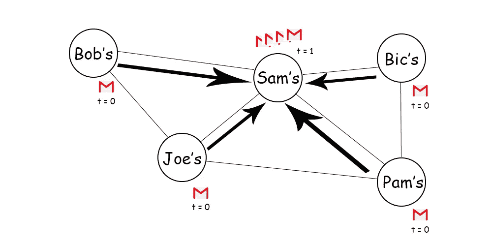

Sam? More like S-p-am…

山姆的所有邻居都在给他发信息，其中 *t* 代表时间步长。Sam 可以选择打开自己的邮箱，更新自己的信息。通过网络传播信息的概念对于具有**注意力机制的模型**来说非常重要。在图中，消息传递是我们推广卷积的一种方式。稍后将详细介绍。

## 电子图形——计算机上的图形

学完这些，你现在对图论有了一个基本的了解！对于 GNNs 来说，任何其他重要的概念都会在它们出现的时候被解释，但是同时，还有最后一个关于图的主题我们需要讨论。我们必须学会如何通过计算来表达图形。

有几种方法可以把一张图表转换成计算机可以理解的格式；它们都是不同类型的矩阵。

**关联矩阵( *I* ):**

关联矩阵，在研究论文中通常用大写字母 ***I*** 表示，由 1、0 和-1 组成，关联矩阵可以通过以下简单模式制作:

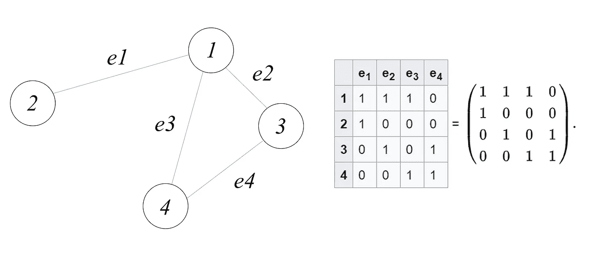

From Graph to Incidence Matrix

**(加权)邻接矩阵( *A* ):**

图的邻接矩阵是由 1 和 0 组成的**，除非**它被另外加权或标记。在任何情况下 ***一个*** 都可以按照这个规则来构建:

**因此，无向图的邻接矩阵沿其对角线对称**，从左上到右下:

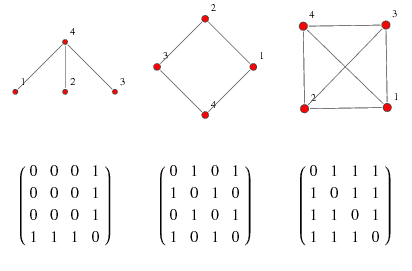

Adjacency Matrices (Courtesy of Wolfram Mathworld)

有向图的邻接矩阵只覆盖对角线的一边，因为有向图的边只有一个方向。

**邻接矩阵可以被“加权”**，这基本上意味着每条边都有一个与之相关联的值，因此该值被放在各自的矩阵坐标中，而不是 1。这些权重可以代表你想要的任何东西。以分子为例，它们可以代表两个节点(原子)之间的键的类型。在 LinkedIn 这样的社交网络中，它们可以代表两个节点(人)之间的第一、第二或第三顺序连接。

边缘权重的概念是 GNNs 如此强大的一个原因；它们允许我们同时考虑结构(相关)和奇异(独立)信息。对于真实世界的应用程序，这意味着我们既可以考虑内部信息，也可以考虑外部信息。

**度矩阵( *D* ):**

图的度矩阵可以用前面讲过的度的概念来求。 ***D*** 本质上是一个对角矩阵，其中**对角线的每一个值都是其对应节点的度数。**

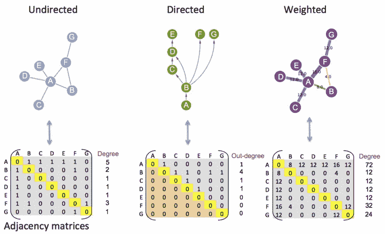

The different types of graphs and Matrices (Courtesy of the EU Bioinformatics Institute)

注意，度只是邻接矩阵中每一行的和。然后将这些度放在矩阵的对角线上(邻接矩阵的对称线)。这很好地引出了最终的矩阵:

**拉普拉斯矩阵(L):**

图的拉普拉斯矩阵是从度矩阵中减去邻接矩阵的结果:

度矩阵中的每个值都减去其在邻接矩阵中的相应值，如下所示:

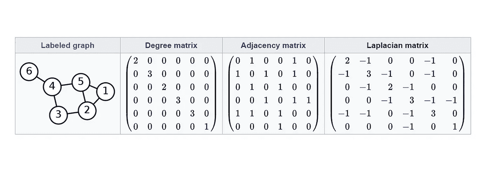

The graph matrix trinity (Courtesy of Wikipedia)

还存在其他图形矩阵表示，如**关联矩阵、**，但是绝大多数图形类型数据的 GNN 应用程序使用一个、两个或所有三个矩阵。这是因为它们，尤其是拉普拉斯矩阵，提供了关于**实体**(具有属性的元素)和**关系**(实体之间的连接)的大量信息。

唯一缺少的是一个**规则**(一个通过关系将实体映射到其他实体的函数)。这就是神经网络派上用场的地方。

> **如果你需要更多关于图形及其表示的见解，我强烈推荐你看看** [**这篇深度中等的文章。**](https://medium.com/basecs/from-theory-to-practice-representing-graphs-cfd782c5be38)

# 深度学习—速成班

现在让我们快速运行另一半“图形**神经网络**”。当有人说“**深度学习**”时，神经网络就是我们谈论的架构。神经网络架构建立在**感知器**的概念之上，感知器受到人类大脑中神经元相互作用的启发。

人工神经网络(或简称 NN)及其扩展家族，包括卷积神经网络、递归神经网络，当然还有图神经网络，都是深度学习算法的类型。

> 深度学习是一种机器学习算法，而机器学习算法又是人工智能的一个子集。

这一切都始于不起眼的线性方程。

> y = mx + b

如果我们把这个等式构造成一个感知器，我们会看到:

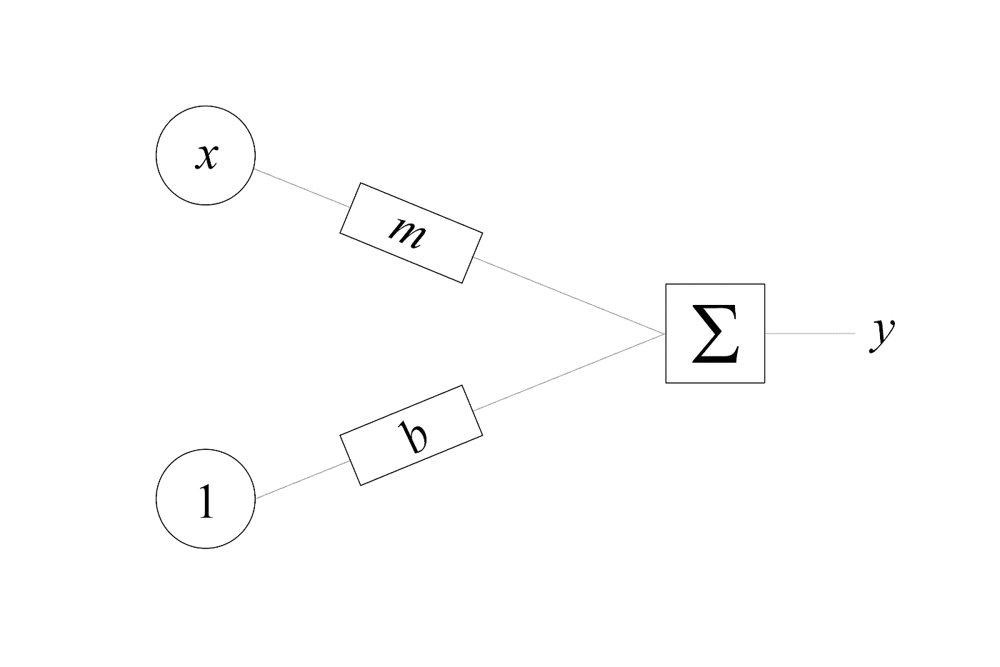

其中**输出(y)是偏差(b)和输入(x)之和(E)乘以权重(m)。**

神经网络通常有一个**激活函数**，它基本上决定一个给定的神经元输出(即 *y* )是否应该被认为是“激活的”，并将一个感知器的输出值保持在一个合理的、可计算的范围内。(sigmoid 表示 0–1，tanh 表示-1–1，ReLU 表示 0 或 1，以此类推。).这就是为什么我们在感知器的末端附加一个激活函数。

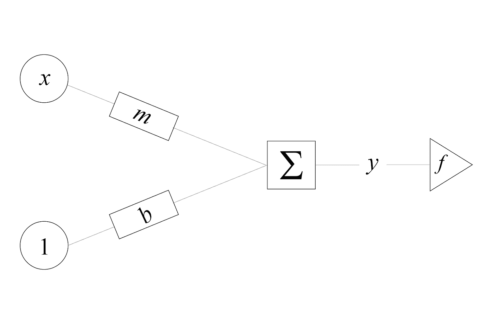

当我们把一堆感知器放在一起时，我们得到了类似于神经网络的开端的东西！这些感知器将数值从一层传递到另一层，每次传递都使该数值更接近网络训练所针对的目标/标签。

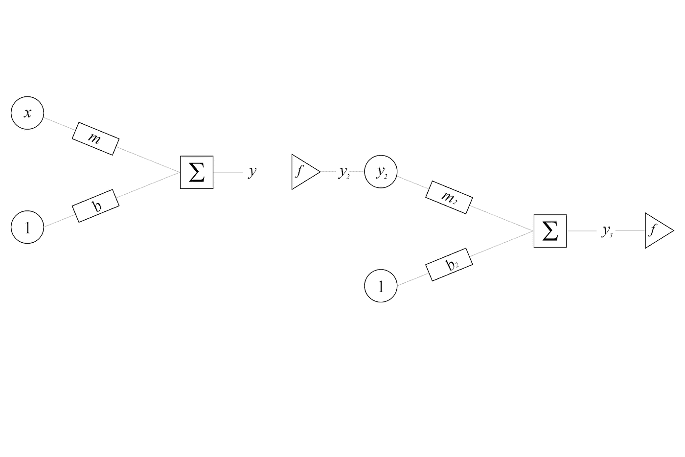

当你把一堆感知器放在一起，你会得到:

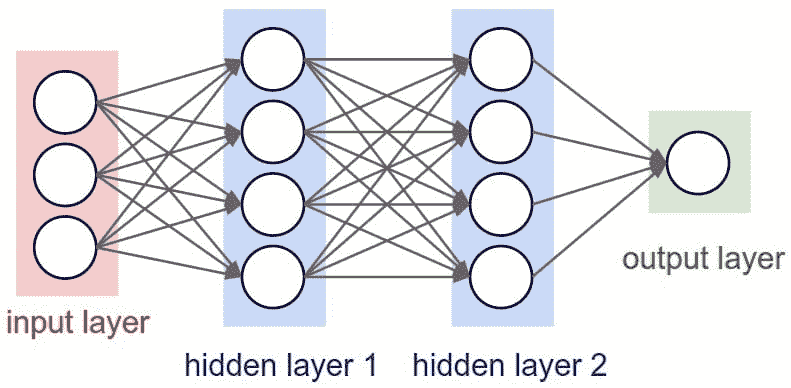

A vanilla NN (courtesy of Digital Trends)

为了训练神经网络，我们需要首先计算我们需要调整模型的权重多少。我们用一个**损失函数**来计算**误差**。

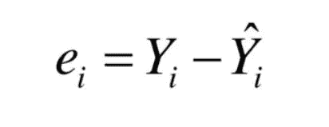

其中 ***e*** 为误差， ***Y*** 为预期输出，*为实际输出。在高层次上，误差被计算为实际输出(神经网络的预测)减去预期输出(目标)。目标是**最小化误差**。通过使用称为**反向传播的过程来调整每个层的权重，误差被最小化。***

*本质上，反向传播将调整分布在从输出层到输入层的整个网络中。调整量由接收误差作为输入的**优化功能**决定。优化函数可以想象成一个球滚下山坡，球的位置就是误差。因此，当球滚到山脚时，误差最小。*

*此外，还有一些必须定义的**超参数**，其中最重要的一个是**学习率**。学习速率调整应用优化函数的速率。学习速度就像重力设置；重力越大(学习率越高)球滚下山的速度越快，反过来也是一样。*

*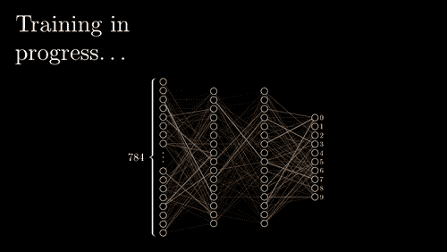*

*The propagation of a network (Courtesy of 3Blue1Brown)*

*神经网络有许多不同的宏观和微观定制，使每个模型都是独特的，具有不同的性能水平，但所有这些都是基于这个**普通**模型。稍后我们将会看到这是如何实现的，特别是对于图形学习。像卷积和递归这样的运算将根据需要引入。*

# *深度学习是图论*

*为了把我们所研究的一切联系起来，并检验我们的知识，我们将解决房间里的大象。如果你一直在关注，你可能会注意到一个微妙但明显的事实:*

> *人工神经网络其实只是图！*

*NNs 是一种特殊的图形，但是它们具有相同的结构，因此具有相同的术语、概念和规则。*

*回想一下，感知器的结构本质上是:*

> *感知器图片(修改)*

*我们可以将输入值(x)、偏差值(b)和求和运算(E)看作是图中的 3 个节点。我们可以将权重(m)视为连接输入值(x)和求和运算(E)的边。*

*NNs 最相似的特定类型的图是**多部分图。多部图是可以分成不同节点集的图。每个集合中的节点可以共享集合之间的边，但不能共享每个集合内的边。***

*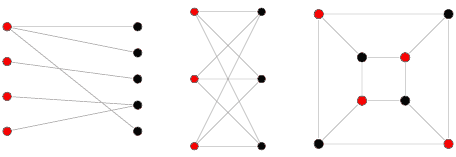*

*Isomorphic bipartite graphs (courtesy of Wolfram MathWorld)*

*一些神经网络甚至具有全连接节点、条件节点和其他疯狂的架构，这些架构赋予了神经网络其标志性的多功能性和能力；以下是一些最受欢迎的架构:*

*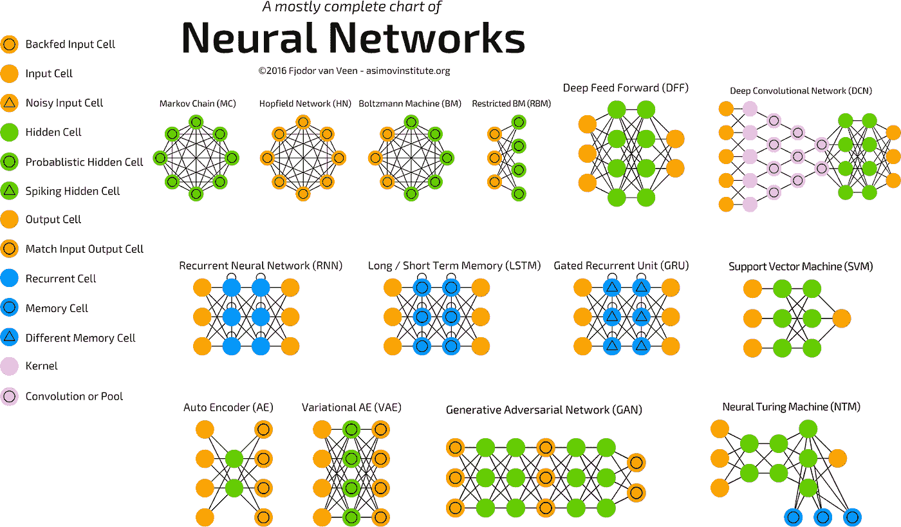*

*Neural Network Zoo (Courtesy of Asimov Institute)*

*每种颜色对应一种不同类型的节点，节点可以用多种不同的方式排列。通过网络向前或向后传播数据类似于在图中传递**消息。图中的**边或节点特征**类似于神经网络中的权重。注意一些节点甚至有我们之前提到的**自循环**(RNNs 固有的——递归神经网络)。***

*神经网络不是唯一具有类似图形结构的机器学习模型。*

*   *k 均值*
*   *k-最近邻*
*   *决策树*
*   *随机森林*
*   *马尔可夫链*

*都像图形本身一样构造，或者在图形结构中输出数据。*

*因此，这意味着图形学习模型可以用来学习这些机器学习算法本身。在**超参数优化**中有潜在的应用。这正是这篇令人惊叹的论文的作者们所做的。*

*随着我们更多地了解在几何数据上推广深度学习，可能性才刚刚开始浮出水面。*

# *本质上*

*我们讨论了很多，但概括来说，我们深入探讨了 3 个概念*

1.  *图论*
2.  *深度学习*
3.  *基于图论的机器学习*

*记住先决条件，你就能完全理解和欣赏图形学习。在高层次上，图学习使用一系列旨在处理非欧几里得数据的神经网络，进一步探索和利用深度学习和图论之间的关系。*

# *关键要点*

*有许多关键要点，但重点是:*

*   *所有图形都有**属性，这些属性定义了可以使用或分析的可能动作和限制**。*
*   ***使用各种矩阵通过计算表示图形**。每个矩阵提供不同数量或类型的信息。*
*   ***深度学习是机器学习的一个子集**它大致模仿了人类大脑使用神经元的工作方式。*
*   ***深度学习通过迭代学习**通过网络向前传递信息，向后传播神经元调整。*
*   *神经网络(以及其他机器学习算法)与图论有着密切的联系；**有的本身就是图，或者输出。***

*现在，您已经具备了进入图形学习奇妙世界所需的所有先决条件。一个好的起点是研究到目前为止已经开发的各种图形神经网络。*

# *需要看到更多这样的内容？*

**跟我上*[***LinkedIn***](http://www.linkedin.com/in/flawnson)***，*** [***脸书***](https://www.facebook.com/flawnson) ***，***[***insta gram***](https://www.instagram.com/flaws.non/?hl=en)*，当然还有* [***中***](https://medium.com/@flawnsontong1)*

***我所有的内容都在* [***我的网站***](http://www.flawnson.com) *我所有的项目都在*[***GitHub***](https://github.com/flawnson)**

***我总是希望结识新朋友、合作或学习新东西，所以请随时联系*[***flawnsontong1@gmail.com***](http://mail.google.com)**

> **向上和向前，永远和唯一🚀**