# 描绘英国退出欧盟

> 原文：<https://towardsdatascience.com/graphing-brexit-bbe4314cf70?source=collection_archive---------9----------------------->

我和我的许多同胞一起，在周三晚上观看了英国议员对一系列潜在的英国退出欧盟选项投“不”票，然后阅读了不同个人和政党在各种网站上投票的分析。

虽然非常有趣，但所有的分析对我来说都是非常表格化的(T4)，我很好奇我们是否可以通过将数据放到图表中来学习新的东西。

# 获取数据

我四处搜索了一下，试图找到选票背后的数据，虽然有官方记录，但我发现《卫报》的“你的议员如何投票表”是最容易处理的。

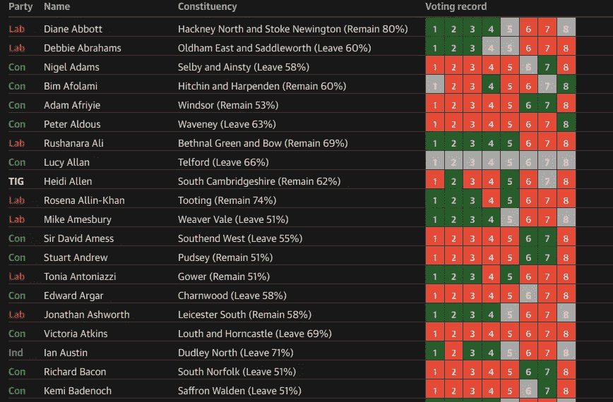

Guardian Voting Table

我编写了一个 scraper，将这些数据放入 CSV 文件中，我们可以使用 [LOAD CSV](https://neo4j.com/docs/cypher-manual/current/clauses/load-csv/) 工具将这些文件导入 Neo4j。

你可以在[mneedham/graphing-英国退出欧盟](https://github.com/mneedham/graphing-brexit) GitHub 资源库中找到 scrapper 和原始 CSV 文件。下面是其中一个文件的示例:

Sample of mps.csv

# 导入数据


Enable multi statement query editor

我们可以通过将以下脚本粘贴到 Neo4j 浏览器中，将数据导入到 Neo4j 中。如果您在家里跟进，请确保启用了多语句查询编辑器。

你还需要确保你已经安装了流行的 [APOC](https://neo4j.com/developer/neo4j-apoc/) 库，因为我们用它来创建表明议员投票方式的关系。

```
// Create one node per motion
LOAD CSV WITH HEADERS FROM "[https://github.com/mneedham/graphing-brexit/raw/master/data/motions.csv](https://github.com/mneedham/graphing-brexit/raw/master/data/motions.csv)" AS row
MERGE (m:Motion {id: toInteger(row.id)})
SET m.name = row.name;// Create nodes for each MP and each party and connect them
LOAD CSV WITH HEADERS FROM "[https://github.com/mneedham/graphing-brexit/raw/master/data/mps.csv](https://github.com/mneedham/graphing-brexit/raw/master/data/mps.csv)" AS row
MERGE (person:Person {name: row.mp})
MERGE (party:Party {name: row.party})
MERGE (person)-[:MEMBER_OF]->(party);// Create a relationship between each MP and each motion
LOAD CSV WITH HEADERS FROM "[https://github.com/mneedham/graphing-brexit/raw/master/data/votes.csv](https://github.com/mneedham/graphing-brexit/raw/master/data/votes.csv)" AS row
MATCH (person:Person {name: row.person})
MATCH (motion:Motion {id: toInteger(row.motionId)})
CALL apoc.create.relationship(person, row.vote, {}, motion) 
YIELD rel
RETURN rel;
```

我们可以通过执行`CALL db.schema()`命令来查看图表的模式:

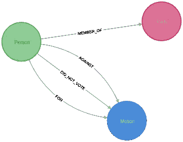

Graph model for the Brexit votes

# 分析数据

既然我们已经加载了数据，让我们来分析它。我们将从支持和反对不同运动的总次数的概述开始。我们可以通过运行以下查询来做到这一点:

```
MATCH (motion:Motion)
RETURN motion.name,
       size((motion)<-[:FOR]-()) AS for,
       size((motion)<-[:AGAINST]-()) AS against
ORDER BY motion.id
```

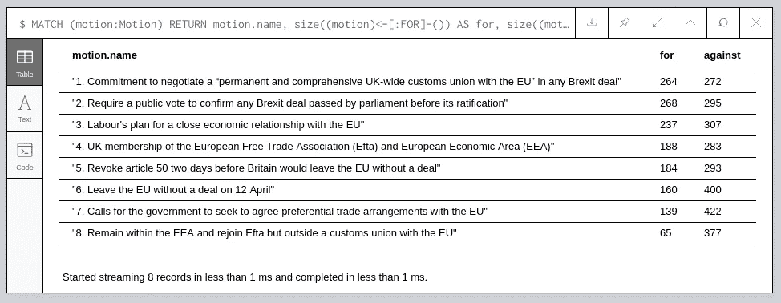

Total votes for each motion

对于那些熟知这些数字的人来说，你会注意到有些数字差了一位。这是因为**守护表好像少了一个 MP** ！我不确定是谁，但如果你发现了它，请告诉我，我会更新 CSV 文件。

从数据中我们还能发现什么？

## 47 个人什么都没投

```
MATCH (person:Person)-->(party:Party)
WHERE not((person)-[:FOR]->()) AND not ((person)-[:AGAINST]->())
RETURN party.name, count(*) AS count
ORDER BY count DESC
```

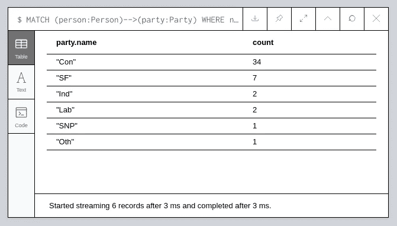

Non votes by party

## 其中许多人是保守党的内阁成员

```
MATCH (person:Person)
WHERE not((person)-[:FOR]->()) AND not ((person)-[:AGAINST]->())
MATCH path = (person)-->(:Motion)
WHERE (:Party {name: "Con"})<--(person)
RETURN path
LIMIT 50
```

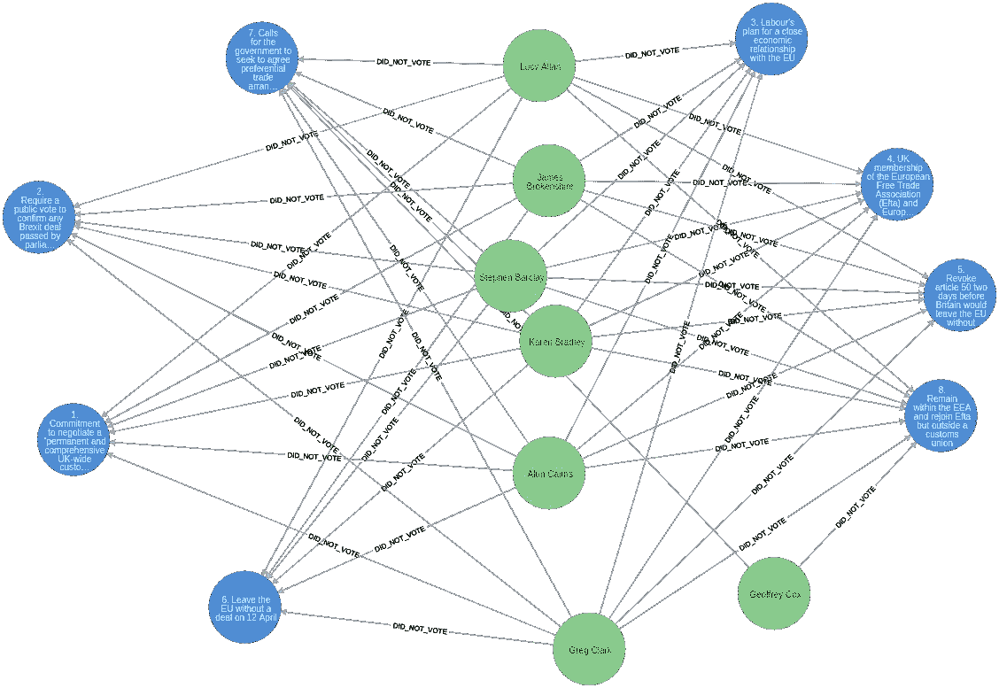

Ain’t nobody got time to vote

## 有保守派投票支持工党的计划吗？

```
MATCH path = (:Motion {id: 3})<-[:FOR]-()-[:MEMBER_OF]->(:Party {name: "Con"})
RETURN path
```

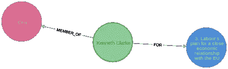

Conservatives voting for Labour’s plan

就一个！

# 用 Neo4j Bloom 可视化数据

在又写了几个 Cypher 查询之后，我开始好奇我们是否可以做任何视觉分析，所以我打开了 [Neo4j Bloom](https://neo4j.com/bloom/) 。

呼声最高的两个人是 Boris Johnson 和 Jacob Rees-Mogg，通过输入搜索词`Boris Johnson Motion Jacob Rees-Mogg`，我们得到下面的 **BoRees Star** :

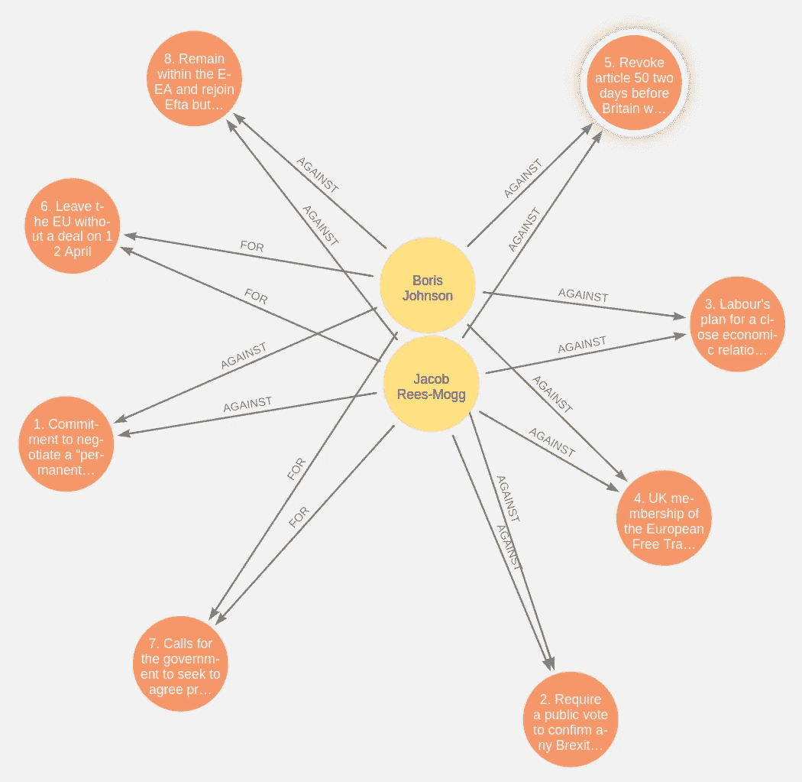

The BoRees Star

如我们所见，他们对每一项动议都投了相同的票。

# 使用图算法寻找相似的投票者

在比较了几个这样的 MP 之后，我想尝试自动化这个过程，这个问题对于 [Neo4j 图算法库](https://neo4j.com/docs/graph-algorithms/current/)中的 [**相似性算法**](https://neo4j.com/docs/graph-algorithms/current/algorithms/similarity/) 来说是完美的。

我们想找出不同人的投票模式有多相似。最初我认为我们可以使用 Jaccard 相似性来做到这一点，但意识到它不会工作得很好，因为虽然**两个人可以连接到同一个动议，但这并不意味着他们是相似的**-他们可能以不同的方式投票！

相反，我们会认为投票是给一个动议打分。如果你投票:

*   因为这意味着你喜欢它。得分为 1
*   没有投票，这意味着你不确定。0.5 分
*   反对那就说明你不喜欢。得分为 0

如果我们像这样对投票进行评分，这意味着我们可以使用一种基于权重的相似性算法。余弦相似性算法通常用于计算推荐引擎中项目之间的相似性，因此我们将尝试使用该算法。

## 谁的选票最像鲍里斯？

```
MATCH (p1Party:Party)<-[:MEMBER_OF]-(p1:Person)-[r1]->(m:Motion)
WHERE p1.name = "Boris Johnson"
MATCH (p2Party:Party)<-[:MEMBER_OF]-(p2:Person)-[r2]->(m) 
WHERE p2 <> p1
WITH p1, p2, p2Party,
     CASE WHEN type(r1) = "FOR" THEN 5 
          WHEN type(r1) = "DID_NOT_VOTE" THEN 0.5 
          ELSE 0 END AS r1Score,
     CASE WHEN type(r2) = "FOR" THEN 5 
          WHEN type(r2) = "DID_NOT_VOTE" THEN 0.5 
          ELSE 0 END AS r2Score 
WITH p2.name AS to,
     p2Party.name AS party,
     algo.similarity.cosine(collect(r1Score), collect(r2Score)) 
     AS similarity
WHERE similarity > 0
RETURN to, party, similarity
ORDER BY similarity DESC
```

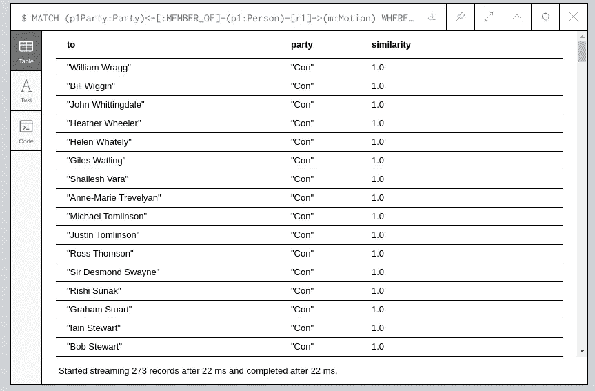

也许不足为奇的是，保守党中的许多人也投了相同的票。

## 如果排除同党的人呢？

```
MATCH (p1Party:Party)<-[:MEMBER_OF]-(p1:Person)-[r1]->(m:Motion)
WHERE p1.name = "Boris Johnson"
MATCH (p2Party:Party)<-[:MEMBER_OF]-(p2:Person)-[r2]->(m) 
WHERE p2 <> p1
WITH p1, p2, p2Party,
     CASE WHEN type(r1) = "FOR" THEN 5 
          WHEN type(r1) = "DID_NOT_VOTE" THEN 0.5 
          ELSE 0 END AS r1Score,
     CASE WHEN type(r2) = "FOR" THEN 5 
          WHEN type(r2) = "DID_NOT_VOTE" THEN 0.5 
          ELSE 0 END AS r2Score
WHERE p1Party <> p2Party 
WITH p2.name AS to,
     p2Party.name AS party,
     algo.similarity.cosine(collect(r1Score), collect(r2Score)) 
     AS similarity
WHERE similarity > 0
RETURN to, party, similarity
ORDER BY similarity DESC
```

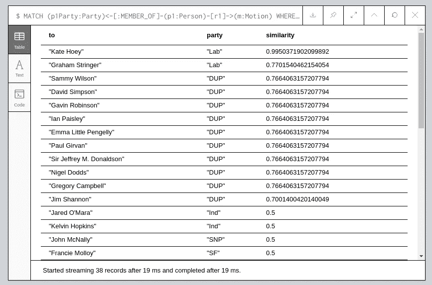

有趣的是，凯特·霍伊是一个选区的议员，该选区有 78%的人投票支持留欧，但她的投票方式与支持脱欧的人相似。

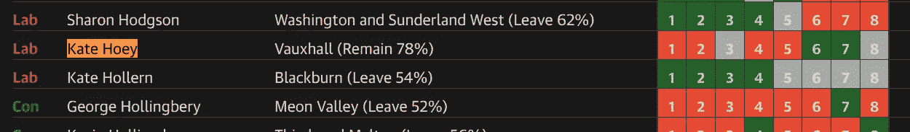

# 接下来呢？

这确实为一些潜在的未来分析铺平了道路。我们能否根据这些选项对脱欧/留欧立场的支持程度对它们进行排序，并计算出哪些议员的投票方式最符合其选区的投票结果？

我们可以做的另一件事是创建一个 MPs 的相似图，然后在其上运行一些[社区检测算法](https://neo4j.com/docs/graph-algorithms/current/algorithms/community/)。

如果你对数据的图形分析感兴趣，你可能会喜欢我和艾米·霍德勒在过去 9 个月里一直在研究的《奥莱利图形算法》一书。我们正处于最后的审查阶段，它应该在未来几周内可用。

你可以从 Neo4j 网站注册获得免费的电子版，网址:[neo4j.com/graph-algorithms-book](https://neo4j.com/graph-algorithms-book/)。

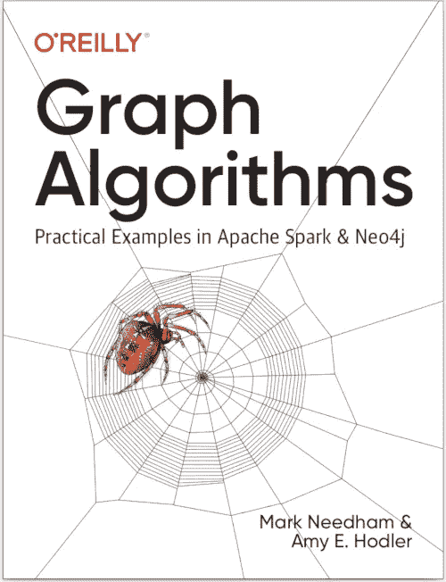

O’Reilly Graph Algorithms Book