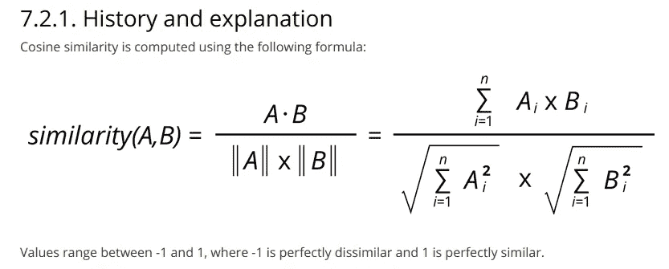
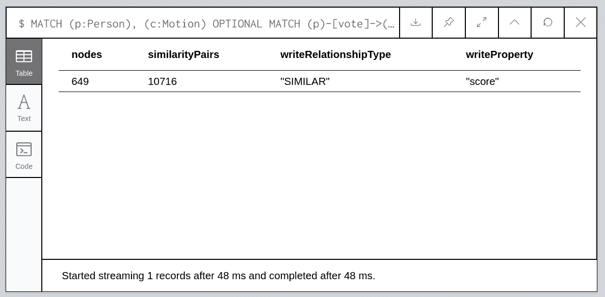
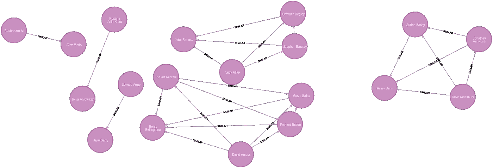
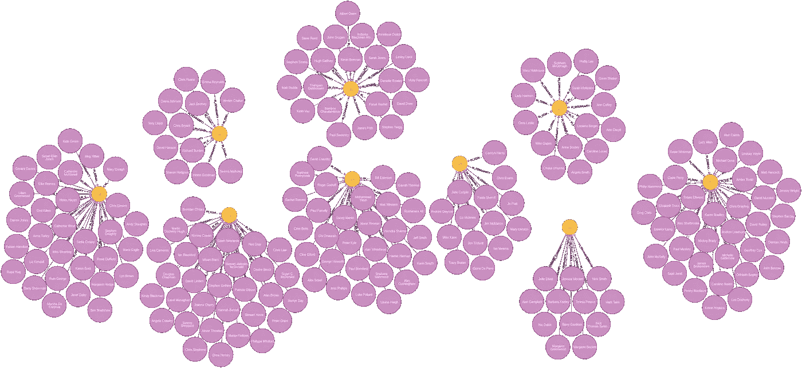
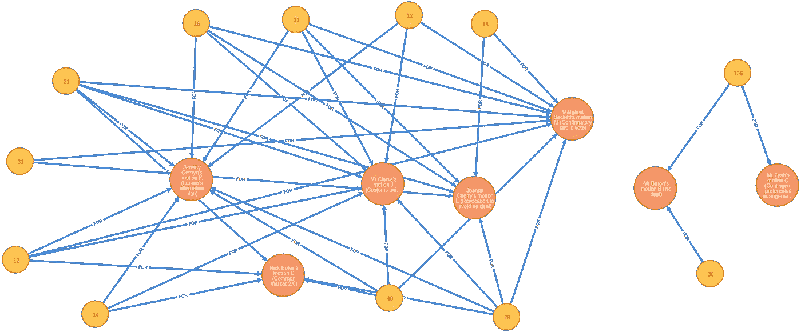
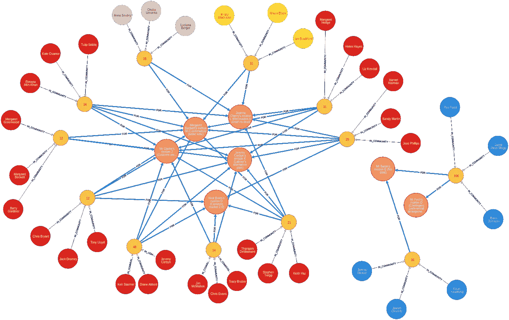
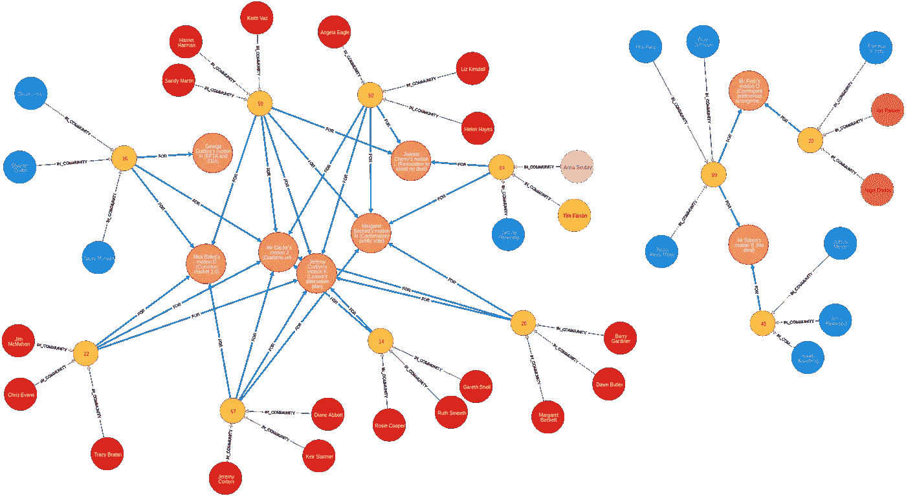

# 绘制英国退出欧盟:聚类版

> 原文：<https://towardsdatascience.com/graphing-brexit-clustering-edition-3b966694e723?source=collection_archive---------18----------------------->

这是展示如何用图表分析英国退出欧盟系列文章的第二篇。在本帖中，我们根据投票记录对议员进行分类。


Brexit — EU ([https://unsplash.com/photos/yxDhneWz3vk](https://unsplash.com/photos/yxDhneWz3vk))

上周五，我写了一篇博文，展示了如何使用 Neo4j 对英国退出欧盟的数据进行[图形分析，在第一篇博文的末尾，我展示了如何根据议员们对不同动议的立场，计算他们与 Boris Johnson 的相似度。](/graphing-brexit-bbe4314cf70)

在做这个分析的时候，我注意到**有很多人对每个动议都以同样的方式**投票，所以我想进一步探究这个问题。

罗宾·布拉姆雷还指引我去了 [CommonsVotes 网站](https://commonsvotes.digiminster.com/?page=1)，那里有 CSV 格式的投票记录。

这将有助于未来的英国退出欧盟分析，所以让我们快速了解如何从那里导入数据到 Neo4j。

# 导入常用选项数据

我已经下载了所有指示性投票的数据，并把文件放到了[图形-英国退出欧盟](https://github.com/mneedham/graphing-brexit) GitHub 库的[*data/commons votes*](https://github.com/mneedham/graphing-brexit/tree/master/data/commonsvotes)目录下。

我们可以使用下面的 Cypher 查询导入所有指示性动作的数据:

```
UNWIND [655,656,657,658,659,660,661,662] AS division
LOAD CSV FROM "[https://github.com/mneedham/graphing-brexit/raw/master/data/commonsvotes/Division](https://github.com/mneedham/graphing-brexit/raw/master/data/commonsvotes/Division)" + division + ".csv" AS row// Create motion nodes
WITH division, collect(row) AS rows
MERGE (motion:Motion {division: trim(split(rows[0][0], ":")[1]) })
SET motion.name = rows[2][0]// Skip the first 6 rows as they have metadata we don't need
WITH motion, rows
UNWIND rows[7..] AS row// Create person, party, constituency, and corresponding rels
MERGE (person:Person {name: row[0]})
MERGE (party:Party {name: row[1]})
MERGE (constituency:Constituency {name: row[2]})
MERGE (person)-[:MEMBER_OF]->(party)
MERGE (person)-[:REPRESENTS]->(constituency)
WITH person, motion,  
     CASE WHEN row[3] = "Aye" THEN "FOR" 
          WHEN row[3] = "No" THEN "AGAINST" 
          ELSE "DID_NOT_VOTE" END AS vote
CALL apoc.merge.relationship(person, vote, {}, {}, motion)
YIELD rel
RETURN count(*)
```

# 相同的选民

现在我们已经加载了数据，我们将探究那些相同的投票者。我尝试了几种不同的方法，最终决定采用以下方法:

1.  基于以**相同方式**投票的人，创建**相似度图**
2.  在相似性图上运行**连通分量算法**来找到人群的聚类

在我们完成这两个步骤之后，我们希望有一个**节点来代表我们找到的每个社区或集群**，以及从每个人到他们的社区的关系。

我们开始吧！

# 相似图

我们将创建一个议员相似度图，这是一种奇特的说法，即我们将**在以相同方式**投票的成对议员之间创建关系。



Cosine Similarity

正如在第一篇文章中，我们将使用来自 [Neo4j 图形算法库](https://neo4j.com/docs/graph-algorithms/current/)的[余弦相似度](https://neo4j.com/docs/graph-algorithms/current/algorithms/similarity-cosine/)算法来做这件事。在我们的数据库中创建任何关系之前，我们将使用`write: false`和`similarityCutoff: 1.0`运行该过程的非流版本(即它们的行为相同)，以查看在不写入数据库的情况下我们有多少对相同的投票者。

下面的 Cypher 查询可以做到这一点:

```
MATCH (p:Person), (c:Motion)
OPTIONAL MATCH (p)-[vote]->(c)
WITH p, c,
     CASE WHEN type(vote) = "FOR" THEN 1
          WHEN type(vote) = "DID_NOT_VOTE" THEN 0.5
          ELSE 0 END AS score
WITH {item:id(p), weights: collect(score)} as userData
WITH collect(userData) as data
CALL algo.similarity.cosine(data, {
  similarityCutoff: 1.0, write: false
})
YIELD nodes, similarityPairs, writeRelationshipType, writeProperty
RETURN nodes, similarityPairs, writeRelationshipType, writeProperty
```



How many identical votes do we have?

我们的 649 个议员有超过 10，000 个相似性对！这应该是一个有趣的图表。

我们现在将使用`write:true`运行这个过程，以便在相似度为 1.0 的节点之间创建`SIMILAR`关系。下面是创建的图表示例:



Similarity Graph

# 查找具有连通分量的聚类

现在我们将在这个相似度图上运行[连通分量算法](https://neo4j.com/docs/graph-algorithms/current/algorithms/connected-components/)。但是这个算法是做什么的呢？

在文档页面中:

> 连通分量或`Union Find`算法在无向图中寻找连通节点集，其中**每个节点都可以从同一集合中的任何其他节点到达**。

通过执行以下查询，我们可以在相似度图上运行该算法的流版本:

```
// Run the algorithm for:
// nodes with 'Person' label, based on the 'SIMILAR' rel type
CALL algo.unionFind.stream('Person', 'SIMILAR', {direction: "BOTH"})
YIELD nodeId,setId// Grouping by setId, create a 'Community' node for each community
WITH setId, collect(algo.getNodeById(nodeId)) AS nodes
MERGE (community:Community {
  id: setId, type: "Connected Components"
})// Create 'IN_COMMUNITY' rel from each node to its community
WITH community, nodes
UNWIND nodes AS node
MERGE (node)-[:IN_COMMUNITY]->(community);
```

这个查询返回一串`setId, nodeId`对。然后，我们为每个`setId`创建一个标签为`Community`的节点，并创建一个从每个节点到其对应社区的关系。我们可以运行以下查询来可视化这些社区:

```
MATCH (c:Community)
WHERE size((c)<-[:IN_COMMUNITY]-()) > 10
MATCH path = (c)<-[comm:IN_COMMUNITY]-(person)
RETURN path
LIMIT 200
```



Communities of MPs based on how they voted

那么…这些社区的人们是如何投票的呢？通过运行以下 Cypher 查询，我们可以创建一个可视化的社区投票方式:

```
// Find communities with more than 10 people
MATCH (c:Community)
WITH c, size((c)<-[:IN_COMMUNITY]-()) AS size
WHERE size > 10// Take one person to act as a representative of each community
MATCH (c)<-[rel:IN_COMMUNITY]-(person)
WITH c, collect(person)[0] AS person// Check which motions that person voted for
WITH c, [(person)-[:FOR]->(motion:Motion) | motion] AS votes// Create a virtual relationship from each community to the motion
UNWIND votes AS vote       
CALL apoc.create.vRelationship(c,"FOR",{},vote) yield rel
RETURN *
```

在这个查询中，我们选择一个人作为他们社区的代表。然后我们检查他们是如何投票的，最后从每个社区创建一个虚拟关系(使用 [APOC](https://neo4j.com/developer/neo4j-apoc/) 库)到投票赞成的动议。这导致以下可视化:



How did each community vote?

黄色节点代表社区，数字表示该社区的议员人数。我们可以看到右边有一个很大的社区，里面有 106 个人，他们投票反对任何交易，并希望获得可能的优先安排。我们会假设这些集群中的人大多属于保守党。

另一方面，我们有较小的集团投票赞成其他动议，包括杰里米·科尔宾的替代计划、撤销第 50 条和确认性公众投票。

# 在每个集群中寻找有影响力的成员

当我向迈克尔展示这一可视化效果时，他建议我们应该找出每个集群中最有影响力的人，我认为一个简单的方法就是统计他们在维基百科页面上的浏览量。

我编写了一个脚本，将这些计数提取到一个 CSV 文件中，然后将它们导入 Neo4j:

```
load csv with headers from "https://github.com/mneedham/graphing-brexit/raw/master/data/pageviews.csv" AS row
MATCH (p:Person {name: row.person})
SET p.pageviews = toInteger(row.pageviews);
```

迈克尔还建议给每个议员添加**党派标签，这样我们就可以在可视化上用他们的党派颜色给他们**上色。以下查询可以做到这一点:

```
match (p:Person)-[:MEMBER_OF]->(pa:Party)
CALL apoc.create.addLabels(p, [apoc.text.replace(pa.name, " ", "")]) YIELD node
RETURN count(*)
```

现在我们已经完成了，我们可以将我们的查询更新为**将每个聚类中最有影响力的前 3 个人**添加到我们的可视化中:

```
// Find communities with more than 10 people
MATCH (c:Community)
WHERE size((c)<-[:IN_COMMUNITY]-()) > 10// Find the top 3 most influential people per community
MATCH (c)<-[rel:IN_COMMUNITY]-(person)
WITH c, rel, size, person
ORDER BY person.pageviews DESC
WITH c, collect({person: person, rel:rel })[..3] AS topPeople// Select the first of those people to represent the cluster
WITH c, topPeople, topPeople[0].person AS person// Check how that person voted
WITH c, topPeople, 
     [(person)-[:FOR]->(motion:Motion) | motion] AS votes// Create a virtual relationship from each community to the motion     
UNWIND votes AS vote       
CALL apoc.create.vRelationship(c,"FOR",{},vote) 
yield rel
RETURN *
```



Communities, their most famous MPs, and how they voted

现在我们可以清楚地看到右手边的保守星团。最大的一个包含鲍里斯·约翰逊，雅各布·里斯-莫格和普里蒂·帕特尔，而另一个包含一些不太知名的党员。

左边的苏格兰民族党是黄色的，他们赞成进行公众投票，废除第 50 条。独立党派也投票赞成这两项动议。这两个社区分开的原因是因为我们在构建我们的相似度图时考虑到了*反对*和*没有投票*的关系，他们在那里的投票肯定是不同的

最后工党成员分裂成几个群体，尽管他们都投票支持杰里米·科尔宾的动议。与 SNP 和独立聚类一样，如果我们只基于关系的*构建相似性图，我们最终会得到数量更少的聚类。*

我们已经做了大部分的基础工作，所以让我们看看如果我们只考虑人们投票赞成的动议会发生什么。

# 基于投票赞成的动议的分组

我们将使用类似的方法来构建我们的相似性图，但是这一次因为我们只关心一种关系类型，所以我们可以使用 Jaccard 相似性算法来计算节点之间的相似性。

我们希望在以相同方式投票支持动议的人们之间建立一种`SIMILAR_FOR`关系。下面的 Cypher 查询将完成这项工作:

```
MATCH (p:Person)-[:FOR]->(motion:Motion)
WITH {item:id(p), categories: collect(id(motion))} as userData
WITH collect(userData) as data
CALL algo.similarity.jaccard(data, {
  similarityCutoff: 1.0,
  write:true,
  writeRelationshipType: "SIMILAR_FOR"
})
YIELD nodes, similarityPairs, writeRelationshipType, writeProperty
RETURN nodes, similarityPairs, writeRelationshipType, writeProperty;
```

现在，我们将在此图表上运行连接组件算法，与之前一样，我们将把人们与社区节点联系起来:

```
// Run the algorithm for:
// nodes with 'Person' label, based on the 'SIMILAR_FOR' rel type
CALL algo.unionFind.stream('Person', 'SIMILAR_FOR', {
  direction: "BOTH"
})
YIELD nodeId,setId// Grouping by setId, create a 'Community' node for each community
WITH setId, collect(algo.getNodeById(nodeId)) AS nodes
MERGE (community:Community {
  id: setId, type: "Connected Components FOR"
})
WITH community, nodes// Create 'IN_COMMUNITY' rel from each node to its community
UNWIND nodes AS node
MERGE (node)-[:IN_COMMUNITY]->(community);
```

一旦我们做到了这一点，我们可以重新运行查询，找到集群，运动，每个集群最有名的人。我们根据维基百科页面的浏览量来确定最著名的人。

```
MATCH (c:Community {type: "Connected Components FOR"})
WITH c, size((c)<-[:IN_COMMUNITY]-()) AS size
WHERE size > 10MATCH (c)<-[rel:IN_COMMUNITY]-(person)
WITH c, rel, size, person
ORDER BY person.pageviews DESCWITH c, collect({person: person, rel:rel })[..3] AS topPeople, size
WITH c, topPeople, topPeople[0].person AS person, size
WITH c, topPeople, size, [(person)-[:FOR]->(motion:Motion) | motion] AS votes

UNWIND votes AS vote       
CALL apoc.create.vRelationship(c,"FOR",{},vote) yield rel
RETURN *;
```



Communities, their most famous MPs, and how they voted

我们现在在右边有三个集群。保守派集群仍然存在，但我们现在也有一个集群包含民主统一党成员，他们只投票赞成或有优惠安排。

在左边，我们现在有一个包含保守党、独立党和自由民主党成员的集群。该集群投票赞成撤销，以避免无交易和确认性公众投票。

然后有一堆不同的劳工团体投票支持其他 6 项动议的某个子集。

在第一篇文章之后，克里斯·艾尔问了以下问题:

看起来确实有一些基于这些集群的政治团体:

*   保守党有强硬的英国退出欧盟一面，比我想象的要大得多。
*   独立党的一些成员似乎与一些保守派和自由民主党人有相似的观点

# 接下来呢？

在我写完第一篇文章后，我在 twitter 上列出了人们建议的其他类型的分析。

Jo Stichbury 建议我研究一下议员们的投票是否符合他们选区的要求:

作为这篇文章的一部分，我已经加载了选区和投票离开的人的百分比，现在我可以尝试回答这个问题了。

如果你对数据的图形分析感兴趣，你可能会喜欢我和艾米·霍德勒在过去 9 个月里一直在研究的《奥莱利图形算法》一书。我们正处于最后的审查阶段，它应该在未来几周内可用。

你可以从 Neo4j 网站注册获得免费的电子版，网址:【neo4j.com/graph-algorithms-book】T2。


O’Reilly Graph Algorithms Book