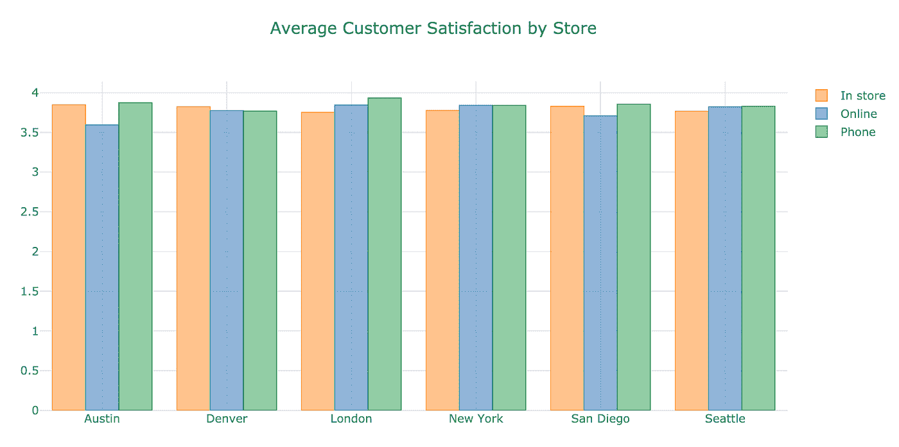
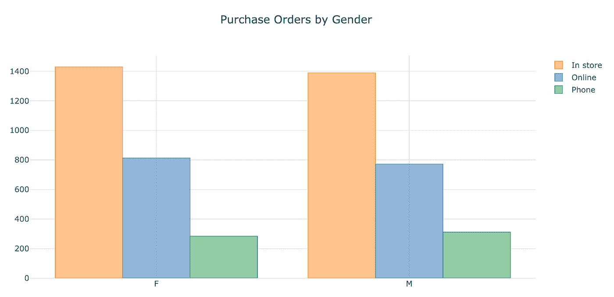
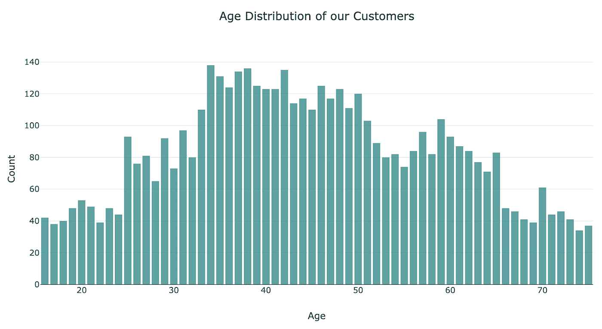

# 从 MongoDB 绘制数据

> 原文：<https://towardsdatascience.com/graphing-data-from-mongodb-99c3722650da?source=collection_archive---------12----------------------->


## 本指南将带您了解如何从 Jupyter 笔记本连接到您自己的 MongoDB 实例，获取您的数据并绘制它，所有这些都是用 python 完成的。

# 介绍

灵活的 NoSQL 数据库可以处理大量的非结构化数据，并且可以灵活地增加或减少存储容量而不造成损失，它将逐渐取代关系数据库。

MongoDB 是 NoSQL 数据库中的佼佼者之一，能够满足在多个开发阶段快速灵活地访问数据的业务需求，尤其是在实时数据占主导地位的情况下。

注意，我不打算介绍 MongoDB 的安装和数据库的设置，因为已经有大量的文档介绍了这方面的内容。

## 设置全局变量

如上所述，假设您已经在 Atlas 上运行了一个 MongoDB 数据库。在 MongoDB 上的*集群*下，点击相关数据库上的*连接*。有 3 种不同的方法连接到数据库。如果您还没有，那么您需要将您自己的 IP 地址加入白名单，并为这个特定项目创建一个 MongoDB 用户。

选择第二个选项— *连接您的应用程序*。选择 Python 作为你的驱动，选择 *3.6 或更高版本*作为你的版本。将连接字符串复制到剪贴板。

在首选编辑器中打开 bash 概要文件，并输入以下内容:

```
export 'MONGO_URI' = "YOUR_CONNECTION_STRING"
```

用刚才复制的连接字符串替换“YOUR_CONNECTION_STRING”。在连接字符串中，您还必须替换为当前用户的登录密码。

从命令行运行:

```
source ~/.bash_profile
```

## 安装 Anaconda

现在，为了使本指南可移植并可在任何机器上运行，我首先需要创建一个虚拟环境。查看我们之前关于安装 Anaconda 发行版的指南:

[用 Anaconda 安装 Jupyter】](https://docs.kyso.io/guides/jupyter-with-anaconda)

[/guides/巨蟒/巨蟒](https://docs.kyso.io/guides/jupyter-with-anaconda)

## 创建虚拟环境

我们将运行以下命令来创建 python3.7 环境。创建我们的虚拟环境:

```
conda create -n mongodb-playground python=3.7 -y
```

并启动它:

```
conda activate mongodb-playground
```

我们还需要以下库来连接到 Mongo 4.0:

```
conda install pymongo==3.8 dnspython ipykernel -y
```

下一个命令确保我们的 Jupyterlab 实例连接到这个虚拟环境:

```
python -m ipykernel install --user
```

## 附加安装

稍后，一旦我们获取了数据，我们将需要绘制图表。鉴于其相对简单的语法和交互性，我们通常建议在 python 中使用 plotly。

为了在 jupyterlab 中使用，我们需要安装 JupyterLab 和 ipywidgets 包:

```
conda install -c conda-forge jupyterlab-plotly-extension -y
```

Plotly 有一个名为*袖扣*的熊猫包装器(数据处理库)，目前它与 plotly 的最新版本存在兼容性问题。目前解决这个问题的方法是降级 plotly 并使用以下命令安装袖扣。一旦你看到用袖扣生成图形是多么容易，你就会明白为什么我们要经历这种麻烦。袖扣团队已经为修复工作努力了一段时间，但还没有结果。

从 2019 年 9 月起，这将帮助您启动并运行:

```
conda install -c conda-forge plotly=2.7.0 -y
conda install -c conda-forge cufflinks-py -y
```

现在我们可以用以下方法旋转 Jupyterlab:

```
jupyter lab
```

在启动时，您可能会得到一个推荐构建的提示——我们上面运行的 jupyterlab-plotly-extension 安装。点击*构建*，等待完成。

# 在朱庇特

## 正在连接到 MongoDB

让我们首先导入我们需要的库:

```
import os # to create an interface with our operating systemimport sys # information on how our code is interacting with the host systemimport pymongo # for working with the MongoDB API
```

然后，我们连接到我们的 MongoDB 客户端:

```
client = pymongo.MongoClient(os.environ['MONGO_URI'])
```

注意，我们可以调用`'MONGO_URI'`，因为我们已经在`~/.bash_profile`中将连接字符串设置为环境变量。

## 访问我们的数据

现在让我们访问一个数据库，在本例中是 *sample supplies。*

```
db = client.sample_supplies
```

一个[集合](http://www.mongodb.org/display/DOCS/Collections)是存储在 MongoDB 数据库中的一组文档，大致相当于关系数据库中的一个表。获取一个集合的工作方式与我们上面访问数据库的方式相同。在这种情况下，我们的集合称为*销售*。

```
collection = db.sales
```

让我们通过获取单个文档来测试我们是否成功。下面的方法返回与我们的查询匹配的单个文档。

```
test = collection.find_one()
```

## 将我们的数据载入熊猫

[Pandas](https://pandas.pydata.org/) 提供了快速、灵活、富于表现力的数据结构，旨在使处理“关系”或“标签”数据变得既简单又直观，可以说是最强大、最灵活的开源数据分析/操作工具。

我们可以用一个简单的命令将我们收集的全部数据转换成熊猫数据帧:

```
data = pd.DataFrame(list(db.sales.find()))
```

DataFrame 中的一些列仍然被格式化为字典或 PyMongo 方法。出于本指南的目的，让我们看一下*客户*列——这是一个字典，包含针对每个客户的年龄和性别的 2 个键值对。

我们需要拆分该列，使*年龄*和*性别*成为它们自己的列。为此，我们可以使用`.apply(pd.Series)`方法将字典转换成它自己的数据帧，并将其连接到我们现有的数据帧，所有这些都在一行中完成。

```
df = pd.concat([data.drop(['customer'], axis=1), data['customer'].apply(pd.Series)], axis=1)
```

例如，我们可以对*项目*列做类似的事情，但是这超出了本指南的范围。

# 绘制我们的数据

好了，让我们开始绘制数据来回答一些基本问题。首先，我们将导入我们的绘图库。

```
import plotly.plotly as py
import plotly.graph_objs as go
import plotly
from plotly.offline import download_plotlyjs, init_notebook_mode, plot, iplot
import cufflinks as cf
cf.set_config_file(offline=True)
```

下面是链接到[](https://plot.ly/python/)**和 [*袖扣*](https://plot.ly/ipython-notebooks/cufflinks/) 的文档。**

****定义您的业务问题****

**你想回答什么商业问题？我们为样本数据列出了一些示例问题:**

1.  **商店的平均顾客满意度是多少——这是否会受到购买方式的影响，是通过电话、店内还是网上购买？**

```
**df.groupby(['storeLocation', 'purchaseMethod'], as_index=True)['satisfaction'].mean().unstack().iplot(kind='bar', mode='group', title='Average Customer Satisfaction by Store')**
```

****

**Average satisfaction ratings across all our stores.**

**2.按性别分类，收到的采购订单数量如何——有什么重大差异吗？**

```
**df.groupby(['gender', 'purchaseMethod'], as_index=True)['_id'].count().unstack().iplot(kind='bar', mode='group', title='Purchase Orders by Gender')**
```

****

**Men make more purchases over the phone, women in-store.**

**3.我们所有顾客的年龄分布是怎样的？**

```
**df['age'].iplot(kind='hist', color='rgb(12, 128, 128)', opacity=0.75, bargap = 0.20,title="Age Distribution of our Customers", xTitle='Age', yTitle='Count')**
```

****

**The largest group falls within the 35–42 age range.**

# **过帐到 Kyso**

**好了，我们已经回答了一些关于业务指标的基本问题。是时候将我们的分析发布到我们团队的 Kyso 工作区了，这样每个人都可以从我们的见解中学习并将其应用到各自的角色中。**

*   **我们可以从本地机器推送到我们组织的 Github 存储库，并与 Kyso 同步:[将 Github repo 连接到 Kyso](https://docs.kyso.io/posting-to-kyso/connect-a-github-repo-to-kyso)**
*   **由于我们已经在 Jupyterlab 中，我们可以安装 Kyso 的发布扩展，并从这里直接将我们的笔记本发布到 Kyso:[使用 Kyso 的 Jupyterlab 扩展](https://docs.kyso.io/posting-to-kyso/kysos-jupyterlab-extension)**
*   **如果这是一次性分析，而不是定期运行，我们也可以在 [Kyso](https://kyso.io/) 应用程序中手动上传笔记本。**