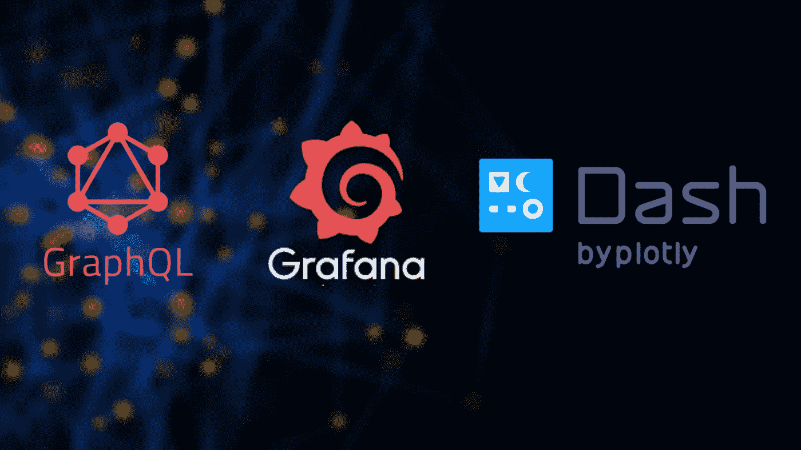
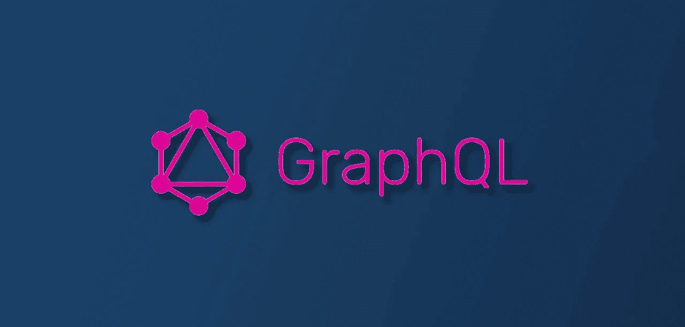
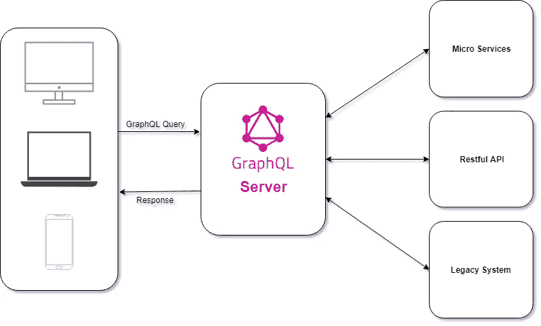
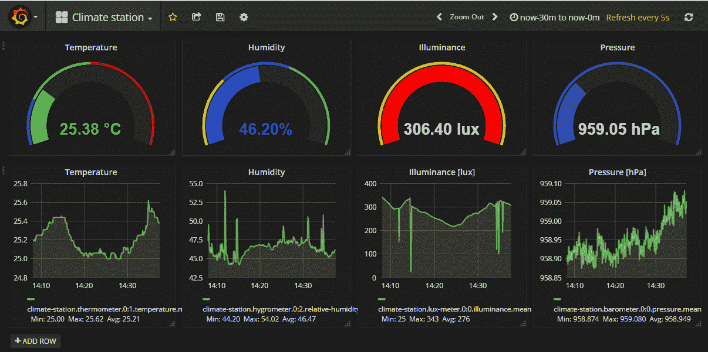
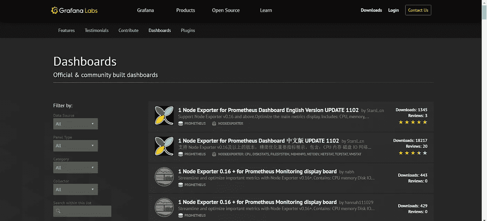
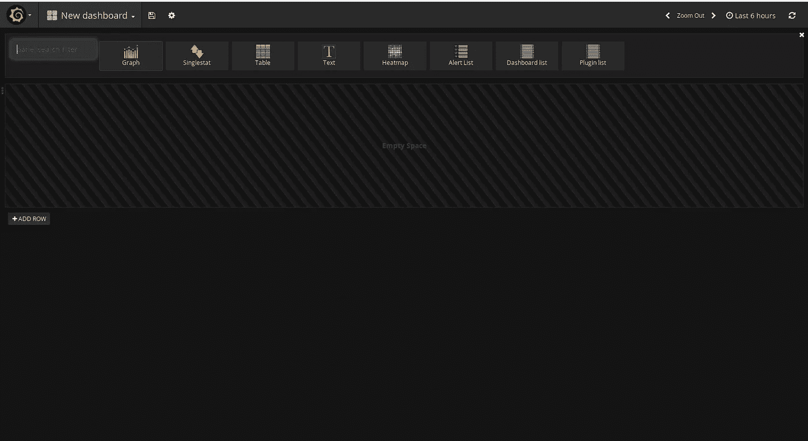
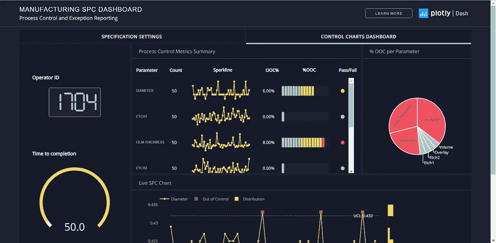

# GraphQL、Grafana 和 Dash

> 原文：<https://towardsdatascience.com/graphql-grafana-and-dash-7aa96d940f1b?source=collection_archive---------6----------------------->

如果你对**数据科学**、**数据操作**或**数据可视化**感兴趣，这篇文章正适合你。我相信你已经听说过我在上面的主题中使用的名字。在这篇文章中，我将首先详细介绍每一个，然后进行比较。



GraphQL, Grafana and Dash

从上面三个中除了 GraphQL 另外两个用于数据可视化。今天的数据可视化工具已经超越了 Microsoft Excel 电子表格中使用的标准图表和图形，以更复杂的方式显示数据，如信息图、刻度盘和仪表、地理图、迷你图、热图以及详细的条形图、饼图和散点图。这些图像可能包括交互功能，使用户能够操作它们或深入数据进行查询和分析。还可以包括用于在数据更新或预定义条件发生时提醒用户的指示器。数据可视化已经成为现代商业智能的事实标准。

为了以任何方式可视化数据，首先你必须从某种来源提取数据。它可以是传感器、API、数据库等的系统。它还包括理解数据的不同特征，并得出它们有意义的、重要的和有趣的属性。数据提取还用于执行探索性分析，并从数据中提取相关信息。有许多方法和技术用于数据操作，如 Pandas、R、SQL、GraphQL 等。所以 GraphQL，这是我选择的主题之一，也是一种数据提取方法，但与其他方法完全不同。

所以我们从第一个开始，GraphQL。

# GraphQL 是什么？

如今，大多数应用程序都需要从存储在数据库中的服务器获取数据。API 的职责是为存储的数据提供一个满足应用程序需求的接口。或者，应该对通过 API 获取的数据进行某种过滤，以满足应用程序的需求。



大多数人将 GraphQL 混淆为一种数据库技术。这并不十分准确，因为 GraphQL 是一种用于 API 而不是数据库的**查询语言**。从这个意义上说，它是数据库不可知的，可以有效地用于任何使用 API 的环境中。它支持声明性数据获取，因此与 React/React Native 完美结合，作为构建用户界面的声明性框架。GraphQL 可以补充或完全取代 REST APIs 的使用。

REST 和 GraphQL 的主要区别在于 RESTful APIs 有**多个端点**返回**固定数据结构**，而 GraphQL 服务器只公开一个**单个** **端点**并返回**灵活数据结构**。



使用 RESTful API，您最终会得到您不需要的数据。例如，当调用**环境/构建/ < id >** 端点时，您将获得与该特定构建相关的所有数据。您可以获得类似于**创建日期、更新日期、状态等数据**。但是我们需要的只是作者的名字。这是一个在 RESTful API 中**过度获取**的明显例子。

在**环境/构建/ < id >** 的情况下，不足以检索我们正在寻找的内容。为了获得 build 所属的代码库，我们必须调用另一个端点***environment/build/<id>/code bases**。这种情况称为**欠取**。*

*GraphQL 使用自己的类型系统来定义一个 API 的模式，其语法称为**模式定义语言** (SDL)。模式充当服务器和客户机之间的桥梁，定义客户机如何访问数据。*

*一旦定义了模式，前端和后端开发人员就可以独立工作了，因为前端可以很容易地用模拟数据进行测试。前端也可以从模式中获得有用的信息，比如它的类型、查询和突变。该模式还提供了类型安全，这对于前端和后端开发来说是一个优势，因为它可以及早发现类型错误。*

***示例查询:***

```
*query {
  books {
    id
    title
    author
    isbn
    price  } 
}*
```

*这里我们得到了一个端点，在这个端点上，我们可以获得所有必要的数据，而不会通过 GraphQL 服务器进行任何过量或不足的获取。*

*许多流行的编程语言支持 GraphQL。*

*   *[C# /。网](https://graphql.org/code/#c-net)*
*   *[走](https://graphql.org/code/#go)*
*   *[Groovy](https://graphql.org/code/#groovy)*
*   *[Java](https://graphql.org/code/#java)*
*   *[JavaScript](https://graphql.org/code/#javascript)*
*   *[科特林](https://graphql.org/code/#kotlin)*
*   *[PHP](https://graphql.org/code/#php)*
*   *[Python](https://graphql.org/code/#python)*
*   *[红宝石](https://graphql.org/code/#ruby)*
*   *[Scala](https://graphql.org/code/#scala)*

*除了数据获取方面的进步，性能优化、版本控制和易于启动也是您应该试用 [GraphQL](https://graphql.org/) 的几个原因。*

# *Grafana 是什么？*

**

*Climate Station Dashboard using Grafana ( [https://developers.bigclown.com/integrations/grafana-for-visualization](https://developers.bigclown.com/integrations/grafana-for-visualization) )*

*Grafana 是一个开源的仪表板、分析和监控平台，可以连接各种资源，如 Elasticsearch、Influxdb、Graphite、Prometheus、AWS Cloud Watch 等。最重要的是，Grafana 能够将几个数据源放在一个仪表板中，并添加将托管单个面板(在 UI 中)的行。*

*Grafana 允许您查询、可视化、提醒和了解您的指标，无论它们存储在哪里。您可以使用 Grafana 创建、探索和共享仪表板，培养数据驱动的文化。*

*如果我们谈论认证，Grafana 可以与 LDAP，Google Auth，Grafana.com，Github 集成。然而，如果您的公司使用 SSO(单点登录)之类的技术来处理身份验证，Grafana 可以让它轻松地与您现有的工作流程一起工作。*

*Grafana 也已经创建了由社区构建的仪表板。我们可以通过数据源、面板类型、类别和收集器来选择。你可以在这里看看那些仪表盘[。](https://grafana.com/grafana/dashboards)*

**

*如果您有与 Grafana 兼容的数据源，您所要做的就是设置这些数据源，然后创建您需要的面板，以便可视化您想要显示的内容。这里，您将从一个只有一行的空仪表板开始。在那一行你可以放任何种类和任何数量的面板，每个面板负责一个视觉。*

**

*您可以选择您喜欢的面板，并将其添加到您的仪表板中。就这么简单。您可以选择面板的类型，并探索与之交互的方式。您可以轻松地创建动态和可重用的仪表板，其中变量以下拉列表的形式显示在仪表板顶部，您可以在其中进行更改和交互。此外，您可以通过查询来深入查看视图。除此之外，您还可以使用拆分视图进行相互比较。*

*您可以轻松创建实时仪表板，甚至可以单独浏览日志。另一个有用的特性是给用户空间来为他们的重要指标定义警报规则。Grafana 将持续寻找最新数据，并向 Slack、PagerDuty、VictorOps 等系统发送通知**。***

*Grafana 是一个非常用户友好的工具，并且有许多吸引人的设计可供选择。*

# *Dash 是什么？*

> *[*Dash*](https://plot.ly/products/dash) *是一个开源的 Python 库，用于创建反应式的、基于 Web 的应用程序。两年前，Dash 开始在 GitHub 上公开进行概念验证。我们在网上保留了这个原型，但是 Dash 的后续工作是秘密进行的。我们使用来自银行、实验室和数据科学团队的私人试验的反馈来指导产品的发展。* ***今天，我们很兴奋地宣布 Dash 的首次公开发布，它既是企业级的，也是 Plotly 开源工具的一流成员。*** *Dash 现在可以通过* `*pip install dash*` *从 Python 的包管理器中下载——它是完全开源的，并且得到了 MIT 的许可。你可以在这里找到* [*入门指南*](https://plot.ly/dash) *和 GitHub 上的* [*Dash 代码*](https://github.com/plotly/dash) *。**

**

*Sample dashboard from the Dash App Gallery*

*Dash 使数据科学团队能够专注于数据和模型，同时仍能生产和部署企业就绪型应用。通常需要后端开发团队完成的工作，前端开发人员都可以通过 Dash 完成。*

*Dash 是一个基于 Python 的框架，主要用于创建包含大量数据可视化的 web 应用程序。顾名思义，Dash 专门用于创建基于 web 的仪表板应用程序。但这是在一些 Python 库的帮助下，通过使用纯 Python 或 R 实现的。*

*这特别适合任何使用 Python 或 r 语言处理数据的人。Dash 抽象出了构建基于 web 的交互式应用程序所需的所有技术和协议，因此对开发人员来说更加方便。他们目前有一个开源版本和一个企业版本。*

*我们可以用吸引人的主题和任何类型的图表制作令人敬畏的数据可视化应用程序。美妙之处在于，所有这些都是在纯 Python 或 r 中完成的。此外，当我们使用 Dash 时，您会有更多的灵活性，因为我们可以使用 Python 从头开始创建仪表板。以便您可以创建自己的自定义仪表板。*

*Dash 基于 Flask、Plotly.js 和 React.js 编写，非常适合构建带有极具吸引力的仪表板的数据可视化应用程序。它特别适合任何使用 Python 处理数据的人。*

*Dash 应用程序呈现在 web 浏览器中，因此它们可以跨平台和移动使用。Dash 是一个高级框架，它抽象了图形、表格等 UI 组件的低级实现。*

***以下是使用 Dash 进行数据可视化的更多优点**:*

*   *能够以可打印的 pdf 或交互式分析 web 应用程序的形式创建报告*
*   *自动化报告和监控流式数据流*
*   *历史存档、版本控制和状态跟踪，有助于审核和合规性，并创建机构记忆*

*由于 Dash 与我们之前讨论的两个框架相比是一个相对较新的框架，所以您可以获得关于 Dash 以及如何使用 Dash[T3(此处为 T5)创建仪表板的总体描述性知识。](https://medium.com/better-programming/build-an-interactive-modern-dashboard-using-dash-ab6b34cb515)*

# *比较*

*与 Dash 和 Grafana 相比，GraphQL 显然走的是一条不同的道路，因为它是关于从你存储的任何地方查询必要的数据。GraphQL 帮助我们得到我们所需要的，不多也不少。当我们考虑像仪表板这样的应用程序时，这对于提高效率非常有用。另一件事是，尽管许多专家和创业公司希望能够说服每个人，GraphQL 不会取代 REST。但这确实是一种简单、高效和有效的查询和操作数据的方式。*

*Grafana 和 Dash 可以被认为是将您从不同来源收集的数据可视化的方法。在 Grafana 中，您首先通过单击仪表板链接创建一个新的空白 Grafana 仪表板。Grafana 配有各种面板，可以添加到您的仪表板上。除非某种类型的图形与面板相关联，否则面板不是很有用。图表依赖于数据，因此您添加到仪表板的每个面板都将与一个数据源相关联。因此 grafana 将允许您添加预定义的面板和图形，并连接一个数据源。*

*但是在 Dash 中，我们可以从头开始构建我们自己的非常定制的仪表板。但是在绘制图表和可视化数据时，这真的很容易。我们可以使用数据帧，然后将它们提供给 Dash 中的图形元素。所以 Dash 的可定制性更强，基于 Python。它基于 React 和 Flask，而 Grafana 是用 Go 编程语言(由 Google 创建)和 Node.js 编写的。即使你可能认为使用 Dash 可能需要更多的时间和精力，但如果你熟悉 Python 或 r，这并不困难。*

*总而言之，我的建议是，如果你需要创建一个仪表板，可以尝试 Grafana 和 Dash。什么是最好的取决于你的要求。但是它们都给你惊人的时尚视觉效果，既有知识性又有吸引力。*