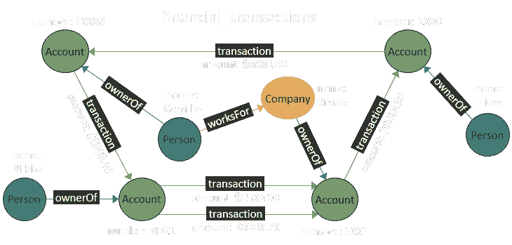
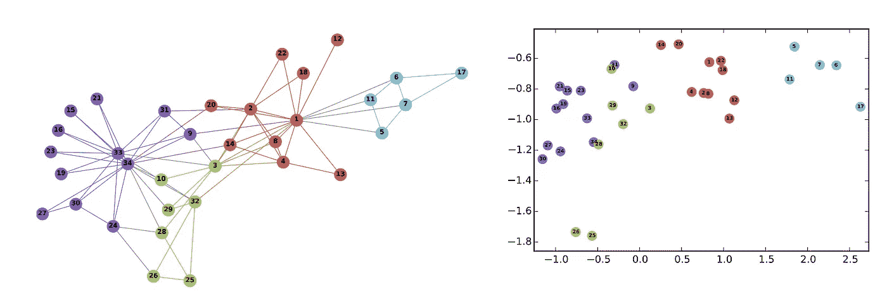

# 欺诈检测的图表分析

> 原文：<https://towardsdatascience.com/graphs-analytics-for-fraud-detection-83ee3af81ec7?source=collection_archive---------14----------------------->

Photo by [Ariel Besagar](https://unsplash.com/@arielbeagar?utm_source=unsplash&utm_medium=referral&utm_content=creditCopyText) on [Unsplash](https://unsplash.com/s/photos/hacker?utm_source=unsplash&utm_medium=referral&utm_content=creditCopyText)

基于监督学习技术的欺诈检测系统(FDS)将无法跟踪新型欺诈者。由监督和非监督技术组合而成的解决方案将确保 FDS 能够防范常见的欺诈模式和新型欺诈模式。

欺诈检测中的无监督技术通常是异常检测的一种变体。基于图表的方法很有希望通过[关联数据分析](https://www.graphgrid.com/blog/connected-data-analytics-basics/)来检测异常。

图表是金融领域的一种有用的抽象。节点代表实体，而边编码包括交易的关系。图表为理解实体之间的联系提供了一种自然的方式。由于以下原因，图比其他异常检测技术具有显著的优势[1]。

*   感兴趣的实体是相关和依赖的。对这种关系进行编码对于 FDS 应用程序非常重要。图自然地将节点之间的关系表示为边，这允许更丰富的信息表示。
*   异常本身的相互关系。例如，一个经历了机会主义欺诈的人可能会告诉她的朋友(图上的相关实体)，他们也可能会这样做。
*   图对对抗性攻击更具鲁棒性。图表代表长期相关性，即使是高级欺诈者也很难模仿。

这种图表的一个例子如下所示。

Image Credit [PGQL](http://pgql-lang.org/spec/1.2/)

有多种方法可以检测图上的异常。一些常用的方法是基于结构的方法(egonet [2])、基于社区的方法(Autopart [3])和基于关系学习的方法(关系依赖网络[4])。

尽管上面的方法很有希望，但是由于稀疏性的问题，它不能在大型图上扩展。例如，一个现实金融系统中所有实体的图表将有数百万个稀疏连接的节点。即使使用现代图形数据库，这些方法的时间复杂度对于实时欺诈检测系统来说也太高了。

为了克服稀疏性的挑战，同时保留图形表示的优势，网络表示学习(NRL)等新方法越来越受欢迎[7]。在这种方法中，图嵌入被用来学习大规模网络上顶点的潜在表示。然后，这些表示用于下游异常检测或分类任务。Node2vec [5]就是这样一种方法，它允许“将节点映射到特征的低维空间，最大化保存节点的网络邻域的可能性。”

考虑下面的图像。左图显示了相互关联的账户和交易。左边的图像表示该图在二维空间上的映射。这种转换试图保留图的最重要的优点，同时使图可以被 ML 算法访问。NRL 是无监督的算法，因此通过消除对人工监督的需要，在实际金融网络中具有主要优势。

Image Credit DeepWalk [6]

**用于异常检测的图形神经网络**

来自斯坦福的开源项目 GraphSAGE 是一个基于深度神经网络的 NRL 工具包。该工具包在 Tensorflow 中实现，使其成为开发 FDS 异常检测系统的理想平台。

GraphSAGE 可用于开发实体事务图中每个节点的嵌入。这相当于上面描述的 Node2Vec 方法。一旦这种嵌入可用，这些新特征就被用于使用标准异常检测技术(例如隔离森林)来预测异常[8]。

[1]:[https://www . Andrew . CMU . edu/user/lakoglu/pubs/14-dami-graphanomalyservice . pdf](https://www.andrew.cmu.edu/user/lakoglu/pubs/14-dami-graphanomalysurvey.pdf)

[2]:[https://www . cs . CMU . edu/~ abeu tel/CCS 2015 _ tutorial/slides/010 subgraph . pdf](https://www.cs.cmu.edu/~abeutel/ccs2015_tutorial/slides/010Subgraph.pdf)

【3】:[https://citeseerx.ist.psu.edu/viewdoc/download?doi = 10 . 1 . 1 . 130 . 841&rep = re P1&type = pdf](https://citeseerx.ist.psu.edu/viewdoc/download?doi=10.1.1.130.841&rep=rep1&type=pdf)

【4】:[https://arxiv.org/abs/1410.7835](https://arxiv.org/abs/1410.7835)

【5】:[https://cs.stanford.edu/~jure/pubs/node2vec-kdd16.pdf](https://cs.stanford.edu/~jure/pubs/node2vec-kdd16.pdf)

[6]:[https://arxiv.org/pdf/1403.6652.pdf](https://arxiv.org/pdf/1403.6652.pdf)

[7]:http://snap.stanford.edu/proj/embeddings-www/

[8]:[https://towards data science . com/outlier-detection-with-isolation-forest-3d 190448 d45e](/outlier-detection-with-isolation-forest-3d190448d45e)