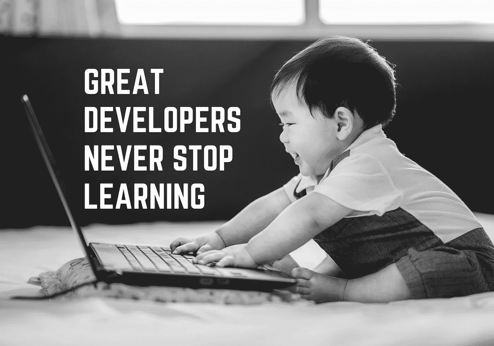

# 伟大的开发人员从不停止学习

> 原文：<https://towardsdatascience.com/great-developers-never-stop-learning-77b9ce867eac?source=collection_archive---------4----------------------->

## it 专业人员培养持续学习心态的 7 种方法



# 技术在向前发展，您也应该向前发展！

作为软件工程师、开发人员或架构师，在我们工作的技术和领域中保持最新和相关是至关重要的。我们几年前在大学学习的一些技能已经过时了，所以除非我们掌控自己的学习，否则我们将失去竞争力。此外，我们经常为了项目期限而牺牲学习和发展。

这种短期思维是要付出长期代价的！

尽管在这个瞬息万变的信息技术世界里，不可能跟上所有事情的发展速度，但我们需要选择几个我们感兴趣的领域(无论这些领域是与我们目前的工作相关，还是与我们未来想要的工作相关)，并留出时间来提升技能。

> 持续学习的第一步是留出时间！

在这篇文章中，我将分享我用来磨砺技能的方法，以及我列表中的其他一些方法。

# ❶——阅读的艺术

## 书

我读了很多！无论采用何种方法(传统的还是数字的)，拥有一个庞大的图书馆都是必不可少的，因为它们提供了对相关主题的**深刻理解**。我避免购买任何特定技术的书籍，因为它们有过期日期:当它们涵盖的技术的新版本发布时，或者不同的做事方法变得更受欢迎时，它们就会过时。相反，我倾向于:

*   **概念性**书籍，即涵盖新(或旧)概念、范例或实践的书籍，如行为驱动开发、面向对象设计模式、建模等。
*   **行为学**书籍，主题包括项目管理、SDLC、软技能、领导力等，
*   有影响力的书籍，这是每个开发人员的必读书籍，因为它们在技术对话中经常被提及。一些例子有: [*神话中的人月*](https://www.amazon.co.uk/Mythical-Man-Month-Software-Engineering-Anniversary/dp/0201835959) ， [*干净的代码*](https://www.amazon.co.uk/Clean-Code-Handbook-Software-Craftsmanship/dp/0132350882) ， [*设计模式:可复用的面向对象软件元素*](https://www.amazon.co.uk/Design-patterns-elements-reusable-object-oriented/dp/0201633612/) ， [*领域驱动设计*](https://www.amazon.co.uk/Domain-Driven-Design-Tackling-Complexity-Software/dp/0321125215) ， [*务实的程序员*](https://www.amazon.co.uk/Pragmatic-Programmer-journey-mastery-Anniversary/dp/0135957052) 。

我的奥赖利订阅服务物有所值，因为它提供了大量技术书籍(以及其他媒体，如视频、会议、教程等)的点播服务。虽然我更喜欢纸质书，但快速浏览一本书的能力确实很方便。

## 博客

阅读博客是我最喜欢的保持最新状态的方法之一:我完全尊重其他开发人员，他们花时间分享他们的个人经验、观点、使用特定技术的成功和失败。一些最好的教程是由业余技术作者编写的，隐藏在谷歌搜索的深处！我使用**书签应用**(如 Pocket 和 OneNote)将它们保存到我的个人文件夹中，然后在我通勤或工作会议间隙阅读它们。

> 博客的货币是真实性和信任——贾森·卡拉卡尼斯

只要我们用批判性思维来区分好质量的博客和那些匆忙写的博客(经常是半生不熟的想法甚至误导)，那么博客就能很好地帮助我们在新的领域发展和获得洞察力。

[Medium](https://medium.com) 是技术诀窍文章的好去处，到目前为止，我最喜欢的出版物是[](https://towardsdatascience.com)**(cc:*[*TDS 团队*](https://medium.com/u/7e12c71dfa81?source=post_page-----77b9ce867eac--------------------------------) *)* 。其他博客还有 [*编码恐怖*](https://blog.codinghorror.com)[*西雅图数据佬*](https://www.theseattledataguy.com)*(cc:*[*SeattleDataGuy*](https://medium.com/u/41cd8f154e82?source=post_page-----77b9ce867eac--------------------------------)*)*[*DZone*](https://dzone.com)等。*

## *推特*

*在社交媒体上关注技术影响者是另一种保持技术更新的流行方式。带着问题接触他们对于提高我们的学习是至关重要的。他们保持“行业领导者”地位的一个原因是，他们乐于分享资源和经验，而且他们都欢迎想向他们学习的人参与进来。*

*谁在重塑我们的行业是一个百万美元的问题。我不会在这里给出任何建议，因为我们都有不同的兴趣，而且确实有这么多鼓舞人心的领导者，但你总能看到我以为榜样的[。](https://twitter.com/semikasemika)*

**

*Photo by [Anna Demianenko](https://unsplash.com/@annademy?utm_source=medium&utm_medium=referral) on [Unsplash](https://unsplash.com?utm_source=medium&utm_medium=referral)*

# *❷——从狂热的读者到狂热的作家*

*在过去的 9 个月里，我开始了自己的博客。起初，这令人望而生畏:我错误地认为只有有独到见解的专家才应该写博客，或者我的观点可能不够好(*你说是骗子综合症？*)，但我很快意识到，我首先是为自己写作——这是**记录自己学习**的一种方式，但也为热门主题添加了我的**个人印记**。*

> *教等于学两次——约瑟夫·儒贝尔*

*更不用说，这是一个很好的方式来拥有一个**在线存在**，建立我在某个领域的经验和激情，最重要的是从那些友好阅读和参与我的内容的人那里获得实时反馈**！***

```
*🔔 **Did you know?** Based on the [learning pyramid](http://thepeakperformancecenter.com/educational-learning/learning/principles-of-learning/learning-pyramid/), the top 3 ways to retain information, are:
1\. Teaching others   : 90%
2\. Practice by doing : 75%
3\. Group discussions : 50%*
```

# *❸——听好了！*

*播客是我的主要生活方式之一:它们是为**多任务处理**(做饭、熨衣服、跑腿等)量身定制的，它们的一口大小的格式非常适合我的日常工作。这是我听的一些精选，涵盖了我选择的技术堆栈。Net)以及通用的 I.T .更新: [*放牧码*](https://herdingcode.com) ， [*。网石！*](https://www.dotnetrocks.com)[*Hanselminutes*](https://www.hanselminutes.com)[*软件工程广播*](https://www.se-radio.net)[*编码块*](https://www.codingblocks.net)[*本周在理工*](https://twit.tv/shows/this-week-in-tech)[*开发者茶会*](https://spec.fm/podcasts/developer-tea)[*软件工程日报*](https://softwareengineeringdaily.com) 。*

# *❹——参加在线课程*

*不要误解我的意思:我更喜欢亲自动手，而且我确实通过实践学到了很多东西！这是我的第一选择——永远如此！但是我现在有一个年轻的家庭，所以我的个人时间很少。为了开始学习一项新技术，我观看视频:它们提供了理论和实践之间的完美平衡，作为一名视觉学习者，我发现它们真的很有效。我以更快的回放速度观看它们，以最大限度地获取更多的内容。其中一些还提供行业认证。*

*有无穷无尽的在线课程可以钻研，但这些是我更常用的资源/平台: [*PluralSight*](https://www.pluralsight.com) ， [*Coursera*](https://www.coursera.org) ， [*可汗学院*](https://www.khanacademy.org) ， [*edX*](https://www.edx.org) 。*

**

*Photo by [Christin Hume](https://unsplash.com/@christinhumephoto?utm_source=medium&utm_medium=referral) on [Unsplash](https://unsplash.com?utm_source=medium&utm_medium=referral)*

# *❺——熟能生巧*

## *概念证明(POC)*

*作为一名架构师，我需要证明技术项目决策的合理性，所以我求助于开发 POC。他们帮助我体验相关技术的**挑战或优势**，以便提供前瞻性研究，同时我也更擅长**评估**(不要轻视‘简单’任务需要多长时间来开发)。根据我的其他承诺，我尝试一次专注于一个项目(例如数据科学、ReactJs、大数据等)，并在该领域制作一个原型。看看我的速度，我每年完成 6 到 8 次概念验证。不算太寒酸！*

## *宠物项目*

*宠物项目允许我们在一个**安全的环境**中玩耍、实验和学习，因此我们可以将所学应用到真实的项目中。事实上，它们是没有压力的真实项目:没有截止日期，没有技术限制，没有对需求的控制(由于预算原因，大部分需求都被削减了)，没有模式的捷径。我们是老板——我们制定规则！*

## *开放源码*

*为开源项目做贡献是提升我们的公众形象和实践的一个很好的方式:我们只需找到我们感兴趣的项目，下载源代码，检查代码库，确保我们可以端到端地运行它，调试通过，我们就可以开始工作了。*

*虽然这是一个我没有积极参与的领域(即没有签入任何更改)，但我体验到的主要好处是，我可以看到最好的开发人员在那里进行编码——这本身就是一种奇妙的学习体验！*

*❗️点击查看 GitHub [上的趋势。
❗️GitHub 也是一家出色的内容创作服务公司。考虑将这些](https://github.com/trending)[十大回购](/top-10-github-repos-to-bookmark-right-now-b0bc62436ffc)标上书签。*

```
*🍭 **Double Whammy:** You can make your Pet Projects Open Source and double up on the benefits described above!*
```

## *网上群体*

*通过在像 Stack Overflow 这样的网站上提问和回答问题，成为一个在线社区的活跃成员，这不仅是一个学习的好机会，也是帮助他人学习的好机会。促进代码和知识共享提供了巨大的成就感。*

## *卡塔斯*

*形是简单的编码练习，也就是说，它们可以在几分钟内理解，但足够复杂，不会很快解决——这个术语是由《实用程序员》一书的合著者迪夫·托马斯创造的，包含了日本武术中的形的概念。我曾经尝试过这种方法，但是很快就失去了兴趣。我更喜欢看真实的问题和大局，而不是像拼图一样的个人练习。对于有经验的程序员来说，我认为本文中提到的其他方法更加强大。
不过，一个武士道的资源是 kata.softwarecraftsmanship.org[](http://codekata.pragprog.com)*。**

**❗️如果这种事情让你觉得有趣，也可以看看这些平台: [*代码厨师*](https://www.codechef.com) ， [*编码者字节*](https://coderbyte.com/) 和 [*黑客等级*](https://www.hackerrank.com/) 。**

## **黑客马拉松**

**黑客马拉松是类似短跑的马拉松，允许开发人员和 it 专业人员在软件项目上合作，并创建工作原型、应用程序功能或集成(API)。这些好处已经在 Quora 中很好地列出来了，所以我在这里就不多说了！我从来没有参加过，但这是我想尝试的事情之一！**

> **昨天又新又热的东西今天已经过时了！**

# **❻——利用你的同事网络**

**虽然从教科书和网上资源中学习有很多好处，但没有什么能比我们与同事的日常互动更好。我很幸运能和一些最好的 C#开发人员一起工作，他们是我灵感和学习的源泉——*谢谢大家*👍！**

**我逐渐意识到，没有所谓的愚蠢问题:我们都知道这句老话，但我们仍然认为这是理所当然的！问题实际上是大多数学习的基础，因为它们成为对话的基本起点。**

**有几个令人信服的理由为什么**结对编程**也能增强我们的学习，但我发现的最大好处是我们被迫构建我们的思想，让我们在试图向他人解释之前彻底理解自己的想法。
最后，**代码评审**是通过获得对代码的直接反馈来提高我们知识的最好方式。它们不是关于暴露我们自己的局限性，而是验证我们的想法或者挑战它们。**

```
**💡 **Pro Tip:** If there is someone at work whose coding wisdom and skills you admire, consider asking them if they might mentor you.**
```

# **❼ —社交**

## **参加行业活动**

**参加会议或演示是了解行业发展方向、其他公司正在做什么、哪些技术正在被采用、将技术引入内部的最佳实践等的绝佳方式。与其他开发人员建立关系网也是一个额外的收获——与其他开发人员交换想法是一种保证变得更敏锐和扩大你的专业联系的模式！**

**这种活动可能会很贵，所以最好是你的公司赞助你。否则，你可以选择在线观看录制的会议，一旦他们发表。下面是我在各自的 YouTube 频道上看的:[*GOTO Conferences*](https://www.youtube.com/user/GotoConferences)[*奥莱利*](https://www.youtube.com/user/OreillyMedia/featured)[*思想著作*](https://www.youtube.com/user/ThoughtWorks) 。**

## **商务化人际关系网**

**LinkedIn 群组是找到志同道合的专业人士以及了解软件开发领域信息的绝佳方式。**

## **加入专业组织**

**专业组织(如英国计算机协会)定期举办培训课程，并提供全面的行业新闻、调查、职业信息、工作和活动细节(通常以折扣价)。**

**这里的问题是**我们得到了我们在**投入的东西:为了充分收获作为会员提供给我们的内在利益，我们需要投入时间积极参与。**

## **加入本地用户组**

**开发者都是内向的极客这种想法完全过时了！**

**加入本地用户组和技术社区是与其他开发者互动的一种简单方式。背景、领域和经历的多样性使这些公司与众不同。不过有一个共同点:**每个人都对编程充满热情**！因此，每个人都乐于学习和分享他们所知道的！**

## **建立自己的网络**

**你想在网络方面更进一步吗？以下是一些实用的想法:**

*   **在你的组织内建立一个技术社区**
*   **创建本地用户组**
*   **在会议上做演示或成为主题发言人**
*   **举行非正式会议或圆桌会议进行小组技术讨论**

> **成为开发人员的最佳时机！**

****

**Photo by [Tim Mossholder](https://unsplash.com/@timmossholder?utm_source=medium&utm_medium=referral) on [Unsplash](https://unsplash.com?utm_source=medium&utm_medium=referral)**

# **技能上去了才能跟上！**

**我们常常不明白，我们的职业不再是我们所受教育的最终产品，它本身就是对我们的一种教育！如果我们保持学习的习惯，我们很可能会延长我们的寿命，提高我们的就业能力。另一个常见的陷阱是用时间作为不采用持续学习的借口。我们都有时间！事实上，我们都有同样多的时间。**区别在于我们选择如何度过它！**(**↓***这是对自己的友情提醒***

**我在这里列出了一些资源，我利用它们来发展我的专业技能！希望对你也有帮助！**

**感谢阅读！**

***我定期在媒体上撰写关于领导力、技术&的数据——如果您想阅读我未来的帖子，请*[*‘关注’我*](https://medium.com/@semika) *！***