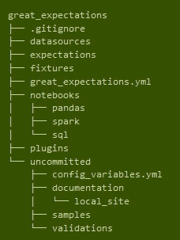

# 巨大的期望

> 原文：<https://towardsdatascience.com/great-expectations-ef9059f04995?source=collection_archive---------10----------------------->

## “在数据进入某些分析之前，验证你对数据的预期。”


Photo by [tian kuan](https://unsplash.com/@realaxer?utm_source=medium&utm_medium=referral) on [Unsplash](https://unsplash.com?utm_source=medium&utm_medium=referral)

越来越多与业务相关的决策是基于自动生成的数据做出的。仅仅测试转换源代码的正确性已经不够了。通常从不同的、快速变化的来源编译的数据的正确性也必须被检查…在最坏的情况下，由于数据质量差，可能做出错误的决定。这不一定是一个新的发现，但不幸的是，开源环境中对数据质量检查的工具支持到目前为止还不能令人满意。这篇博客展示了一种所谓的管道测试的方法和 Python 工具，正好填补了这个空白。

# 什么是管道债务？

数据作为一种原材料在企业所有领域的重要性已经广为人知。从传感器数据到来自所有这些领域的目标数据，数据仓库结构被提供了范围广泛的信息。机器学习模型基于它在训练过程中看到的数据工作。与模型在训练过程中看到的数据相差甚远的数据可能会导致错误的行为。被容易出错的来源或处理步骤篡改的数据肯定会导致错误的结果。从原始数据源到仪表板，数据集通常会经过多个过程(转换、加载、数据模型、机器学习模型)。数据质量的监控和验证在这里经常被忽略。接下来是一个新的开源工具，名为 Great Expectations，用于在运行机器学习模型或使用数字之前验证数据。

数据科学家意识到了这个问题:我们有一个仪表板，上面有来自不同数据源的关键数据。一些关键数字背后是一个机器学习模型，例如用于评分的模型。其中一个关键数字突然发生剧烈变化，以至于不再有意义，或者因为无法再计算该值而变成 NaN。

# 为什么我需要管道测试？

测试驱动开发已经成为软件开发领域的标准方法。编写单元测试是良好风格的一部分，有助于保持高代码质量和避免错误。

然而，与此同时，复杂性往往不再仅仅表现在代码本身，还表现在数据中。在运行机器学习模型期间发生的意外行为可能实际上反映了真正的异常行为，或者数据可能是错误的。通常，原因是源系统的数据模型发生了未传达的变化。

现在，机器学习模型本身由一个包含几个转换步骤的管道组成:

*   数据加载(从原始数据源或数据仓库/另一个 DBMS)
*   清洁和准备
*   聚集
*   特征
*   降维
*   数据的标准化或缩放

在所有这些步骤中，对数据质量验证工具的需求是显而易见的。与检查可执行代码的单元测试不同(大多在*编译*或*构建/部署*时间)，数据测试被称为*管道测试*，并像批处理一样执行。

# 对救援寄予厚望！

Python 已经成为机器学习领域的一种开发语言。远大前程工具是一个 Python 包，可以通过 pip 或 conda 安装。

```
pip install great-expectations
conda install conda-forge::great-expectations
```

因为其应用范围非常复杂，所以该工具具有非常抽象和通用的结构。虽然这最初可能会导致陡峭的学习曲线，但一旦处理了第一个用例，它就会变平。《远大前程》的开发者已经建立了一个[讨论论坛](https://greatexpectations.io/)来提供清晰的介绍性例子。还有一个[松弛通道](https://greatexpectations.io/slack)用于对话。

安装 Python 包后，每个新项目由以下程序启动:

```
great-expectations init
```

这个命令创建了一个远大前程(GE)项目的基本文件夹(GE 行话也叫 DataContext 它后面可以紧跟一个

用 *git* 管理项目的版本。



*初始化调用后远大前程创建的文件夹结构示例*

*   列“ID”不得为空。
*   列“ID”必须单调递增。
*   列“ID”必须是整数类型。
*   “A”列必须始终大于“B”列。
*   列“B”必须介于 0 和 1000 之间。
*   ….

在初始化过程中，会询问您数据源的位置；这个步骤可以跳过，手动执行。这里可以识别不同的数据源，从本地 CSV、SQLAlchemy 连接器到 Spark 和 Hadoop(例如，HDFS 上的一个分区拼花地板)。

通用电气的基本原则是*期望*和*验证*。一旦项目被初始化，数据源被选择，你可以立即开始加载一个*批处理*(数据摘录)并定义期望。以下是一些期望的例子:

有大量的期望模板可用，包括统计(分布)测试。对于新数据集中期望的探索性开发，文件夹*great _ expectations/notebooks/*中提供了各种连接器(csv、SQL、pySpark)的笔记本示例。

一旦定义了一组期望值，就需要用新的数据批次来验证期望值(例如，在最后一天的新数据到达之后)。

在验证过程中，也可以将期望变量参数化。假设您有一个包含带有 unixtime 值的 time 列的流数据源。数据被持久化，并且每天一次验证前一天的一批数据。通过设置期望值，可以很容易地验证时间戳应该在一天的界限内的事实

```
​​​​​​​batch.expect_column_values_to_be_between('timestamp', {'$PARAMETER': 'start_time'}, {'$PARAMETER': 'end_time'})
```

在验证过程中

```
batch.validate(evaluation_parameters={'start_time': unixtime_start, 'end_time': unixtime_end})
```

这个工具的一个很好的特性是 DataDocs，它是在管道测试过程中创建和维护的。在那里，GE 项目跟踪的数据源、期望和验证的目录以透明的网站格式存储(也在 GE 文件夹中，在*great _ expectations/uncommitted/data _ docs*下)并被版本化。通过这种方式，我们总是能够发现哪些数据源被监控，哪些测试(期望)被定义，以及测试是否有正面或负面的结果。

我们不想提交到 GitHub 存储库中的配置密钥可以很容易地保存在 uncommitted 文件夹中的 yml 文件中，这样密码和访问密钥可以安全地保存。

# 数据上下文的生命周期和版本管理

一旦我们获得了一组期望，在将来使用这些期望来验证数据源，我们就保存了我们的期望集。它作为 JSON 文件存储在项目文件夹中。现在是触发 *git commit* 来保存版本管理下的期望套件的好时机。

远大前程并不打算成为一个管道自动化工具(管道执行)，但可以集成为一个工具([气流](https://github.com/superconductive/airflow_meetup_demo)、 [Oozie](https://oozie.apache.org/docs/5.1.0/index.html) 、…)，以便以定时方式(例如每天)执行验证。

一旦理解了通用电气的运营模式，就可以很容易地对其进行扩展。可以定义额外的期望，或者可以集成新的数据源。为了识别影响数据质量的任何中间步骤，在同一数据源通过处理管道的过程中反复监视它也是有意义的。

可以在下面的 [GitHub 存储库](https://github.com/superconductive/great_expectations_example_load_npi_file_into_mysql)中研究一个使用数据源加载数据库的端到端示例。在那里，每天新生成的 CSV 首先作为原始数据进行验证，然后在加载到 MySQL 数据库后再次进行验证。

# 结论

Great Expectations 是一个快速发展的工具，可以广泛用于确保机器学习模型运行的数据质量。该工具的开发特别重视提供尽可能通用的框架，并为用户提供许多界面，使他们能够根据自己的项目适应巨大的期望，并根据自己的需要进行扩展。例如，可用的操作符可以在验证后自动生成时差通知。该模板和其他模板可用于设计与其他系统的接口。

开发速度和像 Databricks 这样的主要参与者在会议上推广这个工具表明了这个工具的重要性和质量。同时，非常需要借助现代工具将数据质量测试带入现代数据源和开发方法的世界。因此，了解 Great Expectations 并将其集成到您自己的数据管道中是值得的；这个工具肯定会陪伴我们更久。

*最初发表于*[T5【https://www.btelligent.com】](https://www.btelligent.com/en/blog/great-expectations/)*。*