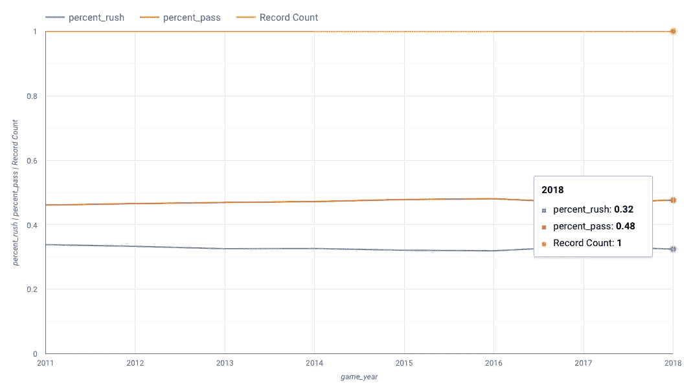
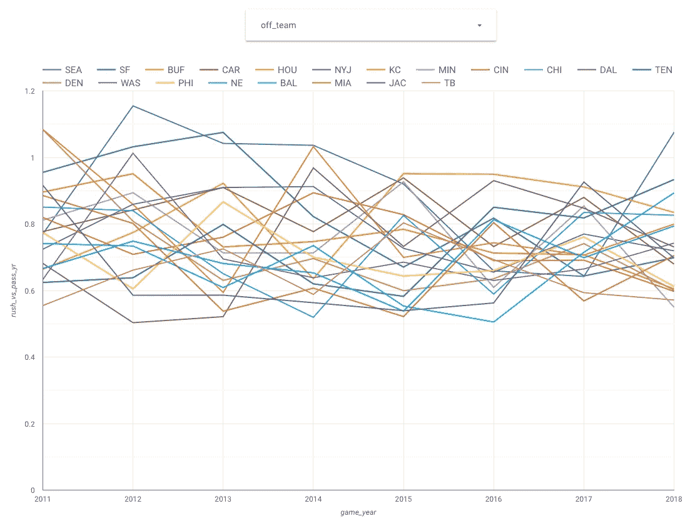
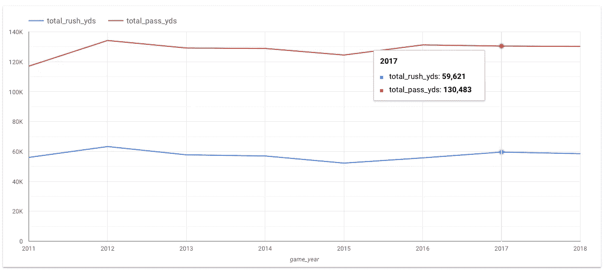
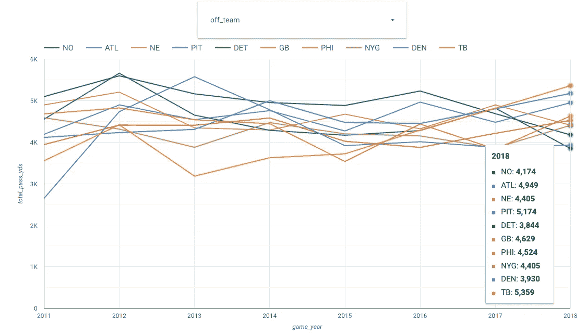
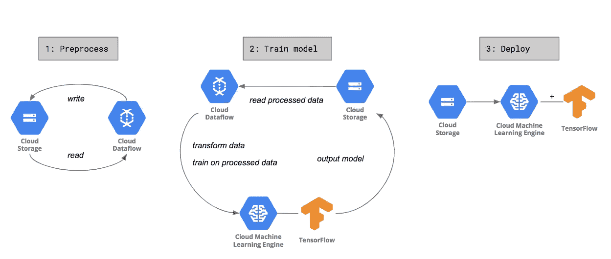
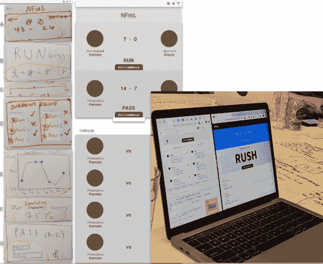
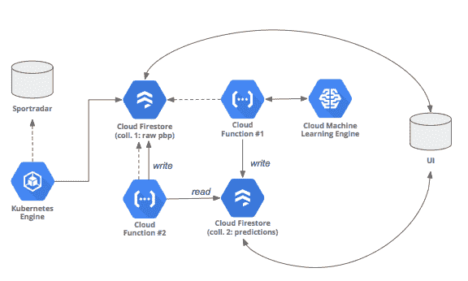
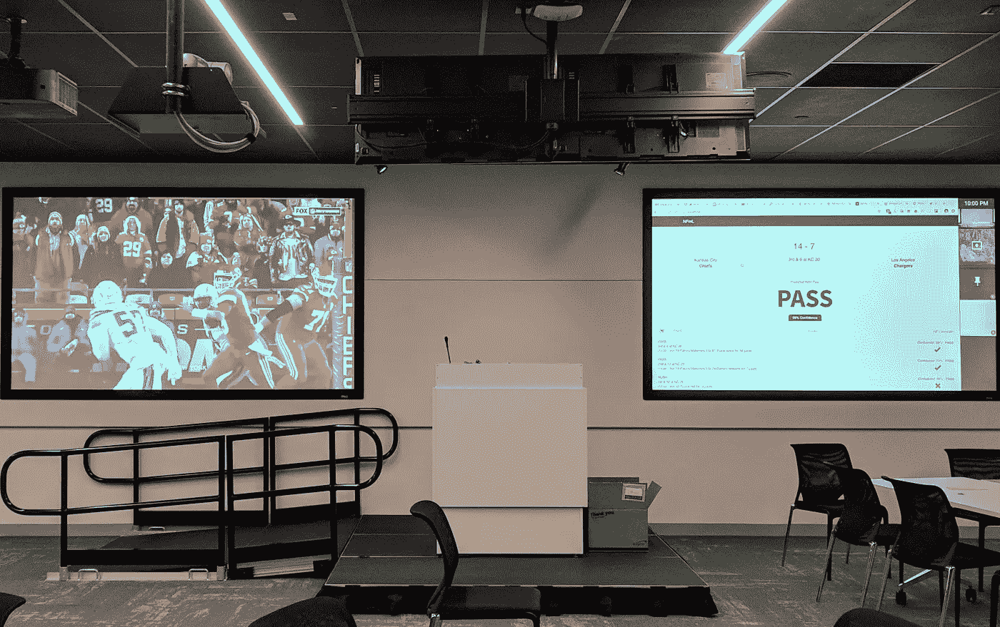
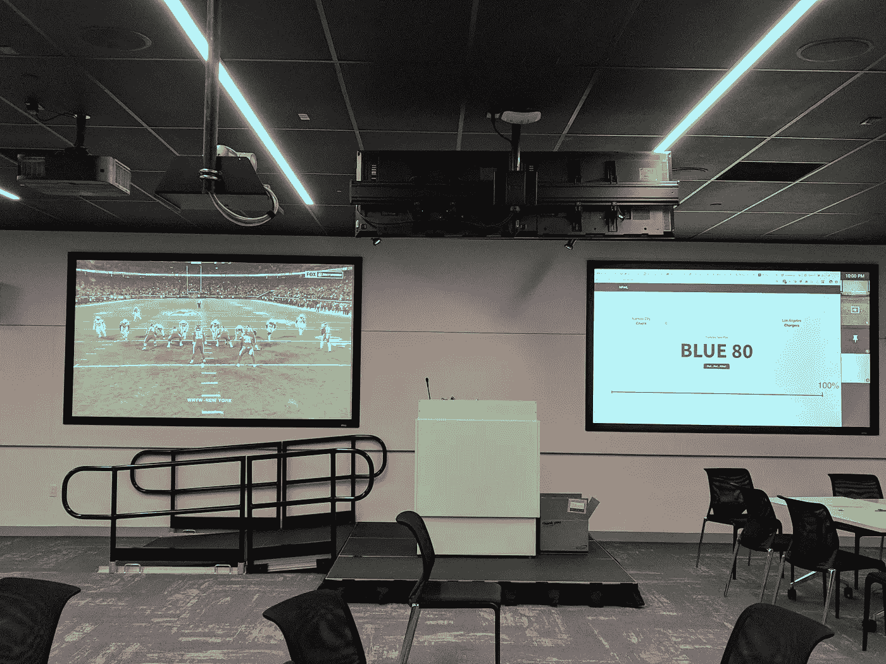

# 云中的橄榄球:与 GCP 一起黑足球

> 原文：<https://towardsdatascience.com/gridiron-in-the-cloud-hacking-on-football-with-gcp-eab7b9404bf2?source=collection_archive---------21----------------------->

如果你有一周的时间尽可能多地利用谷歌云，你可能会构建出什么？

你能在周四足球之夜前完成吗？

这就是一群前端软件工程师和 UXers 试图找到的答案。虽然我们每个人都定期开发不同的谷歌云产品，但我们更广泛的团队会在年底留出一个制作周来试验不同的产品，测试新的工程和 UX 技能，与不同的同事合作，并通常使用 GCP(阅读:没有内部工具)来破解一个项目。

这个想法似乎很简单:提出一个机器学习模型，可以在实时 UI 中预测足球比赛的下一场比赛。充其量，我们会发明有史以来最伟大的体育酒吧应用程序(我们最初的目标是每次打电话都有 90%的准确率和 90%的信心——这表明我们不是专业的数据科学家)。在最坏的情况下，我们会对预测建模的挑战产生更大的共鸣。实际上，我们可能会在中间的某个地方着陆——也许不是最好的模型，但至少是能在实时 UI 中提供一些有价值的东西的模型。

实际上，这相当复杂。我们需要创建一个摄取和 ETL 管道，构建一个功能性的数据仓库，训练和服务一个模型，并几乎同时开发一个实时 UI，以便在一周内完成。幸运的是，每个人都被吸引到不同的项目领域，这是基于他们最有技能或精力做出贡献的领域。有了这样分配的团队，我们有大约四天的时间为 12 月 13 日堪萨斯城酋长队和洛杉矶充电器队之间的比赛做好准备。

如果你只想知道我们是否达到了这个大胆的高门槛，那么惊讶吧:我们没有。但是，如果你想知道如何在一周内建立一个具有实时预测 UI 的机器学习模型(以及在这个过程中可能遇到的一些绊脚石)，那么让我们开始吧。

# 摄取和探索

鉴于[之前的一些](https://medium.com/analyzing-ncaa-college-basketball-with-gcp)[的例子](https://medium.com/baseballongcp)，我们对如何开始有了一个[的大致想法](https://cloud.google.com/blog/products/gcp/architecting-live-ncaa-predictions-from-archives-to-insights)。在一切开始之前，我们需要数据。我们使用 [Sportradar 的 API](https://developer.sportradar.com/docs/read/american_football/Classic_NFL_v1) 来获取 2011 年至 2018 年 NFL 常规赛的基本数据集，结果是 1，529 场比赛，或 255，834 场比赛(由于不一致，我们最终没有在我们的模型中使用 2013 年和 2014 年的数据)。虽然这是一个非常小的数据集，但它足以让我们对一个新生的模型进行训练和测试。

为了将每场比赛的详细数据存储到谷歌云存储(GCS)中，我们使用了 bash 脚本——主要是因为它的编写和执行速度非常快。GCS 成为我们其余工作的主要参考，让我们可以在附近存储原始数据，同时也让我们能够转向 BigQuery 进行探索性分析，并转向云机器学习引擎(CMLE)进行建模(这反过来会馈入 Firestore，即我们 UI 的主干)。

但是原始的逐场播放数据很难查询和建模，所以我们建立了一个数据流作业，将数据从非结构化的 JSON 格式转换为结构化的 CSV 文件，使我们能够提取和开发感兴趣的功能。虽然 Dataflow 使这个过程可重复并且相当快，但它针对比我们遇到的大得多的数据问题进行了优化。我们并没有真正处理它的规模，事后我们意识到这项工作实际上在本地机器上会更快。

从 GCS，我们使用 bq load 作业将所有内容导入 BigQuery，该作业在大约 5 秒钟的时间内将 1，500 个文件导入 BigQuery。(虽然可以直接从数据流加载，但它不允许我们使用递归通配符路径来匹配 bucket 中的特定模式，因此是 bq load。)BigQuery 允许我们的团队在开发模型的同时进行一些探索性的分析。

因为我们最感兴趣的是找到跑位和传球的模式，所以我们大部分的 BigQuery 工作都围绕着更好地理解这些比赛。例如，考虑到公认的智慧，NFL 近年来趋向于一个及格的比赛，我们想知道我们是否应该权衡我们的模型来解释这种转变。我们的数据显示，虽然有所转变，但取决于你如何看待它，这是相当渐进的(在所有的快攻和传球比赛中，传球的百分比从 46%增长到 48%)。也就是说，不同的车队和不同的年份会有很大的不同。

[Percent of all rush and pass plays](https://datastudio.google.com/u/0/reporting/1PjyV72EUH02CtjoUoY6DLTv0xAlcGFk7/page/lnMe) across the NFL since 2011

Ratio of rushes to passes [broken out by team](https://datastudio.google.com/u/0/reporting/1PjyV72EUH02CtjoUoY6DLTv0xAlcGFk7/page/YgGe)

此外，我们发现，虽然完成的传球越来越长(这是考虑传球趋势的一种方式)，但跑动也是如此——这些指标*和*也因团队和年份而异。

Total rush yardage and pass yardage [across the NFL](https://datastudio.google.com/u/0/reporting/1dRrQ6HSCHrasPTzZJzsuSln2EXU4f9WT/page/GiHe)

Total [pass yardage by team](https://datastudio.google.com/u/0/reporting/1dRrQ6HSCHrasPTzZJzsuSln2EXU4f9WT/page/IiHe)

由于我们没有时间为每个团队训练和创建 32 个独特的模型(或通过会议进行调查)，我们决定不对模型进行加权以通过测试。

# 建模和细化

随着我们的渠道建立，我们可以开始建立我们的模型。虽然有多种工具可用于构建模型，但处理模型的团队成员对 TensorFlow 最有经验，也最熟悉。方便的是，TensorFlow 比其他建模工具(例如 BQML)有更少的延迟，这非常适合我们的实时目的。

**预处理:**我们首先从 Sportradar API 中提取 CSV 数据，并使用 [tf 对其进行预处理。变换](https://www.tensorflow.org/tfx/transform/get_started)。使用 tf。Transform 让我们编写一个数据流作业，它能够针对所有数字数据对我们的整个数据集进行规范化，并为我们的分类数据创建预定义的词汇表(例如，某部剧中当前的进攻/防守团队)。在规范化数据之后，我们的数据流作业将那些预处理过的例子写入 [TFRecords](https://www.tensorflow.org/tutorials/load_data/tf-records) 中，这样它们就可以在模型训练期间被轻松有效地读取。

**训练:**一旦我们预处理了所有的数据，我们就开始使用[张量流估值器](https://www.tensorflow.org/guide/estimators)训练模型。TensorFlow estimator 库附带了一个预构建的线性分类器[,我们可以在数据集上对其进行训练。鉴于我们使用线性模型和 TensorFlow 估值器内置的分布式训练，我们知道我们的训练可以轻松扩展到指数级更多的示例。](https://www.tensorflow.org/api_docs/python/tf/estimator/LinearClassifier)

我们在很大程度上根据 [CloudML census estimator 代码样本](https://github.com/GoogleCloudPlatform/cloudml-samples/tree/master/census/estimator/trainer)调整了我们的培训计划。使用固定估算器使得调整样本代码以适应我们的需求变得特别容易(当您试图赶时间时，这是一个不错的好处)。

**测试:**除了针对 30%的随机数据测试模型的常见做法之外，我们还在逐场播放的数据上创建了一个模拟游戏重放功能。当我们检查以确保模型没有过度拟合时(我们的验证准确性与训练准确性跟踪得很好)，我们还通过使用模型从未见过的模拟实时回放来确认这些怀疑。通过以这种方式测试模型，我们可以验证它确实具有预测准确性，并且不会过度拟合训练数据。

**Refine:** 在建立并运行模型之后，我们回到 BigQuery，使用它作为评估工具来帮助我们确定向我们的模型添加(并帮助改进)什么新特性。我们从 17 个基线特征开始(如比赛类型、场地位置、进攻和防守团队)，但根据我们想问的数据问题类型创建了另外 9 个(并删除了 3 个没有帮助的)。23 个特征并不算多——其他创建预测游戏模型的尝试已经使用了 100 多个特征——但鉴于周四晚上即将开始，23 个似乎可以作为概念验证。一个特别的衍生特征，我们称之为 SERA(情景预期冲刺尝试，或给定一个特定的倒球和码到第一倒球的球队持球的可能性)，后来形成了我们天真模型的基础，并帮助我们衡量我们模型的技巧性。

为了给我们的模特上菜，我们靠在 tf 上。再次转变。这确保了在推理过程中接收到的任何输入都将以与我们的训练数据完全相同的方式进行预处理，从而减轻了来自数据预处理差异的任何[训练服务偏差](https://developers.google.com/machine-learning/guides/rules-of-ml/#training-serving_skew)。

Machine learning architecture

# UI 开发

如果一个模型预测了一场比赛，但没有用户界面让你实时查看，它会发出声音吗？

我们不想找出答案，这意味着我们需要构建与数据管道和模型并行的 UI。在我们对足球预测比赛模型的简短研究中，我们发现了几个复杂机器学习的例子，但没有一个试图实时预测比赛，或试图连接到图形用户界面。根据你自己对你最喜欢的球队的了解(或渴望)做出纸上谈兵的预测可能很有趣，但我们想*实际上* *看看*一个训练有素的模型在整个比赛过程中表现如何。

我们运行了一个简短的设计 sprint 来决定在这样的 UI 中什么信息可能是有趣和有用的，以及如何呈现它。除了包括游戏预测和我们的模型对它的信心得分，我们还想包括 drive 在游戏中的所有先前游戏，以及我们对那些游戏的*预测——包括信心和准确性。最后，我们希望包括一个图表，它将更新我们对每场比赛准确性的累积预测，以及对比赛的总信心和准确性。*

Design iteration

为此，我们首先创建了一个 Kubernetes 容器来订阅 Sportradar API，这样它就可以将实时的、原始的比赛数据推送到 Firestore 集合中。一个云函数将每个原始剧本标准化为我们预期的结构，并将其输入 CMLE，然后将一个预测写回到第二个预测集合中。当下一次播放发生时，另一个云函数将其与所做的预测进行匹配，然后更新播放集合中的数据。然后，UI 显示预测集合中最新文档的下一次播放的模型预测，以及逐播放集合中所有以前的播放和预测。

在这一周里，我们的模拟游戏回放功能承担了模型测试和 UI 测试的双重任务——我们严重依赖它来检查没有游戏时 UI 的行为。通过模拟游戏回放测试 UI 的功能，我们为周四晚上做好了准备。

Real-time UI architecture

# 把它放在一起

尽管在测试场景中让模型和 UI 一起工作很有趣，但在周四晚上的足球比赛中运行我们的系统却带来了另一个层次的悬念。在征用了一些投影屏幕后(并不是说晚上 8 点在办公室有很大的阻力)，我们并排排队等候游戏和我们的应用程序。

追随模特可能比游戏更令人兴奋(而且[这是一个令人兴奋的游戏](https://www.youtube.com/watch?v=vGggi5CEq9U)！).在游戏过程中，我们的模型实时执行的准确率为 66%，尽管我们第二天用一些更新的功能重新运行了模型，准确率提高到了 73%。为了了解这是否有任何好处，我们检查了我们的天真模型(它严格依赖于 NFL 在过去七年的比赛历史，给定了一次倒地和一次倒地的距离)在那场比赛中的表现——它只有 55.8%。

设计实时 UI 的一个怪癖是确定“实时”对观众的实际意义:我们需要协调 Sportradar API、电视广播和我们这边的任何系统处理之间的延迟。假设我们正在构建一个无服务器 UI，我们不会因为服务器延迟或通知延迟而损失太多时间。为了弥补这一差异(并防止观众在当前播放尚未发生或甚至超过 40 秒播放时钟阈值时看到对未来播放的预测)，我们在从 Firestore 接收更新和更新底层数据之间给了 UI 一个简短的填充。(我们通过轮换一些常见的 play 调用来弥补延迟，这样就不会看起来 UI 被冻结了。)

我们的最终模型以 70.1%的总体准确度和 0.651 的平均损失净出。对于一周的工作来说还不错。

# 赛季后的

鉴于缺乏无限的时间和资源，我们没有达到 90%的信心和 90%的准确性——这些数字肯定会让任何有经验的数据科学家感到惊讶。但我们确实构建了一个功能性的端到端系统，在一个实时 UI 中提供和评估播放预测，使用的是无服务器云环境和普遍可用的云产品。这需要不同技能的团队来实现。

尽管如此，这个模型总是可以改进的，而且有无数的方向可以探索:

*   **更多更好的功能** : 23 只是可能性的冰山一角。如果有足够的时间，你可以围绕赛季趋势和比赛趋势构建功能，更不用说天气条件，主客场因素，以及围绕时间和比分的更细粒度的功能。(这还是在观察个别球员或教练的信号之前。)
*   **更多更好的数据**:我们只用了常规赛；季后赛完全是另一个野兽。
*   更多更好的模型:足球队是高度特殊的——为球员和教练创造和控制不同的模型会非常有帮助。
*   更多更好的模型 *ing* :我们对张量流的了解是有限的。深入研究 [TensorFlow 模型分析](https://github.com/tensorflow/model-analysis)工具，了解某些特性如何影响我们的模型，是我们改进系统的下一步工作的重中之重。此外，我们仅使用线性分类器运行该模型。

一个结合了实时用户界面的更好的模型不仅会给粉丝带来乐趣，而且会对游戏中的决策产生真正的影响。如果一个模型最终采用了比人类在叫牌时间内所能处理的更复杂的技术特征，你可以想象一个场景，体育评论员可以利用这些信息来改善他们对比赛的报道和洞察力。你可以想象一个场景，四分卫或进攻协调人可能会利用这些知识来制定他们的策略——进行可预测的比赛或惊喜。你甚至可以想象一个与足球完全无关的场景。

只是一些思考的食粮，让你在周日那些史诗般的商业广告时段保持忙碌。

*感谢奥斯汀·博格斯特伦、克里·程、约瑟夫·罗林斯、易卜拉欣·阿卜杜勒-萨布尔、艾维·帕吉特、阿雅·达马里、尼古拉斯·凯尔曼、阿萨弗·阿农*、埃里克·施密特 *。*