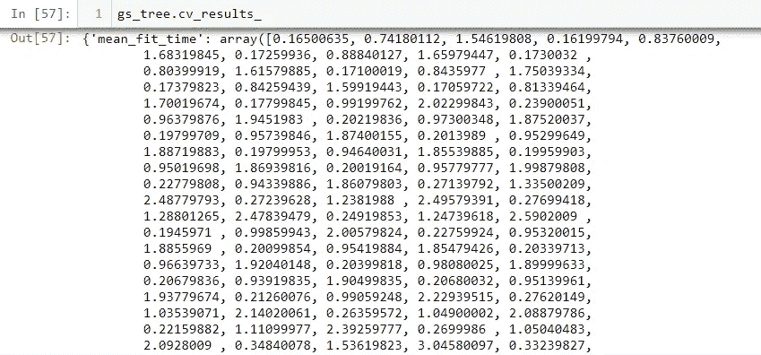
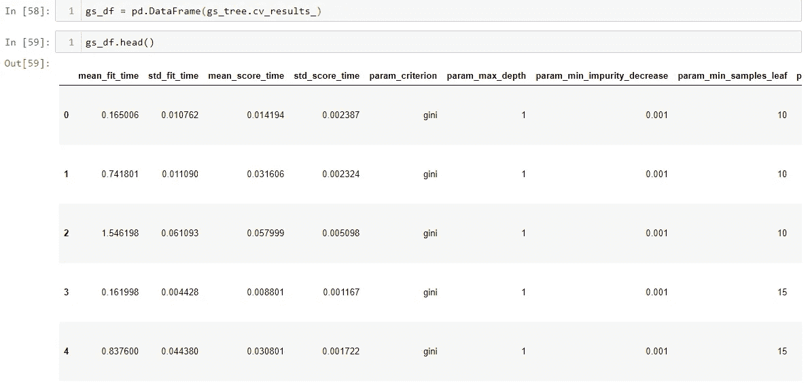
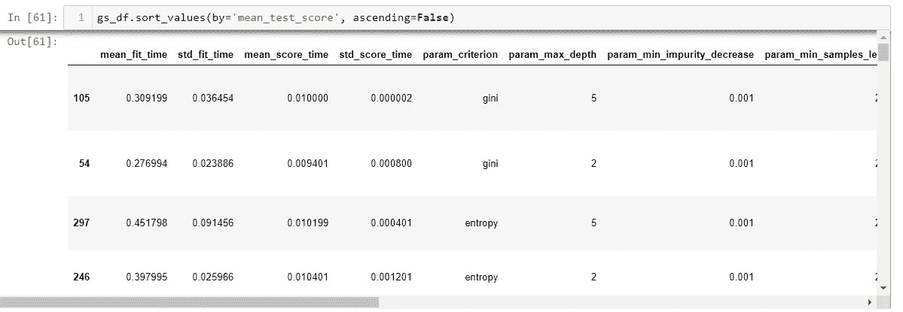
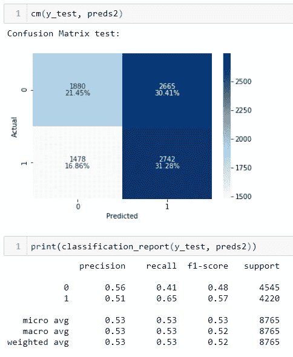
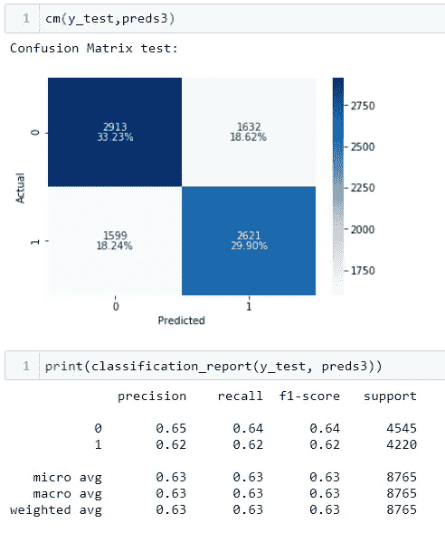

# GridsearchCV:打开黑盒

> 原文：<https://towardsdatascience.com/gridsearchcv-cracking-open-the-black-box-ae3ce40ac76d?source=collection_archive---------43----------------------->

Photo by [Nikita Kachanovsky](https://unsplash.com/@nkachanovskyyy?utm_source=unsplash&utm_medium=referral&utm_content=creditCopyText) on [Unsplash](https://unsplash.com/s/photos/box-light?utm_source=unsplash&utm_medium=referral&utm_content=creditCopyText)

当我第一次开始使用 GridSearchCV 时，我感到困扰的是，在我看来，我们似乎接受了网格搜索抛出的最佳超参数。然后，我们从那里开始工作，更好地调整超参数，以获得最佳结果。我想一定有更好的方法。

然后我注意到了 cv_results 选项，我很兴奋有一种方法可以查看网格搜索所做的一切。我兴奋地把它打印出来，看到了这个:

我非常失望。直到我意识到似乎所有的东西都在字典里，作为每个部分的键/值。我立即试着把它加载到一个熊猫的数据框架中，成功了！

正如你在上面看到的，把所有东西都放在那里仍然没有帮助。我开始研究 dataframe，并意识到 best_params 函数打印具有最高平均测试分数的超参数。

这并不总是我们想要的。在我从事这项工作的时间里，我看到过由于各种不同的原因，最高的结果不是很好的时候。其中之一是过度拟合，如果测试和训练分数比其他组合彼此相差更远，尽管也可能有其他原因。

熊猫的伟大之处在于，我们一直在使用它，并且可以操纵数据来帮助我们找到我们正在寻找的东西。我开始计算训练和测试分数之间的差异，并按此排序。但这可能会导致最高分出现负差异，或者测试和训练分数非常低。

因此，我根据训练和测试分数之间的差异对测试分数进行加权，并按此降序排序。

在这种情况下，您将看到顶部结果与网格搜索中的 best_params 选项相同。这种情况有时确实会发生，但总的来说，这会产生更好的结果。在这种情况下，当根据我的测试数据检查时，这些是带有顶级参数的结果:

这比使用默认超级参数的简单随机森林更糟糕，如下所示:

我尝试了加权分数的第二行参数，得到了与基线随机森林相似的结果:

对于这种情况，随机森林似乎不会给出很好的结果。我在这里只是演示如何做到这一点。

没有一个答案，有时根据你的 EDA，你会觉得在一个随机的森林里你需要更多的树。所以你可以选择分数高的超参数。有时，你可以尝试几种不同的组合，都取得了不错的成绩。这适用于任何可以使用 GridSearch 的模型。

你可以根据你想要的任何东西来决定，最重要的是你可以根据数据来决定，而不是在不理解的情况下得出给定的结果。

我期待着在评论中看到伟大的想法，这样我们就可以在继续寻找我们模型的最佳超参数时使用它们。

这个演示的代码在这里:
[https://github . com/lrai chik/GridsearchCV _ cracking _ open _ the _ black _ box](https://github.com/lraichik/GridsearchCV_cracking_open_the_black_box)

声明:我没有做任何 EDA，因为我这样做只是为了演示的目的。

我欢迎评论中的任何反馈和想法。