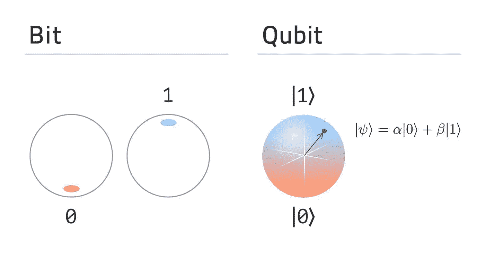
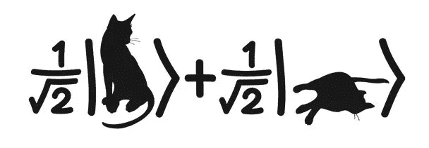
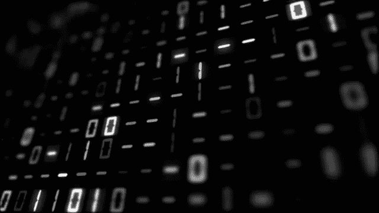
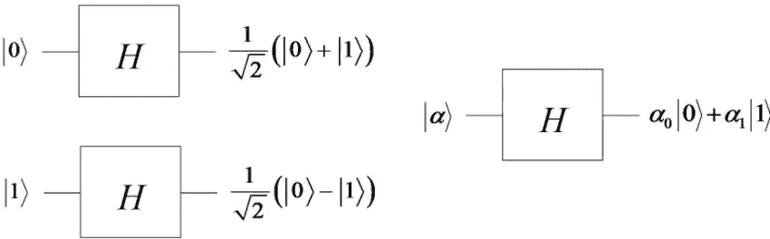
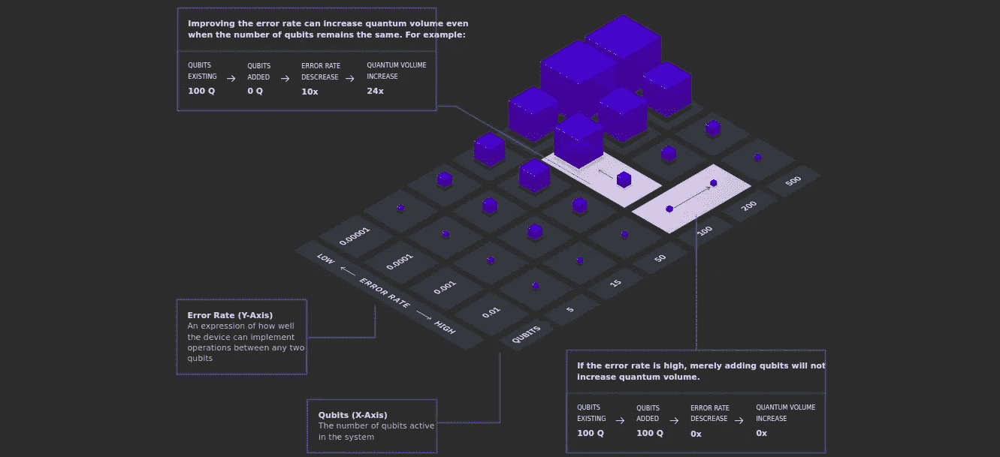
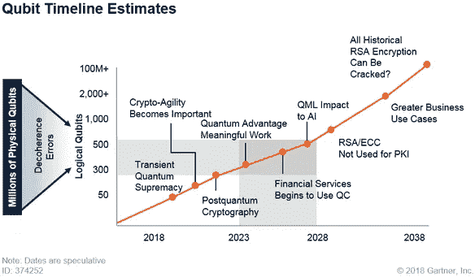
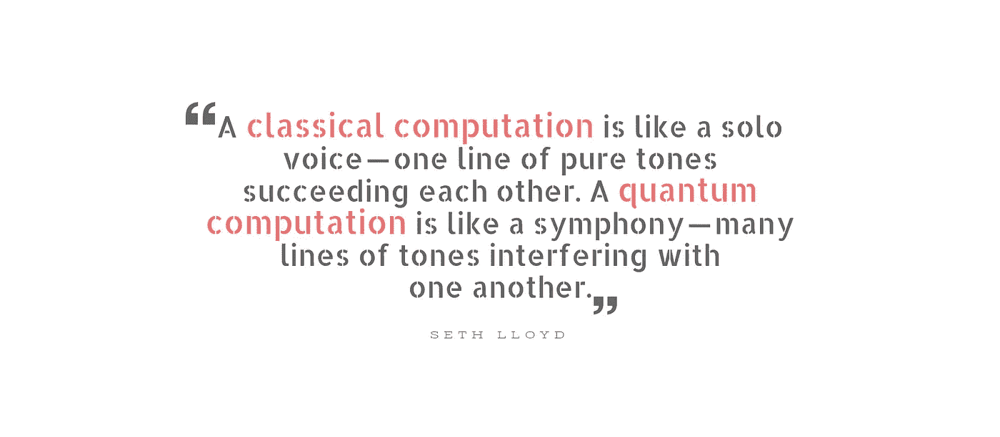

# 探索量子计算——好奇者的古怪指南

> 原文：<https://towardsdatascience.com/grokking-quantum-computing-a-quirky-guide-for-curious-people-8cea6eb67803?source=collection_archive---------8----------------------->

我们承认吧，量子粒子很奇怪。各种违反直觉的现象，如*叠加*、*纠缠*，简直就是激发灵感的好科幻小说。除了错综复杂，量子力学已被证明是最成功的理论！

没有量子物理学，我们就不会有现代计算机或智能手机。

> 说什么？

现在，你可能会想:

> 等等，我以为量子力学是用于量子计算的！

是的，你说得对；量子计算的计算逻辑利用了这些原理，而经典计算机却没有。这并不意味着构成这些经典计算机的组件不遵守上述原则。🙄

想一想——在现代计算机中你需要半导体，而整个固态物理学的理论都是建立在量子力学的基础上的。

这篇文章聚焦于量子计算，并且是在假设你对量子奇异性有一些高中水平的熟悉的情况下写的！

# 为什么我们需要量子 computers❓

1965 年，英特尔公司的联合创始人戈登·摩尔声称，集成电路上每平方英寸的晶体管数量每年翻一番，并预言这一趋势将继续下去！

根据摩尔定律，计算机一天比一天小，一天比一天快。单个晶体管的尺寸正在缩小到几个原子的大小，但代价来了——q*量子隧道效应*。

由于晶体管充当电子流动的开关，它可以与其他电子元件一起用于构建驱动经典计算的逻辑门。但是，如果这些晶体管变得足够小，电子可能会从一边跳到另一边，从而阻碍任何逻辑实现。

> 那么，解决方案是什么？

量子计算——虽然不完全是你想的那样！

According to IBM, quantum computers are radically different with the potential to solve some problems beyond the reach of today’s classical computers in areas like drug discovery, financial services, and artificial intelligence.

你看，量子计算机不是经典计算机的替代品。相反，这些计算机将能够以相当高的精确度解决某些优化或基于加密的问题，这是我们当前的经典计算机无法解决的。

在经典计算机中，每一个逻辑运算最终都归结为翻转和排列内存中的位。

在这里，经典位由 1 和 0 组成，逻辑上代表-真和假，开和关，阴和阳…你明白了吧！

但是量子比特是如何工作的呢？🤔

# 量子比特简介

A Q *ubit* 是对应单位状态机的最简单的量子系统。它是“0”状态和“1”状态的复杂线性组合。

让我们用振幅⟨α、β⟩来表示一个量子位，如上所示，使得α和β是复数，并且‖α‖+β‖= 1。如果α和β只是实数，那么相应的量子位将代表一个圆形状态机，而不是球形状态机。

> “一个量子位的值怎么可能既不是 0 也不是 1，”

*叠加*。

我猜你对薛定谔的猫这个著名的思想实验很熟悉。它处理的是这样一个想法——假设盒子里有一只猫，有 50%的机会活着，有 50%的机会死了。所以，除非你往盒子里面看，否则你会认为这只猫既没死也没活！它是两种不同状态的叠加。

这太荒谬了。其实猫不是死了就是活了。不可能两者兼得。但是你不打开盒子是不会知道的。你看叠加原理不适用于日常物体。

你仍然可以持有类似的论点——如果量子位也处于 0 或 1 的确定状态，会怎么样？也许只是在我们测量之前无法判断而已！

在这种情况下，你说对了一部分——在测量之前，我们不可能知道量子位的确切值。但我们确实从实验中知道，量子位实际上处于叠加状态，当我们测量它时，它有α几率坍缩为 0，β几率坍缩为 1。

我知道这令人困惑，但请耐心听我说…😣

你看，量子计算机使用这种叠加原理，因为它可以用ψ表示的薛定谔波动方程进行数学描述。为了操纵这些量子态来驱动计算，已经开发了几种算法。

A qubit just corresponds to a unit vector in two-dimensional Hilbert space!

当我们谈到一个量子比特以一定的概率坍缩到特定的状态时，你可能会认为这和扔一个公平的硬币或者扔一个平衡的骰子是一样的。很有可能你会选择不读这篇文章而不完成它。这些是经典概率的情况。

我们只能说这些随机实验的结果无法确定，因为我们不知道与之相关的所有隐藏变量。如果我们在投掷时知道了硬币的转数、空气阻力、初始状态、硬币的重量、施加的扭矩和所有其他可能的隐藏变量，我们肯定可以以很高的准确度确定硬币投掷的结果。

然而，量子随机性是真正的随机。在测量之前我们不会联想到经典概率。当我们说一个量子位是 0 和 1 的叠加时，我们并不意味着它要么是 0 要么是 1——相反，我们谈论的是代表这些单独状态的振幅的线性组合。

# 让我们问问 questions❗️

在我们继续之前，让我澄清一些可能一直萦绕在你脑海中的疑问——

> 我们如何在物理上表示一个量子位？

理论上，我们可以利用电子的自旋，光子的极化，甚至可以利用原子、分子或离子。

> 但是，我们怎样才能实际实施呢？

像谷歌和 IBM 这样的科技巨头使用*超导回路*，其中振荡电流被微波信号激发成叠加态。为了使这些超导材料工作，使用稀释制冷机将工作温度冷却到大约 0.015 开尔文，稀释制冷机是一种低温设备。

另一方面，像英特尔这样的公司使用*硅量子点*，而像 IonQ 这样的初创公司使用*俘获离子。*

> 那么，我们如何操作这些量子位呢？

我们使用矩阵运算子来模拟某些装置的效应，这些装置在不测量或破坏量子位元的情况下，操控量子位元的自旋或极化。有几个重要的矩阵算符只在量子环境中有意义。

> 嗯，这些矩阵算符是什么！

先说一个——*哈达玛门*。它被表示为“H ”,它作用于单个量子位，如 0 或 1，并将其置于完全相等的叠加状态——

这意味着测量量子位将有相等的概率坍缩回任一基态。

我猜你对经典逻辑门很熟悉。同样，还有各种各样的其他量子门，如 Deutsch，Pauli-X，等等…

与经典逻辑门不同，所有量子门都是可逆的。这意味着给定操作符和输出，就可以推导出相应的输入。

# 什么是量子 Computing❓

请记住，我们的目标是实现控制量子态的能力，这样就有可能给计算机编程。量子计算背后的想法是在一定数量的量子位上配置这些不同的量子逻辑门。

到目前为止，我们已经讨论了单个量子位的量子态表现。然而，在量子计算机中，正在使用多个量子位。在那种情况下，叠加只是等式的一面——我们需要*量子纠缠*的性质！

Einstein’s “spooky action at a distance”!

通俗地说，当两个或两个以上量子比特的状态不能相互独立描述时，就产生了量子纠缠。因此，测量一个纠缠的量子位也会瞬间瓦解其他纠缠的量子位，不管它们之间的空间距离有多远！

现在，在你对量子隐形传态和超光速旅行大肆宣传之前，让我告诉你——即使是纠缠也不能让经典信息的速度超过光速。

> 那么这一切对量子计算意味着什么？

量子计算实现了叠加和纠缠以及*量子干涉的原理。*首先，你激活量子位，使其成为所有可能配置的叠加，然后通过对每个状态施加相位，将问题编码到你的量子计算机中。接下来，使用量子干涉来校准一些振幅，而消除其他振幅来优化正确答案。

在这里，1 个量子位可以是 2 个状态的叠加，2 个量子位可以是 2 个状态的叠加，同样，用 300 个量子位，你可以探索 2 个⁰⁰可能的状态——这远远超过了可观测宇宙中的原子数量！😯

> “我们怎么可能跟踪所有这些状态，”

你看这不是经典计算。通过纠缠这些量子位，它们的状态保持相关。对于经典计算机，你必须一次探索两个⁰⁰比特的可能性才能找到相关的答案，但在量子计算机中，你只需要跟踪 300 个量子比特！

需要指数级扩展的问题非常适合量子计算。这类问题包括——质因数分解、旅行推销员、模拟化学反应中的化合物等等。

如果输入足够大，一台经典计算机将花费整个宇宙的生命来解决这样的问题！

# 量子计算背后的挑战

量子计算不全是阳光和彩虹。所以，不要指望量子笔记本电脑会很快运行 PUBG-Q，在那里你的角色同时活着和死去！

当你不断增加更多的门或者增加量子位的数量来实现某些算法时，系统会变得非常不稳定。因此，由于被称为*量子退相干*的现象，错误率增加。它负责通过无意的相互作用将量子位的量子本质泄露到环境中。

这意味着量子位可以在计算过程中坍缩回经典状态。

2013 年实现了最长的相干长度。量子位持续了超过 39 分钟；然而，他们只有 81%的忠实率。第二年，尽管相干长度减少到了 30 秒，但保真度却提高到了 99.99%以上。🎉

这个想法是建立相干长度足以计算数学问题的系统。为了增加相干长度和构建容错量子计算机，我们需要一个有用的度量来测量两个维度上的量子能力——量子位的数量和错误率。这个度量被称为*量子数*。

[Source: IBM](https://www.ibm.com/quantum-computing/learn/what-is-quantum-computing/)

自从 1995 年*量子纠错*问世以来，许多新的技术和方法被提出。为了使量子比特稳定并减轻退相干，纠缠起着重要的作用。

然而，量子退相干仍然是研究人员和工程师实现量子优势的最大障碍之一。

# 迈向量子霸权的竞赛

从本质上说，这是一个里程碑，量子计算机能够执行经典计算机几乎不可能完成的计算。

上个月，谷歌声称他们已经实现了量子计算的这个长期目标。在它被撤下之前，NASA 网站上有一份简短的文件对它进行了描述。这似乎是由谷歌和量子人工智能实验室合作的科学家撰写的早期草案，其中包括美国宇航局的研究人员。

这篇论文描述了如何使用 53 个量子位来确定随机选择的量子电路的输出。实验中涉及的干涉图案是由谷歌的 Sycamore 量子处理器通过在量子电路上进行一百万次测量而确定的，耗时约 200 秒。作者还声称，最先进的经典超级计算机将需要大约 10，000 年来计算相同的数据。

在论文中，作者还指出—

> 据我们所知，这个实验标志着只能在量子处理器上进行的第一次计算。

然而，这一信息的可信度是一个有争议的话题。自论文消失以来，谷歌和美国宇航局都拒绝回答有关论文的问题。所以，我建议你对此半信半疑！

但无论如何，量子计算的未来就在眼前。现在正在发生。在量子计算机变得强大到足以使用 Shor 算法破解 RSA 加密的世界中，它还可以用于建立预测市场行为的复杂模型，加速供应链物流，使数据分析速度成倍提高，并推动药物和化学开发的巨大研究。

恭喜你！你已经走到这一步了…🏁我希望我能够解释量子计算的基本原理。

*   如果你想进一步探索这个令人兴奋的话题，可以从阅读《量子计算机 编程》这本书开始。
*   如果你想在一台真正的量子计算机上获得实际操作的体验，可以试试这个平台— [*IBM Q Experience*](https://www.ibm.com/quantum-computing/technology/experience)

## 感谢您阅读本文！