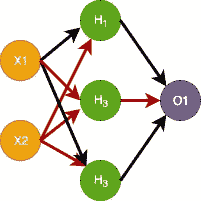
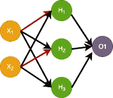
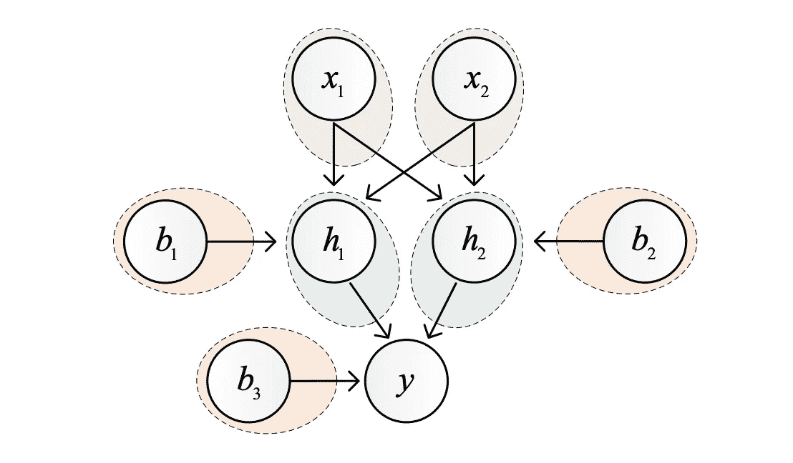
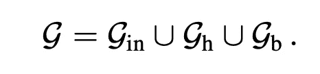
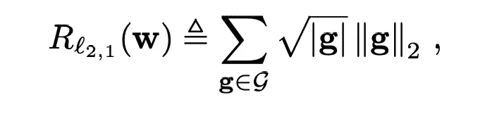
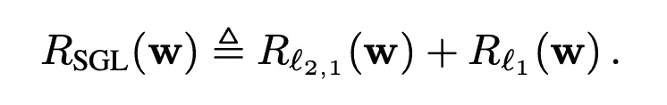
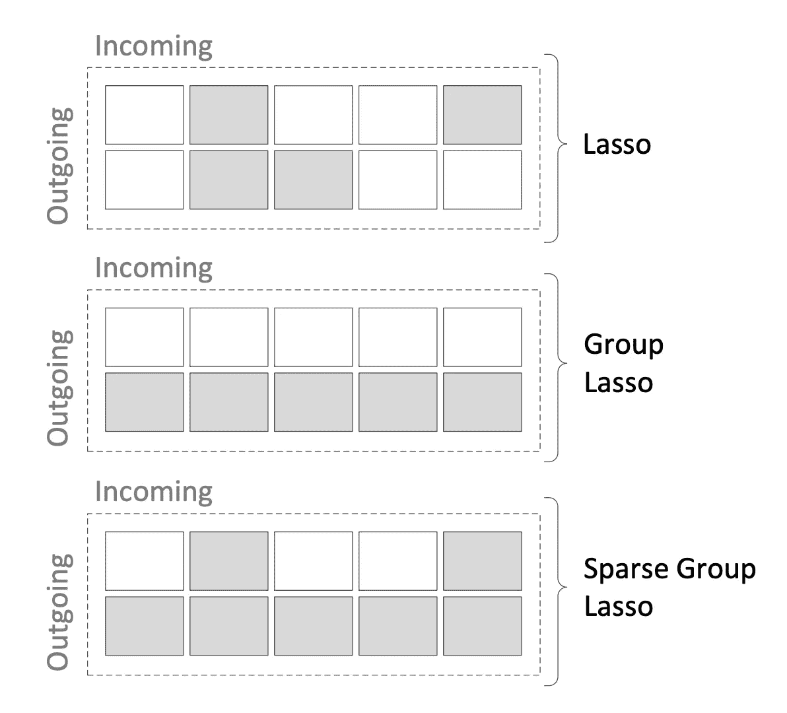

# 深度神经网络的组稀疏正则化

> 原文：<https://towardsdatascience.com/group-sparse-regularization-for-deep-neural-networks-6a70ecb1561c?source=collection_archive---------21----------------------->

## 如何自动修剪神经网络中的节点？

[深度神经网络的分组稀疏正则化论文摘要](https://arxiv.org/pdf/1607.00485.pdf)

# 动机

随着硬件技术的进步和成本的降低，训练大型神经网络变得更加容易。正因为如此，即使是简单的任务也需要大型网络。网络中有太多的层会导致许多问题，

*   过度拟合
*   在部署到生产/移动/ IOT 设备之前，需要进行网络修剪

然后就是特征选择的问题。特征选择是搜索对建模很重要的所有特征的子集的过程。这通常在建模开始前作为**独立管道**完成。

稀疏群正则化(SGR)解决了这三个问题

1.  优化神经网络的权重
2.  优化每个隐藏层的神经元数量
3.  特征选择

并创建了一个**单一流程/流水线**来解决所有这些问题。在神经网络中，特征选择可以被认为是对输入层节点的修剪，这就是在稀疏群正则化中如何处理它。

# 神经网络中的稀疏性

如果一个神经元的所有输入和输出权重都是 0，那么该节点可以被移除。



Figure 1

在上面的人工神经网络图像中，红色连接的权重为零。由于来自输入功能 **X2** 的所有连接为零，因此该功能可以移除。类似地，对于节点 **H3，**由于所有输出权重都是零，因此该节点也可以被移除。这是在节点和特征的修剪中使用的稀疏性的思想。

# 如何实现稀疏性？

L1 正则化(Lasso)是实现权重稀疏性的一种方式。在这种技术中，权重的绝对值之和在训练期间被罚。

```
New Cost = Cost + λ ||w||
```

由于权重因其绝对大小而受到惩罚，因此可以使用 L1 正则化来实现稀疏性。

[点击此处了解更多关于 L1 和 L2 正规化的信息](http://www.chioka.in/differences-between-l1-and-l2-as-loss-function-and-regularization/)。

然而，单独使用 L1(套索)不能保证系统的稀疏性，使用它可以删除节点。为了删除一个节点，该节点的所有传出权重都应该为零。在非结构化的情况下，L1 可以导致不同类型的稀疏性。见下图



Figure 2 : Sparse connection with L1

这里 2 个权重为零，但是没有一个节点可以被移除。因此，L1 独自不能帮助修剪。这就是稀疏群正则化发挥作用的地方。

# 稀疏群正则化



Figure 3\. Schematic representation of a group LASSO regularization with two inputs (top), two hidden neurons with biases (middle), and one output (bottom). We have three groups of connections. Green: input groups; blue: hidden groups; red: bias groups. Image source [1]

为了获得用于修剪的结构化稀疏度，我们需要对来自每个神经元的传出连接进行分组，并强制它们为零。为此，考虑 3 种不同类型的重量组，

1.  输入组 **Gin** :一个元素 gi ∈ **Gin，** i = 1，.。。d 是从第 I 个输入神经元到网络的所有输出连接的向量。在上图(图 3)中，有两个输入组(绿色)。x1 的输入组将包含从 x1 到隐藏层的所有权重。输入组用于特征选择。
2.  隐藏组: **Gh** :在这种情况下，单个元素 g ∈ **Gh** 对应于网络隐藏层中某个神经元的所有传出连接的向量。在图 3 中，有两个输出组(与隐藏节点的数量相同)。
3.  偏差组: **Gb** :这些是与网络上的偏差相对应的一维组(标量)。也可以使用包含所有偏差变量的单个组，而不是将每个偏差视为一个单独的组。

总组数 **G** 为



**稀疏组正则化**可以写成，



其中 **|g|** 表示向量 g 的维数，它确保每个组得到均匀的加权。这里使用每组的 L2 标准。因为 L2 范数不能像 L1 那样产生稀疏性，所以进行阈值化步骤以将低权重转换为零。

这个公式对于获得高水平的稀疏性来说仍然是次优的(即使在阈值化之后)。为了加强这一点，使用了套索和稀疏组惩罚的组合。**稀疏群套索**惩罚的定义是，



其中第二项是权重的 L1 范数。



Figure 4 : Comparison between Lasso, group Lasso, and sparse group Lasso applied to a single weight matrix. The removed connections are represented in gray. Image source [1]

> 图 4 显示了本博客中讨论的三种正则化惩罚之间的比较。2×5 矩阵表示 2 维输入层和 5 维输出层之间的**权重矩阵**。

套索惩罚(l1)在不考虑节点级别的情况下移除连接。在图像中，它导致了 40%的连接稀疏度。输出层中的第二个神经元(5 dim)可以被移除，因为来自两个输入节点的所有传入连接都是灰色的(参见图 4 中 Lasso 中的列 2)。

在组 Lasso 中(在稀疏组正则化中的阈值化之后)，来自第二神经元输入层的所有连接为零，因此可以被移除。

稀疏群套索惩罚结合了前两个公式的优点。来自输出层的两个节点(第 2 和第 5)可以被移除，并且第二输入神经元也可以被移除。连接数减少到 70%,从而形成一个非常紧凑的网络。

# 参考

[1] Simone Scardapane，Amir Hussain 和 Aurelio Uncini，[深度神经网络的组稀疏正则化](https://arxiv.org/pdf/1607.00485.pdf) s 2017