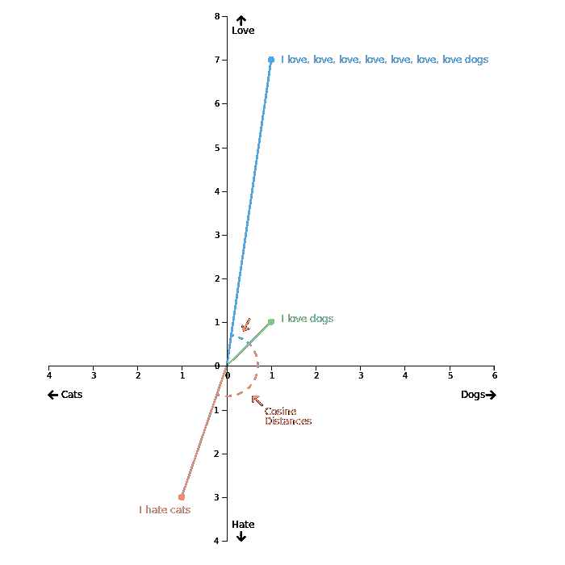

# 在几秒钟内将数千个相似的电子表格文本单元格分组

> 原文：<https://towardsdatascience.com/group-thousands-of-similar-spreadsheet-text-cells-in-seconds-2493b3ce6d8d?source=collection_archive---------3----------------------->

## 用 TF-IDF 和余弦相似度在 Python 中进行字符串匹配



This image — explained below — visualizes the cosine similarity of a document term matrix in a multidimensional space.

下面是一个常见的电子表格或数据库问题:

```
+-----+-------------------+
| row |     fullname      |
+-----+-------------------+
|   1 | John F. Doe       |
|   2 | Esquivel, Mara    |
|   3 | Doe, John F       |
|   4 | Whyte, Luke       |
|   5 | Doe, John Francis |
+-----+-------------------+
```

第 1、3 和 5 行可能指的是同一个人，只是在拼写和格式上略有不同。在小型数据集中，可以手动清理像元。但是在巨大的数据集中呢？我们如何梳理成千上万的文本条目并对相似的实体进行分组？

理想情况下，应该有一种简单的方法来添加第三列，如下所示:

```
+-----+-------------------+---------------+
| row |     fullname      |  name_groups  |
+-----+-------------------+---------------+
|   1 | John F. Doe       | Doe John F    |
|   2 | Esquivel, Mara    | Esquivel Mara |
|   3 | Doe, John F       | Doe John F    |
|   4 | Whyte, Luke       | Whyte Luke    |
|   5 | Doe, John Francis | Doe John F    |
+-----+-------------------+---------------+
```

嗯，有，这就是我们要做的。

> TLDR:我为此制作了一个工具。你可以[在这里](https://github.com/lukewhyte/textpack)安装 Python 模块。但是如果你想了解这个工具背后的概念——或者你只是强烈地不信任我(嗨，亲爱的)——请继续读下去。

**我们将讨论的话题:**

1.  用 TF-IDF 和 N 元文法构建文档术语矩阵
2.  使用余弦相似度计算字符串之间的接近度
3.  使用散列表将我们的发现转换为电子表格中的“组”列

在本教程中，我将使用[美国劳工部工资盗窃调查的数据集](https://data.world/lukewhyte/us-dept-of-labor-wage-theft-investigations)。它包含了从 1984 年到 2018 年因违反最低工资或加班而对雇主进行的每一次 DOL 调查。

该数据包括一个`legal_name`列，其中列出了被调查公司的名称。然而，条目格式千差万别:

```
+-----+----------------------+
| row |      legal_name      |
+-----+----------------------+
|   1 | Wal-mart Inc         |
|   2 | Walmart Stores Inc.  |
|   3 | Wal-mart stores Inc  |
|   4 | Wal-Mart stores Inc. |
+-----+----------------------+
```

我们将对`legal_name`下的条目进行标准化和分组，然后使用我们的组进行一些快速分析。

## **第一步:用 TF-IDF 和 N 元语法构建文档术语矩阵**

我们这里最大的挑战是，我们专栏中的每个条目都需要与其他每个条目进行比较。因此，一张 400，000 行的表格需要 400，000 次计算，当我在记得关闭 Photoshop 之前打开网飞时，我的笔记本电脑过热了。

如果我们可以使用矩阵乘法来进行同时计算，这将会快得多，我们可以使用文档术语矩阵、TF-IDF 和 N-Grams 来进行计算。

让我们来定义这些术语:

**文档术语矩阵**

文档术语矩阵本质上是单词包概念的扩展，我喜欢这个概念，因为它听起来像是一个蒙面人在芝麻街上偷的东西。

BOW 包括计算字符串中单词的频率。所以，鉴于这句话:

“罗德岛既不是路，也不是岛。讨论。”

我们可以像这样制作一个弓:

```
+---------+-------+
|  term   | count |
+---------+-------+
| rhode   |     1 |
| island  |     2 |
| is      |     2 |
| neither |     1 |
| a       |     1 |
| road    |     1 |
| nor     |     1 |
| it      |     1 |
| an      |     1 |
| discuss |     1 |
+---------+-------+
```

文档术语矩阵(DTM)将 BOW 扩展到多个字符串(或者在术语中称为“多个文档”)。假设我们有以下三个字符串:

1.  “连我哥哥都有需求”
2.  “我弟弟需要搭车”
3.  “老弟，你到底举不举？”

DTM 可能是这样的:

每个条目的值通过计算每个单词在每个字符串中出现的次数来确定。

上述方法的问题在于，像“The”、“is”和“if”这样的无关紧要的词往往比重要的词出现得更频繁，这可能会扭曲我们的分析。

因此，我们可以给它们分配一个 TF-IDF 分数，来评估每个单词对 DTM 的重要性，而不是计算单词数。

**TF-IDF**

为了计算 TF-IDF 得分，我们将一个术语在单个文档中出现的次数(术语频率或 TF)乘以该术语对整个语料库的重要性(逆文档频率或 IDF)——一个单词在文档中出现的次数越多，该单词在区分文档中的价值就越低。

如果你对计算 TF-IDF 分数背后的数学感兴趣，看看这里的。

重要的是，对于我们的文档术语矩阵中的每个单词，如果我们用 TF-IDF 分数替换单词计数，我们可以在检查字符串相似性时更有效地加权单词。

**N-Grams**

最后，我们将解决这个问题:

`Burger King`是两个字。`BurgerKing`应该是两个字，但是电脑会把它看成一个。因此，当我们计算文档术语矩阵时，这些术语将不匹配。

n 元语法是一种将字符串分成更小块的方法，其中`N`是块的大小。所以，如果我们将`N`设为`3`，我们得到:

```
['Bur', 'urg', 'rge', 'ger', 'er ', 'r K', ' Ki', 'Kin', 'ing']
```

并且:

```
['Bur', 'urg', 'rge', 'ger', 'erK', 'rKi', 'Kin', 'ing']
```

这些字符串比原始字符串有更多的重叠。

因此，当我们构建我们的文档术语矩阵时，让我们计算 N-Grams 而不是单词的 TF-IDF 分数。

**最后，一些代码:**

下面是构建文档术语矩阵的代码，使用 N-gram 作为列标题，使用 TF-IDF 分值作为值:

在第 6 行，我们将 CSV 转换成一个[熊猫数据帧](https://pandas.pydata.org/pandas-docs/stable/reference/api/pandas.DataFrame.html)。

第 10 行从数据集的`legal_name`列中提取唯一值，并将它们放入一维 NumPy 数组中。

在第 14 行，我们编写了构建我们的 5 个字符的 N-Grams 的函数(我从这里提取了函数[)。使用正则表达式过滤掉一些字符。](https://bergvca.github.io/2017/10/14/super-fast-string-matching.html)

第 20 行将`ngrams_analyzer`传递给 TF-IDF 矢量器，我们将使用它来构建矩阵。

最后，在第 23 行，我们构建了我们的文档术语矩阵。

**稀疏矩阵与密集矩阵以及如何让你的电脑崩溃**

上面代码的结果`tfidf_matrix`，是一个压缩的稀疏行(CSR)矩阵。

如果你不熟悉稀疏矩阵，[这是一个伟大的介绍](https://machinelearningmastery.com/sparse-matrices-for-machine-learning/)。出于我们的目的，要知道任何大部分值为零的矩阵都是稀疏矩阵。这不同于大部分非零值的密集矩阵。

我们的 N 元模型矩阵有 237，573 行和 389，905 列。前 10 行和前 10 列如下所示:

(I added the underscores to represent blank characters.)

那是相当稀少的。没有理由在内存中存储所有这些零。如果我们这样做，就有可能耗尽 RAM 并触发`MemoryError`。

进入 CSR 矩阵，它只存储矩阵的非零值和对其原始位置的引用。

这是一个过于简化的问题，你可以在这里学习细节。重要的一点是，CSR 格式节省了内存，同时还允许快速的行访问和矩阵乘法。

## **步骤二:使用余弦相似度计算字符串之间的接近度**

余弦相似度是一个介于 0 和 1 之间的度量，用于确定字符串的相似程度，而不考虑其长度。

它测量多维空间中字符串之间角度的余弦值。该值越接近 1(余弦值为 0)，字符串相似度越高。

取以下三个字符串:

1.  我喜欢狗
2.  我爱爱爱爱爱爱爱狗
3.  我讨厌讨厌讨厌猫

并将它们放入文档术语矩阵中:

然后在多维空间上绘制这个矩阵，其中每个维度对应于我们四个术语中的一个。可能是这样的:


如果我们看一下我们之间的距离，“我爱狗”和“我讨厌猫”比“我爱狗”和“我爱…爱狗”在身体上更接近。

然而，如果我们看看我们的点的线之间的*角度——*余弦距离——我们可以看到，“我爱狗”和“我爱……爱狗”之间的角度比“我爱狗”和“我讨厌猫”之间的角度小得多。

因此，字符串 1 和字符串 2 之间的余弦相似度将比字符串 1 和字符串 3 之间的余弦相似度更高(更接近 1)。

[下面是更深入的解释](https://www.machinelearningplus.com/nlp/cosine-similarity/)。

**用 Python 计算余弦相似度**

我们可以使用 [scikit-learn](https://scikit-learn.org/stable/modules/generated/sklearn.metrics.pairwise.cosine_similarity.html) 来计算余弦相似度。这将返回具有余弦相似值的成对矩阵，如下所示:

然后，我们将通过相似性阈值(类似于 0.75 或 0.8)过滤这个矩阵，以便对我们认为代表相同实体的字符串进行分组。

然而，如果我们使用由 ING Bank 的数据科学家构建的模块[和](https://github.com/ing-bank/sparse_dot_topn),我们可以在构建矩阵时根据相似性阈值进行过滤。该方法比 scikit-learn 更快，并返回一个较少占用内存的 CSR 矩阵供我们使用。

ING [写了一篇博客解释为什么](https://medium.com/wbaa/https-medium-com-ingwbaa-boosting-selection-of-the-most-similar-entities-in-large-scale-datasets-450b3242e618)，如果你感兴趣的话。

**因此，让我们将以下内容添加到我们的脚本中:**

现在我们有了一个 CSR 矩阵来表示所有字符串之间的余弦相似性。是时候带它回家了。

## **第三步:构建一个**散列表，将我们的发现转换为电子表格中的“groups”列

我们现在将构建一个 Python 字典，为我们的`legal_name`列中的每个唯一字符串提供一个键。

最快的方法是将我们的 CSR 矩阵转换成坐标(首席运营官)矩阵。首席运营官矩阵是稀疏矩阵的另一种表示。

举例来说，如果我们有这个稀疏矩阵:

```
+------------+
| 0, 0, 0, 4 |
| 0, 1, 0, 0 |
| 0, 0, 0, 0 |
| 3, 0, 0, 7 |
+------------+
```

我们将其转换为首席运营官矩阵，它将成为一个具有三个属性的对象— `row`、`col`、`data` —分别包含以下三个数组:

1.  `[0, 1, 3, 3]`:每个非零值的行索引(索引为 0)
2.  `[3, 1, 0, 3]`:每个非零值的列索引(索引为 0)
3.  `[4, 1, 3, 7]`:矩阵中的非零值

因此，我们可以说值`4`(存储在`matrix.data[0]`)的坐标是`(0,3)`(存储在`(matrix.row[0],matrix.col[0]`)。

让我们建立我们的首席运营官矩阵，并用它来填充我们的字典:

在第 2 行，我们将余弦矩阵转换为坐标矩阵。

在第 39–43 行，我们遍历坐标矩阵，提取非零值的行和列索引，记住，所有非零值的余弦相似度都超过 0.8，然后将它们转换为字符串值。

为了澄清，让我们用一个简化的例子进一步解开第 39–43 行。再来看这个余弦矩阵:

如果我们使用阈值设置为 0.8 的`awesome_cossim_topn`构建它，然后将其转换为首席运营官矩阵，我们可以这样表示它:

```
 (row, col) | data  
 ------------|------ 
  (0,0)      |    1 
  (0,2)      | 0.84 
  (1,1)      |    1 
  (2,0)      | 0.84 
  (2,2)      |    1
```

`vals`将等于`['Walmart', 'Target', 'Wal-mart stores']`。

因此，在循环内部，我们第一个通过`row != col`条件的`(row, col)`对将是`(0, 2)`，然后我们将它作为`(vals[0], vals[2)`或`('Walmart', 'Wal-mart stores')`传递给`add_pair_to_lookup`。

继续这个例子，在我们所有的字符串都通过`add_pair_to_lookup`之后，我们会得到:

```
>>> group_lookup
{
    'Walmart': 'Walmart',
    'Wal-mart stores': 'Walmart'
}
```

没有类似于“Target”的字符串，因此没有为其分配组。

**向量化熊猫**

最后，我们可以使用 Pandas 中的[矢量化功能，将每个`legal_name`值映射到数据帧中的一个新的`Group`列，并导出我们的新 CSV。](https://engineering.upside.com/a-beginners-guide-to-optimizing-pandas-code-for-speed-c09ef2c6a4d6)

由于 Pandas 函数可以同时对整个数组进行操作——而不是依次对单个值进行操作——这个过程非常快:

`fillna`方法允许我们在`group_lookup`中不存在键时用`legal_name`值代替`Group`。

**把所有的放在一起:**

剩下要做的就是将这些数据放入数据透视表，看看哪些雇主欠员工的工资最多。

剧透提示:是沃尔玛。183 项调查导致他们同意支付近 4100 万美元的欠薪。

**最后一个提示**

如果您希望按两列或更多列而不是一列进行分组，一种方法是创建一个临时列，用于在数据帧中将每列的条目连接成一个字符串进行分组:

```
columns_to_group = ['legal_name', 'address']df['grouper'] = df[
   columns_to_group.pop(0)
].astype(*str*).str.cat(
   df[columns_to_group].astype(*str*)
)
```

然后将`vals`设置为:

```
vals = df['grouper'].unique().astype('U')
```

最后导出时，删除该列:

```
df.drop(columns=['grouper']).to_csv('./dol-data-grouped.csv')
```

同样，我创建了一个 Python 模块来完成这一切。[来看看](https://github.com/lukewhyte/textpack)！！