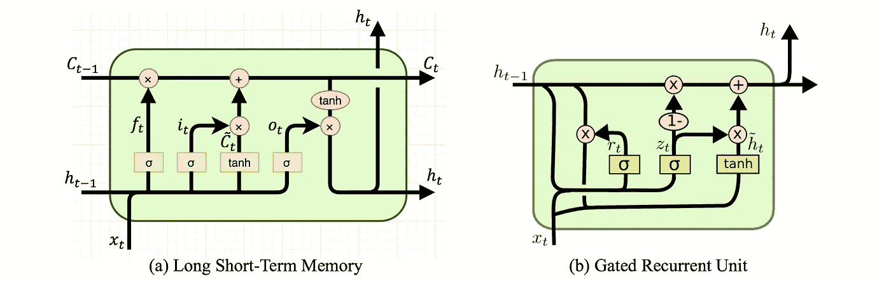
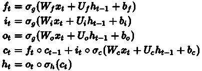
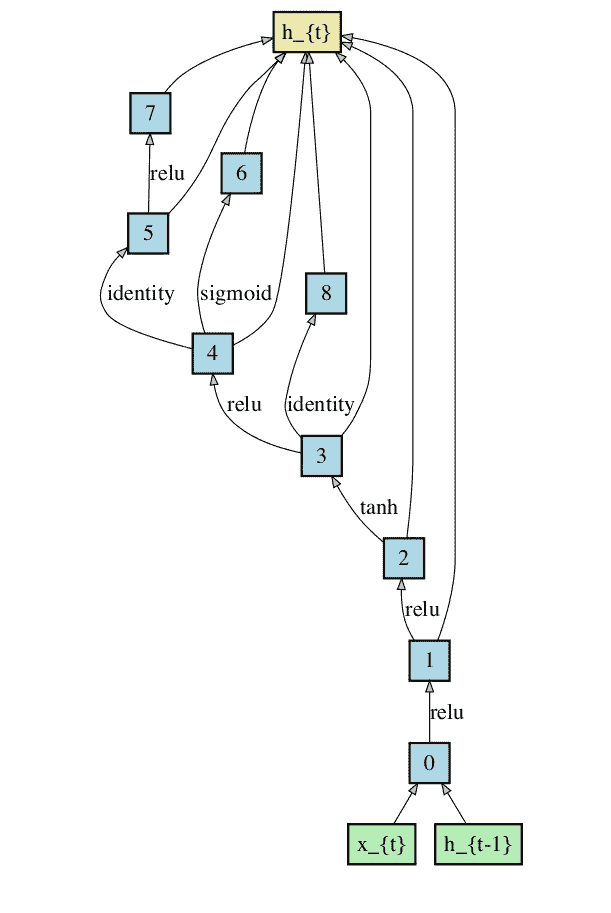
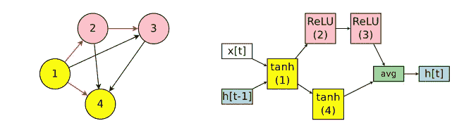
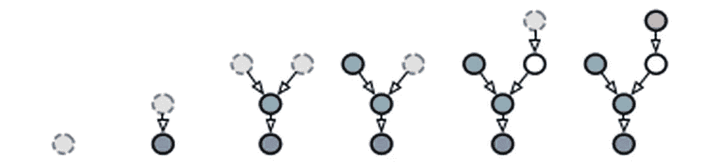
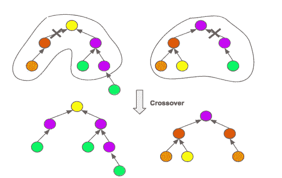

# 培养你自己的 RNN 细胞:简化

> 原文：<https://towardsdatascience.com/growing-your-own-rnn-cell-simplified-b68ba2c0f082?source=collection_archive---------12----------------------->

## 一窥单个 RNN 细胞的“深层”世界

## 什么是 RNN 细胞？

根据 Tensorflow 文档，“在最抽象的设置中，*RNN 单元是指* ***具有状态*** *并执行一些需要输入矩阵的操作的任何东西。”*

RNN 细胞在某种意义上区别于普通神经元，因为它们有一个状态，因此可以记住过去的信息。RNN 细胞构成了循环网络的主干。

在数学层面上，一系列输入通过 RNN 单元，一次一个。单元的状态有助于它记住过去的序列，并将该信息与当前输入相结合以提供输出。一个更简单的方法是展开序列中发生的事情，揭示一个更简单的深层网络。

## 常见的 RNN 单元架构

两种最常用的 RNN 单元是 GRUs 和 LSTMs。这两个单元都有“门”,基本上是对应于每个输入的 0 和 1 之间的值。这些门背后的直觉是忘记和保留少数选定的输入，表明这些细胞既可以记住来自过去的信息，也可以在需要时让它离开。这使得他们能够更好地处理序列。

要详细了解这些细胞的工作，请参考这个包含动画的相当不错的博客，以便于解释。

 [## 动画 RNN，LSTM 和 GRU

### gif 中的递归神经网络细胞

towardsdatascience.com](/animated-rnn-lstm-and-gru-ef124d06cf45) 

## 单个节点本身就是一个深度网络！！

让我们看看 LSTM 工作的方程，它是最常用的 RNN 池之一。这里 x_t 表示单元的输入，而 h_t-1，h_t 和 c_t-1，c_t 表示隐藏状态和单元状态。所有其余的变量都是可训练的权重和偏差。

它们看起来确实很吓人，想想这些都发生在 RNN 的一个牢房里。在不深入细节的情况下，这些等式是否让你想起了其他事情？让我强调一下，*矩阵与输入的权重相乘，然后是激活函数！！！* ***是的！！！人脉深厚！！！***

RNN 细胞本身包含一个小而深的网络。虽然 LSTMs 和 GRUs 中的架构是最常用的，但这并不意味着它们是手头每项任务的最佳选择。可能有比这些标准单元性能更好的更复杂、看起来不可思议的架构。

RNN cell created by WeNet, performing better than complex Recurrent networks containing LSTM cells, on the Penn Treebank dataset.

就像*神经架构搜索(NAS)* 和 *AutoML 的发展一样，*研究人员也一直致力于创建他们自己的 RNN 细胞架构。如果你不知道 NAS 或 AutoML 是什么，可以看看我之前在 AutoML 上的博客。

## 常用方法

1.  *搜索整个参数空间*:从所有可能的连接开始，然后删除多余的连接，留下重要的连接。由于从真正“所有”可能的连接开始在计算上是一场噩梦，这些方法中的实际搜索空间通常是有限的。

1.  *生长细胞，一次一个节点*:这些方法依赖于类似于生长决策树的策略。每次迭代后，都会在图的顶部添加一个新节点。树从 h_t(输出)开始生长，当我们在叶节点同时得到 x_t 和 h_t-1(输入)时结束。

1.  *遗传算法* : RNN 细胞架构是当前一代中的明星，杂交产生下一代更好的细胞架构。

## 下一步是什么？

AutoML 和 NAS 领域的工作和开发是最近的事，而且每年都在快速增长。然而，不仅没有一种算法能够集成并真正创建任何深度学习网络(包括 CNN 和 RNNs ),而且现有算法所花费的计算时间也是巨大的。这些都是未来研究可以并且将会改进的方向。

本博客是为机器学习领域创建简化介绍的努力的一部分。点击此处查看完整系列

 [## 机器学习:简化

### 在你一头扎进去之前就知道了

towardsdatascience.com](/machine-learning-simplified-1fe22fec0fac) 

*或者干脆阅读本系列的下一篇博客*

 [## AutoML 和 AutoDL:简化

### 看看机器学习新阶段的开始

towardsdatascience.com](/automl-and-autodl-simplified-b6786e5560ff) 

## 参考

*[1]拉瓦尔、阿迪蒂亚、里斯托·米库拉宁。"从节点到网络:进化循环神经网络."arXiv 预印本 arXiv:1803.04439 (2018)。
[2]Schrimpf，Martin 等人，“一种灵活的自动化 RNN 架构生成方法”arXiv 预印本 arXiv:1712.07316 (2017)。
[3] Pham，Hieu 等，“通过参数共享进行有效的神经结构搜索”arXiv 预印本 arXiv:1802.03268 (2018)。
[4]黄、智衡、秉祥。" WeNet:用于递归网络体系结构搜索的加权网络."arXiv 预印本 arXiv:1904.03819 (2019)。*