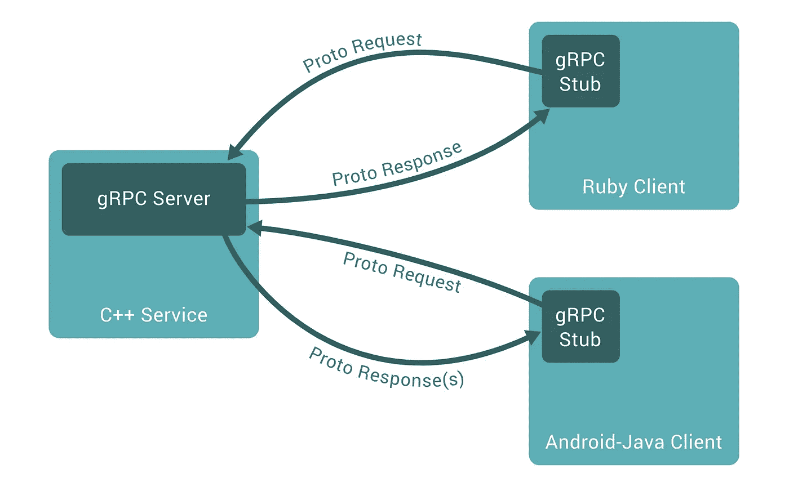
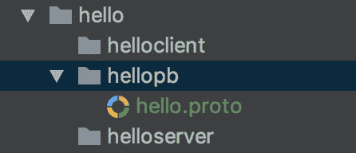

# Golang

> 原文：<https://towardsdatascience.com/grpc-in-golang-bb40396eb8b1?source=collection_archive---------2----------------------->

## 使用 gRPC 构建一个简单的 API 服务

在很长一段时间里，REST API 一直统治着 web 编程世界，直到 gRPC 的到来，颠覆了这个行业。网上有很多帖子讨论 gRPC 的优势，并将其与 REST 进行比较，因此我不打算在这一点上做多余的评论。我的理解是 gRPC 继承了 REST 的功能，并用更快、更轻、更灵活的服务对其进行了扩展。在这篇文章中，让我们看一下 gRPC 并使用 Golang 实现一个简单的服务。

# 先决条件

*   安装 Go:[https://golang.org/doc/install](https://golang.org/doc/install)
*   安装`protoc` : gRPC 使用`protobuf`进行通信，为了生成相关文件，需要安装`protoc`:

```
brew install protobuf // For MacOS
```

*   安装`protoc-gen-go`:因为我们在这篇文章中使用`go`，你将需要`protobuf`的 go-support

```
go get -u github.com/golang/protobuf/protoc-gen-go
```

*   安装`grpc`:go 的 grpc 包

```
go get -u google.golang.org/grpc
```

(注意:确保您的`GOPATH`设置正确，这样您的包和项目将位于`GOPATH/src`下)

# gRPC 概述

与传统的 REST API 相比，在传统的 REST API 中，客户端通过指定一系列约束条件与服务器进行通信，如发送到特定的 url — `localhost/api/v1/hello`、`localhost/api/v1/doSomething`并指定哪种操作，如 PUT、POST、GET……*我认为 gRPC 在某种程度上抽象了这个概念，并通过简单地调用函数来定义通信，这些函数中的消息以* `*protobuf*` *格式定义。*



使用 gRPC，客户机可以直接调用服务器中的函数，正如您稍后将看到的，它们实际上共享同一个 protobuf 文件。上图的一个巨大优势是，用不同语言编写的服务器和客户端可以很容易地相互通信，因为它们共享一个 protobuf 文件。

如果到目前为止您对 gRPC 和 protobuf 有点困惑，让我们继续并实现一个服务，看看 protobuf 如何在通信中发挥作用。在这篇文章中，我们将实现一个简单的一元服务，即发送一个问候请求并接收一个响应。*客户端会发送一个对其名称的请求，服务器会返回一串* `*Hello + client_name*` *。*

# 原蟾蜍

在 protobuf 中，它定义了可用的服务和消息。打开具有结构的项目:



并且在`hello.proto`里面写着:

所以`service`关键字定义了一个服务，`rpc`定义了服务的功能。在这个例子中，我们的`helloService`提供了一个`Hello`函数，它需要输入`helloRequest`消息并输出一个`helloResponse`消息。如果你熟悉任何一门编程语言，我们大致可以打个比方:`service => class`、`rpc => function`和`message => global variables`。

转到您的终端并运行:

```
protoc --go_out=plugins=grpc:. YOUR_ROOT_FOLDER/hellopb/hello.proto
```

`--go_out`选项指定了生成文件的输出目录，也告诉我们需要使用 grpc 插件。第二部分是目标文件。

结果给你一个`hello.pb.go`文件。如果你查看文件，你会发现 gRPC 的神奇之处在于，所有这些信息都是用 go 特定语言表示的，而*如果你使用其他语言，同样的 protobuf 会用其他特定语言表示，这也是 protobuf 可以跨语言交流的原因。*

# 计算机网络服务器

服务器接收来自客户端的请求并相应地做出响应。

在`main`函数中，我们注册了一个服务器，让它监听地址`0.0.0.0:50051`，它是本地主机，端口`50051`是 gRPC 连接的端口。

函数`RegisterHelloServiceServer`是从我们刚刚编写的 protobuf 文件自动生成的。*如果你仔细研究这个函数，你会发现第二个参数需要一个 struct 类型来实现服务接口——做“实际工作”:*

```
// HelloServiceServer is the server API for HelloService service.
type HelloServiceServer interface {
   Hello(context.Context, *HelloRequest) (*HelloResponse, error)
}
```

上面的代码是在`hello.pb.go`中生成的。为了实现服务器，struct 类型需要在接口内部实现函数`Hello`。

然后在实现中，它从请求中接受名称并返回一个字符串`Hello + name`。

# 客户

客户端发送请求并接收响应。

代码很简单，我们创建一个客户端`hellopb.NewHelloServiceClient`拨号到端口`50051`并通过函数`client.Hello`发送请求。注意，所有这些函数都在自动生成的文件中提供。

现在，请再次理解文档中所说的内容:

> 在 gRPC 中，客户端应用程序可以直接调用不同机器上的服务器应用程序的方法，就像它是一个本地对象一样，这使得您可以更容易地创建分布式应用程序和服务。

`client.Hello`正是上面所描述的，因为客户端可以直接调用服务器端的函数。

# 运行应用程序

服务器和客户端都准备好了，让我们先运行服务器，然后运行客户端，您将得到结果:


这是 gRPC 在 golang 中最简单的用法，当然，还有很多其他应用，特别是 gRPC 支持流调用，允许客户端和服务器以流格式相互通信。我希望这只是一个起点，还有更多值得探索。

**参考**:

1.  [https://grpc.io/docs/guides/](https://grpc.io/docs/guides/)
2.  [https://github.com/golang/protobuf](https://github.com/golang/protobuf)
3.  [https://github.com/grpc/grpc-go](https://github.com/grpc/grpc-go)
4.  [https://code . tuts plus . com/tutorials/rest-vs-grpc-battle-of-the-API-CMS-30711](https://code.tutsplus.com/tutorials/rest-vs-grpc-battle-of-the-apis--cms-30711)