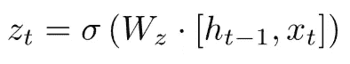

# GRU 和 LSTM 的

> 原文：<https://towardsdatascience.com/grus-and-lstm-s-741709a9b9b1?source=collection_archive---------13----------------------->

递归神经网络是保存信息的网络。它们对序列相关的任务很有用，如语音识别、音乐生成等。然而，RNN 患有短期记忆。如果一个序列足够长，它们将很难把信息从前面的时间步带到后面的时间步。这就是所谓的消失梯度问题。在这篇文章中，我们将研究门控循环单位(GRU)和长短期记忆(LSTM)网络，它们解决了这个问题。如果你没有读过 RNN 氏症，这里有一个链接[指向我解释 RNN 是什么以及它如何工作的帖子。](https://medium.com/datadriveninvestor/understanding-recurrent-neural-networks-aea0078defc6)

Basic Architecture of RNN Cell

一个标准 RNN 的架构表明，中继模块具有非常简单的结构，只有一个 *tanh* 层。GRU 和 LSTM 都有类似 RNN 的重复模块，但是重复模块有不同的结构。

GRU 和 LSTM 的关键思想是细胞状态或记忆细胞。它允许两个网络保留任何信息而不会丢失太多。这些网络也有闸门，帮助调节流向细胞状态的信息流。这些门可以知道序列中哪些数据是重要的，哪些是不重要的。通过这样做，它们以长序列传递信息。现在，在我们进入 LSTM 之前，让我们先试着理解 GRU 或门控循环单元。

Basic Architecture of a GRU Cell

我们可以清楚地看到，GRU 单元的架构比简单的 RNN 单元复杂得多。我觉得方程式比图表更直观，所以我会用方程式来解释一切。

在 GRU 单元中，我们需要注意的第一件事是单元状态*h<t>等于时间 *t* 的输出。现在，让我们一个一个地看所有的方程。*

在每个时间步长，我们有两个选项:

1.  保留以前的单元状态。
2.  更新其值。

上面的等式示出了在时间 *t* 可以替换单元状态的更新值或候选值。它依赖于前一时间步*h<t-1>的单元状态和一个称为*r<t>的相关性门，该相关性门在计算当前单元状态时计算前一单元状态的相关性。**

如我们所见，关联门 *r < t >* 具有 sigmoid 激活，其值在 0 和 1 之间，决定了先前信息的相关程度，然后用于更新值的候选中。

当前单元状态*h<t>是先前单元状态 *h < t-1 >和*更新候选状态 *h(tilde) < t >* 的过滤组合。这里，更新门*z<t>决定计算当前单元状态所需的更新候选的部分，这又决定保留的先前单元状态的部分。**

像关联门一样，更新门也是一个 sigmoid 函数，它帮助 GRU 在需要时保持单元状态。现在，让我们看看在《RNN 邮报》上看到的例子，以便更好地理解 GRU

史密斯太太养的狗意识到房子里有人，正在吠叫。

这里的“dogs”一词是必要的，因为 dogs 是复数，所以要知道单词“were”在末尾。让我们有一个单元格状态*c<t>= 1 为复数。因此，当 GRU 到达单词“dogs”时，它理解我们在这里讨论的是句子的主语，并在单元状态中存储值 *c < t >* = 1。这个值一直保留到单词“were ”,在这里它理解主语是复数，单词应该是“were”而不是“was”。这里的更新门知道什么时候保留值，什么时候忘记值。所以一旦单词“were”完成，它就知道细胞状态不再有用，并忘记了它。这就是 GRU 如何保持记忆，从而解决渐变消失的问题。*

虽然 LSTM 的核心思想是相同的，但它是一个更复杂的网络。让我们试着用类似的方式来理解它。

Basic Unit of a LSTM Cell

乍一看，LSTM 单元看起来确实很可怕，但让我们试着像对 GRU 一样将其分解为简单的方程。GRU 有两个门，称为更新门和关联门，而 LSTM 有三个门，即遗忘门*f<t>，更新门*I<t>和输出门 *o < t >* 。**

在 GRU，细胞状态等于激活状态/输出，但在 LSTM，它们并不完全相同。时间“t”处的输出由*h<t>表示，而单元状态由*c<t>表示。**

如同在 GRU，在时间‘t’的单元状态具有候选值 *c(波形符)< t >* ，其依赖于先前的输出 *h < t-1 >* 和输入 x < t >。

像在 GRU，LSTM 的当前单元格状态 c *< t >* 是前一单元格状态和候选值的过滤版本。然而，这里的过滤器由两个门决定，即更新门和忽略门。遗忘门与 GRU 中(1-updateGate < t >的值非常相似，遗忘门和更新门都是 sigmoid 函数。

遗忘门计算当前单元状态需要多少来自前一单元状态的信息。

更新门计算在当前单元状态中需要多少候选值 *c(波形符)< t >* 。更新门和遗忘门的值都在 0 和 1 之间。

最后，我们需要决定我们要输出什么。这个输出将是我们的细胞状态的过滤版本。因此，我们通过一个 *tanh* 层传递单元状态，将值推到-1 和 1 之间，然后乘以一个输出门，该输出门有一个 sigmoid 激活，因此我们只输出我们决定输出的内容。

LSTM 氏症和 GRU 氏症在深度学习中基于序列的问题上都非常流行。虽然 GRU 的工作对某些问题有效，但 LSTM 的工作对其他问题也有效。GRU 的简单得多，需要较少的计算能力，因此可以用来形成真正的深度网络，然而 LSTM 的更强大，因为它们有更多的门，但需要大量的计算能力。至此，我希望你对 LSTM 和 GRU 有了基本的了解，并准备好深入序列模型的世界。

参考资料:

1.  http://colah.github.io/posts/2015-08-Understanding-LSTMs/
2.  【https://www.coursera.org/learn/nlp-sequence-models 