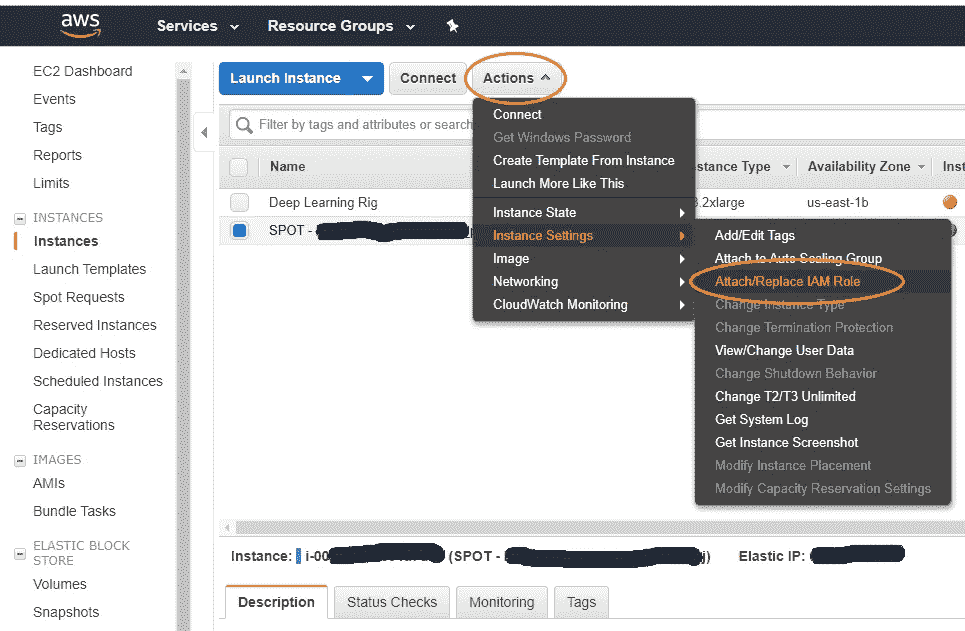

# AWS Textract 设置指南

> 原文：<https://towardsdatascience.com/guide-on-aws-textract-set-up-8cddb8a3b3a3?source=collection_archive---------9----------------------->

如何使用 AWS 的 OCR 即服务准确处理 PDF 文件


Photo by [Raphael Schaller](https://unsplash.com/@raphaelphotoch?utm_source=unsplash&utm_medium=referral&utm_content=creditCopyText) on [Unsplash](https://unsplash.com/?utm_source=unsplash&utm_medium=referral&utm_content=creditCopyText)

## 异步 API 响应

最近，异步 API 响应的新范例变得非常突出。它通过返回 Job-ID 而不是 API 响应来工作。然后，为了检查状态，用户需要使用作业 ID 向 API 提交第二次调用。这里有一个很好的指南。


[Sync vs. Async API responses in Flask](https://smirnov-am.github.io/background-jobs-with-flask/)

异步 API 响应通常用于重量级机器学习应用程序或移动大量数据的应用程序，即任何需要花费很长时间才能将结果同步返回给用户的应用程序。

AWS Textract 可以检测和分析 PDF 格式的多页文档中的文本。Textract 对其 API 使用异步响应。在后台，每个 PDF 被分成单页格式并发送到处理引擎，以便每个页面可以独立于 PDF 文档进行处理，并且系统可以水平扩展。此外，异步操作允许用户提交超过 1，000 页的 PDF 文件进行处理，并在稍后返回以检查结果，而不是等待请求。

## 在 EC2 上使用 Python 设置 Textract 的分步说明

让我们来看一下设置 EC2 机器来用 Python 调用 Textract 所需的步骤:

**1 —** 设置一个 AWS 角色从 EC2 实例访问 Amazon Textract。


Create a role for an EC2 in IAM

**a)** 在**创建角色**页面上，将使用该角色的服务—选择 **EC2** 并转到下一步:权限

**b)** 我们将需要授予以下 4 个权限来设置 text ract—AmazonTextractFullAccess
amazonsreadonlyaccess
amazonsfnfullaccess
AmazonSQSFullAccess

(一旦设置了 SNS、SQS 和 Textract 配置，您可能需要降低访问权限)

**c)** 跳过**标签**，进入**审核**。称之为爽快的东西。

**d)** 转到 **EC2** 页面，在**实例**下选择将调用 Textract 的机器，并附加您从 **a)** 创建的角色，如下图所示



Associate newly created role with an EC2 Instance

**2 —** 登录到您添加了角色的 EC2 机器，安装 Python-boto 3 所需的 AWS SDK

```
> pip install boto3
```

**3 —** 创建一个 IAM 服务角色，授予 Amazon Textract 访问您的 Amazon SNS 主题的权限。这将允许 Textract 在文件分析完成时通知您。
参见 [**授予亚马逊 Textract 访问您的亚马逊社交网络主题**](https://docs.aws.amazon.com/textract/latest/dg/api-async-roles.html#api-async-roles-all-topics) 的详细访问权限。**保存服务角色的亚马逊资源名称(ARN)** ，因为您需要将它提供给 Textract。

根据上述参考，您创建的角色将在策略声明中指出以下内容—

```
{
  "Version": "2012-10-17",
  "Statement": [
    {
      "Effect": "Allow",
      "Principal": {
        "Service": "ec2.amazonaws.com"
      },
      "Action": "sts:AssumeRole"
    }
  ]
}
```

你需要把它替换成—

```
{
  "Version": "2012-10-17",
  "Statement": [
    {
      "Effect": "Allow",
      "Principal": {
        "Service": "textract.amazonaws.com"
      },
      "Action": "sts:AssumeRole"
    }
  ]
}
```

**4 —** 在 EC2 实例中运行以下代码，使用 Textract 分析 pdf。pdf 必须位于您的 S3 存储桶中。

## 结论

我们已经通过上面提供的代码介绍了如何在您的 S3 中的图像和 pdf 上使用 AWS Textract。

设置 Textract 有点复杂，但是如果您查看一下代码，就会明白为什么会这样。该代码创建了一个新的 SQS 队列和一个新的 SNS 主题，并为该队列订阅了我们创建的主题。

接下来，在代码中，我们指示要处理的所需 PDF 的 Textract 位置，以及进行通信的 SNS 通道。