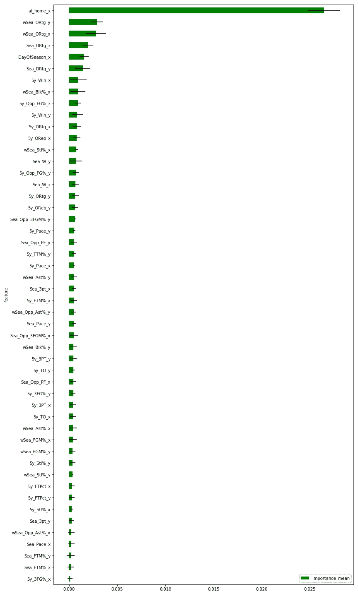

# 用 Python 构建大学篮球机器学习模型指南

> 原文：<https://towardsdatascience.com/guide-to-building-a-college-basketball-machine-learning-model-in-python-1c70b83acb51?source=collection_archive---------2----------------------->


Photo by [Martin Sanchez](https://unsplash.com/@zekedrone?utm_source=unsplash&utm_medium=referral&utm_content=creditCopyText) on [Unsplash](https://unsplash.com/s/photos/basketball?utm_source=unsplash&utm_medium=referral&utm_content=creditCopyText)

## 让我们比较神经网络性能和 Vegas 线精度。

## 介绍

感恩节假期，我有一些空闲时间，偶然发现了由[罗伯特·克拉克](https://medium.com/u/d2a72525d0b3?source=post_page-----1c70b83acb51--------------------------------)创建的[伟大的 Python 公共 API](https://medium.com/clarktech-sports/python-sports-analytics-made-simple-part-2-40e591a7f3db) 。这个 API 允许用户从 sports-reference.com 的[非常容易地获得美国主要体育项目的任何统计数据。通常，任何数据科学工作中最困难的部分是收集和清理数据。虽然仍有一些工作要做，但我自然会被那些最难的部分变得简单的项目所吸引。我的目标是快速创建一个接近众所周知的公开可用系统质量的模型。赌博市场真的很难击败，他们将提供一个很好的准确性的衡量标准。尽管赛季初的大学篮球经常被认为是一个疲软的市场，但这种模式在拉斯维加斯不太可能盈利——有几个关键因素超出了它的范围。我这个项目的代码可以在 Github](https://www.sports-reference.com/) 上找到[。](https://github.com/btatkinson/cbb-model)

## 概述

我的计划是找到与预测大学篮球比赛结果相关的最重要的统计数据。然后我可以利用两个强大的模型，一个光梯度推进机(LGBM)，一个神经网络来预测大学篮球传播。神经网络和 LGBM 模型都有不同的优点和缺点，通常两者的组合优于各自。他们都在 Kaggle 上的机器学习比赛中人气极高。如果我即将失去你，这里的[是一个关于神经网络的很好的讲解视频。另一方面，LGBM 模型具有线性回归的优势，但也可以很好地处理非线性数据和空值。](https://www.youtube.com/watch?v=aircAruvnKk)[下面深入解释一下](https://www.kaggle.com/c/ga-customer-revenue-prediction/discussion/66048#388925)它为什么会在 Kaggle 上流行。这些模型虽然比简单的线性回归器复杂得多，但可能不会明显优于线性回归器(我们将测试它！).

## 收集数据

我们需要在大学篮球比赛开始前找到最有预见性的特征。这可能会很棘手，因为样本量会随着季节的变化而变化。进入赛季，我们只能使用季前赛的功能。在赛季后期，季前赛的特点不太可能是重要的，我们可以依靠 20+场比赛的样本量。

为了组装这些功能，我们需要每个游戏的游戏日志。这样，我们就可以汇总游戏开始时的赛季统计数据。我用以下代码编译了一个 box score URLs 列表:

```
import numpy as np
import pandas as pdfrom sportsreference.ncaab.teams import Teams
from tqdm import tqdmseasons = range(2011, 2020) # python is odd, this is 2011 - 2019master_array = []for season in tqdm(seasons): #tqdm shows progress bar
    # a couple of teams don't have links for every season, thus    #"try/except"
    try:
        season_team_list = Teams(str(season))
        for team in season_team_list: 
            team_schedule = team.schedule
            for game in team_schedule:
               boxscore = game.boxscore_index
               master_array.append([str(season),team.name,boxscore])
    except:
        continue

schedule_df = pd.DataFrame(master_array, columns=['Season','TeamName','BoxscoreIndex'])schedule_df.to_csv('./output/schedule.csv',index=None)
```

所有这些 API 调用总共需要大约 30 分钟。出于这个原因，[我把数据集发布在 Kaggle](https://www.kaggle.com/btatkinson/cbb-data) 上，这样你就可以下载了。

现在我们有了 boxscore 链接，我们可以遍历 box score 并捕获几乎所有内容。因为我还不知道什么是有用的，所以我会全部下载下来。幸运的是，令人惊讶的运动参考 API 有一个简单的命令来做到这一点。我一次跑了大约 4 季，仍然花了几个小时。所以，再一次，你可能只想从 Kaggle 下载它。花名册数据可以单独收集(这样做的说明可以在 API 文档中找到)。

```
from sportsreference.ncaab.boxscore import Boxscoreseason = 2011 # will run once for each season
box_df = Noneschedule_df = pd.read_csv('./output/schedule.csv')season_df = schedule_df.loc[schedule_df.Season==season]
for index, row in tqdm(season_df.iterrows()):
    box_link = row['BoxscoreIndex']
    _df = Boxscore(box_link).dataframe

    if box_df is not None:
        box_df = pd.concat([box_df,_df],axis=0)
    else:
        box_df = _dfbox_df.to_csv('./output/{}_boxscores.csv'.format(season),index=None)
```

## 数据清理

从 2011 年到 2019 年，我们总共有大约 50，000 场比赛和票房成绩。数据清理可能非常混乱，但也非常重要。让我们向数据科学之神祈祷好运，然后首先检查空值:

```
print(df.isnull().sum(axis=0).sort_values(ascending=False))away_ranking                              95468
home_ranking                              92529
location                                  14172
away_offensive_rebound_percentage          2329
home_minutes_played                        2329
away_turnover_percentage                   2329
away_true_shooting_percentage              2329
away_total_rebound_percentage              2329
away_steal_percentage                      2329
away_assist_percentage                     2329
away_offensive_rating                      2329
away_free_throw_attempt_rate               2329
away_effective_field_goal_percentage       2329
away_defensive_rebound_percentage          2329
away_defensive_rating                      2329
away_block_percentage                      2329
away_three_point_attempt_rate              2329
home_offensive_rebound_percentage            81
home_assist_percentage                       81
home_defensive_rating                        81
...
date                                          0
away_wins                                     0
away_win_percentage                           0
away_two_point_field_goals                    0
away_two_point_field_goal_percentage          0
away_two_point_field_goal_attempts            0
away_turnovers                                0
home_total_rebounds                           0
home_offensive_rebounds                       0
away_three_point_field_goals                  0
winning_name                                  0
```

首先，很多重要的列没有空值！考虑到我们依靠公共 API 和网站来收集 100，000 个 boxscore，这是令人兴奋的(上面的代码收集每个 box score 两次，每个团队一次)。

让我们继续前进。因为一次只有 25 个团队被排名，所以许多团队的排名列为空是有道理的。如果我们没有太多的数据，我会依赖排名列作为输入。但是，我认为我们可以安全地删除这些列。在某些情况下，地点也很难确定。我不打算将旅行合并到这个模型中，因此我将忽略该列。旅行，或在一段时间内的累积旅行，将是一个有趣的补充！

在进一步的检查中，很明显高级统计数据只在 I 级团队中被追踪。这就是为什么客场高级统计比主场高级统计有更多的空值——二级球队通常必须在一级竞技场比赛。我们其实并不关心二级的高级属性，所以这不是问题。这次数据清理比我预期的要顺利得多。

除了检查空值之外，数据清理还有其他步骤。我浏览了一些关键栏目(得分、助攻、胜场等)。)并检查它们的最小值和最大值，同时使用 [seaborn 的 distplot](https://seaborn.pydata.org/generated/seaborn.distplot.html) 来检查它们是否有意义。目前一切似乎都很好！

## 特征创建

简单的得分统计将帮助我们预测 NCAA 篮球队未来的成功。有不同的方法将团队质量输入到我们的模型中。我们可以使用过去 10 场比赛的平均得分。我们可以使用过去 5 个赛季的平均得分。我们只需输入前 25 名的排名，模型就会知道排名 1-5 的团队是真正的好团队。我试图合理地限制这个项目的范围，但有近乎无限的组合可以尝试。

作为题外话，我想谈谈指数加权平均(EWA)。不要对过去的 X 个游戏进行平均统计，有时更好的方法是对最近的游戏进行加权(甚至稍微)使其比旧游戏更重。我将使用 EWA 和赛季平均版本的盒子得分统计数据。具有高游戏间差异的统计数据(3 分命中率，失误)将从长期样本中受益。

另外，我必须坦白。我已经做了大量的特征选择工作。如果下面的统计数据看起来特别具体，那是因为我已经排除了相似但不太有用的特性。有这么多的组合可以尝试，我不想浪费读者宝贵的时间去经历整个过程。我将添加一些未经测试的、可能无用的特性来展示我如何测试重要性。

我将从长期特征开始。我们谈的是非常长远的计划。对于以下特性，我采用了过去 5 季的指数加权平均值:

1.  获胜%
2.  进攻等级(每 100 次进攻得分)
3.  进攻篮板百分比(导致进攻篮板的可用进攻篮板百分比)
4.  允许对手 FG%
5.  节奏
6.  罚球得分的百分比
7.  投篮命中率
8.  三分球得分的百分比
9.  三分球命中率
10.  失误百分比(导致失误的进攻型进攻的百分比)
11.  抢断百分比(导致抢断的防守控球百分比)

我们已经有 11 个功能了。然而，我们也需要同样的 11 个特征给对手。所以我们有 22 个功能。太多了！你可以看到这很容易失控。

好的，所以我们还需要比过去五年更多的样本。下面的统计数据我将使用一个季度的样本。

1.  防御等级
2.  获胜%
3.  Opp 3PT 拍摄%
4.  犯规了
5.  三分球得分的百分比
6.  节奏
7.  罚球命中率%

最后但同样重要的是，我们需要统计过去几场比赛的数据:

1.  攻击性评级
2.  偷窃百分比
3.  辅助百分比
4.  块百分比
5.  两分投篮命中率
6.  允许的助攻百分比

所以每支球队有 24 个特色，或者每场比赛有 48 个特色。告诉我们的模型赛季进行到什么程度以及主队是谁也是非常重要的。

上下文特征:

1.  季节的某一天
2.  主场/客场

现在我们有一个很好的，甚至 50 个功能。你能找到可以添加到模型中的特性吗？绝对的！这个模型是你玩的。出于演示的目的，我将添加几个可能没有用的。我其实还没测试过，所以不能排除！

1.  本赛季平均个人犯规数
2.  赛季罚球百分比
3.  季节更替百分比

## 功能重要性和选择

我喜欢用三种主要方法来测试特性的重要性。按照从最懒到最不懒的顺序:

1.  LGBM 增益——我们的 LGBM 模型可以指出它认为最重要的特征。虽然这给出了一个粗略的重要性的概念，但是只使用增益也有缺点。我将在整篇文章中谈到所有这些方法的缺点。
2.  LOFO 重要性—“去掉一个特征”，这种方法通过每次运行去掉一个特征来测试模型。明显的缺点是要花很多时间。这个缺点被它非常广泛地适用于不同的模型和输入数据的事实所抵消。我最近才知道这种方法，我想感谢[艾哈迈德·艾尔丹姆](https://github.com/aerdem4/lofo-importance)开源了这种方法并使其易于使用。
3.  皮尔逊、斯皮尔曼和赫夫丁的 D 相关性——假设，在现实世界中，有时你不得不捍卫你的工作。在这种情况下，说“我把它扔进了一个黑盒机器学习模型，这就是我得到的结果”是不够的。谢天谢地，统计学家为我们做了繁重的工作。皮尔逊相关性衡量线性关系，斯皮尔曼相关性衡量单调关系，赫夫丁衡量非线性关系。我们可以针对模型中的每个特征和目标运行这些相关性，并计算出相对有用性。这些在寻找某些参数时也非常有用。例如，如果我想知道我的助攻百分比指数加权平均值衰减多少，我可以优化 Spearman 相关来找到最佳衰减值。


Pearson’s would estimate the first well, Spearman’s the first and second, and Hoeffding’s D the third. You can read more about these correlations [here](https://m-clark.github.io/docs/CorrelationComparison.pdf) or [here](https://statistics.laerd.com/statistical-guides/spearmans-rank-order-correlation-statistical-guide.php). If I had to guess, Spearman’s would work on almost all of these college basketball features.

## 基线结果

我们如何给我们的模型评分？这个模型试图预测维加斯的扩散。所以如果一个好的队和一个差的队比赛，这个模型会给出一个预期的胜率。假设模型预测好的队伍赢 10 分，但他们实际上赢了 8 分。那么我们的平均绝对误差是 2。同样，如果好队赢了 12 分，而我们的模型再次预测 10 分，我们的平均绝对误差也是 2。

这是我的模型代码。你会注意到我正在使用[五重交叉验证](https://machinelearningmastery.com/k-fold-cross-validation/)来帮助给出一个可靠的模型误差估计，并且我还记录了特征的重要性。

平均绝对误差，使用上述 56 个特征:

```
Sklearn's Linear Regressor: 9.17 LightGBM model: 9.09
```

这意味着平均而言，我们的预测大约有 9 个百分点的误差。这样好吗？谁知道呢！让我们把它和维加斯的利差比较一下。前几天发现[历史线](https://www.sportsbookreviewsonline.com/scoresoddsarchives/ncaabasketball/ncaabasketballoddsarchives.htm)和结果。很抱歉链接我自己的 twitter 帖子，但我谈论的是赛季与赛季之间的错误和赛季过程中的错误:

TL；DR:维加斯的开盘价误差约为 8.48，收盘价格误差约为 8.41。一方面，我们离得很远。那是可以预料的。如果线性模型能打败拉斯维加斯，我就不会写中等水平的文章了。我可能会离开意大利海岸。另一方面，我确实认为这显示了简单线性回归的力量，平均误差已经在维加斯 0.75 分之内。这也展示了 LightGBM 的威力。它以与线性回归相似的速度消除了十分之一的误差。

## 特征选择

让我们用我上面提到的最懒惰的方法，更仔细地看看我们的特性有什么贡献:


LGBM Feature Importance, using the ‘gain’ setting

我很抱歉，上面的 y 轴有点难以阅读，因为有超过 50 个功能。LGBM 模型喜欢的两组特征是加权赛季进攻等级和五年加权胜率。它也真的很喜欢整个赛季的防守评分。这对那些熟悉篮球的人来说是有意义的。

需要注意的一点是，每个特性都有一点贡献。情况并非总是如此。有时，该图中有一些明显的特征，但没有任何贡献。如果我制造一列随机噪声，它将显示为无用的(否则我们就有问题了)。我还不小心给了 LGBM 两份同一专栏的副本——在这种情况下，其中一份将显示为没有贡献任何内容。这些特性是可以安全丢弃的。

之前我提到了只使用 LGBM 增益的缺点。开始放弃增益图底部显示的特性不一定安全。“在家”是最清晰、最有用的特征之一。然而，它位于增益图的中间。有时特征可能是共线的，这可能会混淆甚至阻碍模型。“赛季罚球百分比”与“赛季罚球得分百分比”非常相似——即，在一个方面做得好的球队可能在另一个方面也做得好。该模型可能很难区分使用哪一个。让我们看看 LOFO 方法是否能帮助我们。下面是使用 LOFO 方法的重要性图表:


LOFO highlights “At home” — because it’s telling us something no other feature is!

好多红色啊！回购协议的作者表示，删除任何红色特征都是安全的。然而，在这种情况下，误差线延伸到绿色区域。可能只有两个确定的下降——季节英尺%和季节到%。这两个特性都是我为了演示我的特性选择过程而添加的。你会注意到一些红色的特征与我们添加的相似。例如，五年英尺百分比和五年到百分比。这些可能是红色的，因为我添加了共线要素。最后，赛季平均个人犯规只有一点红色，但绝对没有帮助。我不一定会在这一批中放弃这个功能，但它也是 LGBM 增益图上的最后一个。因此，我认为这也是安全的下降。让我们再试一次，这次只有 50 个原始功能:



好多了！全绿！

但是，我们牺牲了性能吗？不，两种型号实际上得分完全相同，但少了 6 个特征:

```
Sklearn's Linear Regressor: 9.17LightGBM model: 9.09
```

使用的数据更少，性能差异很小。我每次都会做这个交易。使用太多的特征会导致过度拟合，这意味着你的模型不能推广到未来的篮球比赛。事实上，我可能会添加大约 20 个类似于现有的 50 个功能，也许会提高 CV 分数。02。问题是这是否值得。对我来说，不是这样的。

也就是说，有一些特性可以显著提高性能。稍后会详细介绍。

## 神经网络

既然我们已经剔除了可能导致过度拟合的特征，是时候给神经网络(NN)一个机会了。实际上我对这里的期望很低。我们没有处理大量的非线性特征，我们也无法受益于像卷积这样的神经网络特定层。因此，轻型 GBM 是绰绰有余的。我们还优化了我们的功能选择，以提高 LGBM 的性能。从神经网络中分别增加和减少一些特征是值得的。

除了典型的密集神经网络层，我将利用辍学。脱落层随机“脱落”一定比例的神经元。这防止了对单个神经元的过度依赖，从而防止了过度拟合和局部极小值。由于我们几乎所有的功能都是有用的，而且我们有一个基本的神经网络，我们不需要大量的辍学。然而，如果你创建了自己的网络，我建议你使用 dropout 值(尤其是在添加了一些功能之后)。这是我使用的普通前馈网络:


使用五折交叉验证重复五次，这花了 15 分钟训练！增加的复杂性和性能不是免费的。最终结果:

```
Neural Network: 9.22Sklearn's Linear Regressor: 9.17LightGBM model: 9.09Vegas Open: 8.4833Vegas Close: 8.4110
```

等等，一个 NN 花了 15 分钟训练还打不过一个线性回归器？没错。这部分是由于优化了线性模型的特征。这部分也是由于我们的特征的线性性质。最后，我们的神经网络可以更深，这将提高性能。因为我爱我的读者，我尝试了这个模式:

```
def get_model():
    x = keras.layers.Input(shape=[X.shape[1]])
    fc1 = keras.layers.Dense(units=450, input_shape=[X.shape[1]])(x)
    act1 = keras.layers.PReLU()(fc1)
    bn1 = keras.layers.BatchNormalization()(act1)
    dp1 = keras.layers.Dropout(0.45)(bn1)
    gn1 = keras.layers.GaussianNoise(0.15)(dp1)
    concat1 = keras.layers.Concatenate()([x, gn1])
    fc2 = keras.layers.Dense(units=600)(concat1)
    act2 = keras.layers.PReLU()(fc2)
    bn2 = keras.layers.BatchNormalization()(act2)
    dp2 = keras.layers.Dropout(0.45)(bn2)
    gn2 = keras.layers.GaussianNoise(0.15)(dp2)
    concat2 = keras.layers.Concatenate()([concat1, gn2])
    fc3 = keras.layers.Dense(units=400)(concat2)
    act3 = keras.layers.PReLU()(fc3)
    bn3 = keras.layers.BatchNormalization()(act3)
    dp3 = keras.layers.Dropout(0.45)(bn3)
    gn3 = keras.layers.GaussianNoise(0.15)(dp3)
    concat3 = keras.layers.Concatenate([concat2, gn3])
    output = keras.layers.Dense(units=1)(concat2)
    model = keras.models.Model(inputs=[x], outputs=[output])
    return model
```

这是由[布鲁诺·梅洛](https://www.kaggle.com/bgmello)在 Kaggle 上发现的[竞争性神经网络](https://www.kaggle.com/bgmello/neural-networks-feature-engineering-for-the-win)的修改。我还在模型中添加了一些我之前已经删除的特性。用了 4 个多小时(！)来训练，并且得了 9.05 分。

## 未来方向

敏锐的读者，或者至少是那些有广泛篮球知识的读者，会指出我遗漏了一些非常重要的特征。时间表的力量是最明显和最有用的。事实上，[有一个很棒的讲解者](https://medium.com/analyzing-ncaa-college-basketball-with-gcp/fitting-it-in-adjusting-team-metrics-for-schedule-strength-4e8239be0530)讲述了如何将阿洛克·帕蒂和[艾丽莎·勒纳](https://medium.com/u/d6bc63d2ab78?source=post_page-----1c70b83acb51--------------------------------)的时间表的力量结合起来。伤病、招募排名和教练变动也会有所帮助。最后，基本的球员名单特征，比如身高，或者休赛期特征，比如“上个赛季的篮板数占总篮板数的百分比”也可以提高球员的表现。

我非常乐观地认为，使用这些基础知识和上述一些特性的组合，您可以朝着令人垂涎的 Vegas 误差值前进。我会更新这篇文章，增加一些功能吗？如果我开始接近维加斯错误，我会分享我的代码吗？没有人知道，尤其是我。