# TensorFlow Core 中自定义卷积神经网络编码指南

> 原文：<https://towardsdatascience.com/guide-to-coding-a-custom-convolutional-neural-network-in-tensorflow-bec694e36ad3?source=collection_archive---------4----------------------->

## 低级 API 开发教程


下面演示了如何使用低级 TensorFlow 内核创建卷积神经网络(ConvNet)模型，而无需 Keras 等高级 API。本教程的目标是更好地理解深度神经网络中的后台进程，并演示如何使用 TensorFlow 创建自定义代码的概念。

本教程将展示如何将 MNIST 手写数字数据集加载到数据迭代器中，使用图形和会话，创建一个新颖的 ConvNet 架构，用不同的选项训练模型，进行预测，并保存训练好的模型。然后，将提供完整的代码以及 Keras 中的等效模型，以允许直接比较，从而为使用 Keras 的人提供进一步的见解，并显示高级 API 对于创建神经网络是多么强大。

# MNIST 数据集

MNIST 是一组手写数字的 28x28 灰度图像，训练集中有 60，000 幅图像，测试集中有 10，000 幅图像。首先，我将加载并处理 MNIST 图像。

模型将期望输入形状是`[batch_size, height, width, channels]`。由于图像是灰度的(单通道)，它们有形状`[60000,28,28]`，所以它们需要增加一个通道尺寸来获得形状`[60000,28,28,1]`。它们还具有 uint8 类型(像素值范围为 0–255)，因此需要通过除以 255 将其缩放至 0–1 之间的范围。然后显示第一幅图像作为示例。

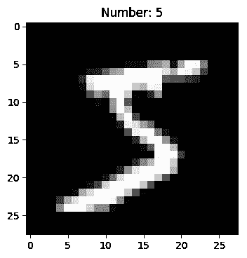

标签是整数值(例如，0，1，2)，但是标签是分类值，因此它们需要被一热编码(例如，[1，0，0]，[0，1，0]，[0，0，1])用于训练。Keras 有一个编码器[to _ categorial](https://www.tensorflow.org/api_docs/python/tf/keras/utils/to_categorical)，我将使用它来转换标签(Scikit-learn 也有 [OneHotEncoder](https://scikit-learn.org/stable/modules/generated/sklearn.preprocessing.OneHotEncoder.html) 作为另一个选项)。

正如下面将要看到的，我们不需要将测试标签转换为一键编码。

# 图表和会话

使用 TensorFlow 制作模型有两个部分[:创建一个](https://www.tensorflow.org/guide/graphs)[图](https://www.tensorflow.org/api_docs/python/tf/Graph),并在一个[会话](https://www.tensorflow.org/api_docs/python/tf/Session)中运行该图。

该图概述了计算数据流。它组织何时以及如何对张量(多维数据数组)执行操作。该图形可以在会话内部或外部创建，但只能在会话内部使用。在会话中，张量被初始化，操作被执行，模型被训练。

## **数据迭代器**

为了演示数据流图和会话，我将创建一个[数据集](https://www.tensorflow.org/api_docs/python/tf/data/Dataset)迭代器。由于 MNIST 图像和地面实况标签是 NumPy 数组的切片，因此可以通过将数组传递给方法[TF . data . dataset . from _ tensor _ slices](https://www.tensorflow.org/api_docs/python/tf/data/Dataset#from_tensor_slices)来创建数据集。然后我们可以为数据集创建一个迭代器。我们希望它在每次运行时返回`batch_size`数量的图像和标签，并在不确定的时期内[重复](https://www.tensorflow.org/api_docs/python/tf/data/Dataset#repeat)。

我们现在已经定义了一个数据流图，为了获得一批新的图像和标签，我们可以在一个会话中运行`data_batch`。

但是，还没有。数据流图已经完成，但是图像还没有真正传入。为此，迭代器需要在会话中初始化。

现在一个会话正在运行，只需运行`data_batch`就可以检索到第一批图像。图像将具有形状`[batch_size, height, width, channels]`，标签具有形状`[batch_size, classes]`。我们可以通过以下方式检查这一点:

```
Images shape: (128, 28, 28, 1)
Labels shape: (128, 10)
```

我们可以通过运行两次`data_batch`来显示前两批中的第一幅图像。

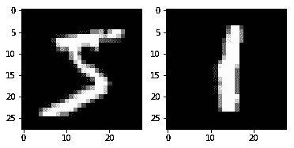

在第一批中，第一张图片是 5。在第二批中，第一张图片是 1。

然后，会话可以在`sess.close()`前关闭。但是，请记住，当会话关闭时，信息将会丢失。例如，如果我们如下所示关闭并重新启动会话，数据迭代器将从头开始重新启动。(注意迭代器需要在每个会话中初始化。)

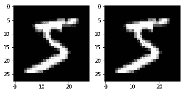

因为会话被关闭并且创建了一个新的会话，所以数据迭代器从头重新启动并再次显示相同的图像。

## **同“同”**

会话也可以通过“with”语句启动和自动关闭。在“with”块的末尾，会话被关闭，如下所示。


# ConvNet 模型

下面将演示如何使用 TensorFlow 构建所示的基本 ConvNet:

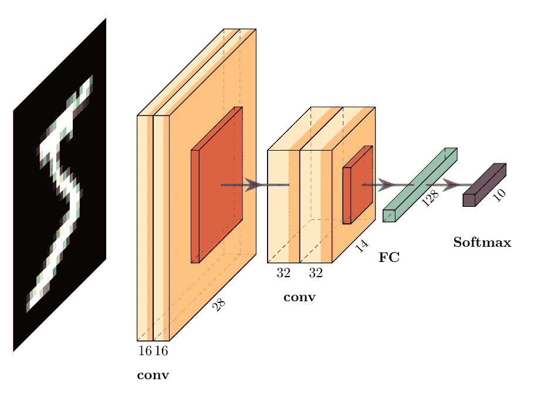

该架构有四个卷积层。前两层有 16 个滤镜，后两层有 32 个滤镜，所有滤镜的大小都是 3x3。四个卷积层中的每一个都添加了偏置和一个 [relu](https://www.tensorflow.org/api_docs/python/tf/nn/relu) 激活。最后两层是全连接(密集)层。

## **权重和偏差**

ConvNet 中的初始权重需要是对称破缺的[随机值，这样网络将能够学习](http://cs231n.github.io/neural-networks-2/#init)。 [xavier_initializer](https://www.tensorflow.org/api_docs/python/tf/contrib/layers/xavier_initializer) “旨在保持所有层中渐变的比例大致相同”，通常用于初始化模型的权重。我们可以通过使用这个带有 [tf.get_variable](https://www.tensorflow.org/api_docs/python/tf/get_variable) 的初始化器来创建层的权重。每个卷积层都有形状为`[filter_height, filter_width, in_channels, out_channels]`的过滤器。由于密集层是完全连接的，并且没有 3×3 的过滤器，所以它们的形状简单地是`[in_channels, out_channels]`。还会创建偏差，每个偏差的大小与相应层的`out_channels`相同，并且用零初始化。

为了组织和简化，我将创建`weights`和`biases`字典。

因为 MNIST 图像是灰度的，所以第一层的`in_channels`是 1。输出层需要将`out_channels`设为 10，因为有 10 个类。其他层中的过滤器数量可以根据性能或速度进行调整，但每个`in_channels`需要与前一层的`out_channels`相同。下面创建 ConvNet 时将解释第一个密集层的大小为 7*7*32。

## **卷积层**

TensorFlow 有一个 [tf.nn.conv2d](https://www.tensorflow.org/api_docs/python/tf/nn/conv2d) 函数，可用于将张量与权重进行卷积。为了简化卷积层，我将创建一个函数，它接受输入数据`x`，应用带权重的 2D 卷积`W`，添加偏差`b`，使用 relu 激活。

## **模型图**

另一个函数可以用来制作模型图。这将采用 MNIST 图像作为`data`，并使用不同层的权重和偏差。

如体系结构所示，在第二和第四卷积层之后，各层的高度和宽度会减小。[最大汇集](https://www.tensorflow.org/api_docs/python/tf/nn/max_pool)将滑动一个窗口，仅使用该区域内的单个最大值。通过使用 2×2 的窗口(`ksize=[1,2,2,1]`)和 2 的跨距(`strides=[1,2,2,1]`)，尺寸将减少一半。这有助于减小模型尺寸，同时保留最重要的特征。对于奇数输入大小，输出形状由除以 2 后的上限确定(例如 7/2 = 4)。

在第四个卷积层之后，张量需要在完全连接的层之前[整形](https://www.tensorflow.org/api_docs/python/tf/reshape)，这样它就变平了。全连接层的权重不用于 2D 卷积，而是仅用于[矩阵乘法](https://www.tensorflow.org/api_docs/python/tf/linalg/matmul)，因此不使用`conv2d`函数。

在最后两层之间添加一个示例[下降](https://www.tensorflow.org/api_docs/python/tf/nn/dropout)层，以帮助减少过拟合，其中下降权重的概率为 0.2。只应在训练期间使用丢弃层，因此如果模型用于预测，则包含一个`training`标志来绕过该层。如果在预测过程中包含了下降图层，则由于随机下降的权重，模型的输出将会不一致且精度较低。

不同层的形状在代码注释中给出。从一个 28x28 的图像开始，大小被两个最大池层缩小了一半，因此其宽度和高度都减小到大小(28/2)/2 = 7。在用于密集图层之前，权重需要通过整形来展平。由于第四个卷积层中有 32 个滤波器，所以展平层的第一个形状维度的大小为 7x7x32(这就是为什么使用它来获得`weights['d1']`的形状)。

# 构建 ConvNet 图

接下来，我们可以构建将用于训练模型的数据流图。

一个重要的概念是使用[占位符](https://www.tensorflow.org/api_docs/python/tf/placeholder)，所以我将首先使用它们创建 ConvNet。但是，我还将展示如何在没有占位符的情况下制作模型(参见下面的**无占位符培训**)。

## **占位符**

我们需要定义如何将数据迭代器中的数据输入到模型图中。为此，我们可以创建一个占位符，指示形状为`[batch_size, height, width, channels]`的张量将被输入到`conv_net`函数中。我们可以将`height`和`width`设置为 28，将`channels`设置为 1，并通过将其设置为`None`来保持批量大小不变。

我们现在可以使用带有`weights`和`biases`字典的`Xtrain`占位符作为`conv_net`函数的输入来获取输出逻辑。

这一步将允许我们通过向`Xtrain`占位符中输入一个或一批图像来训练模型(参见下面的**输入图像**)。

## 失败

该模型基于 10 个互斥的类别对图像进行分类。在训练期间，可以通过使用 [softmax](https://en.wikipedia.org/wiki/Softmax_function) 将 logits 转换为图像属于每个类别的相对概率，然后可以通过 softmax 的交叉熵来计算损失。这些都可以使用 TensorFlow 的 [softmax 交叉熵](https://www.tensorflow.org/api_docs/python/tf/nn/softmax_cross_entropy_with_logits_v2)一步完成。由于我们正在测量一批图像的损失，我们可以使用 [tf.reduce_mean](https://www.tensorflow.org/api_docs/python/tf/math/reduce_mean) 来获得该批图像的平均损失。

我们可以再次为图表使用占位符`ytrain`,它将用于输入 MNIST 标签。回想一下标签是一个热编码的，批次中的每个图像都有一个标签，所以形状应该是`[batch_size, n_classes]`。

## **优化器**

该损失用于通过网络反向传播该损失来更新模型权重和偏差。学习率用于按比例缩小更新，这防止了权重偏离最优值或在最优值附近跳跃。

[Adam](https://arxiv.org/abs/1412.6980) 优化器源自 Adagrad 和 RMSProp 与 momentum 的组合，并且已经证明与 ConvNets 一起工作一直很好。这里我使用 Adam 优化器，学习率为 1e-4。然后计算梯度，并通过运行[最小化](https://www.tensorflow.org/api_docs/python/tf/train/AdamOptimizer#minimize)方法来更新权重。

`train_op`现在是训练模型的关键，因为它运行`optimizer.minimize`。为了训练模型，只需要将图像输入图表，然后运行`train_op`来根据损失更新权重。

# **训练模型**

## **精度**

我们可以在训练期间使用测试图像来测量准确度。对于每个图像，我们执行模型推断，并使用具有最大 logit 值的类作为预测。准确度就是正确预测的比例。我们需要使用整数值而不是独热编码来比较预测和标签，所以我们需要通过使用 [argmax](https://www.tensorflow.org/api_docs/python/tf/math/argmax) 来转换它们(这就是为什么`test_labels`没有被转换为独热编码，否则它必须被转换回来)。

精度可以用 TensorFlow 的[精度](https://www.tensorflow.org/api_docs/python/tf/metrics/accuracy)算子来测量，该算子有两个输出。第一个输出是没有更新指标的准确性，第二个输出是我们将使用的返回具有更新指标的准确性的输出。

## **初始化变量**

需要初始化[局部变量](https://www.tensorflow.org/api_docs/python/tf/local_variables)(临时变量，如精度中的`total`和`count`度量)和[全局变量](https://www.tensorflow.org/api_docs/python/tf/global_variables)(如模型权重和偏差)，以便在会话中使用。

## **输送图像**

回想一下，对于每一批，需要创建一组新的图像和基本事实，并输入占位符`Xtrain`和`ytrain`。如上图所示，我们可以从`data_batch`得到`batch_images`和`batch_labels`。然后，通过创建一个将占位符作为键、将数据作为值的字典，然后在`sess.run()`中运行`train_op`时将字典传递给`feed_dict`参数，可以将它们输入到占位符中。

## **培训课程**

通过调用会话中的`train_op`,图形中的所有步骤都将如上所述运行。我将使用 [tqdm](https://github.com/tqdm/tqdm) 查看每个时期的训练进度。在每个历元之后，测量精度并打印出来。

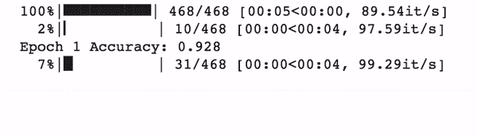

该模型将继续训练给定的时期数。在 5 个时期之后，该模型具有大约 0.97 的准确度。

## **没有占位符的培训**

上面的例子演示了用于输入图像的占位符，但是如果直接在`conv_net`中使用`batch_images`，在`tf.nn.softmax_cross_entropy_with_logits_v2`的`labels`参数中使用`batch_labels`，这个图形会变得更加简洁。然后，可以训练模型，而不必像这里所示的那样将任何张量输入到图形中。

## **访问其他节点**

图中的不同节点可以通过在会话中调用它们来访问，可以是单独的，也可以是列表形式的。如果运行了一个节点列表，那么将会给出一个输出列表。例如，假设我们想要查看训练期间每个图像批次的损失。这可以通过在带有`train_op`的列表中运行会话中的`loss`来完成。在这里，我将使用 tqdm 来打印该时期内每批的损失。

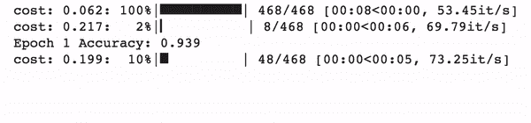

# 预言

## **测试预测**

我们可以使用测试精度中的`test_predictions`来可视化分类一些示例图像的性能。在这里，我将显示前 25 个测试图像，并使用整数预测作为标题。

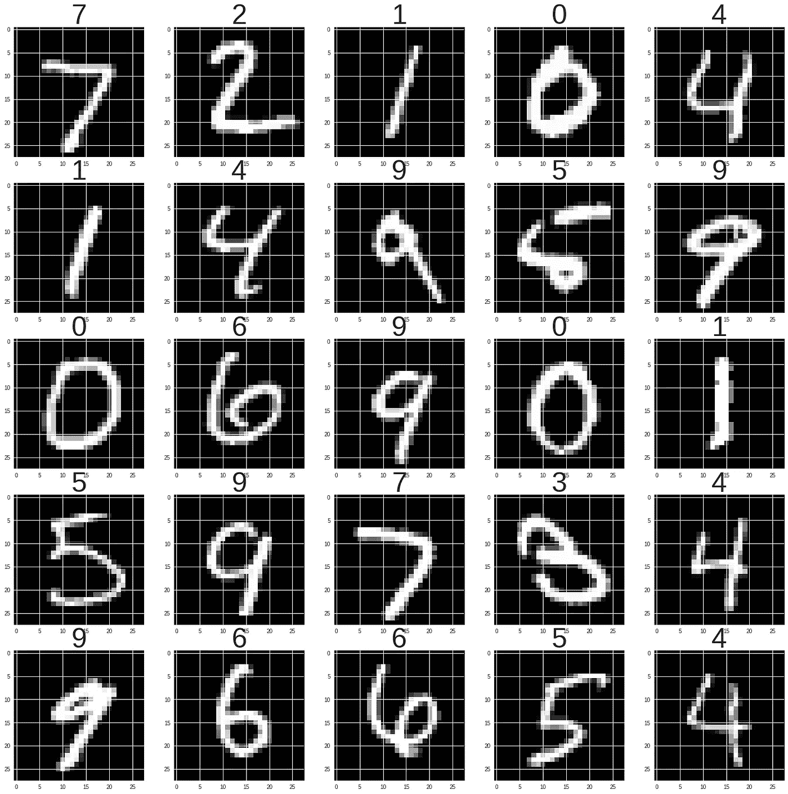

## **预测新的图像批次**

如果您想要预测一组新的图像，只需在会话中对一批图像运行`conv_net`功能即可进行预测。例如，以下内容可用于获得测试集中前 25 幅图像的预测:

然后`predictions`可以像上面一样用于显示图像。

## **预测单个图像**

回想一下，模型期望输入具有形状`[batch_size, height, width, channels]`。这意味着，如果正在对单个图像进行预测，则该图像需要将其维度扩展到第一维度(即`batch_size`)作为一个维度。这里预测了测试集中的第 1000 幅图像。

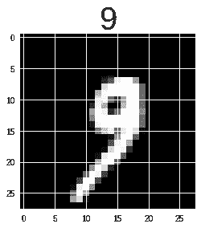

## **预测概率**

预测的标准化概率分布可使用 softmax 对来自`conv_net`模型的对数进行计算。

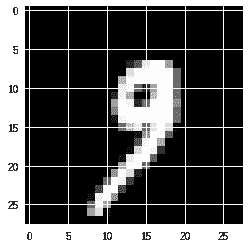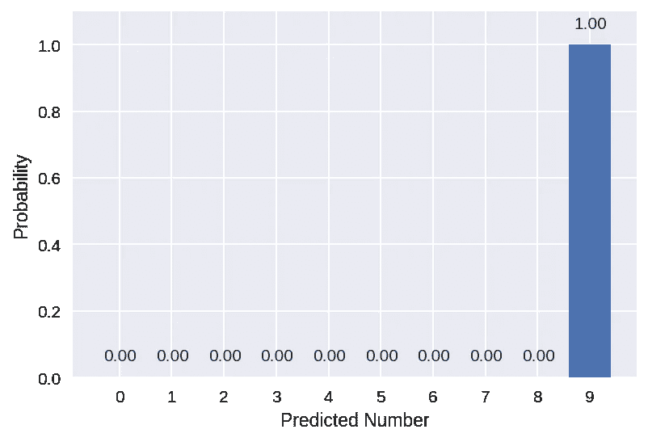

该模型预测该数字为 9 的概率很高。

对于模型来说，有些数字不容易预测。例如，这里是测试集中的另一个图像(`idx=3062`)。

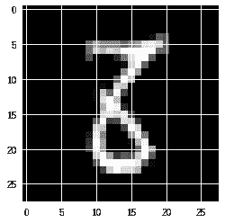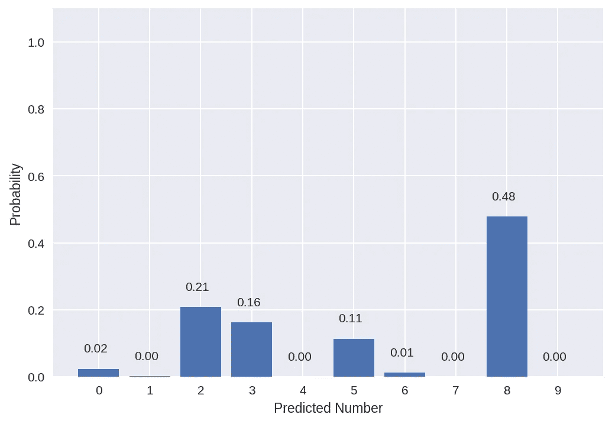

虽然模型预测 8 是最有可能的类别，但它的概率只有 0.48，而且还有其他几个数字的概率在增加。

下面是一个不正确预测的例子(`idx=259`):

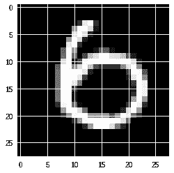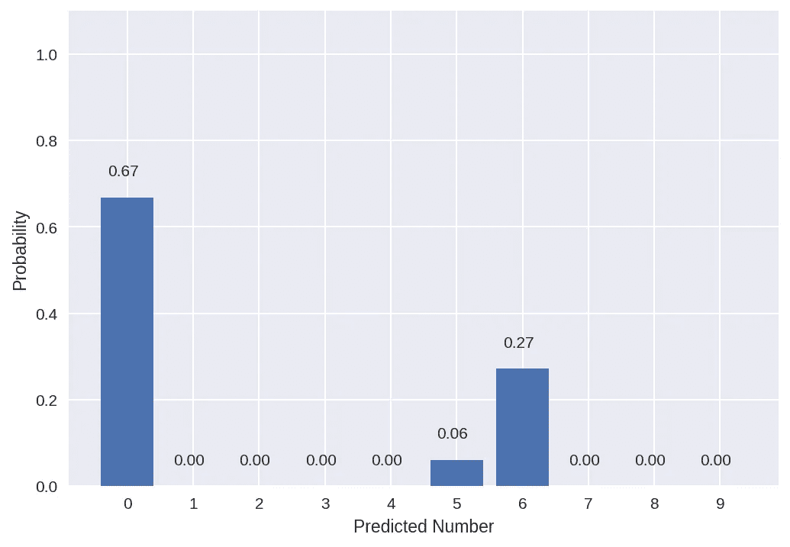

该模型错误地预测了 0，数字 6 是第二高的预测值。

# 保存模型

正如所讨论的，只要会话仍然打开，就可以进行预测。如果会话关闭，训练的权重和偏差将会丢失。通过使用 [tf.train.Saver](https://www.tensorflow.org/api_docs/python/tf/train/Saver) ，可以将会话和模型图以及训练好的权重和偏差保存为检查点。

# 完整的代码示例

结合上面的信息，下面是一个创建、训练和保存 ConvNet 并显示手写数字样本预测的示例脚本。

## Keras 中的等效模型

Keras 是一个高级 API，可以通过使用其[顺序模型 API](https://keras.io/getting-started/sequential-model-guide/) 来极大地简化上述代码。[功能 API](https://keras.io/getting-started/functional-api-guide/) 也是更复杂的神经网络的一个选项。对于那些有使用该 API 经验的人来说，这是一个有用的比较，并向那些没有使用过它的人展示它的价值。

请注意，不需要使用会话。此外，模型权重和偏差不需要在模型之外定义。它们是在添加层时创建的，并且它们的形状是自动计算的。

# 摘要

张量流图为如何训练模型创建计算数据流，会话用于进行实际训练。本文演示了在培训会话中创建图表和运行图表时使用的不同步骤和选项。当您大致了解如何创建图表并在会话中使用它们时，开发自定义神经网络并使用 TensorFlow Core 来满足您的特定需求将变得更加容易。

此外，可以看出，Keras 更加简洁，这也是为什么这个 API 更适合测试新的神经网络的原因。然而，对于新的 AI 开发者来说，许多步骤可能是黑盒，本教程旨在帮助展示后台发生的事情。