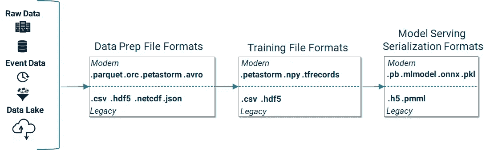

# 机器学习文件格式指南:列式、训练、推理和特征存储

> 原文：<https://towardsdatascience.com/guide-to-file-formats-for-machine-learning-columnar-training-inferencing-and-the-feature-store-2e0c3d18d4f9?source=collection_archive---------0----------------------->

TLDR；大多数机器学习模型都是使用文件中的数据进行训练的。这篇文章是 Python 中机器学习开源框架中使用的流行文件格式的指南，包括 TensorFlow/Keras、PyTorch、Scikit-Learn 和 PySpark。我们还将描述特性存储如何在选择的文件系统上以选择的文件格式生成训练/测试数据，从而使数据科学家的工作变得更加轻松。

文件格式定义了存储在其中的数据的结构和编码，通常由文件扩展名来标识，例如，以结尾的文件名。txt 表示该文件是一个文本文件。然而，尽管文件被用来存储世界上的大部分数据，但是大部分数据并不是可以直接用于训练 ML 模型的格式。

这篇文章主要关注的是结构化数据的文件格式，我们将讨论 Hopsworks 特性库如何以 ML 的流行文件格式轻松创建训练数据，例如。tfrecords，。csv，。npy 还有。petastorm，以及用于存储模型的文件格式，如。pb 和。pkl。我们将不涉及其他众所周知的文件格式，如图像文件格式(例如。png，。jpeg)、视频文件格式(例如. mp4、.mkv 等)、档案文件格式(例如，zip，。gz，。tar、. bzip2)、文档文件格式(例如，docx，。pdf，。txt)或网络文件格式(例如，html)。

# 数据源

文件存储在文件系统上，并且在云中，越来越多地存储在对象存储上。文件系统有不同的风格。本地文件系统(POSIX)通常将其数据存储在一个或多个磁盘上(磁盘(硬盘)、SSD(固态存储)或 NVMe 驱动器)。这种文件系统可以通过网络(例如 NFS)访问，或者如果需要大量的容量，可以使用分布式文件系统，可以扩展到在数千个服务器上存储数百 Pb 的数据，如 HDFS、HopsFS 和 CephFS。在云中，对象存储是最便宜的文件存储选项，应用程序可以以合理的性能读取/写入文件。

文件格式与其文件系统相关联。例如，如果您在 Nvidia V100 GPU 上运行 TensorFlow/Pytorch 应用程序来训练 ImageNet 处理存储在 S3(对象存储)中的图像，您可能能够每秒处理 100 张图像，因为这是单个客户端可以从 S3 读取的数据。但是，V100 可能每秒处理 1000 个图像——这是文件系统的 I/O 瓶颈。新的文件格式似乎可以解决这类问题。例如，petastorm 文件格式是由优步开发的，用于存储存储在 HDFS 的自动驾驶车辆的 PBs 数据。petastorm 文件很大，可拆分，并使用 TensorFlow 和 PyTorch 的阅读器进行压缩，使它们能够并行处理大量 V100，确保它们不会成为文件 I/O 的瓶颈，如果在较慢的网络文件系统上使用传统的多媒体文件格式，就会出现这种情况。另一个替代方案是在由数百或数千个 NVMe 磁盘组成的存储设备上使用传统的文件格式，但这要昂贵得多。

机器学习框架希望将训练数据作为样本序列来使用，因此用于训练 ML 模型的文件格式应该具有易于使用的布局，并且与存储平台或用于读/写文件的语言没有阻抗不匹配。此外，分布式训练(同时在许多 GPU 上训练 ML 模型以使训练进行得更快)要求文件是可拆分的，并且可以通过分布式文件系统或对象存储来访问，以便不同的 GPU 可以从不同的服务器并行读取不同的数据碎片(分区)。

# 大数据—从二进制数据到结构化数据

机器学习在许多领域取得了技术突破，如图像分类、语音识别、语音合成、自然语言处理和神经机器翻译。这些系统中使用的文件格式类型通常是压缩的二进制或明文数据格式。

机器学习的影响已经超出了这些最初的领域，现在正在应用于企业数据，以解决可以建模为监督机器学习问题的业务问题。然而，许多企业数据是以结构化数据的形式提供的，这些数据来自数据仓库、数据库、文档存储库和数据湖。结构化企业数据还可以用于各种基于文本的二进制文件格式。通常，如果您有大量数据，那么您应该考虑使用二进制文件格式(而不是传统的基于文本的格式，如 CSV)，因为二进制文件格式可以显著提高导入管道的吞吐量，有助于减少模型训练时间。二进制文件格式需要更少的磁盘空间，从磁盘读取所需的时间也更少。二进制文件格式意义重大，因为机器学习的另一个主要趋势是深度学习的使用越来越多。深度学习对数据如饥似渴——它在上训练的数据越多，它就会变得越好——随着数据量的增加，高效的压缩文件格式将在未来的深度学习战争中发挥作用。

# 机器学习框架中的文件格式

较旧的文件格式(例如，csv)可能不被压缩，可能不可分割(例如，HDF5 和 netCDF)以便它们在与许多工作者并行训练时可以无缝地工作，并且可能使得难以组合多个数据集。然而，如果您用于机器学习的框架，如 TensorFlow、PyTorch、ScikitLearn，不提供与那些文件格式功能和数据源无缝集成的数据导入和预处理功能，那么您可能无法获得更好的文件格式的好处。例如，TFRecord 文件格式是为 TensorFlow 设计的，在 tf.data 中有完整的支持，而 PyTorch 的 DataLoader 首先是围绕 Numpy 文件设计的，然后扩展到其他文件格式。类似地，ScikitLearn 最初设计用于 CSV 和 Pandas，然后扩展用于其他文件格式。因此，尽管很明显您应该使用更现代的文件格式来进行机器学习，但您仍然面临着将数据转换为这种格式的挑战，并且关于如何做到这一点的可用文档可能有限。幸运的是，Feature Store(稍后介绍)使您可以轻松地将数据转换为最重要的文件格式，以便进行机器学习。

# 文件格式

本节介绍了最广泛使用的 ML 文件格式，将它们分为众所周知的文件格式类型:柱状、表格、嵌套、基于数组和分层。还有为模型服务设计的新文件格式，如下所述。

# 柱状数据文件格式

除了可能的 Excel 之外，企业数据最常见的位置是数据仓库或数据湖。通常使用结构化查询语言(SQL)来访问这些数据，并且这些数据可以以面向行的格式(通常是提供低延迟访问、高写入吞吐量的 OLTP 数据库)或者更常见的面向列的格式(可以从 TB 扩展到 PBs 并提供更快的查询和聚合的 OLTP 列数据库)来存储。在数据湖中，结构化数据可以存储为文件(。拼花地板和。orc ),仍然可以使用 SparkSQL、Hive 和 Presto 等可伸缩的 SQL 引擎通过 SQL 访问。这些柱状数据文件和后端数据库通常是企业 ML 模型的训练数据的来源，对它们的特征工程通常需要数据并行处理框架(Spark、Beam 和 Flink ),以使特征工程能够在许多服务器上横向扩展。这种可伸缩的处理之所以能够实现，是因为 parquet/orc/petastorm 数据中的数据路径实际上是一个目录——而不是一个文件。该目录包含许多可以并行处理的文件。因此，当您想要读取列文件格式的数据时，通常需要提供基本路径(目录),处理引擎会计算出要读取的文件。如果您只想从表中读取列的子集，则不会从磁盘中读取包含排除列的文件，并且如果您执行范围扫描，文件中的统计信息(文件中列的最大/最小值)会启用数据跳过-如果您的查询要求值超出文件中存储的值范围的列，则跳过此文件。

虽然 parquet 和 orc 具有相似的属性，但 Petastorm 是为支持 ML 数据而独特设计的，它是唯一一种本地支持多维数据的列式文件格式。列式文件格式通常假设二维关系数据，但是张量可以具有比一维向量或二维关系数据源更高的维数。Petastorm 通过使用自己的 Unischema 扩展 Parquet 来提供多维数据能力，Unischema 是专门为机器学习用例设计的。Unischema 支持 petastorm 文件在 Parquet 中本地存储多维张量。unischema 还与 PyTorch 和 TensorFlow 兼容，因此您可以将 petastorm 架构直接转换为 TensorFlow 架构或 PyTorch 架构，从而为 petastorm 启用本机 TensorFlow/PyTorch 读取器。

列式文件格式是为分布式文件系统(HDFS、霍普斯福斯)和对象存储(S3、GCS、ADL)设计的，在这些系统中，工作人员可以并行读取不同的文件。

*   ***文件格式*:。拼花地板。兽人、. petastorm.**
*   *特色工程* : PySpark，Beam，Flink。
*   *训练*:。petastorm 在 TensorFlow 和 PyTorch 有原生读者；
    。兽人，。Spark 的拼花地板有本地读者；由 Spark 支持的 JDBC/Hive 源

# 基于表格文本的文件格式

用于机器学习的表格数据通常在。csv 文件。Csv 文件是基于文本的文件，包含逗号分隔值(csv)。Csv 文件在 ML 中很流行，因为它们易于查看/调试，并且易于从程序中读取/写入(没有压缩/索引)。但是，它们不支持列类型，文本列和数字列之间没有区别，并且它们的性能很差，当数据量增长到 GB 或更大时，这一点更加明显—它们不可拆分，没有索引，并且不支持列过滤。。csv 文件可以使用 GZIP 压缩以节省空间。ML 中通常不使用的其他流行表格格式是电子表格文件格式(例如。xlsx 和。xls)和非结构化文本格式(。txt)。

*   ***文件格式*:。csv，。xslx**
*   *特色工程*:熊猫、Scikit-Learn、PySpark、Beam 等等
*   *训练*:。csv 在 TensorFlow、PyTorch、Scikit-Learn、Spark 中有本地读者

# 嵌套文件格式

嵌套文件格式以 n 级分层格式存储它们的记录(条目),并有一个模式来描述它们的结构。分层格式意味着一个记录可以有一个父记录(或者是根记录，没有父记录)，但也可以有子记录。嵌套文件格式模式能够被扩展(在保持向后兼容性的同时添加属性),并且属性的顺序通常并不重要。的。json 和。xml 文件格式是最著名的纯文本嵌套文件格式，而二进制嵌套文件格式包括协议缓冲区(。pb)和 avro(。avro)。

TFRecords 是二进制记录的序列，通常是带有模式“Example”或“SequenceExample”的 protobuf。开发人员决定是将样本存储为“示例”还是“序列示例”。如果您的要素是相同类型数据的列表，请选择序列示例。TFRecords 文件可以是一个目录(包含许多。tfrecords 文件)，并且支持用 Gzip 压缩。关于如何使用 TFRecords 的更多细节可以在[官方文档](https://www.tensorflow.org/guide/data)和这篇[好博文](https://medium.com/mostly-ai/tensorflow-records-what-they-are-and-how-to-use-them-c46bc4bbb564)中找到。

*   ***文件格式*:。tfrecords，。json，。xml，。avro**
*   *特征工程*:熊猫、Scikit-Learn、PySpark、Beam 等等
*   *培训*:。tfrecords 是 TensorFlow 的本机文件格式；
    。json 在 TensorFlow、PyTorch、Scikit-Learn、Spark
    都有原生阅读器。avro 文件可以用 [LinkedIn 的库](https://github.com/linkedin/Avro2TF)作为 TensorFlow 中的训练数据。

# 基于数组的格式

Numpy 是 Numerical Python 的缩写，是一个非常流行的科学计算和数据分析库。通过对矢量化的支持，Numpy(。npy)也是一种高性能的文件格式。Numpy 数组是具有相同类型元素的密集数组。文件格式。npy 是一种二进制文件格式，存储单个 NumPy 数组(包括嵌套的记录数组和对象数组)。

*   ***文件格式*:。npy**
*   *特色工程* : PyTorch、Numpy、Scikit-Learn、TensorFlow
*   *训练*:。npy 在 PyTorch、TensorFlow、Scikit-Learn 都有原生读者。

# 分层数据格式

HDF5 (.h5 或. HDF5)和 NetCDF(。nc)是流行的分层数据文件格式(HDF ),旨在支持大型、异构和复杂的数据集。特别是，HDF 格式适用于不能很好地映射到像 parquet 这样的列格式的高维数据(尽管 petastorm 既是列格式的，也支持高维数据)。许多医疗设备数据以 HDF 文件或相关文件格式存储，如 VCF BAM 的基因组数据。在内部，HDF5 和 NetCDF 以压缩布局存储数据。NetCDF 在气候科学和天文学等领域很受欢迎。HDF5 在 GIS 系统等领域广受欢迎。它们是不可分割的，因此不适合分布式处理(使用 Spark 这样的引擎)。

*   ***文件格式* : .h5 (HDF5)，。nc (NetCDF)**
*   *特色工程*:熊猫、Dask、XArray
*   *Training* : .h5 在 [TensorFlow](https://github.com/tensorflow/tensorflow/issues/27510) 或 [PyTorch](/hdf5-datasets-for-pytorch-631ff1d750f5) 中没有原生阅读器；
    。据我们所知，nc 没有本地阅读器。

# 模型文件格式

在监督机器学习中，训练后创建的用于对新数据进行预测的人工制品称为模型。例如，在训练深度神经网络(DNN)之后，训练的模型基本上是包含 DNN 中的层和权重的文件。通常，模型可以保存在一个可能被压缩的文件中，因此模型文件通常具有二进制文件格式。TensorFlow 将模型保存为协议缓冲文件，带有**。pb** 文件扩展名。Keras 将模型原生保存为 **.h5** 文件。Scikit-Learn 将模型保存为 pickled python 对象，带有一个**。pkl** 文件扩展名。基于 XML 的模型服务的旧格式，预测模型标记语言(**)。pmml** )，在一些框架上仍然可用，比如 Scikit-Learn。

模型文件用于对新数据进行预测，通过(1)通常将模型作为文件读入的批处理应用程序，或(2)将模型读入内存的实时模型服务服务器(如 TensorFlow 服务服务器),甚至可能在内存中有模型的多个版本用于 AB 测试。

使用的其他模型文件格式包括 SparkML 模型，这些模型可以保存为 MLleap 文件格式，并使用 ml leap 模型服务器进行实时服务(文件打包在**中)。zip** 格式)。苹果公司开发了**。mlmodel** 文件格式，用于存储嵌入 iOS 应用程序的模型，作为其核心 ML 框架的一部分(该框架对 ObjectiveC 和 Swift 语言具有卓越的支持)。受过 TensorFlow、Scikit-Learn 和其他框架培训的应用程序需要将其模型文件转换为。iOS 上使用的 mlmodel 文件格式，可以使用 [coremltools 和 Tensorflow converter](https://www.inovex.de/blog/tensorflow-models-with-core-ml/) 等工具帮助文件格式转换。ONNX 是一种独立于 ML 框架的文件格式，由微软、脸书和亚马逊支持。理论上，任何 ML 框架都应该能够将其模型导出到。onnx 文件格式，因此它为跨不同框架的统一模型服务提供了很大的希望。然而，[截至 2019 年末](https://leimao.github.io/blog/PyTorch-ATen-ONNX/)，ONNX 并不支持最流行的 ML 框架(TensorFlow、PyTorch、Scikit-Learn)的所有操作，因此 [ONNX 对于那些框架还不实用](https://pytorch.org/blog/model-serving-in-pyorch/)。在 PyTorch 中，推荐的服务模型的方式是[使用 Torch 脚本跟踪并保存一个模型](https://pytorch.org/tutorials/advanced/cpp_export.html)作为一个**。pt** 文件，并从 C++应用程序中提供它。

这里要提到的最后一个文件格式是 [YAML，用于打包模型，作为 Spark 上 ML 管道的 MLFlow 框架](https://mlflow.org/docs/latest/models.html)的一部分。MLFlow 存储一个 YAML 文件，该文件描述了它为模型服务而打包的文件，以便部署工具可以理解模型文件格式并知道要部署什么文件。

*   ***文件格式*:。pb，。onnx，。pkl，。mlmodel，。zip，。pmml，。pt**
*   *推论*:。pb 文件由 TensorFlowServing 服务器提供服务；
    。onnx 文件由微软的商业模式服务平台提供服务；
    。pkl 文件用于 Scikit-Learn 模型，通常在 Flask 服务器上；
    。mlmodel 文件由 iOS 平台提供服务；
    。zip 文件用于打包在 MLeap 运行时提供的 MLeap 文件；
    。pt 文件用于封装 PyTorch 模型，这些模型可以在 C++应用程序中使用。

# ML 数据文件格式摘要

下表总结了不同 ML 管道阶段(特征工程/数据准备、培训和服务)的不同文件格式:

# 获胜者是…

用于深度学习的训练数据的文件格式中，功能最完整、语言独立且可扩展的是 **petastorm** 。它不仅支持高维数据，并在 TensorFlow 和 PyTorch 中具有本机读取器，而且它还可针对并行工作机进行扩展，而且它还支持下推索引扫描(仅从磁盘中读取您请求的那些列，甚至跳过文件中的值不在所请求的值范围内的文件)，并可扩展到存储许多 TB 的数据。

对于模型服务，我们真的找不到任何优于其他文件格式的文件格式。部署和操作最简单的模型服务解决方案是协议缓冲区和 TensorFlow 服务服务器。虽然 ONNX 和 Torch Script 都有潜力，但服务于服务器的开源模型还不适合它们。同样，上菜。flask 服务器上的 pkl 文件虽然在生产中大量使用，但仍然需要 ML 操作工程师做更多的工作——您必须编写自己的 Python 服务程序、管理安全性、负载平衡等等。

# Hopsworks 和 ML 文件格式

在本节中，我们将讨论使用 [Hopsworks 功能库](https://www.logicalclocks.com/featurestorepage)将 ML 功能数据转换为您选择的文件格式的支持，以及使用 HopsFS 文件系统在 [Hopsworks](https://www.logicalclocks.com/hopsworks) 中对主要 ML 框架文件格式的支持。Hopsworks 是一个开源企业平台，用于大规模开发和运营机器学习(ML)管道，基于业界第一个 ML 功能商店。

# 用于文件格式转换的特征存储

‍

Hopsworks 功能存储可以在您选择的数据存储(S3、HDFS、HopsFS)上以您选择的文件格式创建训练/测试数据。

Hopsworks 功能存储是一个仓库，用于存储 ML 的可重用功能。它旨在充当要素数据的缓存。特征数据是特征工程的输出，特征工程将来自后端系统的原始数据转换成可直接用于训练 ML 模型的特征。数据科学家通过浏览可用的功能与功能库进行交互，然后，在找到构建预测模型所需的功能后，他们会在自己选择的存储平台上以自己选择的文件格式生成训练/测试数据。在上图所示的示例中，我们可以看到我们有 3 个特征和一个来自 Titanic 数据集的目标变量，然后我们可以选择一种文件格式(从 10 多种可用的文件格式中)和一个将创建训练/测试数据的目标文件系统。功能存储使团队能够通过使用不同方法(例如，TensorFlow 和 PyTorch 上的深度学习和 Scikit-Learn 上的决策树)在不同框架中轻松尝试解决方案，从而轻松协作解决问题，而无需将训练/测试数据转换为各自框架的最高效、易用的文件格式。

# Hopsworks 中的文件格式示例

Hopsworks 提供 HopsFS(下一代 HDFS 文件系统)作为其默认的分布式文件系统。HopsFS 是一个很好的用于机器学习的分布式文件系统，因为它具有高吞吐量和低延迟，并且在 ML 的流行框架中有广泛的原生 HDFS 阅读器:Spark、TensorFlow、Pandas (Scikit-Learn)和 PyTorch(通过 petastorm)。

这里包含了一些在 Hopsworks 中使用不同文件格式的笔记本的例子，接着是 Python 中 ML 的流行框架的具体例子(PySpark，TensorFlow/Keras，PyTorch，Scikit-Learn):

*   熊猫和霍普斯
*   [Numpy 和 HopsFS](https://github.com/logicalclocks/hops-examples/blob/master/notebooks/ml/numpy/numpy-hdfs.ipynb)
*   [Scikit-Learn 和 HopsFS](https://github.com/logicalclocks/hops-examples/tree/master/notebooks/ml/Serving/sklearn)
*   [使用张量流和 HopsFS 的 Tfrecords】](https://github.com/logicalclocks/hops-examples/blob/master/notebooks/ml/Parallel_Experiments/TensorFlow/grid_search/grid_search_fashion_mnist.ipynb)
*   [使用 PyTorch 和 HopsFS 的 Petastorm】](https://github.com/logicalclocks/hops-examples/blob/master/notebooks/featurestore/petastorm/PetastormMNIST_CreateDataset.ipynb)
*   [使用 TensorFlow 和 HopsFS 的 Petastorm】](https://github.com/logicalclocks/hops-examples/blob/master/notebooks/featurestore/petastorm/PetastormMNIST_Tensorflow.ipynb)

在接下来的部分中，我们将简要概述主要 python ML 框架的推荐文件格式:PySpark、TensorFlow/Keras、PyTorch 和 Scikit-Learn，以及一个示例代码片段和一个来自 Hopsworks 的 python 笔记本链接。

# PySpark

*文件格式*:。csv，。拼花地板。兽人，。json，。avro，。佩塔斯托姆

*数据来源*:本地文件系统，HDFS，S3
*模型服务文件格式*:。zip (MLeap)

柱状文件格式与 PySpark(.拼花地板。兽人，。petastorm)，因为它们压缩得更好，可拆分，并支持列的选择性读取(只有那些指定的列才会从磁盘上的文件中读取)。当您需要使用 PySpark 快速编写时，经常会使用 Avro 文件，因为它们是面向行的并且是可拆分的。PySpark 可以从本地文件系统、HDFS 和 S3 数据源读取文件。

[*打开*](https://github.com/logicalclocks/hops-examples/blob/master/notebooks/ml/pandas/pandas-hdfs.ipynb) [*例子 PySpark 笔记本*](https://nbviewer.jupyter.org/github/logicalclocks/hops-examples/blob/master/notebooks/spark/KafkaSparkPython.ipynb)

# 熊猫/Scikit-学习

*文件格式*:。csv，。npy，。拼花、. h5、。json，。xlsx
*数据来源*:本地文件系统，HDFS，S3
*模型服务文件格式*:。pkl

熊猫可以在本地读取文件。csv，。拼花、. hdf5、.json，。xlsx，也来自 SQL 源代码。熊猫可以从本地文件系统、HDFS、S3、http 和 ftp 数据源读取文件。在 Hopsworks 中，您可以使用 Panda 自带的 HDFS 阅读器和一个助手类来读取 HopsFS 中的文件:

[*打开示例熊猫笔记本*](https://github.com/logicalclocks/hops-examples/blob/master/notebooks/ml/pandas/pandas-hdfs.ipynb)

# 张量流/Keras

*文件格式*:。csv，。npy，。tfrecords，。佩塔斯托姆

*数据来源*:本地文件系统，S3 HDFS
*模型服务文件格式*:。平装书

Tensorflow 的原生文件格式是。如果您的数据集不是很大，并且您不需要从数据集中只读取列的子集，那么这是我们推荐的文件格式。但是，如果您只想从数据集中读取列的子集(数据库术语中的投影)，那么。petastorm 是要使用的文件格式。TensorFlow 可以从本地文件系统、HDFS 和 S3 数据源读取文件。

[*打开*](https://github.com/logicalclocks/hops-examples/blob/master/notebooks/ml/pandas/pandas-hdfs.ipynb) [*例子 TensorFlow 笔记本*](https://github.com/logicalclocks/hops-examples/blob/master/notebooks/ml/Parallel_Experiments/TensorFlow/grid_search/grid_search_fashion_mnist.ipynb)

# PyTorch

*培训文件格式*:。csv，。npy，。佩塔斯托姆

*数据来源*:本地文件系统，HDFS ( petastorm)，S3
*模型服务文件格式*:。元素铂的符号

PyTorch 与 Numpy 紧密集成，并且。npy 是 PyTorch 的本地文件格式。然而，np.load()本身并不与 HopsFS 一起工作，所以您必须使用我们在库中包含的包装器函数，该函数首先将来自 HopsFS 的数据具体化到本地文件系统，然后将其作为 numpy 数组读入。如果您有大型数据集，我们建议使用。petastorm 通过自己的阅读器与 PyTorch 一起工作。

[*打开范例 PyTorch 笔记本*](https://github.com/logicalclocks/hops-examples/blob/master/notebooks/featurestore/petastorm/PetastormMNIST_PyTorch.ipynb)

# Numpy/Scikit-Learn

*文件格式*:。神经肽 y

*数据来源*:本地文件系统
*模型服务文件格式*:。pkl

Scikit-Learn 的[原生数据格式是数字数据，通常存储为 numpy 数组或 pandas 数据帧(可转换为 numpy 数组)。PyTorch 也直接构建在 numpy 数组上。就此而论。npy 是用 Scikit-Learn 训练数据的常用文件格式。在 Hopsworks 中，我们提供了一个 *numpy_helper* 来读取。来自 HopsFS 的 npy 文件。](https://scikit-learn.org/stable/datasets/index.html)

[*打开示例 Scikit-学习笔记本*](https://github.com/logicalclocks/hops-examples/blob/master/notebooks/ml/numpy/numpy-hdfs.ipynb)

# 参考

https://www.neonscience.org/about-hdf5

[numpy][https://towards data science . com/why-you-should-start-using-npy-file-more-frequency-df 2 a 13 cc 0161](/why-you-should-start-using-npy-file-more-often-df2a13cc0161)

https://www.tensorflow.org/tfx/transform/get_started

https://www.logicalclocks.com/featurestore

[TF records][https://medium . com/mosely-ai/tensor flow-records-what-them-and-how-to-use-them-c 46 BC 4 BBB 564](https://medium.com/mostly-ai/tensorflow-records-what-they-are-and-how-to-use-them-c46bc4bbb564)

https://luminousmen.com/post/big-data-file-formats

【PETA storm】[https://qcon . ai/system/files/presentation-slides/yevgeni _-_ PETA storm _ 16 日 _2019 年 4 月 _ 日。pdf](https://qcon.ai/system/files/presentation-slides/yevgeni_-_petastorm_16th_apr_2019_.pdf)